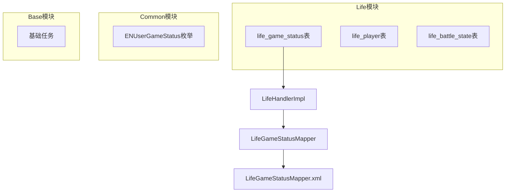
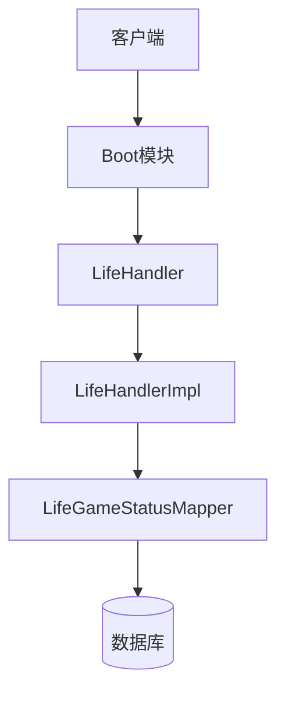
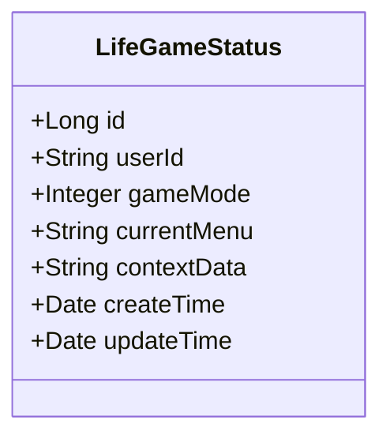
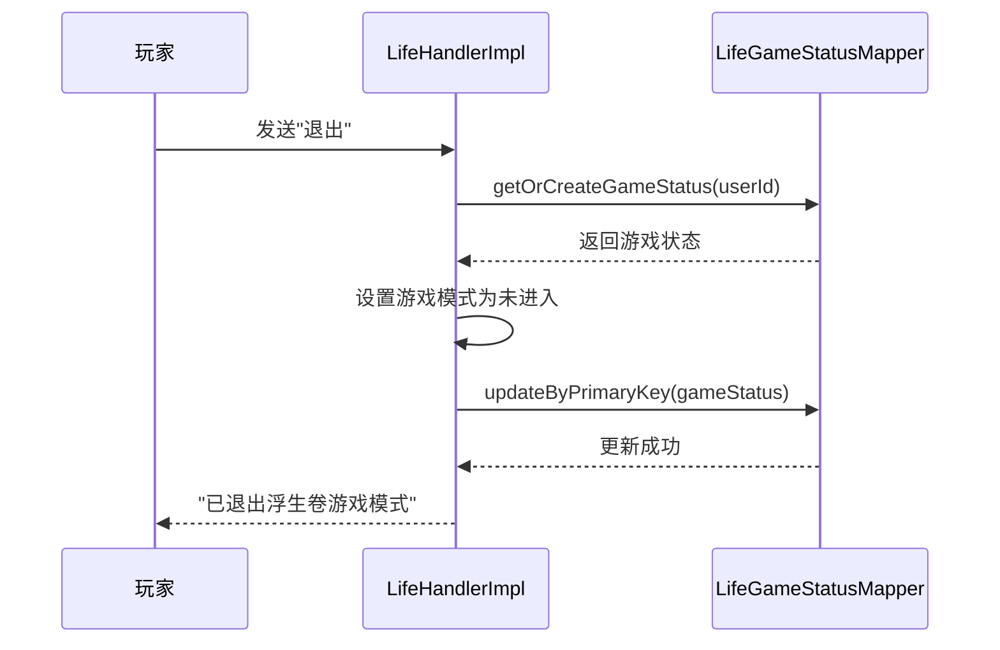

# 游戏状态清理

<cite>
**本文档引用文件**   
- [Life_Database_Init.sql](file://Life_Database_Init.sql)
- [Life_Deployment_Guide.md](file://Life_Deployment_Guide.md)
- [LifeGameStatus.java](file://Life/src/main/java/com/bot/life/dao/entity/LifeGameStatus.java)
- [LifeHandlerImpl.java](file://Life/src/main/java/com/bot/life/service/impl/LifeHandlerImpl.java)
- [LifeGameStatusMapper.java](file://Life/src/main/java/com/bot/life/dao/mapper/LifeGameStatusMapper.java)
- [LifeGameStatusMapper.xml](file://Life/src/main/resources/mapper/LifeGameStatusMapper.xml)
</cite>

## 目录
1. [引言](#引言)
2. [项目结构](#项目结构)
3. [核心组件](#核心组件)
4. [架构概述](#架构概述)
5. [详细组件分析](#详细组件分析)
6. [依赖分析](#依赖分析)
7. [性能考虑](#性能考虑)
8. [故障排除指南](#故障排除指南)
9. [结论](#结论)

## 引言
本文档旨在说明如何清理Bot项目中无效或过期的游戏状态记录，基于Life_Deployment_Guide.md中的性能优化建议和Life_Database_Init.sql中的life_game_status表结构，提供清除长时间未更新的游戏状态记录的SQL脚本和自动化清理策略。文档涵盖清理阈值设置、自动化调度配置和对在线玩家的影响评估，确保系统资源的有效利用。

## 项目结构
Bot项目包含多个模块，其中Life模块负责处理浮生卷游戏的核心逻辑。项目结构清晰，分为Base、Boot、Common、Game和Life等主要模块。Life模块包含游戏状态管理、玩家数据、战斗系统等核心功能。

**图表来源**
- [Life_Database_Init.sql](file://Life_Database_Init.sql#L379-L389)
- [LifeGameStatus.java](file://Life/src/main/java/com/bot/life/dao/entity/LifeGameStatus.java#L1-L20)

**章节来源**
- [Life_Database_Init.sql](file://Life_Database_Init.sql#L379-L389)
- [LifeGameStatus.java](file://Life/src/main/java/com/bot/life/dao/entity/LifeGameStatus.java#L1-L20)

## 核心组件
Life模块中的游戏状态管理是核心组件之一，负责跟踪玩家在游戏中的状态。`LifeGameStatus`实体类定义了游戏状态的基本结构，包括用户ID、游戏模式、当前菜单和上下文数据等字段。

**章节来源**
- [LifeGameStatus.java](file://Life/src/main/java/com/bot/life/dao/entity/LifeGameStatus.java#L1-L20)
- [Life_Database_Init.sql](file://Life_Database_Init.sql#L379-L389)

## 架构概述
浮生卷游戏的架构基于Spring Boot和MyBatis构建，采用分层设计。Life模块通过`LifeHandlerImpl`类处理游戏逻辑，与数据库交互通过`LifeGameStatusMapper`接口实现。游戏状态的持久化通过`life_game_status`表完成。

**图表来源**
- [LifeHandlerImpl.java](file://Life/src/main/java/com/bot/life/service/impl/LifeHandlerImpl.java#L54-L145)
- [LifeGameStatusMapper.java](file://Life/src/main/java/com/bot/life/dao/mapper/LifeGameStatusMapper.java#L1-L35)

## 详细组件分析

### 游戏状态实体分析
`LifeGameStatus`实体类是游戏状态管理的核心，定义了玩家在游戏中的各种状态。

**图表来源**
- [LifeGameStatus.java](file://Life/src/main/java/com/bot/life/dao/entity/LifeGameStatus.java#L1-L20)

**章节来源**
- [LifeGameStatus.java](file://Life/src/main/java/com/bot/life/dao/entity/LifeGameStatus.java#L1-L20)

### 游戏状态管理服务分析
`LifeHandlerImpl`类负责处理游戏状态的创建、更新和删除操作。当玩家退出游戏时，`exit`方法会重置游戏状态。

**图表来源**
- [LifeHandlerImpl.java](file://Life/src/main/java/com/bot/life/service/impl/LifeHandlerImpl.java#L129-L145)
- [LifeGameStatusMapper.java](file://Life/src/main/java/com/bot/life/dao/mapper/LifeGameStatusMapper.java#L34-L35)

**章节来源**
- [LifeHandlerImpl.java](file://Life/src/main/java/com/bot/life/service/impl/LifeHandlerImpl.java#L129-L145)

## 依赖分析
游戏状态管理组件依赖于多个其他组件，包括玩家服务、图片生成服务、地图服务等。这些依赖关系通过Spring的@Autowired注解注入。

```mermaid
graph TD
LifeHandlerImpl[LifeHandlerImpl] --> GameStatusMapper[LifeGameStatusMapper]
LifeHandlerImpl --> PlayerService[PlayerService]
LifeHandlerImpl --> ImageGenerationService[ImageGenerationService]
LifeHandlerImpl --> MapService[MapService]
LifeHandlerImpl --> ExplorationService[ExplorationService]
LifeHandlerImpl --> InventoryService[InventoryService]
LifeHandlerImpl --> AchievementService[AchievementService]
LifeHandlerImpl --> FriendService[FriendService]
LifeHandlerImpl --> WorldBossService[WorldBossService]
LifeHandlerImpl --> HealthRecoveryService[HealthRecoveryService]
LifeHandlerImpl --> MarketService[MarketService]
LifeHandlerImpl --> MailService[MailService]
LifeHandlerImpl --> SkillService[SkillService]
LifeHandlerImpl --> TeamService[TeamService]
LifeHandlerImpl --> RealmService[RealmService]
LifeHandlerImpl --> SigninService[SigninService]
LifeHandlerImpl --> BattleService[BattleService]
```

**图表来源**
- [LifeHandlerImpl.java](file://Life/src/main/java/com/bot/life/service/impl/LifeHandlerImpl.java#L56-L127)

**章节来源**
- [LifeHandlerImpl.java](file://Life/src/main/java/com/bot/life/service/impl/LifeHandlerImpl.java#L56-L127)

## 性能考虑
根据Life_Deployment_Guide.md中的性能优化建议，需要定期清理过期的游戏状态记录以优化系统性能。建议实现过期清理机制，监控游戏状态缓存大小。

**章节来源**
- [Life_Deployment_Guide.md](file://Life_Deployment_Guide.md#L165-L167)

## 故障排除指南
在清理游戏状态记录时，需要注意以下几点：
1. 确保清理操作不会影响在线玩家的游戏体验
2. 定期备份重要数据，如玩家数据和系统配置
3. 监控数据库连接池状态和内存使用情况

**章节来源**
- [Life_Deployment_Guide.md](file://Life_Deployment_Guide.md#L126-L143)

## 结论
通过分析Life模块的游戏状态管理机制，我们可以制定有效的清理策略。建议设置合理的清理阈值，如30天未更新的游戏状态记录，并通过自动化调度定期执行清理任务。同时，需要评估清理操作对在线玩家的影响，确保系统资源的有效利用。