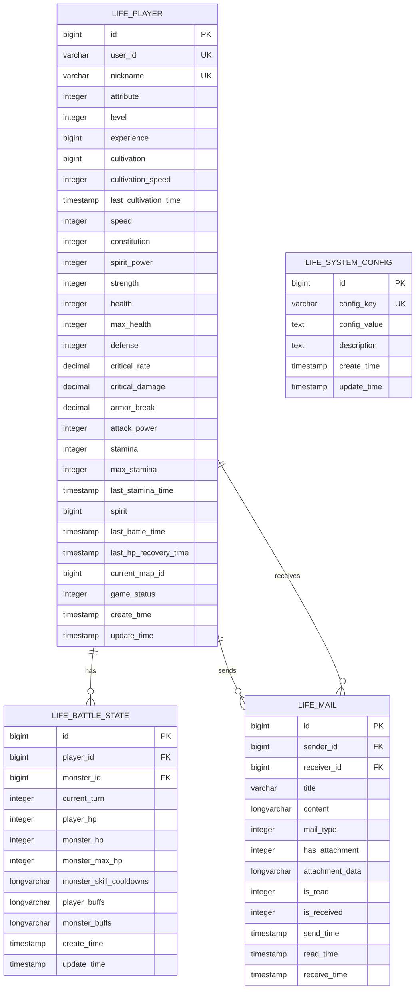
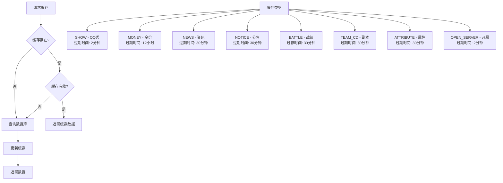
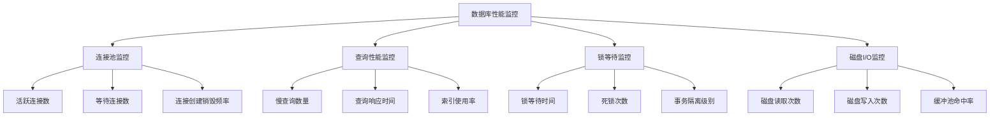

# 性能优化

<cite>
**本文档引用的文件**
- [Life_Database_Init.sql](file://Life_Database_Init.sql)
- [Life_Deployment_Guide.md](file://Life_Deployment_Guide.md)
- [application.properties](file://Boot/src/main/resources/application.properties)
- [application-dev.properties](file://Boot/src/main/resources/application-dev.properties)
- [application-prod.properties](file://Boot/src/main/resources/application-prod.properties)
- [LifePlayerMapper.xml](file://Life\src\main\resources\mapper\LifePlayerMapper.xml)
- [LifeBattleStateMapper.xml](file://Life\src\main\resources\mapper\LifeBattleStateMapper.xml)
- [LifeMailMapper.xml](file://Life\src\main\resources\mapper\LifeMailMapper.xml)
- [JXCacheMapper.xml](file://Game\src\main\resources\mapper\JXCacheMapper.xml)
- [JXCache.java](file://Game\src\main\java\com\bot\game\dao\entity\JXCache.java)
- [ENJXCacheType.java](file://Common\src\main\java\com\bot\common\enums\ENJXCacheType.java)
</cite>

## 目录
1. [概述](#概述)
2. [数据库架构分析](#数据库架构分析)
3. [索引优化策略](#索引优化策略)
4. [查询优化方案](#查询优化方案)
5. [数据库连接池配置](#数据库连接池配置)
6. [缓存机制优化](#缓存机制优化)
7. [慢查询分析与优化](#慢查询分析与优化)
8. [性能监控与调优](#性能监控与调优)
9. [最佳实践建议](#最佳实践建议)

## 概述

Bot项目采用MySQL数据库作为主要数据存储，支持高并发的游戏交互场景。本文档基于Life模块的数据库设计和实际运行需求，提供全面的性能优化策略，帮助提升数据库响应时间和系统吞吐量。

### 核心特性
- **高并发支持**：支持多玩家同时在线的游戏状态管理
- **实时性要求**：战斗状态、邮件系统等需要快速响应
- **数据一致性**：保证玩家状态和游戏进度的准确性
- **扩展性设计**：支持未来功能扩展和数据增长

## 数据库架构分析

### 表结构概览



**图表来源**
- [Life_Database_Init.sql](file://Life_Database_Init.sql#L6-L48)
- [Life_Database_Init.sql](file://Life_Database_Init.sql#L599-L616)
- [Life_Database_Init.sql](file://Life_Database_Init.sql#L262-L277)
- [Life_Database_Init.sql](file://Life_Database_Init.sql#L366-L376)

### 关键业务表分析

| 表名 | 主要用途 | 访问频率 | 性能关键点 |
|------|----------|----------|------------|
| `life_player` | 玩家角色数据 | 极高 | 用户ID索引、频繁读写 |
| `life_battle_state` | 战斗状态管理 | 高 | 玩家ID索引、实时更新 |
| `life_mail` | 邮件系统 | 中等 | 接收者ID索引、分页查询 |
| `life_system_config` | 系统配置 | 低 | 配置键唯一索引 |

**章节来源**
- [Life_Database_Init.sql](file://Life_Database_Init.sql#L6-L646)

## 索引优化策略

### 核心表索引设计

#### 1. 玩家表索引优化

```sql
-- 当前索引
UNIQUE KEY `uk_user_id` (`user_id`),
UNIQUE KEY `uk_nickname` (`nickname`),
KEY `idx_player_id` (`id`)

-- 优化建议索引
CREATE INDEX idx_player_status ON life_player(game_status, level);
CREATE INDEX idx_player_cultivation ON life_player(cultivation, experience);
CREATE INDEX idx_player_map ON life_player(current_map_id, game_status);
CREATE INDEX idx_player_create_time ON life_player(create_time);
```

#### 2. 战斗状态表索引优化

```sql
-- 当前索引
PRIMARY KEY (`id`),
UNIQUE KEY `uk_player_battle` (`player_id`),
KEY `idx_player_id` (`player_id`)

-- 优化建议索引
CREATE INDEX idx_battle_monster ON life_battle_state(monster_id, current_turn);
CREATE INDEX idx_battle_update_time ON life_battle_state(update_time);
CREATE INDEX idx_battle_hp ON life_battle_state(player_hp, monster_hp);
```

#### 3. 邮件表索引优化

```sql
-- 当前索引
PRIMARY KEY (`id`),
KEY `idx_to_player` (`to_player_id`)

-- 优化建议索引
CREATE INDEX idx_mail_receiver_status ON life_mail(receiver_id, is_read, send_time);
CREATE INDEX idx_mail_sender ON life_mail(sender_id, send_time);
CREATE INDEX idx_mail_unread_count ON life_mail(receiver_id, is_read);
```

### 索引选择原则

1. **前缀匹配原则**：将经常用于WHERE条件的列放在索引前面
2. **选择性原则**：选择性高的列优先建立索引
3. **复合索引顺序**：等值查询列 > 范围查询列 > 排序列
4. **避免过度索引**：平衡查询性能和写入性能

**章节来源**
- [LifePlayerMapper.xml](file://Life\src\main\resources\mapper\LifePlayerMapper.xml#L52-L64)
- [LifeBattleStateMapper.xml](file://Life\src\main\resources\mapper\LifeBattleStateMapper.xml#L32-L37)
- [LifeMailMapper.xml](file://Life\src\main\resources\mapper\LifeMailMapper.xml#L40-L49)

## 查询优化方案

### 1. 分页查询优化

```sql
-- 传统分页（大数据集性能差）
SELECT * FROM life_mail 
WHERE receiver_id = ? 
ORDER BY send_time DESC 
LIMIT ?, ?

-- 优化方案：基于主键的分页
SELECT * FROM life_mail 
WHERE id < ? AND receiver_id = ? 
ORDER BY id DESC 
LIMIT ?
```

### 2. 连接查询优化

```sql
-- 优化前：笛卡尔积风险
SELECT m.*, p.nickname 
FROM life_mail m, life_player p 
WHERE m.receiver_id = p.id AND m.receiver_id = ?

-- 优化后：明确连接类型
SELECT m.*, p.nickname 
FROM life_mail m 
JOIN life_player p ON m.sender_id = p.id 
WHERE m.receiver_id = ?
```

### 3. 子查询优化

```sql
-- 优化前：嵌套子查询性能差
SELECT * FROM life_player 
WHERE id IN (
    SELECT player_id FROM life_battle_state 
    WHERE update_time > DATE_SUB(NOW(), INTERVAL 1 HOUR)
)

-- 优化后：使用JOIN
SELECT DISTINCT p.* 
FROM life_player p 
JOIN life_battle_state bs ON p.id = bs.player_id 
WHERE bs.update_time > DATE_SUB(NOW(), INTERVAL 1 HOUR)
```

### 4. 查询缓存策略

```sql
-- 频繁查询的配置项
SELECT config_value FROM life_system_config 
WHERE config_key IN ('speed_armor_break_rate', 'constitution_health_rate')
```

**章节来源**
- [LifeMailMapper.xml](file://Life\src\main\resources\mapper\LifeMailMapper.xml#L40-L49)
- [LifePlayerMapper.xml](file://Life\src\main\resources\mapper\LifePlayerMapper.xml#L52-L64)

## 数据库连接池配置

### Druid连接池优化配置

基于项目现有配置，建议进行以下优化：

```properties
# 生产环境优化配置
spring.datasource.type=com.alibaba.druid.pool.DruidDataSource
spring.datasource.druid.initial-size=10
spring.datasource.druid.min-idle=10
spring.datasource.druid.max-active=200
spring.datasource.druid.max-wait=6000
spring.datasource.druid.time-between-eviction-runs-millis=60000
spring.datasource.druid.min-evictable-idle-time-millis=300000
spring.datasource.druid.validation-query=SELECT 'x'
spring.datasource.druid.test-while-idle=true
spring.datasource.druid.test-on-borrow=false
spring.datasource.druid.test-on-return=false
spring.datasource.druid.pool-prepared-statements=true
spring.datasource.druid.max-pool-prepared-statement-per-connection-size=20
```

### Tomcat连接池优化配置

```properties
# 开发环境配置
spring.datasource.tomcat.initial-size=5
spring.datasource.tomcat.max-wait=20
spring.datasource.tomcat.min-idle=5
spring.datasource.tomcat.max-active=100
spring.datasource.tomcat.time-between-eviction-runs-millis=60000
spring.datasource.tomcat.min-evictable-idle-time-millis=300000
spring.datasource.tomcat.validation-query=SELECT 'x'
spring.datasource.tomcat.test-while-idle=true
spring.datasource.tomcat.test-on-borrow=false
spring.datasource.tomcat.test-on-return=false
```

### 连接池参数说明

| 参数 | 建议值 | 说明 |
|------|--------|------|
| initial-size | 5-10 | 初始连接数 |
| min-idle | 5-10 | 最小空闲连接数 |
| max-active | 100-200 | 最大活跃连接数 |
| max-wait | 6000-10000 | 获取连接的最大等待时间(ms) |
| validation-query | SELECT 'x' | 连接有效性检测SQL |

**章节来源**
- [application.properties](file://Boot\src\main\resources\application.properties#L52-L63)
- [application-dev.properties](file://Boot\src\main\resources\application-dev.properties#L38-L48)
- [application-prod.properties](file://Boot\src\main\resources\application-prod.properties#L75-L85)

## 缓存机制优化

### JXCache缓存系统

项目已经实现了基于数据库的缓存机制，针对不同类型的缓存设置了不同的过期时间：



**图表来源**
- [ENJXCacheType.java](file://Common\src\main\java\com\bot\common\enums\ENJXCacheType.java#L9-L17)
- [JXCache.java](file://Game\src\main\java\com\bot\game\dao\entity\JXCache.java#L1-L238)

### 缓存优化策略

#### 1. 缓存键设计
```java
// 缓存键格式：类型-标识符
String cacheKey = String.format("%s-%s", serverName, playerName);
// 示例：money-剑三服务器
```

#### 2. 缓存过期策略
```java
// 不同类型缓存设置不同过期时间
private static final Map<String, Long> CACHE_EXPIRATION = Map.of(
    ENJXCacheType.SHOW.getValue(), 2 * 60 * 1000L,      // 2分钟
    ENJXCacheType.MONEY.getValue(), 12 * 60 * 60 * 1000L, // 12小时
    ENJXCacheType.NEWS.getValue(), 30 * 60 * 1000L,      // 30分钟
    ENJXCacheType.NOTICE.getValue(), 30 * 60 * 1000L,     // 30分钟
    ENJXCacheType.BATTLE.getValue(), 30 * 60 * 1000L,     // 30分钟
    ENJXCacheType.TEAM_CD.getValue(), 30 * 60 * 1000L,    // 30分钟
    ENJXCacheType.ATTRIBUTE.getValue(), 30 * 60 * 1000L, // 30分钟
    ENJXCacheType.OPEN_SERVER.getValue(), 2 * 60 * 1000L  // 2分钟
);
```

#### 3. 缓存预热机制
```java
// 系统启动时预热常用配置
@PostConstruct
public void initCache() {
    List<SystemConfig> configs = systemConfigMapper.selectAll();
    configs.forEach(config -> {
        String cacheKey = "config-" + config.getConfigKey();
        cacheService.put(cacheKey, config.getConfigValue(), 24 * 60 * 60 * 1000L);
    });
}
```

### 分布式缓存建议

对于高并发场景，建议引入Redis作为分布式缓存：

```properties
# Redis缓存配置
spring.redis.host=localhost
spring.redis.port=6379
spring.redis.database=0
spring.redis.timeout=2000ms
spring.redis.lettuce.pool.max-active=20
spring.redis.lettuce.pool.max-idle=10
spring.redis.lettuce.pool.min-idle=5
```

**章节来源**
- [JXCacheMapper.xml](file://Game\src\main\resources\mapper\JXCacheMapper.xml#L1-L29)
- [ENJXCacheType.java](file://Common\src\main\java\com\bot\common\enums\ENJXCacheType.java#L9-L17)

## 慢查询分析与优化

### 慢查询识别

```sql
-- 查看慢查询日志配置
SHOW VARIABLES LIKE '%slow_query_log%';
SHOW VARIABLES LIKE '%long_query_time%';

-- 设置慢查询阈值（生产环境建议1秒）
SET GLOBAL slow_query_log = 'ON';
SET GLOBAL long_query_time = 1;

-- 分析慢查询
EXPLAIN SELECT * FROM life_player 
WHERE game_status = 1 AND level > 10 
ORDER BY cultivation DESC 
LIMIT 100;
```

### 常见慢查询场景及优化

#### 场景1：玩家状态查询
```sql
-- 慢查询示例
SELECT * FROM life_player 
WHERE game_status = 1 
ORDER BY cultivation DESC 
LIMIT 100;

-- 优化方案
CREATE INDEX idx_player_status_cultivation ON life_player(game_status, cultivation, id);
```

#### 场景2：邮件列表查询
```sql
-- 慢查询示例
SELECT * FROM life_mail 
WHERE receiver_id = 12345 
ORDER BY send_time DESC 
LIMIT 50 OFFSET 1000;

-- 优化方案
CREATE INDEX idx_mail_receiver_sendtime ON life_mail(receiver_id, send_time, id);
```

#### 场景3：战斗状态查询
```sql
-- 慢查询示例
SELECT * FROM life_battle_state 
WHERE update_time > DATE_SUB(NOW(), INTERVAL 5 MINUTE);

-- 优化方案
CREATE INDEX idx_battle_update_time ON life_battle_state(update_time, player_id);
```

### 查询优化工具

```sql
-- 查询执行计划分析
EXPLAIN FORMAT=JSON SELECT * FROM life_player 
WHERE user_id = 'test_user';

-- 查看索引使用情况
SHOW INDEX FROM life_player;

-- 分析表统计信息
ANALYZE TABLE life_player;
```

## 性能监控与调优

### 数据库性能监控指标



### 监控配置

```properties
# Druid监控配置
spring.datasource.druid.stat-view-servlet.enabled=true
spring.datasource.druid.stat-view-servlet.url-pattern=/druid/*
spring.datasource.druid.stat-view-servlet.login-username=admin
spring.datasource.druid.stat-view-servlet.login-password=admin
spring.datasource.druid.web-stat-filter.enabled=true
spring.datasource.druid.web-stat-filter.url-pattern=/*
spring.datasource.druid.web-stat-filter.exclusions=*.js,*.gif,*.jpg,*.png,*.css,*.ico,/druid/*

# MyBatis SQL日志
logging.level.com.bot=DEBUG
logging.level.org.mybatis=DEBUG
```

### 性能基准测试

```java
@SpringBootTest
public class DatabasePerformanceTest {
    
    @Autowired
    private LifePlayerMapper playerMapper;
    
    @Test
    public void testPlayerQueryPerformance() {
        StopWatch watch = new StopWatch();
        watch.start();
        
        for (int i = 0; i < 1000; i++) {
            playerMapper.selectByUserId("test_user_" + i);
        }
        
        watch.stop();
        System.out.println("1000次查询耗时：" + watch.getTotalTimeMillis() + "ms");
    }
}
```

## 最佳实践建议

### 1. 数据库设计优化

- **合理使用索引**：为高频查询字段建立适当索引，避免过度索引
- **分区策略**：对大表实施按时间或用户ID分区
- **数据类型选择**：使用合适的数据类型，避免浪费存储空间
- **范式与反范式平衡**：根据查询需求权衡规范化程度

### 2. 查询语句优化

- **避免SELECT ***：只查询需要的字段
- **合理使用JOIN**：避免笛卡尔积，明确指定连接类型
- **分页优化**：使用基于主键的分页而非OFFSET
- **批量操作**：使用批量插入和更新替代单条操作

### 3. 应用层优化

- **连接池配置**：根据实际负载调整连接池参数
- **缓存策略**：合理设置缓存过期时间和更新策略
- **异步处理**：将非关键操作异步化
- **批量处理**：合并多个小操作为批量操作

### 4. 硬件和环境优化

- **SSD存储**：使用SSD提高I/O性能
- **内存配置**：确保足够的内存用于缓冲池
- **CPU核心**：合理分配CPU资源给数据库进程
- **网络优化**：减少网络延迟对数据库性能的影响

### 5. 监控和维护

- **定期分析**：定期分析慢查询和执行计划
- **容量规划**：根据数据增长趋势进行容量规划
- **备份策略**：制定完善的备份和恢复策略
- **性能测试**：定期进行压力测试和性能评估

通过以上性能优化策略的实施，可以显著提升Bot项目的数据库性能，确保系统在高并发场景下的稳定运行和良好的用户体验。