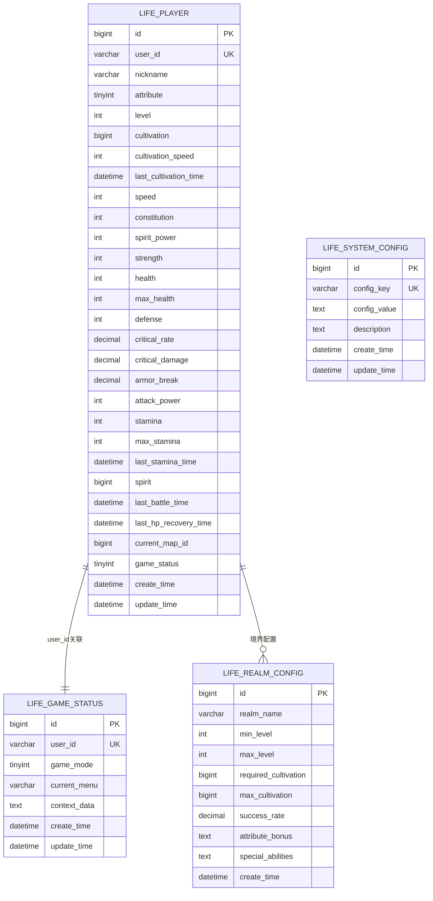
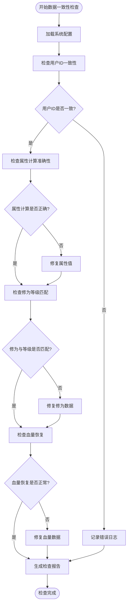
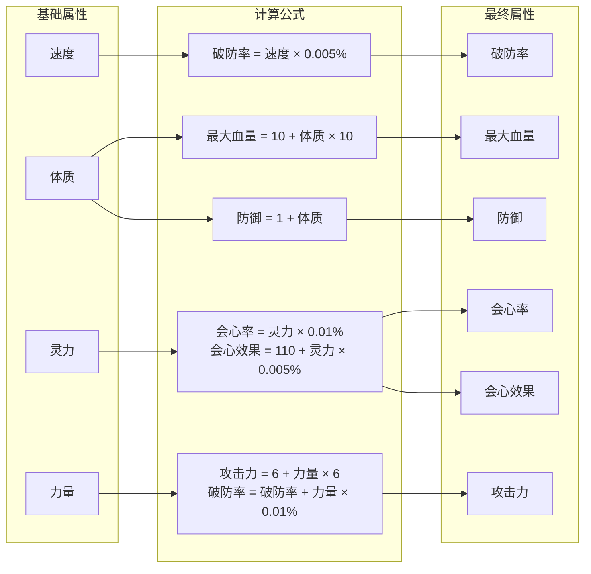
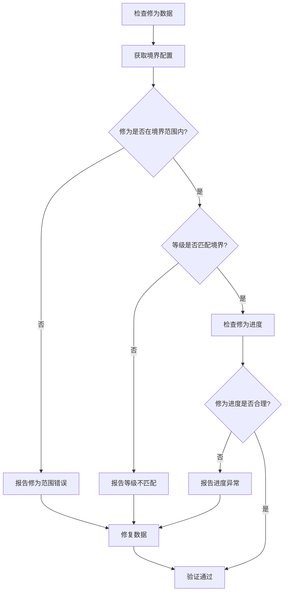
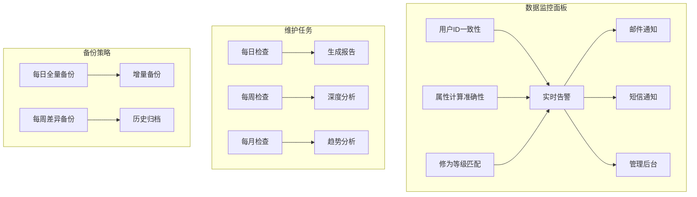

# 数据一致性检查

<cite>
**本文档引用的文件**
- [Life_Database_Init.sql](file://Life_Database_Init.sql)
- [Life_Deployment_Guide.md](file://Life_Deployment_Guide.md)
- [LifePlayer.java](file://Life\src\main\java\com\bot\life\dao\entity\LifePlayer.java)
- [LifeGameStatus.java](file://Life\src\main\java\com\bot\life\dao\entity\LifeGameStatus.java)
- [PlayerServiceImpl.java](file://Life\src\main\java\com\bot\life\service\impl\PlayerServiceImpl.java)
- [HealthRecoveryServiceImpl.java](file://Life\src\main\java\com\bot\life\service\impl\HealthRecoveryServiceImpl.java)
- [RealmServiceImpl.java](file://Life\src\main\java\com\bot\life\service\impl\RealmServiceImpl.java)
- [LifeGameStatusMapper.xml](file://Life\src\main\resources\mapper\LifeGameStatusMapper.xml)
- [LifeSystemConfigMapper.java](file://Life\src\main\java\com\bot\life\dao\mapper\LifeSystemConfigMapper.java)
- [HealthRecoveryTask.java](file://Life\src\main\java\com\bot\life\task\HealthRecoveryTask.java)
</cite>

## 目录
1. [概述](#概述)
2. [核心数据表结构](#核心数据表结构)
3. [数据一致性检查架构](#数据一致性检查架构)
4. [用户ID一致性验证](#用户id一致性验证)
5. [玩家属性计算准确性检查](#玩家属性计算准确性检查)
6. [修为与等级匹配度验证](#修为与等级匹配度验证)
7. [数据异常检测机制](#数据异常检测机制)
8. [自动化检查脚本](#自动化检查脚本)
9. [数据修复方法](#数据修复方法)
10. [监控与维护](#监控与维护)

## 概述

浮生卷项目是一个基于Java Spring Boot框架的修仙文字游戏，核心业务数据涉及玩家角色、游戏状态、境界配置等多个重要表。本文档详细说明了如何验证这些核心业务数据的一致性，确保游戏逻辑的正确性和数据的完整性。

数据一致性检查主要包括以下几个方面：
- **用户ID一致性**：确保life_player表与life_game_status表的用户ID关联正确
- **属性计算准确性**：验证玩家属性（血量、防御、攻击力等）计算公式的正确性
- **修为等级匹配**：检查修为与境界等级的对应关系
- **系统配置验证**：确保系统配置参数的有效性
- **数据完整性**：检测缺失数据和异常值

## 核心数据表结构

### 生命模块核心表



**图表来源**
- [Life_Database_Init.sql](file://Life_Database_Init.sql#L6-L48)
- [Life_Database_Init.sql](file://Life_Database_Init.sql#L379-L389)

### 关键字段说明

| 表名 | 关键字段 | 类型 | 说明 |
|------|----------|------|------|
| life_player | user_id | varchar(50) | 用户唯一标识符 |
| life_player | level | int | 玩家等级 |
| life_player | cultivation | bigint | 修为值 |
| life_player | max_health | int | 最大血量 |
| life_player | constitution | int | 体质属性 |
| life_game_status | user_id | varchar(50) | 用户唯一标识符 |
| life_game_status | game_mode | tinyint | 游戏模式状态 |

**章节来源**
- [Life_Database_Init.sql](file://Life_Database_Init.sql#L6-L48)
- [Life_Database_Init.sql](file://Life_Database_Init.sql#L379-L389)

## 数据一致性检查架构

### 检查流程图



**图表来源**
- [PlayerServiceImpl.java](file://Life\src\main\java\com\bot\life\service\impl\PlayerServiceImpl.java#L108-L120)
- [HealthRecoveryServiceImpl.java](file://Life\src\main\java\com\bot\life\service\impl\HealthRecoveryServiceImpl.java#L29-L62)

## 用户ID一致性验证

### SQL验证查询

```sql
-- 检查life_player与life_game_status用户ID一致性
SELECT 
    p.user_id AS player_user_id,
    g.user_id AS game_status_user_id,
    CASE 
        WHEN p.user_id = g.user_id THEN '一致'
        ELSE '不一致'
    END AS consistency_status
FROM 
    life_player p
LEFT JOIN 
    life_game_status g ON p.user_id = g.user_id
WHERE 
    g.user_id IS NULL OR p.user_id <> g.user_id;

-- 检查孤立的游戏状态记录
SELECT 
    g.id,
    g.user_id,
    g.create_time,
    g.update_time
FROM 
    life_game_status g
LEFT JOIN 
    life_player p ON g.user_id = p.user_id
WHERE 
    p.user_id IS NULL;

-- 检查孤立的玩家记录
SELECT 
    p.id,
    p.user_id,
    p.nickname,
    p.create_time
FROM 
    life_player p
LEFT JOIN 
    life_game_status g ON p.user_id = g.user_id
WHERE 
    g.user_id IS NULL;
```

### Java验证逻辑

```java
// 用户ID一致性检查服务
@Service
public class UserIdConsistencyChecker {
    
    @Autowired
    private LifePlayerMapper playerMapper;
    
    @Autowired
    private LifeGameStatusMapper gameStatusMapper;
    
    public ConsistencyReport checkUserIdConsistency() {
        ConsistencyReport report = new ConsistencyReport();
        
        // 获取所有玩家ID
        List<String> playerUserIds = playerMapper.selectAllUserIds();
        List<String> gameStatusUserIds = gameStatusMapper.selectAllUserIds();
        
        // 检查缺失的关联
        List<String> missingFromGameStatus = playerUserIds.stream()
            .filter(userId -> !gameStatusUserIds.contains(userId))
            .collect(Collectors.toList());
            
        List<String> missingFromPlayer = gameStatusUserIds.stream()
            .filter(userId -> !playerUserIds.contains(userId))
            .collect(Collectors.toList());
            
        report.setMissingFromGameStatus(missingFromGameStatus);
        report.setMissingFromPlayer(missingFromGameStatus);
        
        return report;
    }
}
```

**章节来源**
- [LifePlayer.java](file://Life\src\main\java\com\bot\life\dao\entity\LifePlayer.java#L46-L84)
- [LifeGameStatus.java](file://Life\src\main\java\com\bot\life\dao\entity\LifeGameStatus.java#L13-L20)

## 玩家属性计算准确性检查

### 属性计算公式验证

根据系统配置和业务逻辑，玩家属性计算遵循以下公式：



**图表来源**
- [LifePlayer.java](file://Life\src\main\java\com\bot\life\dao\entity\LifePlayer.java#L56-L76)

### SQL属性验证查询

```sql
-- 检查属性计算准确性
SELECT 
    p.id,
    p.user_id,
    p.level,
    p.constitution,
    p.speed,
    p.spirit_power,
    p.strength,
    p.max_health AS current_max_health,
    p.defense AS current_defense,
    p.critical_rate AS current_critical_rate,
    p.critical_damage AS current_critical_damage,
    p.attack_power AS current_attack_power,
    p.armor_break AS current_armor_break,
    
    -- 计算的期望值
    10 + p.constitution * 10 AS expected_max_health,
    1 + p.constitution AS expected_defense,
    ROUND(p.spirit_power * 0.01, 3) AS expected_critical_rate,
    ROUND(110 + p.spirit_power * 0.005, 3) AS expected_critical_damage,
    6 + p.strength * 6 AS expected_attack_power,
    ROUND(p.speed * 0.005 + p.strength * 0.01, 3) AS expected_armor_break,
    
    -- 差异检查
    CASE WHEN p.max_health <> 10 + p.constitution * 10 THEN '不一致' ELSE '一致' END AS health_check,
    CASE WHEN p.defense <> 1 + p.constitution THEN '不一致' ELSE '一致' END AS defense_check,
    CASE WHEN p.critical_rate <> ROUND(p.spirit_power * 0.01, 3) THEN '不一致' ELSE '一致' END AS crit_rate_check,
    CASE WHEN p.critical_damage <> ROUND(110 + p.spirit_power * 0.005, 3) THEN '不一致' ELSE '一致' END AS crit_damage_check,
    CASE WHEN p.attack_power <> 6 + p.strength * 6 THEN '不一致' ELSE '一致' END AS attack_check,
    CASE WHEN p.armor_break <> ROUND(p.speed * 0.005 + p.strength * 0.01, 3) THEN '不一致' ELSE '一致' END AS armor_break_check
    
FROM 
    life_player p
WHERE 
    p.max_health <> 10 + p.constitution * 10 OR
    p.defense <> 1 + p.constitution OR
    p.critical_rate <> ROUND(p.spirit_power * 0.01, 3) OR
    p.critical_damage <> ROUND(110 + p.spirit_power * 0.005, 3) OR
    p.attack_power <> 6 + p.strength * 6 OR
    p.armor_break <> ROUND(p.speed * 0.005 + p.strength * 0.01, 3);
```

### 属性验证服务

```java
@Service
public class AttributeValidationService {
    
    @Autowired
    private LifePlayerMapper playerMapper;
    
    @Autowired
    private SystemConfigService systemConfigService;
    
    public ValidationResult validatePlayerAttributes(Long playerId) {
        LifePlayer player = playerMapper.selectByPrimaryKey(playerId);
        if (player == null) {
            return ValidationResult.error("玩家不存在");
        }
        
        ValidationResult result = new ValidationResult();
        
        // 验证最大血量
        int expectedMaxHealth = 10 + player.getConstitution() * 10;
        if (player.getMaxHealth() != expectedMaxHealth) {
            result.addWarning("最大血量不正确", 
                String.format("期望: %d, 实际: %d", expectedMaxHealth, player.getMaxHealth()));
        }
        
        // 验证防御
        int expectedDefense = 1 + player.getConstitution();
        if (player.getDefense() != expectedDefense) {
            result.addWarning("防御值不正确",
                String.format("期望: %d, 实际: %d", expectedDefense, player.getDefense()));
        }
        
        // 验证会心率
        BigDecimal expectedCritRate = BigDecimal.valueOf(player.getSpiritPower() * 0.01);
        if (player.getCriticalRate().compareTo(expectedCritRate) != 0) {
            result.addWarning("会心率不正确",
                String.format("期望: %s, 实际: %s", expectedCritRate, player.getCriticalRate()));
        }
        
        // 验证攻击力
        int expectedAttackPower = 6 + player.getStrength() * 6;
        if (player.getAttackPower() != expectedAttackPower) {
            result.addWarning("攻击力不正确",
                String.format("期望: %d, 实际: %d", expectedAttackPower, player.getAttackPower()));
        }
        
        return result;
    }
}
```

**章节来源**
- [LifePlayer.java](file://Life\src\main\java\com\bot\life\dao\entity\LifePlayer.java#L56-L76)

## 修为与等级匹配度验证

### 境界配置验证



**图表来源**
- [RealmServiceImpl.java](file://Life\src\main\java\com\bot\life\service\impl\RealmServiceImpl.java#L125-L133)

### SQL修为验证查询

```sql
-- 检查修为与境界匹配度
WITH realm_ranges AS (
    SELECT 
        realm_name,
        min_level,
        max_level,
        required_cultivation,
        max_cultivation
    FROM 
        life_realm_config
),
player_realms AS (
    SELECT 
        p.id,
        p.user_id,
        p.level,
        p.cultivation,
        r.realm_name,
        r.min_level,
        r.max_level,
        r.required_cultivation,
        r.max_cultivation,
        CASE 
            WHEN p.cultivation >= r.required_cultivation AND p.cultivation <= r.max_cultivation THEN '匹配'
            WHEN p.cultivation < r.required_cultivation THEN '不足'
            WHEN p.cultivation > r.max_cultivation THEN '超出'
            ELSE '异常'
        END AS cultivation_status
    FROM 
        life_player p
    LEFT JOIN 
        realm_ranges r ON p.level BETWEEN r.min_level AND r.max_level
)
SELECT 
    pr.id,
    pr.user_id,
    pr.level,
    pr.cultivation,
    pr.realm_name,
    pr.min_level,
    pr.max_level,
    pr.required_cultivation,
    pr.max_cultivation,
    pr.cultivation_status,
    
    -- 修为进度百分比
    ROUND((pr.cultivation * 1.0 / pr.max_cultivation) * 100, 2) AS progress_percentage,
    
    -- 距离突破所需修为
    CASE 
        WHEN pr.cultivation_status = '不足' THEN pr.required_cultivation - pr.cultivation
        ELSE 0
    END AS needed_for_breakthrough
    
FROM 
    player_realms pr
WHERE 
    pr.cultivation_status IN ('不足', '超出')
ORDER BY 
    pr.cultivation_status, pr.needed_for_breakthrough DESC;
```

### 修为验证服务

```java
@Service
public class CultivationValidationService {
    
    @Autowired
    private LifePlayerMapper playerMapper;
    
    @Autowired
    private LifeRealmConfigMapper realmConfigMapper;
    
    public CultivationValidationResult validateCultivation(Long playerId) {
        LifePlayer player = playerMapper.selectByPrimaryKey(playerId);
        if (player == null) {
            return CultivationValidationResult.error("玩家不存在");
        }
        
        CultivationValidationResult result = new CultivationValidationResult();
        
        // 获取当前境界配置
        LifeRealmConfig currentRealm = realmConfigMapper.selectByLevel(player.getLevel());
        if (currentRealm == null) {
            result.addError("无法找到当前境界配置");
            return result;
        }
        
        // 验证修为范围
        if (player.getCultivation() < 0) {
            result.addError("修为不能为负数");
        }
        
        if (player.getCultivation() > currentRealm.getMaxCultivation()) {
            result.addWarning("修为超出境界上限",
                String.format("当前修为: %d, 境界上限: %d", 
                    player.getCultivation(), currentRealm.getMaxCultivation()));
        }
        
        if (player.getCultivation() < currentRealm.getRequiredCultivation()) {
            result.addWarning("修为不足",
                String.format("需要修为: %d, 当前修为: %d", 
                    currentRealm.getRequiredCultivation(), player.getCultivation()));
        }
        
        // 计算修为进度
        double progress = (double) player.getCultivation() / currentRealm.getMaxCultivation() * 100;
        result.setProgressPercentage(progress);
        
        // 检查修炼速度合理性
        if (player.getCultivationSpeed() < 1) {
            result.addWarning("修炼速度过低", "修炼速度应至少为1");
        }
        
        return result;
    }
}
```

**章节来源**
- [RealmServiceImpl.java](file://Life\src\main\java\com\bot\life\service\impl\RealmServiceImpl.java#L125-L133)

## 数据异常检测机制

### 异常检测规则

```mermaid
flowchart TD
StartDetection[开始异常检测] --> CheckNegative[检查负值字段]
CheckNegative --> CheckOutOfRange[检查超出范围的值]
CheckOutOfRange --> CheckNull[检查必填字段]
CheckNull --> CheckDuplicate[检查重复数据]
CheckDuplicate --> CheckFormat[检查数据格式]
CheckFormat --> GenerateAlerts[生成异常警报]
GenerateAlerts --> NotifyAdmin[通知管理员]
NotifyAdmin --> EndDetection[检测完成]
CheckNegative --> NegativeFields[Negative Fields:<br/>- 修为<br/>- 血量<br/>- 体力<br/>- 灵粹]
CheckOutOfRange --> RangeFields[Range Fields:<br/>- 等级 (1-99)<br/>- 体质 (1-100)<br/>- 速度 (1-100)<br/>- 灵力 (1-100)]
CheckNull --> NullFields[Null Fields:<br/>- 必须字段<br/>- 外键关联]
CheckDuplicate --> DuplicateFields[Duplicate Fields:<br/>- 用户ID<br/>- 昵称<br/>- 角色名]
CheckFormat --> FormatFields[Format Fields:<br/>- 用户ID格式<br/>- 时间戳格式<br/>- JSON格式]
```

### 异常检测服务

```java
@Service
public class DataAnomalyDetector {
    
    @Autowired
    private LifePlayerMapper playerMapper;
    
    @Autowired
    private SystemConfigService systemConfigService;
    
    public AnomalyReport detectDataAnomalies() {
        AnomalyReport report = new AnomalyReport();
        
        // 检查负值字段
        List<LifePlayer> negativeValuePlayers = playerMapper.selectWithNegativeValues();
        report.addAnomalies("负值字段", negativeValuePlayers.stream()
            .map(p -> String.format("玩家ID: %d, 用户ID: %s", p.getId(), p.getUserId()))
            .collect(Collectors.toList()));
        
        // 检查超出范围的值
        List<LifePlayer> outOfRangePlayers = playerMapper.selectOutOfRangeValues();
        report.addAnomalies("超出范围的值", outOfRangePlayers.stream()
            .map(p -> String.format("玩家ID: %d, 用户ID: %s, 等级: %d", 
                p.getId(), p.getUserId(), p.getLevel()))
            .collect(Collectors.toList()));
        
        // 检查异常的属性值
        List<LifePlayer> abnormalAttrPlayers = playerMapper.selectAbnormalAttributes();
        report.addAnomalies("异常属性值", abnormalAttrPlayers.stream()
            .map(p -> String.format("玩家ID: %d, 用户ID: %s, 血量: %d/%d", 
                p.getId(), p.getUserId(), p.getHealth(), p.getMaxHealth()))
            .collect(Collectors.toList()));
        
        // 检查长时间未活动的玩家
        Date inactiveThreshold = DateUtils.addDays(new Date(), -30);
        List<LifePlayer> inactivePlayers = playerMapper.selectInactivePlayers(inactiveThreshold);
        report.addAnomalies("长期未活动玩家", inactivePlayers.stream()
            .map(p -> String.format("玩家ID: %d, 用户ID: %s, 最后活动: %s", 
                p.getId(), p.getUserId(), p.getUpdateTime()))
            .collect(Collectors.toList()));
        
        return report;
    }
}
```

**章节来源**
- [HealthRecoveryServiceImpl.java](file://Life\src\main\java\com\bot\life\service\impl\HealthRecoveryServiceImpl.java#L29-L62)

## 自动化检查脚本

### 定时检查任务

```java
@Component
public class DataConsistencyCheckerTask {
    
    @Autowired
    private UserIdConsistencyChecker userIdChecker;
    
    @Autowired
    private AttributeValidationService attrValidator;
    
    @Autowired
    private CultivationValidationService cultivationValidator;
    
    @Autowired
    private DataAnomalyDetector anomalyDetector;
    
    @Autowired
    private NotificationService notificationService;
    
    /**
     * 每小时执行一次全面数据一致性检查
     */
    @Scheduled(cron = "0 0 * * * ?")
    public void runFullDataCheck() {
        try {
            logger.info("开始执行全面数据一致性检查...");
            
            // 执行各项检查
            ConsistencyReport userIdReport = userIdChecker.checkUserIdConsistency();
            ValidationResult attrReport = new ValidationResult();
            CultivationValidationResult cultReport = new CultivationValidationResult();
            
            // 获取所有玩家ID进行属性和修为检查
            List<Long> playerIds = playerMapper.selectAllPlayerIds();
            for (Long playerId : playerIds) {
                ValidationResult attrResult = attrValidator.validatePlayerAttributes(playerId);
                attrReport.merge(attrResult);
                
                CultivationValidationResult cultResult = cultivationValidator.validateCultivation(playerId);
                cultReport.merge(cultResult);
            }
            
            // 检测异常数据
            AnomalyReport anomalyReport = anomalyDetector.detectDataAnomalies();
            
            // 生成综合报告
            ComprehensiveReport report = new ComprehensiveReport(
                userIdReport, attrReport, cultReport, anomalyReport
            );
            
            // 发送报告
            notificationService.sendDataCheckReport(report);
            
            logger.info("数据一致性检查完成，发现问题: {}", report.getTotalIssues());
            
        } catch (Exception e) {
            logger.error("数据一致性检查任务执行失败", e);
            notificationService.sendErrorMessage("数据一致性检查任务失败", e.getMessage());
        }
    }
    
    /**
     * 每天凌晨2点执行深度检查
     */
    @Scheduled(cron = "0 0 2 * * ?")
    public void runDeepDataCheck() {
        // 执行更深入的数据质量检查
        // 包括跨表关联检查、历史数据完整性检查等
    }
}
```

### SQL检查脚本模板

```sql
-- 浮生卷数据一致性检查脚本模板

-- 1. 用户ID一致性检查
CREATE PROCEDURE check_user_id_consistency()
BEGIN
    SELECT 
        '用户ID不一致' AS issue_type,
        p.user_id,
        g.user_id AS game_status_user_id,
        p.nickname,
        p.create_time
    FROM 
        life_player p
    LEFT JOIN 
        life_game_status g ON p.user_id = g.user_id
    WHERE 
        g.user_id IS NULL OR p.user_id <> g.user_id;
END;

-- 2. 属性计算准确性检查
CREATE PROCEDURE check_attribute_accuracy()
BEGIN
    SELECT 
        p.id,
        p.user_id,
        p.constitution,
        p.speed,
        p.spirit_power,
        p.strength,
        p.max_health AS current_max_health,
        p.defense AS current_defense,
        p.critical_rate AS current_critical_rate,
        p.attack_power AS current_attack_power,
        
        -- 计算的期望值
        10 + p.constitution * 10 AS expected_max_health,
        1 + p.constitution AS expected_defense,
        ROUND(p.spirit_power * 0.01, 3) AS expected_critical_rate,
        6 + p.strength * 6 AS expected_attack_power
        
    FROM 
        life_player p
    WHERE 
        p.max_health <> 10 + p.constitution * 10 OR
        p.defense <> 1 + p.constitution OR
        p.critical_rate <> ROUND(p.spirit_power * 0.01, 3) OR
        p.attack_power <> 6 + p.strength * 6;
END;

-- 3. 修为等级匹配检查
CREATE PROCEDURE check_cultivation_level_match()
BEGIN
    WITH realm_ranges AS (
        SELECT 
            realm_name,
            min_level,
            max_level,
            required_cultivation,
            max_cultivation
        FROM 
            life_realm_config
    )
    SELECT 
        p.id,
        p.user_id,
        p.level,
        p.cultivation,
        r.realm_name,
        r.min_level,
        r.max_level,
        r.required_cultivation,
        r.max_cultivation,
        
        CASE 
            WHEN p.cultivation >= r.required_cultivation AND p.cultivation <= r.max_cultivation THEN '匹配'
            WHEN p.cultivation < r.required_cultivation THEN '不足'
            WHEN p.cultivation > r.max_cultivation THEN '超出'
            ELSE '异常'
        END AS cultivation_status
        
    FROM 
        life_player p
    LEFT JOIN 
        realm_ranges r ON p.level BETWEEN r.min_level AND r.max_level
    WHERE 
        CASE 
            WHEN p.cultivation >= r.required_cultivation AND p.cultivation <= r.max_cultivation THEN 0
            ELSE 1
        END;
END;
```

**章节来源**
- [HealthRecoveryTask.java](file://Life\src\main\java\com\bot\life\task\HealthRecoveryTask.java#L19-L30)

## 数据修复方法

### 自动修复机制

```java
@Service
public class DataRepairService {
    
    @Autowired
    private LifePlayerMapper playerMapper;
    
    @Autowired
    private PlayerService playerService;
    
    @Autowired
    private SystemConfigService systemConfigService;
    
    /**
     * 自动修复属性计算错误
     */
    public RepairResult autoFixAttributeErrors(Long playerId) {
        LifePlayer player = playerMapper.selectByPrimaryKey(playerId);
        if (player == null) {
            return RepairResult.error("玩家不存在");
        }
        
        RepairResult result = new RepairResult();
        
        // 修复最大血量
        int expectedMaxHealth = 10 + player.getConstitution() * 10;
        if (player.getMaxHealth() != expectedMaxHealth) {
            player.setMaxHealth(expectedMaxHealth);
            result.addFixedField("max_health", player.getMaxHealth());
        }
        
        // 修复防御
        int expectedDefense = 1 + player.getConstitution();
        if (player.getDefense() != expectedDefense) {
            player.setDefense(expectedDefense);
            result.addFixedField("defense", player.getDefense());
        }
        
        // 修复会心率
        BigDecimal expectedCritRate = BigDecimal.valueOf(player.getSpiritPower() * 0.01);
        if (player.getCriticalRate().compareTo(expectedCritRate) != 0) {
            player.setCriticalRate(expectedCritRate);
            result.addFixedField("critical_rate", player.getCriticalRate());
        }
        
        // 修复攻击力
        int expectedAttackPower = 6 + player.getStrength() * 6;
        if (player.getAttackPower() != expectedAttackPower) {
            player.setAttackPower(expectedAttackPower);
            result.addFixedField("attack_power", player.getAttackPower());
        }
        
        // 修复破防率
        BigDecimal expectedArmorBreak = BigDecimal.valueOf(player.getSpeed() * 0.005 + player.getStrength() * 0.01);
        if (player.getArmorBreak().compareTo(expectedArmorBreak) != 0) {
            player.setArmorBreak(expectedArmorBreak);
            result.addFixedField("armor_break", player.getArmorBreak());
        }
        
        // 保存修复后的数据
        playerService.updatePlayer(player);
        
        return result;
    }
    
    /**
     * 批量修复所有玩家的属性
     */
    public BatchRepairResult batchFixAllAttributes() {
        List<Long> playerIds = playerMapper.selectAllPlayerIds();
        BatchRepairResult result = new BatchRepairResult();
        
        for (Long playerId : playerIds) {
            try {
                RepairResult repairResult = autoFixAttributeErrors(playerId);
                result.addPlayerResult(playerId, repairResult);
            } catch (Exception e) {
                result.addError(playerId, e.getMessage());
            }
        }
        
        return result;
    }
}
```

### 手动修复工具

```java
@RestController
@RequestMapping("/admin/data-repair")
public class DataRepairController {
    
    @Autowired
    private DataRepairService repairService;
    
    @PostMapping("/fix-attributes/{playerId}")
    public ApiResponse fixPlayerAttributes(@PathVariable Long playerId) {
        RepairResult result = repairService.autoFixAttributeErrors(playerId);
        return ApiResponse.success(result);
    }
    
    @PostMapping("/batch-fix-attributes")
    public ApiResponse batchFixAttributes() {
        BatchRepairResult result = repairService.batchFixAllAttributes();
        return ApiResponse.success(result);
    }
    
    @PostMapping("/repair-user-id/{playerId}")
    public ApiResponse repairUserId(@PathVariable Long playerId) {
        // 实现用户ID修复逻辑
        return ApiResponse.success("修复完成");
    }
    
    @PostMapping("/restore-player/{playerId}")
    public ApiResponse restorePlayerData(@PathVariable Long playerId) {
        // 实现玩家数据恢复逻辑
        return ApiResponse.success("恢复完成");
    }
}
```

**章节来源**
- [PlayerServiceImpl.java](file://Life\src\main\java\com\bot\life\service\impl\PlayerServiceImpl.java#L108-L120)

## 监控与维护

### 数据监控仪表板



### 监控配置

```yaml
# application-monitoring.yml
monitoring:
  data-consistency:
    enabled: true
    check-interval: 3600000  # 1小时
    anomaly-threshold:
      negative-values: true
      out-of-range: true
      attribute-errors: true
      cultivation-mismatch: true
    notifications:
      email:
        enabled: true
        recipients:
          - admin@example.com
      sms:
        enabled: false
      slack:
        enabled: false
        webhook-url: "${SLACK_WEBHOOK_URL}"
      
  backup:
    schedule:
      daily: "0 0 2 * * ?"  # 每天凌晨2点
      weekly: "0 0 2 ? * SUN"  # 每周日凌晨2点
    retention:
      days: 30
      weeks: 12
      months: 12
      
  alerting:
    severity:
      low: "INFO"
      medium: "WARN"
      high: "ERROR"
      critical: "FATAL"
    escalation:
      threshold: 5  # 连续5次告警后升级
      timeout: 3600000  # 1小时
```

### 维护建议

根据部署指南中的维护建议，定期执行以下维护任务：

```sql
-- 定期维护任务
-- 1. 清理过期临时文件
DELETE FROM life_temp_files WHERE expire_time < NOW();

-- 2. 优化数据库表
OPTIMIZE TABLE life_player;
OPTIMIZE TABLE life_game_status;
OPTIMIZE TABLE life_realm_config;

-- 3. 分析表统计信息
ANALYZE TABLE life_player;
ANALYZE TABLE life_game_status;
ANALYZE TABLE life_realm_config;

-- 4. 检查索引使用情况
EXPLAIN SELECT * FROM life_player WHERE user_id = 'some_user_id';

-- 5. 监控慢查询
SET GLOBAL slow_query_log = 'ON';
SET GLOBAL long_query_time = 1;
```

**章节来源**
- [Life_Deployment_Guide.md](file://Life_Deployment_Guide.md#L170-L200)

## 结论

浮生卷项目的数据一致性检查体系涵盖了从基础的用户ID关联到复杂的属性计算验证等多个层面。通过建立完善的检查机制、自动化修复工具和监控体系，可以有效保障游戏业务数据的准确性和完整性。

关键要点包括：

1. **多层次检查**：从用户ID一致性到属性计算准确性，再到修为等级匹配的全方位检查
2. **自动化机制**：通过定时任务和自动化修复工具减少人工干预
3. **实时监控**：建立异常检测和告警机制，及时发现和处理数据问题
4. **预防性维护**：定期执行维护任务，预防数据质量问题的发生

通过持续的监控和维护，可以确保浮生卷游戏的核心业务数据始终保持高质量，为玩家提供稳定可靠的游戏体验。