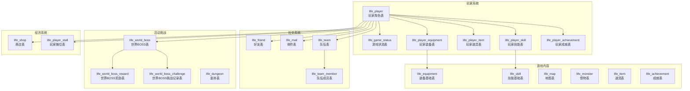
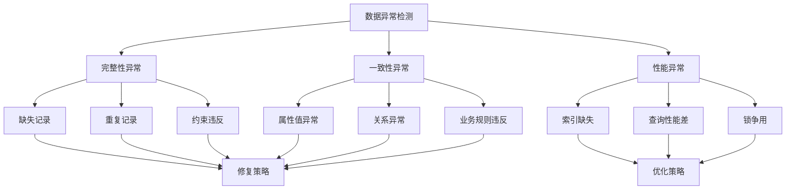

# 数据完整性检查

<cite>
**本文档引用的文件**
- [Life_Database_Init.sql](file://Life_Database_Init.sql)
- [Life_Deployment_Guide.md](file://Life_Deployment_Guide.md)
- [Life_Database_Tables_Check.md](file://Life_Database_Tables_Check.md)
- [application.properties](file://Boot/src/main/resources/application.properties)
- [application-dev.properties](file://Boot/src/main/resources/application-dev.properties)
- [application-prod.properties](file://Boot/src/main/resources/application-prod.properties)
- [LifePlayer.java](file://Life/src/main/java/com/bot/life/dao/entity/LifePlayer.java)
- [LifeGameStatus.java](file://Life/src/main/java/com/bot/life/dao/entity/LifeGameStatus.java)
- [LifePlayerEquipment.java](file://Life/src/main/java/com/bot/life/dao/entity/LifePlayerEquipment.java)
- [HealthRecoveryServiceImpl.java](file://Life/src/main/java/com/bot/life/service/impl/HealthRecoveryServiceImpl.java)
</cite>

## 目录
1. [概述](#概述)
2. [数据库架构概览](#数据库架构概览)
3. [核心表结构分析](#核心表结构分析)
4. [外键约束验证](#外键约束验证)
5. [数据一致性检查](#数据一致性检查)
6. [索引完整性验证](#索引完整性验证)
7. [常见数据异常识别](#常见数据异常识别)
8. [SQL验证查询语句](#sql验证查询语句)
9. [自动化检查工具](#自动化检查工具)
10. [故障排除指南](#故障排除指南)
11. [最佳实践建议](#最佳实践建议)

## 概述

Bot项目采用MySQL数据库存储游戏数据，包含22张核心表，涵盖了玩家角色管理、装备系统、技能体系、社交功能等多个游戏模块。数据完整性检查是确保游戏稳定运行的关键环节，本文档提供了全面的检查方法和工具。

### 检查目标
- 验证数据库表结构的完整性和正确性
- 确保外键约束的有效性
- 检查数据一致性和业务规则
- 识别潜在的数据异常和错误
- 提供自动化检查工具和脚本

## 数据库架构概览

Bot项目的数据库采用分层设计，主要分为以下几个模块：



**图表来源**
- [Life_Database_Init.sql](file://Life_Database_Init.sql#L6-L646)

## 核心表结构分析

### 玩家角色表 (life_player)

玩家角色表是整个游戏系统的核心，存储玩家的基本信息和属性数据。

| 字段名 | 类型 | 约束 | 说明 |
|--------|------|------|------|
| id | bigint | PRIMARY KEY, AUTO_INCREMENT | 主键ID |
| user_id | varchar(50) | UNIQUE, NOT NULL | 用户唯一标识 |
| nickname | varchar(21) | UNIQUE, NOT NULL | 角色昵称 |
| attribute | tinyint | NOT NULL | 角色属性(1金2木3水4火5土) |
| level | int | DEFAULT 1 | 等级 |
| experience | bigint | DEFAULT 0 | 经验值 |
| cultivation | bigint | DEFAULT 0 | 修为 |
| speed | int | DEFAULT 1 | 速度 |
| constitution | int | DEFAULT 1 | 体质 |
| spirit_power | int | DEFAULT 1 | 灵力 |
| strength | int | DEFAULT 1 | 力量 |
| health | int | DEFAULT 10 | 血量 |
| max_health | int | DEFAULT 10 | 最大血量 |
| defense | int | DEFAULT 1 | 防御 |
| critical_rate | decimal(5,3) | DEFAULT 0.000 | 会心率(%) |
| critical_damage | decimal(6,3) | DEFAULT 110.000 | 会心效果(%) |
| armor_break | decimal(5,3) | DEFAULT 0.000 | 破防(%) |
| attack_power | int | DEFAULT 6 | 攻击力 |
| stamina | int | DEFAULT 100 | 体力值 |
| max_stamina | int | DEFAULT 100 | 最大体力 |
| spirit | bigint | DEFAULT 1000 | 灵粹(游戏货币) |
| current_map_id | bigint | DEFAULT 1 | 当前所在地图ID |
| game_status | tinyint | DEFAULT 0 | 游戏状态 |

**节来源**
- [Life_Database_Init.sql](file://Life_Database_Init.sql#L6-L48)
- [LifePlayer.java](file://Life/src/main/java/com/bot/life/dao/entity/LifePlayer.java#L14-L51)

### 游戏状态表 (life_game_status)

游戏状态表记录玩家的游戏进程和上下文信息。

| 字段名 | 类型 | 约束 | 说明 |
|--------|------|------|------|
| id | bigint | PRIMARY KEY, AUTO_INCREMENT | 主键ID |
| user_id | varchar(50) | UNIQUE, NOT NULL | 用户ID |
| game_mode | tinyint | DEFAULT 0 | 游戏模式(0未进入1预备状态2正式游戏) |
| current_menu | varchar(50) | NULLABLE | 当前菜单状态 |
| context_data | text | NULLABLE | JSON格式的上下文数据 |
| create_time | datetime | DEFAULT CURRENT_TIMESTAMP | 创建时间 |
| update_time | datetime | DEFAULT CURRENT_TIMESTAMP ON UPDATE CURRENT_TIMESTAMP | 更新时间 |

**节来源**
- [Life_Database_Init.sql](file://Life_Database_Init.sql#L378-L389)
- [LifeGameStatus.java](file://Life/src/main/java/com/bot/life/dao/entity/LifeGameStatus.java#L13-L20)

### 玩家装备表 (life_player_equipment)

玩家装备表管理玩家的装备持有和装备状态。

| 字段名 | 类型 | 约束 | 说明 |
|--------|------|------|------|
| id | bigint | PRIMARY KEY, AUTO_INCREMENT | 主键ID |
| player_id | bigint | NOT NULL, INDEX | 玩家ID |
| equipment_id | bigint | NOT NULL, INDEX | 装备ID |
| is_equipped | tinyint | DEFAULT 0 | 是否装备(0未装备1已装备) |
| proficiency | int | DEFAULT 0 | 熟练度(仅法宝使用) |
| level | int | DEFAULT 1 | 等级(仅法宝使用) |
| create_time | datetime | DEFAULT CURRENT_TIMESTAMP | 创建时间 |
| update_time | datetime | DEFAULT CURRENT_TIMESTAMP ON UPDATE CURRENT_TIMESTAMP | 更新时间 |

**节来源**
- [Life_Database_Init.sql](file://Life_Database_Init.sql#L63-L74)
- [LifePlayerEquipment.java](file://Life/src/main/java/com/bot/life/dao/entity/LifePlayerEquipment.java#L13-L24)

## 外键约束验证

### 约束关系图

```mermaid
erDiagram
LIFE_PLAYER {
bigint id PK
varchar user_id UK
varchar nickname UK
tinyint attribute
int level
bigint experience
bigint cultivation
int speed
int constitution
int spirit_power
int strength
int health
int max_health
int defense
decimal critical_rate
decimal critical_damage
decimal armor_break
int attack_power
int stamina
int max_stamina
bigint spirit
bigint current_map_id FK
tinyint game_status
datetime create_time
datetime update_time
}
LIFE_GAME_STATUS {
bigint id PK
varchar user_id UK
tinyint game_mode
varchar current_menu
text context_data
datetime create_time
datetime update_time
}
LIFE_PLAYER_EQUIPMENT {
bigint id PK
bigint player_id FK
bigint equipment_id FK
tinyint is_equipped
int proficiency
int level
datetime create_time
datetime update_time
}
LIFE_EQUIPMENT {
bigint id PK
varchar name
tinyint type
tinyint attribute
tinyint rarity
text description
datetime create_time
}
LIFE_PLAYER_ITEM {
bigint id PK
bigint player_id FK
bigint item_id FK
int quantity
int used_count
datetime create_time
datetime update_time
}
LIFE_ITEM {
bigint id PK
varchar name
tinyint type
int effect_value
varchar effect_attribute
bigint skill_id FK
int max_use_count
tinyint can_use_in_battle
text description
datetime create_time
}
LIFE_PLAYER_SKILL {
bigint id PK
bigint player_id FK
bigint skill_id FK
int skill_level
int current_cooldown
datetime last_used_time
datetime learn_time
}
LIFE_SKILL {
bigint id PK
varchar name
tinyint type
tinyint attribute
int power
int cooldown
int required_level
int required_cultivation
int max_level
text description
}
LIFE_FRIEND {
bigint id PK
bigint player_id FK
bigint friend_id FK
tinyint status
datetime create_time
datetime update_time
}
LIFE_MAIL {
bigint id PK
bigint from_player_id FK
bigint to_player_id FK
varchar subject
text content
tinyint attachment_type
bigint attachment_id
int attachment_quantity
tinyint is_read
tinyint is_received
datetime create_time
}
LIFE_TEAM_MEMBER {
bigint id PK
bigint team_id FK
bigint player_id FK
tinyint member_status
datetime join_time
}
LIFE_TEAM {
bigint id PK
bigint leader_id FK
bigint map_id FK
tinyint status
datetime create_time
datetime update_time
}
LIFE_WORLD_BOSS {
bigint id PK
bigint monster_id FK
bigint map_id FK
time start_time
time end_time
int max_challenge_count
tinyint is_active
}
LIFE_SHOP {
bigint id PK
tinyint item_type
bigint item_id FK
int base_price
int current_price
decimal discount
tinyint in_stock
date last_refresh_date
timestamp create_time
timestamp update_time
}
LIFE_PLAYER_STALL {
bigint id PK
bigint player_id FK
varchar stall_name
tinyint item_type
bigint item_id FK
int quantity
int unit_price
datetime create_time
}
LIFE_PLAYER --||--|| LIFE_GAME_STATUS : "关联"
LIFE_PLAYER ||--o{ LIFE_PLAYER_EQUIPMENT : "拥有"
LIFE_PLAYER ||--o{ LIFE_PLAYER_ITEM : "持有"
LIFE_PLAYER ||--o{ LIFE_PLAYER_SKILL : "学习"
LIFE_PLAYER ||--o{ LIFE_PLAYER_ACHIEVEMENT : "达成"
LIFE_PLAYER ||--o{ LIFE_FRIEND : "好友关系"
LIFE_PLAYER ||--o{ LIFE_MAIL : "发送邮件"
LIFE_PLAYER ||--o{ LIFE_TEAM_MEMBER : "加入队伍"
LIFE_PLAYER ||--o{ LIFE_WORLD_BOSS_CHALLENGE : "挑战BOSS"
LIFE_PLAYER ||--o{ LIFE_PLAYER_STALL : "开设摊位"
LIFE_PLAYER_EQUIPMENT ||--|| LIFE_EQUIPMENT : "装备"
LIFE_PLAYER_ITEM ||--|| LIFE_ITEM : "道具"
LIFE_PLAYER_SKILL ||--|| LIFE_SKILL : "技能"
LIFE_FRIEND ||--|| LIFE_PLAYER : "双向关系"
LIFE_MAIL ||--|| LIFE_PLAYER : "收件人"
LIFE_TEAM_MEMBER ||--|| LIFE_TEAM : "队伍成员"
LIFE_TEAM ||--|| LIFE_PLAYER : "队长"
LIFE_WORLD_BOSS ||--|| LIFE_MONSTER : "BOSS怪物"
LIFE_SHOP ||--|| LIFE_ITEM : "商品"
LIFE_PLAYER_STALL ||--|| LIFE_ITEM : "摊位商品"
```

**图表来源**
- [Life_Database_Init.sql](file://Life_Database_Init.sql#L6-L646)

### 外键约束检查SQL

```sql
-- 检查外键约束是否正确设置
SELECT 
    CONSTRAINT_NAME, 
    TABLE_NAME, 
    COLUMN_NAME, 
    REFERENCED_TABLE_NAME, 
    REFERENCED_COLUMN_NAME
FROM INFORMATION_SCHEMA.KEY_COLUMN_USAGE
WHERE TABLE_SCHEMA = 'bot' 
AND REFERENCED_TABLE_NAME IS NOT NULL
ORDER BY TABLE_NAME, CONSTRAINT_NAME;

-- 检查特定表的外键约束
SELECT 
    CONSTRAINT_NAME, 
    TABLE_NAME, 
    COLUMN_NAME, 
    REFERENCED_TABLE_NAME, 
    REFERENCED_COLUMN_NAME
FROM INFORMATION_SCHEMA.KEY_COLUMN_USAGE
WHERE TABLE_SCHEMA = 'bot' 
AND TABLE_NAME IN ('life_player_equipment', 'life_player_item', 'life_player_skill')
AND REFERENCED_TABLE_NAME IS NOT NULL;
```

## 数据一致性检查

### 玩家数据一致性验证

#### 1. 基础属性一致性检查

```sql
-- 检查玩家属性计算的一致性
SELECT 
    p.id, 
    p.nickname,
    p.speed, p.constitution, p.spirit_power, p.strength,
    p.health, p.max_health, p.defense, 
    p.critical_rate, p.critical_damage, p.armor_break,
    p.attack_power, p.stamina, p.max_stamina,
    CASE 
        WHEN p.health > p.max_health THEN '异常: 当前血量超过最大血量'
        WHEN p.stamina > p.max_stamina THEN '异常: 当前体力超过最大体力'
        WHEN p.critical_rate > 1 THEN '异常: 会心率超过100%'
        WHEN p.armor_break > 30 THEN '异常: 破防率超过30%'
        ELSE '正常'
    END AS consistency_check
FROM life_player p
WHERE p.health > p.max_health 
   OR p.stamina > p.max_stamina 
   OR p.critical_rate > 1 
   OR p.armor_break > 30;
```

#### 2. 修为和经验一致性检查

```sql
-- 检查修为和经验的合理性
SELECT 
    p.id, 
    p.nickname,
    p.level, 
    p.experience, 
    p.cultivation,
    r.realm_name,
    r.required_cultivation as min_cultivation,
    CASE 
        WHEN p.level < r.min_level OR p.level > r.max_level THEN '异常: 等级超出境界范围'
        WHEN p.cultivation < r.required_cultivation THEN '异常: 修为低于境界要求'
        ELSE '正常'
    END AS consistency_check
FROM life_player p
LEFT JOIN life_realm_config r 
ON p.level BETWEEN r.min_level AND r.max_level
WHERE p.level < r.min_level 
   OR p.level > r.max_level 
   OR p.cultivation < r.required_cultivation;
```

#### 3. 游戏状态一致性检查

```sql
-- 检查游戏状态与玩家行为的一致性
SELECT 
    p.id, 
    p.nickname,
    p.game_status,
    p.last_battle_time,
    p.last_hp_recovery_time,
    p.last_cultivation_time,
    CASE 
        WHEN p.game_status = 1 AND p.last_battle_time IS NULL THEN '异常: 战斗中但没有战斗时间记录'
        WHEN p.game_status = 2 AND NOT EXISTS (
            SELECT 1 FROM life_team_member tm 
            WHERE tm.player_id = p.id AND tm.member_status = 1
        ) THEN '异常: 组队中但不在任何队伍中'
        WHEN p.game_status = 0 AND (p.last_battle_time IS NOT NULL OR p.last_cultivation_time IS NOT NULL) THEN '异常: 正常状态但有战斗或修炼记录'
        ELSE '正常'
    END AS consistency_check
FROM life_player p
LEFT JOIN life_game_status gs ON p.user_id = gs.user_id;
```

### 装备数据一致性检查

```sql
-- 检查装备装备状态的一致性
SELECT 
    pe.id, 
    pe.player_id,
    pe.equipment_id,
    pe.is_equipped,
    e.name as equipment_name,
    CASE 
        WHEN pe.is_equipped = 1 AND NOT EXISTS (
            SELECT 1 FROM life_player_equipment pe2 
            WHERE pe2.player_id = pe.player_id 
            AND pe2.is_equipped = 1 
            AND pe2.id != pe.id
        ) THEN '正常: 单一装备'
        WHEN pe.is_equipped = 1 AND EXISTS (
            SELECT 1 FROM life_player_equipment pe2 
            WHERE pe2.player_id = pe.player_id 
            AND pe2.is_equipped = 1 
            AND pe2.id != pe.id
        ) THEN '异常: 多重装备'
        ELSE '正常: 未装备'
    END AS equipment_consistency
FROM life_player_equipment pe
JOIN life_equipment e ON pe.equipment_id = e.id;
```

## 索引完整性验证

### 索引检查SQL

```sql
-- 检查表的索引完整性
SELECT 
    TABLE_NAME, 
    INDEX_NAME, 
    COLUMN_NAME, 
    SEQ_IN_INDEX, 
    CARDINALITY
FROM INFORMATION_SCHEMA.STATISTICS
WHERE TABLE_SCHEMA = 'bot'
AND TABLE_NAME LIKE 'life_%'
ORDER BY TABLE_NAME, INDEX_NAME, SEQ_IN_INDEX;

-- 检查关键索引是否存在
SELECT 
    TABLE_NAME, 
    INDEX_NAME, 
    GROUP_CONCAT(COLUMN_NAME ORDER BY SEQ_IN_INDEX) as indexed_columns
FROM INFORMATION_SCHEMA.STATISTICS
WHERE TABLE_SCHEMA = 'bot'
AND TABLE_NAME LIKE 'life_%'
GROUP BY TABLE_NAME, INDEX_NAME
HAVING indexed_columns NOT IN (
    'id',           -- 主键索引
    'user_id',      -- 用户ID唯一索引
    'player_id',    -- 玩家ID索引
    'equipment_id', -- 装备ID索引
    'skill_id',     -- 技能ID索引
    'nickname',     -- 昵称唯一索引
    'name'          -- 名称索引
);
```

### 索引性能分析

```sql
-- 分析索引使用情况
SELECT 
    OBJECT_SCHEMA as schema_name,
    OBJECT_NAME as table_name,
    INDEX_NAME,
    COUNT_FETCH,
    COUNT_INSERT,
    COUNT_UPDATE,
    COUNT_DELETE
FROM performance_schema.table_io_waits_summary_by_index_usage
WHERE OBJECT_SCHEMA = 'bot'
AND INDEX_NAME IS NOT NULL
ORDER BY COUNT_FETCH DESC;
```

## 常见数据异常识别

### 异常类型分类



### 具体异常检测SQL

#### 1. 缺失记录检测

```sql
-- 检查玩家状态表缺失
SELECT COUNT(*) as missing_game_status
FROM life_player p
LEFT JOIN life_game_status gs ON p.user_id = gs.user_id
WHERE gs.id IS NULL;

-- 检查玩家装备缺失
SELECT COUNT(*) as missing_player_equipment
FROM life_player p
LEFT JOIN life_player_equipment pe ON p.id = pe.player_id
WHERE pe.id IS NULL;
```

#### 2. 重复记录检测

```sql
-- 检查重复的玩家昵称
SELECT nickname, COUNT(*) as count
FROM life_player
GROUP BY nickname
HAVING COUNT(*) > 1;

-- 检查重复的好友关系
SELECT player_id, friend_id, COUNT(*) as count
FROM life_friend
GROUP BY player_id, friend_id
HAVING COUNT(*) > 1;
```

#### 3. 约束违反检测

```sql
-- 检查外键约束违反
SELECT 
    'life_player_equipment' as table_name,
    pe.player_id,
    pe.equipment_id,
    CASE 
        WHEN NOT EXISTS (SELECT 1 FROM life_player p WHERE p.id = pe.player_id) THEN '玩家不存在'
        WHEN NOT EXISTS (SELECT 1 FROM life_equipment e WHERE e.id = pe.equipment_id) THEN '装备不存在'
        ELSE NULL
    END as constraint_violation
FROM life_player_equipment pe
WHERE NOT EXISTS (SELECT 1 FROM life_player p WHERE p.id = pe.player_id)
   OR NOT EXISTS (SELECT 1 FROM life_equipment e WHERE e.id = pe.equipment_id);

-- 检查唯一约束违反
SELECT 
    'life_player' as table_name,
    user_id, nickname, COUNT(*) as count
FROM life_player
GROUP BY user_id, nickname
HAVING COUNT(*) > 1;
```

## SQL验证查询语句

### 完整性检查集合

#### 1. 表结构完整性检查

```sql
-- 检查所有life_开头的表是否存在
SELECT 
    COUNT(*) as total_tables,
    SUM(CASE WHEN table_name LIKE 'life_%' THEN 1 ELSE 0 END) as life_tables,
    SUM(CASE WHEN table_name NOT LIKE 'life_%' THEN 1 ELSE 0 END) as other_tables
FROM information_schema.tables
WHERE table_schema = 'bot';

-- 检查表结构字段完整性
SELECT 
    TABLE_NAME, 
    COUNT(*) as field_count,
    GROUP_CONCAT(COLUMN_NAME ORDER BY ORDINAL_POSITION) as fields
FROM INFORMATION_SCHEMA.COLUMNS
WHERE TABLE_SCHEMA = 'bot'
AND TABLE_NAME LIKE 'life_%'
GROUP BY TABLE_NAME
HAVING COUNT(*) < 10; -- 假设最少10个字段
```

#### 2. 数据质量检查

```sql
-- 检查玩家数据质量
SELECT 
    COUNT(*) as total_players,
    AVG(level) as avg_level,
    AVG(cultivation) as avg_cultivation,
    AVG(experience) as avg_experience,
    MIN(level) as min_level,
    MAX(level) as max_level,
    COUNT(CASE WHEN game_status = 0 THEN 1 END) as normal_status_count,
    COUNT(CASE WHEN game_status = 1 THEN 1 END) as battle_status_count,
    COUNT(CASE WHEN game_status = 2 THEN 1 END) as team_status_count
FROM life_player;

-- 检查装备数据质量
SELECT 
    COUNT(*) as total_equipment,
    AVG(proficiency) as avg_proficiency,
    AVG(level) as avg_level,
    COUNT(CASE WHEN is_equipped = 1 THEN 1 END) as equipped_count
FROM life_player_equipment;
```

#### 3. 关系完整性检查

```sql
-- 检查玩家与装备的关系完整性
SELECT 
    p.id as player_id,
    p.nickname,
    COUNT(pe.id) as equipment_count,
    SUM(CASE WHEN pe.is_equipped = 1 THEN 1 ELSE 0 END) as equipped_count
FROM life_player p
LEFT JOIN life_player_equipment pe ON p.id = pe.player_id
GROUP BY p.id, p.nickname
HAVING COUNT(pe.id) > 10; -- 假设最多10件装备

-- 检查玩家与技能的关系完整性
SELECT 
    p.id as player_id,
    p.nickname,
    COUNT(ps.id) as skill_count,
    MAX(ps.skill_level) as max_skill_level
FROM life_player p
LEFT JOIN life_player_skill ps ON p.id = ps.player_id
GROUP BY p.id, p.nickname
HAVING COUNT(ps.id) > 20; -- 假设最多20个技能
```

### 性能监控查询

```sql
-- 监控数据库性能指标
SELECT 
    CONCAT(table_schema, '.', table_name) as table_name,
    ROUND(((data_length + index_length) / 1024 / 1024), 2) as size_mb,
    table_rows,
    ROUND((data_length / 1024 / 1024), 2) as data_mb,
    ROUND((index_length / 1024 / 1024), 2) as index_mb,
    ROUND((index_length / data_length), 2) as index_factor
FROM information_schema.tables
WHERE table_schema = 'bot'
AND table_name LIKE 'life_%'
ORDER BY (data_length + index_length) DESC;

-- 监控慢查询
SELECT 
    query_time,
    lock_time,
    rows_sent,
    rows_examined,
    sql_text
FROM mysql.slow_log
WHERE db = 'bot'
AND sql_text LIKE '%life_%'
ORDER BY query_time DESC
LIMIT 10;
```

## 自动化检查工具

### Shell脚本示例

```bash
#!/bin/bash
# 数据完整性检查脚本

DB_HOST="localhost"
DB_PORT="3306"
DB_NAME="bot"
DB_USER="root"
DB_PASSWORD="your_password"

echo "=== Bot项目数据完整性检查 ==="
echo "检查时间: $(date)"
echo

# 连接数据库并执行检查
mysql -h$DB_HOST -P$DB_PORT -u$DB_USER -p$DB_PASSWORD $DB_NAME << 'EOF'

-- 检查表结构完整性
SELECT '表结构检查' as check_type;
SELECT 
    COUNT(*) as total_tables,
    SUM(CASE WHEN table_name LIKE 'life_%' THEN 1 ELSE 0 END) as life_tables
FROM information_schema.tables
WHERE table_schema = 'bot';

-- 检查玩家数据完整性
SELECT '玩家数据检查' as check_type;
SELECT 
    COUNT(*) as total_players,
    COUNT(DISTINCT user_id) as distinct_users,
    COUNT(DISTINCT nickname) as distinct_nicknames
FROM life_player;

-- 检查装备数据完整性
SELECT '装备数据检查' as check_type;
SELECT 
    COUNT(*) as total_equipment,
    COUNT(DISTINCT player_id) as equipped_players
FROM life_player_equipment
WHERE is_equipped = 1;

-- 检查游戏状态完整性
SELECT '游戏状态检查' as check_type;
SELECT 
    COUNT(*) as total_records,
    COUNT(CASE WHEN game_mode = 0 THEN 1 END) as mode_0_count,
    COUNT(CASE WHEN game_mode = 1 THEN 1 END) as mode_1_count,
    COUNT(CASE WHEN game_mode = 2 THEN 1 END) as mode_2_count
FROM life_game_status;

-- 检查异常数据
SELECT '异常数据检查' as check_type;
SELECT 
    '属性异常' as issue_type,
    COUNT(*) as count
FROM life_player
WHERE health > max_health OR stamina > max_stamina
UNION ALL
SELECT 
    '修为异常' as issue_type,
    COUNT(*) as count
FROM life_player
WHERE cultivation < 0 OR experience < 0;

EOF

echo "=== 检查完成 ==="
```

### Java集成检查工具

```java
@Component
public class DatabaseIntegrityChecker {
    
    @Autowired
    private DataSource dataSource;
    
    /**
     * 执行全面的数据完整性检查
     */
    public DatabaseIntegrityReport checkIntegrity() {
        DatabaseIntegrityReport report = new DatabaseIntegrityReport();
        
        try (Connection conn = dataSource.getConnection()) {
            // 检查表结构
            checkTableStructure(conn, report);
            
            // 检查数据一致性
            checkDataConsistency(conn, report);
            
            // 检查索引完整性
            checkIndexes(conn, report);
            
            // 检查性能指标
            checkPerformance(conn, report);
            
        } catch (SQLException e) {
            report.addError("数据库连接失败", e.getMessage());
        }
        
        return report;
    }
    
    private void checkTableStructure(Connection conn, DatabaseIntegrityReport report) throws SQLException {
        String sql = "SELECT table_name, column_name, data_type, character_maximum_length " +
                     "FROM information_schema.columns " +
                     "WHERE table_schema = ? AND table_name LIKE 'life_%'";
        
        try (PreparedStatement stmt = conn.prepareStatement(sql)) {
            stmt.setString(1, "bot");
            ResultSet rs = stmt.executeQuery();
            
            // 验证关键字段是否存在
            Map<String, List<String>> tableColumns = new HashMap<>();
            while (rs.next()) {
                String tableName = rs.getString("table_name");
                String columnName = rs.getString("column_name");
                
                tableColumns.computeIfAbsent(tableName, k -> new ArrayList<>())
                           .add(columnName);
            }
            
            // 检查必需字段
            for (Map.Entry<String, List<String>> entry : tableColumns.entrySet()) {
                String tableName = entry.getKey();
                List<String> columns = entry.getValue();
                
                if (!columns.contains("id")) {
                    report.addWarning(tableName, "缺少主键字段'id'");
                }
                if (!columns.contains("create_time")) {
                    report.addWarning(tableName, "缺少创建时间字段'create_time'");
                }
            }
        }
    }
    
    // 其他检查方法...
}
```

## 故障排除指南

### 常见问题及解决方案

#### 1. 数据库连接问题

**问题症状：**
- 连接超时
- 权限拒绝
- 无法访问数据库

**排查步骤：**
```sql
-- 检查数据库连接状态
SHOW PROCESSLIST;

-- 检查用户权限
SELECT host, user FROM mysql.user;

-- 检查数据库状态
SHOW DATABASES;
USE bot;
SHOW TABLES;
```

**解决方案：**
- 验证数据库服务是否运行
- 检查连接参数配置
- 确认用户权限设置
- 检查防火墙设置

#### 2. 表结构不一致

**问题症状：**
- SQL语法错误
- 字段类型不匹配
- 约束冲突

**排查步骤：**
```sql
-- 检查表结构差异
DESCRIBE life_player;
DESCRIBE life_game_status;

-- 检查索引定义
SHOW INDEX FROM life_player;
SHOW INDEX FROM life_game_status;
```

**解决方案：**
- 执行数据库初始化脚本
- 重建缺失的表结构
- 修复字段类型不匹配

#### 3. 数据一致性问题

**问题症状：**
- 查询结果异常
- 业务逻辑错误
- 性能下降

**排查步骤：**
```sql
-- 检查数据分布
SELECT game_status, COUNT(*) as count 
FROM life_player 
GROUP BY game_status;

-- 检查异常值
SELECT * 
FROM life_player 
WHERE health > max_health OR stamina > max_stamina;
```

**解决方案：**
- 执行数据修复脚本
- 清理异常数据
- 重新计算衍生字段

### 监控和告警配置

```yaml
# 监控配置示例
monitoring:
  database:
    interval: 300  # 5分钟检查一次
    thresholds:
      table_count: 22  # 应该有22张表
      player_count: 1000  # 至少1000个玩家
      equipment_count: 5000  # 至少5000件装备
    alerts:
      - type: table_missing
        condition: table_count < 20
        action: send_email
      - type: data_anomaly
        condition: player_count < 500
        action: send_sms
```

## 最佳实践建议

### 1. 定期检查计划

建立定期的数据完整性检查机制：

- **每日检查**：基本数据完整性验证
- **每周检查**：性能指标分析
- **每月检查**：全面健康评估

### 2. 数据备份策略

```sql
-- 创建数据备份脚本
mysqldump -hlocalhost -uroot -p bot \
--single-transaction \
--routines \
--triggers \
--events \
--hex-blob \
--set-gtid-purged=OFF \
--result-file="/backup/bot_db_backup_$(date +%Y%m%d).sql"
```

### 3. 自动化运维

```bash
#!/bin/bash
# 自动化运维脚本

# 检查数据库健康状况
./check_database_health.sh

# 清理临时文件
find /tmp -name "*.tmp" -mtime +7 -delete

# 压缩旧的备份文件
gzip /backup/*.sql

# 发送报告
mail -s "数据库健康检查报告" admin@example.com < /tmp/db_health_report.txt
```

### 4. 性能优化建议

- 定期分析慢查询日志
- 优化索引策略
- 监控内存使用情况
- 调整连接池参数

### 5. 安全考虑

- 定期更新数据库安全补丁
- 实施访问控制策略
- 加密敏感数据
- 监控异常访问行为

通过以上全面的数据完整性检查方法和工具，可以有效确保Bot项目数据库的稳定性和可靠性，为游戏的正常运行提供坚实的数据基础保障。