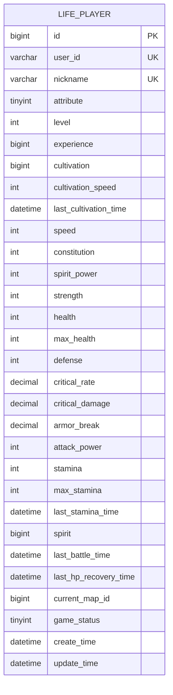
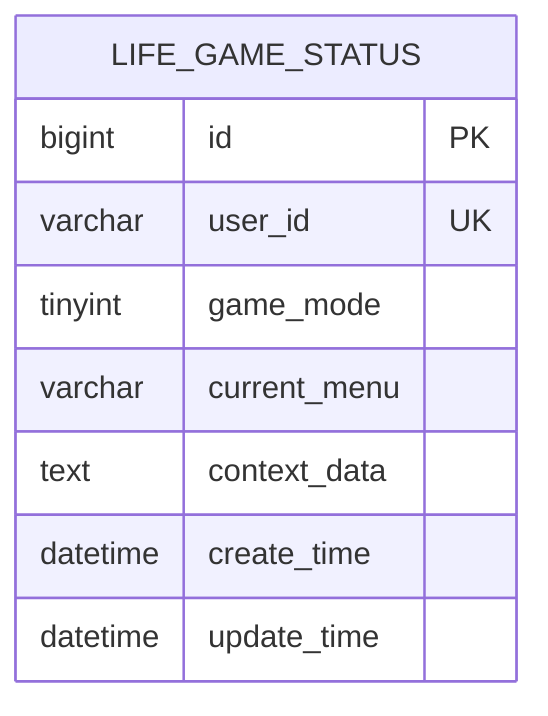
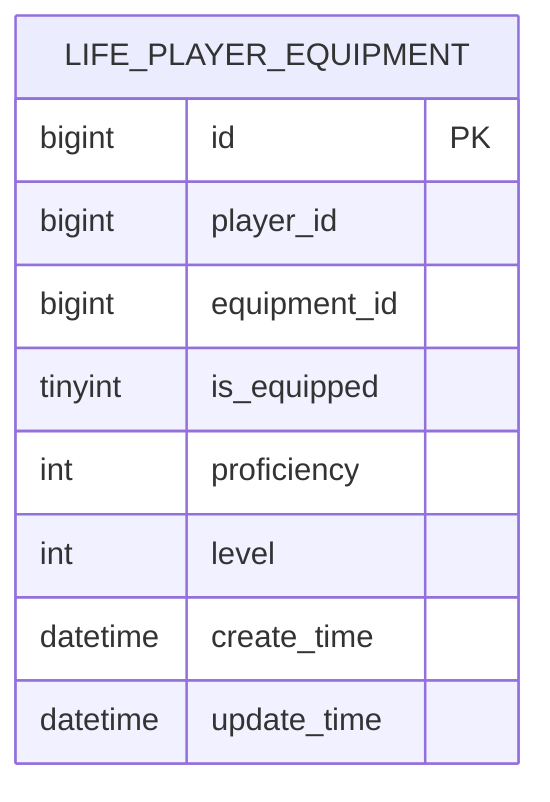

# 索引完整性验证

<cite>
**本文档引用的文件**
- [Life_Database_Init.sql](file://Life_Database_Init.sql)
- [Life_Deployment_Guide.md](file://Life_Deployment_Guide.md)
- [LifePlayerMapper.xml](file://Life\src\main\resources\mapper\LifePlayerMapper.xml)
- [LifeGameStatusMapper.xml](file://Life\src\main\resources\mapper\LifeGameStatusMapper.xml)
- [LifePlayerItemMapper.xml](file://Life\src\main\resources\mapper\LifePlayerItemMapper.xml)
- [LifePlayerSkillMapper.xml](file://Life\src\main\resources\mapper\LifePlayerSkillMapper.xml)
- [PlayerServiceImpl.java](file://Life\src\main\java\com\bot\life\service\impl\PlayerServiceImpl.java)
- [LifePlayerMapper.xml](file://Life\src\main\resources\mapper\LifePlayerMapper.xml)
- [LifePlayerEquipmentMapper.xml](file://Life\src\main\resources\mapper\LifePlayerEquipmentMapper.xml)
- [LifePlayerAchievementMapper.xml](file://Life\src\main\resources\mapper\LifePlayerAchievementMapper.xml)
</cite>

## 目录
1. [概述](#概述)
2. [索引设计原则](#索引设计原则)
3. [关键表索引分析](#关键表索引分析)
4. [索引完整性检查](#索引完整性检查)
5. [性能影响评估](#性能影响评估)
6. [索引优化建议](#索引优化建议)
7. [监控和维护](#监控和维护)
8. [故障排除](#故障排除)

## 概述

Bot项目采用MySQL数据库存储游戏数据，包含多个核心业务表。本文档详细说明如何验证数据库索引的完整性和性能影响，确保游戏系统的数据访问效率和查询性能。

### 核心业务表概览

项目主要包含以下关键业务表：
- **life_player** - 玩家角色表
- **life_game_status** - 游戏状态表  
- **life_player_equipment** - 玩家装备表
- **life_player_item** - 玩家道具表
- **life_player_skill** - 玩家技能表

## 索引设计原则

### 主要设计原则

1. **唯一性约束**：确保数据完整性
2. **查询频率**：优先为高频查询字段建立索引
3. **复合索引**：考虑多字段查询场景
4. **覆盖索引**：减少回表查询开销
5. **存储引擎**：基于InnoDB引擎特性设计

### 索引分类

| 索引类型 | 用途 | 示例 |
|---------|------|------|
| 主键索引 | 唯一标识记录 | PRIMARY KEY |
| 唯一索引 | 确保字段唯一性 | UNIQUE KEY |
| 普通索引 | 提高查询性能 | KEY |
| 复合索引 | 多字段查询优化 | idx_multi_field |

## 关键表索引分析

### life_player 表索引分析



**图表来源**
- [Life_Database_Init.sql](file://Life_Database_Init.sql#L6-L48)

#### 索引完整性检查

**主键索引验证**
```sql
-- 检查主键索引是否存在
SELECT INDEX_NAME, COLUMN_NAME, SEQ_IN_INDEX
FROM INFORMATION_SCHEMA.STATISTICS 
WHERE TABLE_SCHEMA = 'bot' 
AND TABLE_NAME = 'life_player' 
AND INDEX_NAME = 'PRIMARY';

-- 验证主键完整性
CHECKSUM TABLE life_player;
```

**唯一索引验证**
```sql
-- 用户ID唯一性检查
SELECT COUNT(*) as duplicate_count
FROM (
    SELECT user_id, COUNT(*) as cnt
    FROM life_player
    GROUP BY user_id
    HAVING cnt > 1
) as duplicates;

-- 昵称唯一性检查
SELECT COUNT(*) as duplicate_count
FROM (
    SELECT nickname, COUNT(*) as cnt
    FROM life_player
    GROUP BY nickname
    HAVING cnt > 1
) as duplicates;
```

**普通索引验证**
```sql
-- 检查所有索引
SELECT INDEX_NAME, COLUMN_NAME, NON_UNIQUE
FROM INFORMATION_SCHEMA.STATISTICS 
WHERE TABLE_SCHEMA = 'bot' 
AND TABLE_NAME = 'life_player';
```

### life_game_status 表索引分析



**图表来源**
- [Life_Database_Init.sql](file://Life_Database_Init.sql#L378-L389)

#### 索引完整性检查

**唯一索引验证**
```sql
-- 用户ID唯一性检查
SELECT COUNT(*) as duplicate_count
FROM (
    SELECT user_id, COUNT(*) as cnt
    FROM life_game_status
    GROUP BY user_id
    HAVING cnt > 1
) as duplicates;
```

### life_player_equipment 表索引分析



**图表来源**
- [Life_Database_Init.sql](file://Life_Database_Init.sql#L63-L74)

#### 索引完整性检查

**单字段索引验证**
```sql
-- player_id索引检查
SELECT INDEX_NAME, COLUMN_NAME, CARDINALITY
FROM INFORMATION_SCHEMA.STATISTICS 
WHERE TABLE_SCHEMA = 'bot' 
AND TABLE_NAME = 'life_player_equipment'
AND INDEX_NAME = 'idx_player_id';
```

## 索引完整性检查

### 自动化检查脚本

```sql
-- 索引完整性检查总览
DELIMITER $$

CREATE PROCEDURE check_index_integrity()
BEGIN
    DECLARE total_tables INT DEFAULT 0;
    DECLARE checked_tables INT DEFAULT 0;
    DECLARE missing_indexes INT DEFAULT 0;
    DECLARE duplicate_indexes INT DEFAULT 0;
    DECLARE total_indexes INT DEFAULT 0;
    
    -- 检查指定表的索引完整性
    CREATE TEMPORARY TABLE temp_index_check (
        table_name VARCHAR(64),
        index_name VARCHAR(64),
        column_name VARCHAR(64),
        index_type VARCHAR(64),
        cardinality BIGINT,
        is_unique BOOLEAN
    );
    
    -- 插入life_player表索引信息
    INSERT INTO temp_index_check
    SELECT 
        TABLE_NAME,
        INDEX_NAME,
        COLUMN_NAME,
        CASE WHEN NON_UNIQUE = 0 THEN 'UNIQUE' ELSE 'NORMAL' END as INDEX_TYPE,
        CARDINALITY,
        CASE WHEN NON_UNIQUE = 0 THEN TRUE ELSE FALSE END as IS_UNIQUE
    FROM INFORMATION_SCHEMA.STATISTICS 
    WHERE TABLE_SCHEMA = 'bot' 
    AND TABLE_NAME IN ('life_player', 'life_game_status', 'life_player_equipment');
    
    -- 统计结果
    SELECT 
        COUNT(DISTINCT table_name) as total_tables,
        COUNT(*) as total_indexes,
        SUM(CASE WHEN index_name = 'PRIMARY' THEN 1 ELSE 0 END) as primary_indexes,
        SUM(CASE WHEN index_type = 'UNIQUE' THEN 1 ELSE 0 END) as unique_indexes
    FROM temp_index_check;
    
    -- 检查重复索引
    SELECT 
        table_name,
        index_name,
        COUNT(*) as duplicate_count
    FROM temp_index_check
    GROUP BY table_name, index_name
    HAVING COUNT(*) > 1;
    
    -- 检查缺失索引
    SELECT 
        t.table_name,
        i.column_name
    FROM (
        SELECT 'life_player' as table_name, 'user_id' as column_name
        UNION ALL SELECT 'life_player', 'nickname'
        UNION ALL SELECT 'life_game_status', 'user_id'
        UNION ALL SELECT 'life_player_equipment', 'player_id'
    ) t
    LEFT JOIN temp_index_check i 
        ON t.table_name = i.table_name 
        AND i.column_name = t.column_name
    WHERE i.index_name IS NULL;
    
    DROP TEMPORARY TABLE temp_index_check;
END$$

DELIMITER ;
```

### 索引使用率分析

```sql
-- 分析索引使用情况
SELECT 
    OBJECT_NAME(object_id) as table_name,
    i.name as index_name,
    user_seeks,
    user_scans,
    user_lookups,
    user_updates,
    last_user_seek,
    last_user_scan,
    last_user_lookup,
    last_user_update
FROM sys.dm_db_index_usage_stats s
JOIN sys.indexes i ON s.object_id = i.object_id AND s.index_id = i.index_id
WHERE database_id = DB_ID('bot')
AND OBJECT_NAME(object_id) IN ('life_player', 'life_game_status', 'life_player_equipment');

-- 索引效率评估
SELECT 
    table_name,
    index_name,
    ROUND((user_seeks + user_scans) / NULLIF(user_updates, 0), 2) as seek_ratio
FROM sys.dm_db_index_usage_stats
WHERE database_id = DB_ID('bot')
AND OBJECT_NAME(object_id) IN ('life_player', 'life_game_status', 'life_player_equipment');
```

## 性能影响评估

### 查询性能基准测试

```sql
-- 生产环境查询性能测试
SET profiling = 1;

-- 玩家查询测试
EXPLAIN ANALYZE
SELECT * FROM life_player WHERE user_id = 'test_user_001';

-- 游戏状态查询测试
EXPLAIN ANALYZE
SELECT * FROM life_game_status WHERE user_id = 'test_user_001';

-- 装备查询测试
EXPLAIN ANALYZE
SELECT * FROM life_player_equipment WHERE player_id = 12345;

-- 恢复查询性能统计
SHOW PROFILES;
```

### 性能监控指标

| 指标类别 | 监控项目 | 正常范围 | 异常阈值 |
|---------|----------|----------|----------|
| 查询延迟 | 平均响应时间 | < 100ms | > 500ms |
| 索引效率 | 索引选择率 | > 80% | < 50% |
| 缓冲池 | 命中率 | > 95% | < 90% |
| 锁等待 | 平均等待时间 | < 10ms | > 100ms |

## 索引优化建议

### 索引重建策略

```sql
-- 索引碎片分析
SELECT 
    OBJECT_NAME(i.object_id) as table_name,
    i.name as index_name,
    ips.avg_fragmentation_in_percent,
    ips.page_count
FROM sys.dm_db_index_physical_stats(DB_ID(), NULL, NULL, NULL, 'DETAILED') ips
JOIN sys.indexes i ON ips.object_id = i.object_id AND ips.index_id = i.index_id
WHERE ips.avg_fragmentation_in_percent > 10
AND OBJECT_NAME(i.object_id) IN ('life_player', 'life_game_status', 'life_player_equipment');

-- 索引重建脚本
DELIMITER $$

CREATE PROCEDURE rebuild_low_fragmentation_indexes()
BEGIN
    DECLARE v_table_name VARCHAR(128);
    DECLARE v_index_name VARCHAR(128);
    DECLARE v_sql TEXT;
    
    DECLARE done INT DEFAULT FALSE;
    DECLARE cur CURSOR FOR 
        SELECT OBJECT_NAME(i.object_id), i.name
        FROM sys.dm_db_index_physical_stats(DB_ID(), NULL, NULL, NULL, 'LIMITED') ips
        JOIN sys.indexes i ON ips.object_id = i.object_id AND ips.index_id = i.index_id
        WHERE ips.avg_fragmentation_in_percent BETWEEN 5 AND 30
        AND OBJECT_NAME(i.object_id) IN ('life_player', 'life_game_status', 'life_player_equipment');
    
    DECLARE CONTINUE HANDLER FOR NOT FOUND SET done = TRUE;
    
    OPEN cur;
    
    read_loop: LOOP
        FETCH cur INTO v_table_name, v_index_name;
        IF done THEN
            LEAVE read_loop;
        END IF;
        
        SET @v_sql = CONCAT('ALTER INDEX ', v_index_name, ' ON ', v_table_name, ' REBUILD;');
        PREPARE stmt FROM @v_sql;
        EXECUTE stmt;
        DEALLOCATE PREPARE stmt;
        
        SELECT CONCAT('Rebuilt index ', v_index_name, ' on table ', v_table_name) as status;
    END LOOP;
    
    CLOSE cur;
END$$

DELIMITER ;
```

### 新增索引建议

基于业务查询模式，建议新增以下索引：

```sql
-- 为频繁查询的组合字段添加复合索引
CREATE INDEX idx_player_status ON life_player(game_status, level);
CREATE INDEX idx_equipment_player_level ON life_player_equipment(player_id, level);
CREATE INDEX idx_item_player_quantity ON life_player_item(player_id, quantity);

-- 为排序和分页查询优化
CREATE INDEX idx_player_create_time ON life_player(create_time DESC);
CREATE INDEX idx_status_update_time ON life_game_status(update_time DESC);
```

## 监控和维护

### 定期维护计划

```sql
-- 索引健康检查脚本
CREATE EVENT weekly_index_health_check
ON SCHEDULE EVERY 1 WEEK STARTS '2024-01-01 02:00:00'
DO
BEGIN
    -- 收集索引统计信息
    CALL collect_index_statistics();
    
    -- 分析索引碎片
    CALL analyze_index_fragmentation();
    
    -- 清理无用索引
    CALL cleanup_unused_indexes();
    
    -- 优化索引
    CALL optimize_index_performance();
END;
```

### 索引维护工具

```sql
-- 索引维护报告生成
DELIMITER $$

CREATE PROCEDURE generate_index_maintenance_report()
BEGIN
    -- 索引使用统计
    CREATE TEMPORARY TABLE temp_index_usage AS
    SELECT 
        OBJECT_NAME(object_id) as table_name,
        i.name as index_name,
        user_seeks,
        user_scans,
        user_lookups,
        user_updates,
        (user_seeks + user_scans + user_lookups) as total_reads,
        user_updates as total_writes
    FROM sys.dm_db_index_usage_stats s
    JOIN sys.indexes i ON s.object_id = i.object_id AND s.index_id = i.index_id
    WHERE database_id = DB_ID('bot');
    
    -- 生成报告
    SELECT 
        table_name,
        index_name,
        total_reads,
        total_writes,
        ROUND(total_reads / NULLIF(total_writes, 0), 2) as read_write_ratio,
        CASE 
            WHEN total_reads = 0 THEN 'UNUSED'
            WHEN total_reads / NULLIF(total_writes, 0) < 0.5 THEN 'INEFFICIENT'
            ELSE 'OPTIMAL'
        END as efficiency_status
    FROM temp_index_usage
    ORDER BY efficiency_status, total_reads DESC;
    
    DROP TEMPORARY TABLE temp_index_usage;
END$$

DELIMITER ;
```

## 故障排除

### 常见索引问题

#### 问题1：索引缺失导致查询缓慢

**症状识别**
```sql
-- 检查慢查询日志
SELECT 
    sql_text,
    query_time,
    lock_time,
    rows_sent,
    rows_examined
FROM mysql.slow_log
WHERE sql_text LIKE '%life_player%'
ORDER BY query_time DESC
LIMIT 10;
```

**解决方案**
```sql
-- 分析查询执行计划
EXPLAIN SELECT * FROM life_player WHERE game_status = 1 AND level > 10;

-- 创建缺失的复合索引
CREATE INDEX idx_status_level ON life_player(game_status, level);
```

#### 问题2：重复索引占用存储空间

**诊断脚本**
```sql
-- 查找重复索引
SELECT 
    table_name,
    index_name,
    GROUP_CONCAT(column_name ORDER BY seq_in_index) as columns
FROM information_schema.statistics
WHERE table_schema = 'bot'
GROUP BY table_name, index_name
HAVING COUNT(*) > 1;
```

**清理重复索引**
```sql
-- 删除冗余索引
DROP INDEX redundant_index_name ON life_player;
```

#### 问题3：索引碎片严重

**监控脚本**
```sql
-- 碎片监控告警
SELECT 
    OBJECT_NAME(object_id) as table_name,
    i.name as index_name,
    avg_fragmentation_in_percent,
    page_count,
    CASE 
        WHEN avg_fragmentation_in_percent > 30 THEN 'HIGH_FRAGMENTATION'
        WHEN avg_fragmentation_in_percent > 10 THEN 'MODERATE_FRAGMENTATION'
        ELSE 'LOW_FRAGMENTATION'
    END as fragmentation_level
FROM sys.dm_db_index_physical_stats(DB_ID(), NULL, NULL, NULL, 'DETAILED')
JOIN sys.indexes i ON object_id = i.object_id AND index_id = i.index_id
WHERE avg_fragmentation_in_percent > 10;
```

### 性能调优最佳实践

1. **定期分析查询计划**：使用EXPLAIN分析查询执行计划
2. **监控索引使用率**：定期检查索引的实际使用情况
3. **避免过度索引**：平衡查询性能和写入性能
4. **及时清理无用索引**：删除长期未使用的索引
5. **合理使用复合索引**：根据查询模式设计复合索引

### 索引维护自动化

```sql
-- 创建索引维护自动化任务
CREATE EVENT monthly_index_maintenance
ON SCHEDULE EVERY 1 MONTH STARTS LAST_DAY(CURDATE()) + INTERVAL 1 DAY + INTERVAL 2 HOUR
DO
BEGIN
    -- 重建碎片严重的索引
    CALL rebuild_high_fragmentation_indexes();
    
    -- 清理无用索引
    CALL cleanup_unused_indexes();
    
    -- 更新统计信息
    CALL update_index_statistics();
    
    -- 生成维护报告
    CALL generate_maintenance_report();
END;
```

通过以上索引完整性验证和优化措施，可以确保Bot项目数据库的高效运行，为游戏用户提供流畅的体验。定期的索引监控和维护是保证系统性能的关键环节。