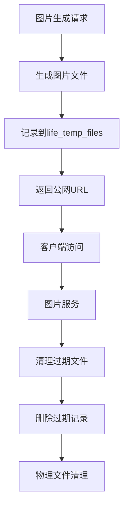

# 数据库维护

<cite>
**本文档引用的文件**
- [Life_Database_Init.sql](file://Life_Database_Init.sql)
- [Life_Deployment_Guide.md](file://Life_Deployment_Guide.md)
- [application.properties](file://Boot/src/main/resources/application.properties)
- [application-dev.properties](file://Boot/src/main/resources/application-dev.properties)
- [HealthRecoveryTask.java](file://Life\src\main\java\com\bot\life\task\HealthRecoveryTask.java)
- [ImageGenerationServiceImpl.java](file://Life\src\main\java\com\bot\life\service\impl\ImageGenerationServiceImpl.java)
- [LifeBattleStateMapper.xml](file://Life\src\main\resources\mapper\LifeBattleStateMapper.xml)
- [LifeGameStatusMapper.xml](file://Life\src\main\resources\mapper\LifeGameStatusMapper.xml)
</cite>

## 目录
1. [概述](#概述)
2. [数据库架构](#数据库架构)
3. [日常维护策略](#日常维护策略)
4. [数据完整性检查](#数据完整性检查)
5. [性能优化建议](#性能优化建议)
6. [临时文件管理](#临时文件管理)
7. [监控和告警](#监控和告警)
8. [备份策略](#备份策略)
9. [故障排除](#故障排除)
10. [维护脚本](#维护脚本)

## 概述

Bot项目采用MySQL数据库作为主要数据存储，支持浮生卷游戏模块的核心功能。数据库维护是确保系统稳定运行的关键环节，包括定期清理、性能优化、数据完整性检查等任务。

### 核心特性
- **高并发支持**：支持多玩家同时在线游戏
- **实时数据同步**：战斗状态、玩家进度实时更新
- **图片缓存机制**：生成的游戏图片自动缓存管理
- **定时任务调度**：自动恢复、状态清理等后台任务

## 数据库架构

### 表结构概览

```mermaid
erDiagram
LIFE_PLAYER {
bigint id PK
varchar user_id UK
varchar nickname UK
tinyint attribute
int level
bigint experience
bigint cultivation
int stamina
bigint spirit
bigint current_map_id
tinyint game_status
datetime create_time
datetime update_time
}
LIFE_GAME_STATUS {
bigint id PK
varchar user_id UK
tinyint game_mode
varchar current_menu
text context_data
datetime create_time
datetime update_time
}
LIFE_TEMP_FILES {
bigint id PK
varchar file_path
datetime create_time
datetime expire_time
}
LIFE_BATTLE_STATE {
bigint id PK
bigint player_id
bigint monster_id
int current_turn
int player_hp
int monster_hp
int monster_max_hp
json monster_skill_cooldowns
json player_buffs
json monster_buffs
datetime create_time
datetime update_time
}
LIFE_SYSTEM_CONFIG {
bigint id PK
varchar config_key UK
text config_value
text description
datetime create_time
datetime update_time
}
LIFE_PLAYER --> LIFE_GAME_STATUS : "has status"
LIFE_PLAYER --> LIFE_BATTLE_STATE : "active battle"
LIFE_TEMP_FILES --> LIFE_PLAYER : "generated images"
```

**图表来源**
- [Life_Database_Init.sql](file://Life_Database_Init.sql#L6-L646)

### 主要数据表分类

| 表类别 | 表名 | 主要用途 | 关键字段 |
|--------|------|----------|----------|
| **玩家数据** | `life_player` | 存储玩家基本信息和状态 | `user_id`, `level`, `cultivation`, `spirit` |
| **游戏状态** | `life_game_status` | 记录玩家游戏进程状态 | `user_id`, `game_mode`, `context_data` |
| **战斗系统** | `life_battle_state` | 存储战斗过程数据 | `player_id`, `monster_id`, `player_hp` |
| **临时文件** | `life_temp_files` | 图片生成缓存管理 | `file_path`, `expire_time` |
| **系统配置** | `life_system_config` | 动态配置参数存储 | `config_key`, `config_value` |

**章节来源**
- [Life_Database_Init.sql](file://Life_Database_Init.sql#L6-L646)

## 日常维护策略

### 1. 定期清理过期数据

#### 临时文件清理
```sql
-- 清理过期临时文件记录
DELETE FROM life_temp_files 
WHERE expire_time < NOW();

-- 清理指定时间范围内的临时文件
DELETE FROM life_temp_files 
WHERE create_time < DATE_SUB(NOW(), INTERVAL 7 DAY);
```

#### 战斗状态清理
```sql
-- 清理超过一定时间的战斗状态
DELETE FROM life_battle_state 
WHERE update_time < DATE_SUB(NOW(), INTERVAL 24 HOUR);

-- 清理未完成的战斗状态（超过1小时）
DELETE FROM life_battle_state 
WHERE update_time < DATE_SUB(NOW(), INTERVAL 1 HOUR) 
AND player_hp > 0 AND monster_hp > 0;
```

#### 游戏状态清理
```sql
-- 清理长时间未活动的游戏状态
DELETE FROM life_game_status 
WHERE update_time < DATE_SUB(NOW(), INTERVAL 7 DAY);
```

### 2. 玩家数据健康检查

#### 玩家数据完整性验证
```sql
-- 检查玩家数据完整性
SELECT COUNT(*) as total_players,
       SUM(CASE WHEN level < 1 THEN 1 ELSE 0 END) as invalid_levels,
       SUM(CASE WHEN cultivation < 0 THEN 1 ELSE 0 END) as negative_cultivation,
       SUM(CASE WHEN spirit < 0 THEN 1 ELSE 0 END) as negative_spirit
FROM life_player;
```

#### 异常数据修复
```sql
-- 修复负值数据
UPDATE life_player 
SET cultivation = 0 
WHERE cultivation < 0;

UPDATE life_player 
SET spirit = 0 
WHERE spirit < 0;

-- 修复无效等级
UPDATE life_player 
SET level = 1 
WHERE level < 1;
```

### 3. 系统配置优化

#### 热门功能配置分析
```sql
-- 分析系统配置使用情况
SELECT config_key, config_value, COUNT(*) as usage_count
FROM life_system_config
GROUP BY config_key, config_value
ORDER BY usage_count DESC;

-- 检查配置有效性
SELECT * 
FROM life_system_config 
WHERE config_key LIKE '%rate%' OR config_key LIKE '%bonus%';
```

**章节来源**
- [Life_Deployment_Guide.md](file://Life_Deployment_Guide.md#L170-L185)

## 数据完整性检查

### 1. 约束完整性验证

```sql
-- 检查唯一性约束
SELECT user_id, COUNT(*) as count 
FROM life_player 
GROUP BY user_id 
HAVING count > 1;

-- 检查外键关联完整性
SELECT p.id, p.user_id 
FROM life_player p
LEFT JOIN life_game_status gs ON p.user_id = gs.user_id
WHERE gs.user_id IS NULL;
```

### 2. 数据一致性检查

```sql
-- 检查玩家状态一致性
SELECT p.id, p.level, p.cultivation, gs.game_mode
FROM life_player p
JOIN life_game_status gs ON p.user_id = gs.user_id
WHERE p.level < 1 OR p.cultivation < 0;

-- 检查战斗状态完整性
SELECT bs.id, bs.player_id, bs.monster_id, 
       CASE WHEN p.id IS NULL THEN '玩家不存在' END as player_check,
       CASE WHEN m.id IS NULL THEN '怪物不存在' END as monster_check
FROM life_battle_state bs
LEFT JOIN life_player p ON bs.player_id = p.id
LEFT JOIN life_monster m ON bs.monster_id = m.id;
```

### 3. 性能指标监控

```sql
-- 监控表大小和增长趋势
SELECT table_name, 
       ROUND((data_length + index_length) / 1024 / 1024, 2) as size_mb,
       table_rows
FROM information_schema.tables 
WHERE table_schema = 'bot' 
AND table_name LIKE 'life_%'
ORDER BY size_mb DESC;
```

## 性能优化建议

### 1. 数据库连接池优化

基于现有配置，建议优化如下：

```properties
# Druid连接池配置优化
spring.datasource.type=com.alibaba.druid.pool.DruidDataSource
spring.datasource.druid.initial-size=10
spring.datasource.druid.min-idle=10
spring.datasource.druid.max-active=200
spring.datasource.druid.max-wait=60000
spring.datasource.druid.time-between-eviction-runs-millis=60000
spring.datasource.druid.min-evictable-idle-time-millis=300000
spring.datasource.druid.validation-query=SELECT 'x'
spring.datasource.druid.test-while-idle=true
spring.datasource.druid.test-on-borrow=false
spring.datasource.druid.test-on-return=false
```

### 2. 索引优化策略

```sql
-- 添加常用查询索引
CREATE INDEX idx_player_level ON life_player(level);
CREATE INDEX idx_player_cultivation ON life_player(cultivation);
CREATE INDEX idx_battle_player ON life_battle_state(player_id);
CREATE INDEX idx_game_status_user ON life_game_status(user_id);
CREATE INDEX idx_temp_expire ON life_temp_files(expire_time);

-- 优化查询性能
EXPLAIN SELECT * FROM life_player 
WHERE level BETWEEN 1 AND 20 
ORDER BY cultivation DESC 
LIMIT 100;
```

### 3. 查询优化

```sql
-- 优化分页查询
SELECT p.id, p.nickname, p.level, p.cultivation
FROM life_player p
WHERE p.level >= 10
ORDER BY p.cultivation DESC
LIMIT 50 OFFSET 100;

-- 使用覆盖索引优化
CREATE INDEX idx_player_covering ON life_player(id, nickname, level, cultivation);
```

**章节来源**
- [application-dev.properties](file://Boot/src\main\resources\application-dev.properties#L34-L58)

## 临时文件管理

### 1. 图片生成缓存管理

系统通过`life_temp_files`表管理生成的图片缓存：



**图表来源**
- [ImageGenerationServiceImpl.java](file://Life\src\main\java\com\bot\life\service\impl\ImageGenerationServiceImpl.java#L31-L37)

### 2. 自动清理机制

```java
// 定时清理过期临时文件
@Component
public class TempFileCleanupTask {
    
    @Scheduled(cron = "0 0 */6 * * ?") // 每6小时执行一次
    public void cleanupExpiredFiles() {
        try {
            // 清理过期记录
            int deletedRecords = tempFileMapper.deleteExpiredFiles();
            
            // 清理物理文件
            cleanupPhysicalFiles(deletedRecords);
            
            log.info("清理过期临时文件完成，删除记录数: {}", deletedRecords);
        } catch (Exception e) {
            log.error("临时文件清理失败", e);
        }
    }
    
    private void cleanupPhysicalFiles(int recordCount) {
        // 实现物理文件清理逻辑
        File dir = new File("/data/files/life_pic/");
        if (dir.exists() && dir.isDirectory()) {
            File[] files = dir.listFiles();
            if (files != null) {
                for (File file : files) {
                    if (file.isFile() && file.lastModified() < System.currentTimeMillis() - 24*60*60*1000) {
                        file.delete();
                    }
                }
            }
        }
    }
}
```

### 3. 文件存储优化

```sql
-- 优化临时文件表结构
ALTER TABLE life_temp_files 
ADD COLUMN file_size BIGINT AFTER file_path,
ADD COLUMN file_type VARCHAR(50) AFTER file_size,
ADD COLUMN access_count INT DEFAULT 0 AFTER file_type;

-- 添加访问统计索引
CREATE INDEX idx_temp_access ON life_temp_files(access_count, expire_time);
```

**章节来源**
- [Life_Database_Init.sql](file://Life_Database_Init.sql#L635-L642)
- [ImageGenerationServiceImpl.java](file://Life\src\main\java\com\bot\life\service\impl\ImageGenerationServiceImpl.java#L31-L37)

## 监控和告警

### 1. 数据库健康监控

```sql
-- 监控数据库连接状态
SELECT 
    CONNECTION_ID() as connection_id,
    USER() as user,
    HOST() as host,
    DB() as database,
    COMMAND as command,
    TIME as duration,
    STATE as state,
    INFO as query_info
FROM INFORMATION_SCHEMA.PROCESSLIST
WHERE COMMAND != 'Sleep';
```

### 2. 性能指标监控

```sql
-- 监控慢查询
SELECT 
    QUERY_TIME,
    LOCK_TIME,
    ROWS_SENT,
    ROWS_EXAMINED,
    SQL_TEXT
FROM mysql.slow_log
ORDER BY QUERY_TIME DESC
LIMIT 10;
```

### 3. 定时任务监控

```java
// 健康检查定时任务
@Component
public class DatabaseHealthCheck {
    
    @Scheduled(fixedRate = 300000) // 5分钟执行一次
    public void checkDatabaseHealth() {
        try {
            // 检查连接池状态
            DruidDataSource dataSource = (DruidDataSource) DataSourceUtils.getDataSource();
            if (dataSource != null) {
                log.info("连接池状态: 活跃连接数={}, 空闲连接数={}", 
                         dataSource.getActiveCount(), 
                         dataSource.getPoolingCount());
            }
            
            // 检查关键表数据量
            checkTableSizes();
            
            // 检查慢查询
            checkSlowQueries();
            
        } catch (Exception e) {
            log.error("数据库健康检查失败", e);
        }
    }
    
    private void checkTableSizes() {
        String[] tables = {"life_player", "life_game_status", "life_battle_state"};
        for (String table : tables) {
            jdbcTemplate.query("SELECT COUNT(*) as count FROM " + table, 
                rs -> log.info("{}表记录数: {}", table, rs.getInt("count")));
        }
    }
}
```

**章节来源**
- [HealthRecoveryTask.java](file://Life\src\main\java\com\bot\life\task\HealthRecoveryTask.java#L18-L30)

## 备份策略

### 1. 全量备份计划

```bash
#!/bin/bash
# 全量数据库备份脚本

BACKUP_DIR="/data/backups/mysql"
DATE=$(date +%Y%m%d_%H%M%S)
DB_NAME="bot"

# 创建备份目录
mkdir -p $BACKUP_DIR/$DATE

# 执行全量备份
mysqldump -h localhost -u root -p$MYSQL_PASSWORD \
    --single-transaction \
    --routines \
    --triggers \
    --databases $DB_NAME \
    > $BACKUP_DIR/$DATE/${DB_NAME}_full_$DATE.sql

# 压缩备份文件
gzip $BACKUP_DIR/$DATE/${DB_NAME}_full_$DATE.sql

# 清理7天前的备份
find $BACKUP_DIR -type f -mtime +7 -exec rm -f {} \;
```

### 2. 增量备份策略

```sql
-- 增量备份配置
SET GLOBAL binlog_format = 'ROW';
SET GLOBAL log_bin = ON;

-- 创建增量备份用户
CREATE USER 'backup_user'@'localhost' IDENTIFIED BY 'backup_password';
GRANT REPLICATION SLAVE, REPLICATION CLIENT ON *.* TO 'backup_user'@'localhost';

-- 备份特定表
mysqldump -h localhost -u root -p$MYSQL_PASSWORD \
    --single-transaction \
    --no-create-info \
    --tables $DB_NAME life_player life_game_status \
    > $BACKUP_DIR/$DATE/incremental_$DATE.sql
```

### 3. 关键数据备份

```sql
-- 玩家数据备份
mysqldump -h localhost -u root -p$MYSQL_PASSWORD \
    --single-transaction \
    --tables $DB_NAME life_player \
    > /data/backups/player_data_$(date +%Y%m%d).sql

-- 游戏状态备份
mysqldump -h localhost -u root -p$MYSQL_PASSWORD \
    --single-transaction \
    --tables $DB_NAME life_game_status \
    > /data/backups/game_status_$(date +%Y%m%d).sql

-- 系统配置备份
mysqldump -h localhost -u root -p$MYSQL_PASSWORD \
    --single-transaction \
    --tables $DB_NAME life_system_config \
    > /data/backups/system_config_$(date +%Y%m%d).sql
```

## 故障排除

### 1. 常见问题及解决方案

#### 数据库连接问题
```sql
-- 检查连接状态
SHOW PROCESSLIST;

-- 查看连接限制
SHOW VARIABLES LIKE 'max_connections';
SHOW VARIABLES LIKE 'max_user_connections';

-- 检查连接池状态
SELECT * FROM information_schema.PROCESSLIST 
WHERE USER = 'root' AND COMMAND != 'Sleep';
```

#### 性能问题诊断
```sql
-- 查看当前正在执行的查询
SELECT * FROM INFORMATION_SCHEMA.PROCESSLIST 
WHERE COMMAND != 'Sleep' AND TIME > 60;

-- 分析查询执行计划
EXPLAIN SELECT * FROM life_player 
WHERE level > 10 ORDER BY cultivation DESC LIMIT 100;
```

#### 内存不足问题
```sql
-- 检查内存使用情况
SHOW VARIABLES LIKE 'innodb_buffer_pool_size';
SHOW VARIABLES LIKE 'tmp_table_size';
SHOW VARIABLES LIKE 'max_heap_table_size';

-- 优化内存配置
SET GLOBAL innodb_buffer_pool_size = 1G;
SET GLOBAL tmp_table_size = 64M;
SET GLOBAL max_heap_table_size = 64M;
```

### 2. 错误日志分析

```bash
# 分析MySQL错误日志
tail -f /var/log/mysql/error.log | grep -E "(ERROR|Warning)"

# 分析慢查询日志
mysqldumpslow -t 10 /var/log/mysql/slow_query.log

# 分析二进制日志
mysqlbinlog /var/log/mysql/mysql-bin.000001 | head -100
```

### 3. 数据恢复流程

```sql
-- 数据恢复流程
-- 1. 停止应用服务
systemctl stop bot-application

-- 2. 恢复数据库
mysql -u root -p$MYSQL_PASSWORD bot < /data/backups/mysql/20241201_120000/bot_full_20241201_120000.sql.gz

-- 3. 验证数据完整性
mysql -u root -p$MYSQL_PASSWORD -e "
SELECT COUNT(*) as total_records FROM life_player;
SELECT MAX(id) as max_id FROM life_player;
CHECK TABLE life_player;"
```

## 维护脚本

### 1. 自动化维护脚本

```bash
#!/bin/bash
# Bot数据库自动化维护脚本

LOG_FILE="/var/log/bot_database_maintenance.log"
MYSQL_USER="root"
MYSQL_PASSWORD="your_password"
DATABASE="bot"

echo "[$(date)] 开始数据库维护..." >> $LOG_FILE

# 1. 清理过期临时文件
echo "[$(date)] 正在清理过期临时文件..." >> $LOG_FILE
mysql -u $MYSQL_USER -p$MYSQL_PASSWORD -e "
DELETE FROM life_temp_files WHERE expire_time < NOW();
OPTIMIZE TABLE life_temp_files;" $DATABASE >> $LOG_FILE 2>&1

# 2. 清理过期战斗状态
echo "[$(date)] 正在清理过期战斗状态..." >> $LOG_FILE
mysql -u $MYSQL_USER -p$MYSQL_PASSWORD -e "
DELETE FROM life_battle_state WHERE update_time < DATE_SUB(NOW(), INTERVAL 24 HOUR);
OPTIMIZE TABLE life_battle_state;" $DATABASE >> $LOG_FILE 2>&1

# 3. 数据完整性检查
echo "[$(date)] 正在检查数据完整性..." >> $LOG_FILE
mysql -u $MYSQL_USER -p$MYSQL_PASSWORD -e "
SELECT 'life_player' as table_name, COUNT(*) as record_count FROM life_player;
SELECT 'life_game_status' as table_name, COUNT(*) as record_count FROM life_game_status;
SELECT 'life_battle_state' as table_name, COUNT(*) as record_count FROM life_battle_state;" $DATABASE >> $LOG_FILE 2>&1

# 4. 性能分析
echo "[$(date)] 正在分析数据库性能..." >> $LOG_FILE
mysql -u $MYSQL_USER -p$MYSQL_PASSWORD -e "
ANALYZE TABLE life_player;
ANALYZE TABLE life_game_status;
ANALYZE TABLE life_battle_state;" $DATABASE >> $LOG_FILE 2>&1

# 5. 备份重要数据
echo "[$(date)] 正在备份重要数据..." >> $LOG_FILE
mysqldump -u $MYSQL_USER -p$MYSQL_PASSWORD --single-transaction $DATABASE life_player > /data/backups/important_data/players_$(date +%Y%m%d_%H%M%S).sql >> $LOG_FILE 2>&1

echo "[$(date)] 数据库维护完成" >> $LOG_FILE
```

### 2. 监控脚本

```bash
#!/bin/bash
# 数据库健康监控脚本

MYSQL_USER="root"
MYSQL_PASSWORD="your_password"
DATABASE="bot"

# 检查数据库连接
mysqladmin -u $MYSQL_USER -p$MYSQL_PASSWORD ping &> /dev/null
if [ $? -ne 0 ]; then
    echo "数据库连接失败"
    exit 1
fi

# 检查关键表大小
TABLE_SIZES=$(mysql -u $MYSQL_USER -p$MYSQL_PASSWORD -e "
SELECT table_name, 
       ROUND((data_length + index_length) / 1024 / 1024, 2) as size_mb
FROM information_schema.tables 
WHERE table_schema = '$DATABASE' 
AND table_name LIKE 'life_%'
ORDER BY size_mb DESC" 2>/dev/null)

echo "$TABLE_SIZES"

# 检查慢查询
SLOW_QUERIES=$(mysql -u $MYSQL_USER -p$MYSQL_PASSWORD -e "
SELECT COUNT(*) as slow_queries 
FROM mysql.slow_log 
WHERE start_time > DATE_SUB(NOW(), INTERVAL 1 HOUR)" 2>/dev/null)

echo "$SLOW_QUERIES"
```

### 3. 自动化部署脚本

```bash
#!/bin/bash
# 数据库维护自动化部署脚本

CRON_JOB="@daily /usr/local/bin/bot-database-maintenance.sh"

# 添加到crontab
(crontab -l 2>/dev/null; echo "$CRON_JOB") | crontab -

# 创建维护脚本
cat > /usr/local/bin/bot-database-maintenance.sh << 'EOF'
#!/bin/bash
# 维护脚本内容...
EOF

chmod +x /usr/local/bin/bot-database-maintenance.sh

echo "数据库维护自动化部署完成"
```

**章节来源**
- [Life_Deployment_Guide.md](file://Life_Deployment_Guide.md#L170-L185)

## 结论

Bot项目的数据库维护是一个系统性工程，需要从多个维度进行规划和实施。通过建立完善的维护策略、监控体系和应急响应机制，可以确保数据库系统的稳定运行和高性能表现。

### 关键维护要点
1. **定期清理**：及时清理过期数据，避免数据膨胀
2. **性能优化**：合理配置连接池和索引，提升查询效率
3. **数据保护**：建立完整的备份和恢复机制
4. **监控告警**：实时监控数据库状态，快速响应异常
5. **文档维护**：保持维护文档的时效性和准确性

通过持续的维护和优化，可以确保Bot项目数据库系统的长期稳定运行，为用户提供优质的用户体验。