# 监控与维护

<cite>
**本文档引用的文件**
- [Life_Deployment_Guide.md](file://Life_Deployment_Guide.md)
- [Life_Database_Init.sql](file://Life_Database_Init.sql)
- [NoticeTask.java](file://Base/src/main/java/com/bot/base/task/NoticeTask.java)
- [HealthRecoveryTask.java](file://Life/src/main/java/com/bot/life/task/HealthRecoveryTask.java)
- [StatusMonitor.java](file://Base/src/main/java/com/bot/base/service/StatusMonitor.java)
- [application-prod.properties](file://Boot/src/main/resources/application-prod.properties)
- [logback-spring.xml](file://Boot/src/main/resources/logback-spring.xml)
- [ThreadPoolManager.java](file://Common/src/main/java/com/bot/common/util/ThreadPoolManager.java)
- [pom.xml](file://pom.xml)
</cite>

## 目录
1. [概述](#概述)
2. [系统架构监控](#系统架构监控)
3. [应用监控](#应用监控)
4. [数据库监控与维护](#数据库监控与维护)
5. [定时任务监控](#定时任务监控)
6. [性能调优](#性能调优)
7. [安全加固](#安全加固)
8. [备份策略](#备份策略)
9. [故障排除](#故障排除)
10. [运维最佳实践](#运维最佳实践)

## 概述

Bot项目是一个基于Spring Boot框架的QQ机器人系统，包含多个模块，包括游戏功能和生活功能。本文档提供了生产环境下的完整监控与维护指南，确保系统的稳定运行和高效维护。

### 系统组件概览

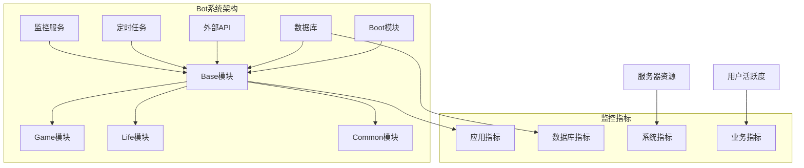

**图表来源**
- [pom.xml](file://pom.xml#L6-L11)
- [application-prod.properties](file://Boot/src/main/resources/application-prod.properties#L71-L91)

## 系统架构监控

### 服务健康检查

系统采用多层次的健康检查机制：

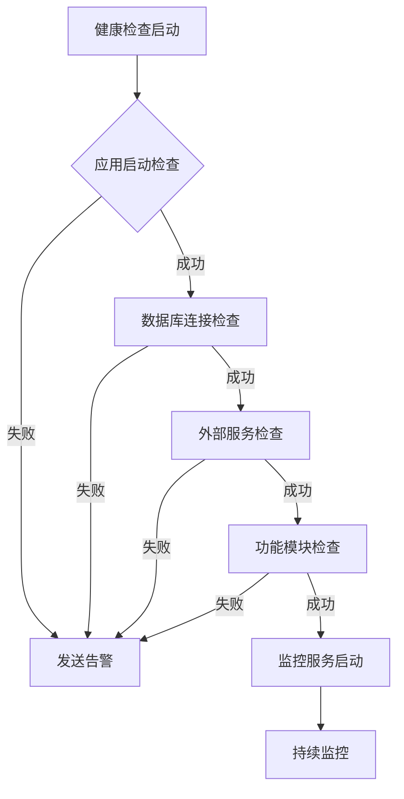

**图表来源**
- [StatusMonitor.java](file://Base/src/main/java/com/bot/base/service/StatusMonitor.java#L68-L91)

### 关键监控指标

| 监控类别 | 指标名称 | 监控方法 | 告警阈值 |
|---------|---------|---------|---------|
| 应用状态 | JVM内存使用率 | JMX监控 | >85% |
| 应用状态 | CPU使用率 | 系统监控 | >80% |
| 数据库 | 连接池状态 | Druid监控 | >90% |
| 数据库 | 查询响应时间 | SQL监控 | >2秒 |
| 业务指标 | 用户活跃度 | 日志分析 | 连续30分钟无新增 |
| 业务指标 | 错误率 | 异常统计 | >5% |

**节来源**
- [application-prod.properties](file://Boot/src/main/resources/application-prod.properties#L71-L91)
- [logback-spring.xml](file://Boot/src/main/resources/logback-spring.xml#L1-L59)

## 应用监控

### 日志监控

系统采用结构化日志管理，支持多级别日志输出：

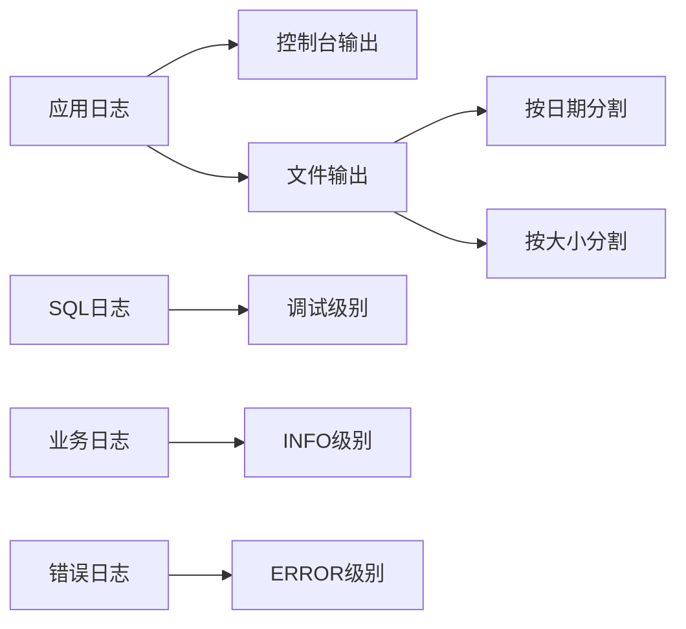

**图表来源**
- [logback-spring.xml](file://Boot/src/main/resources/logback-spring.xml#L23-L36)

#### 日志配置优化

- **异步日志**：使用AsyncAppender提高性能
- **滚动策略**：按时间和大小双重控制
- **编码设置**：UTF-8确保中文字符正确显示
- **过滤器**：不同级别日志分别处理

### 线程池监控

系统使用自定义线程池管理器，支持多种优先级的任务调度：

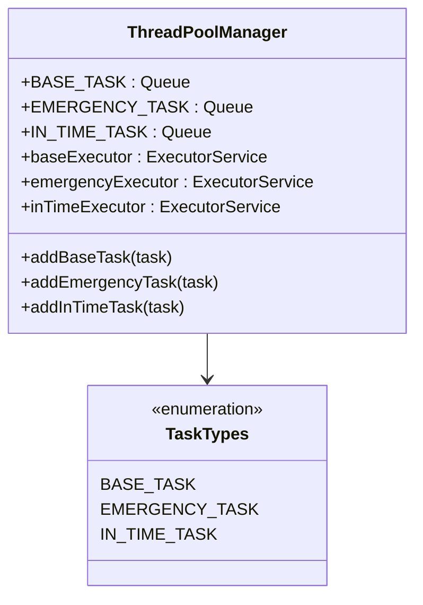

**图表来源**
- [ThreadPoolManager.java](file://Common/src/main/java/com/bot/common/util/ThreadPoolManager.java#L45-L72)

**节来源**
- [ThreadPoolManager.java](file://Common/src/main/java/com/bot/common/util/ThreadPoolManager.java#L45-L72)

## 数据库监控与维护

### 数据库连接池监控

系统使用Druid连接池，提供详细的监控指标：

| 配置项 | 生产环境值 | 说明 |
|-------|-----------|------|
| initialSize | 1 | 初始连接数 |
| minIdle | 3 | 最小空闲连接数 |
| maxActive | 60000 | 最大活跃连接数 |
| maxWait | 20ms | 获取连接最大等待时间 |
| timeBetweenEvictionRunsMillis | 60000ms | 连接回收检查间隔 |
| minEvictableIdleTimeMillis | 300000ms | 连接最小空闲时间 |

### 数据库维护策略

#### 定期维护任务

```sql
-- 清理过期临时文件
DELETE FROM life_temp_files WHERE expire_time < NOW();

-- 检查玩家数据完整性
SELECT COUNT(*) FROM life_player;
SELECT COUNT(*) FROM life_game_status;

-- 分析热门功能配置
SELECT config_key, config_value FROM life_system_config;
```

#### 数据备份策略

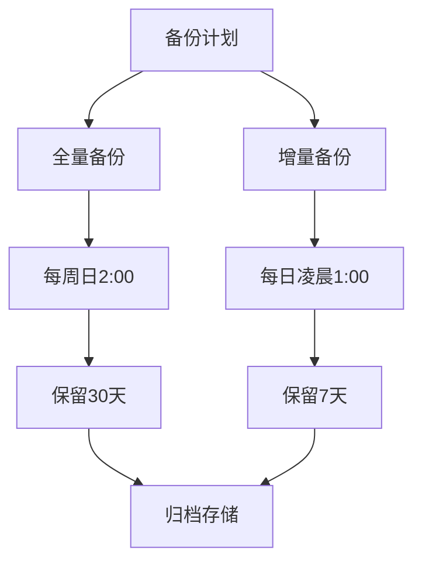

**图表来源**
- [Life_Deployment_Guide.md](file://Life_Deployment_Guide.md#L170-L200)

### 数据库性能优化

#### 索引优化策略

- **主键索引**：所有表必须有主键
- **唯一索引**：用户ID、昵称等唯一字段
- **复合索引**：经常一起查询的字段组合
- **分区表**：大数据量表按时间分区

#### 查询优化

- **慢查询监控**：启用SQL日志记录
- **批量操作**：减少网络往返
- **连接复用**：保持连接池活跃
- **事务控制**：合理设置事务边界

**节来源**
- [application-prod.properties](file://Boot/src/main/resources/application-prod.properties#L75-L85)
- [Life_Database_Init.sql](file://Life_Database_Init.sql#L1-L646)

## 定时任务监控

### 任务监控架构

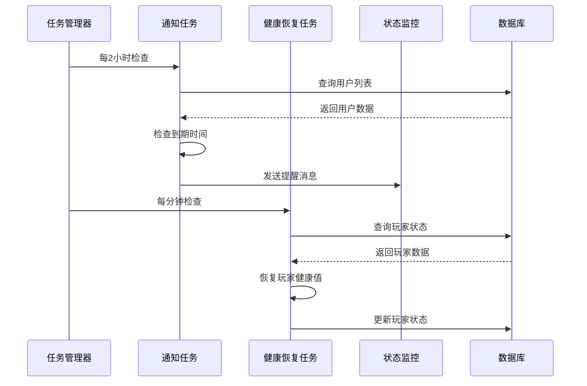

**图表来源**
- [NoticeTask.java](file://Base/src/main/java/com/bot/base/task/NoticeTask.java#L32-L62)
- [HealthRecoveryTask.java](file://Life/src/main/java/com/bot/life/task/HealthRecoveryTask.java#L18-L30)

### 任务监控指标

| 任务类型 | 执行频率 | 监控重点 | 告警条件 |
|---------|---------|---------|---------|
| 通知任务 | 2小时 | 用户到期提醒 | 提醒失败率>10% |
| 健康恢复 | 1分钟 | 玩家状态更新 | 恢复延迟>5秒 |
| 状态监控 | 5分钟 | 系统整体状态 | 连续3次检查失败 |
| 数据清理 | 1小时 | 清理效率 | 清理时间>10分钟 |

### 任务异常处理

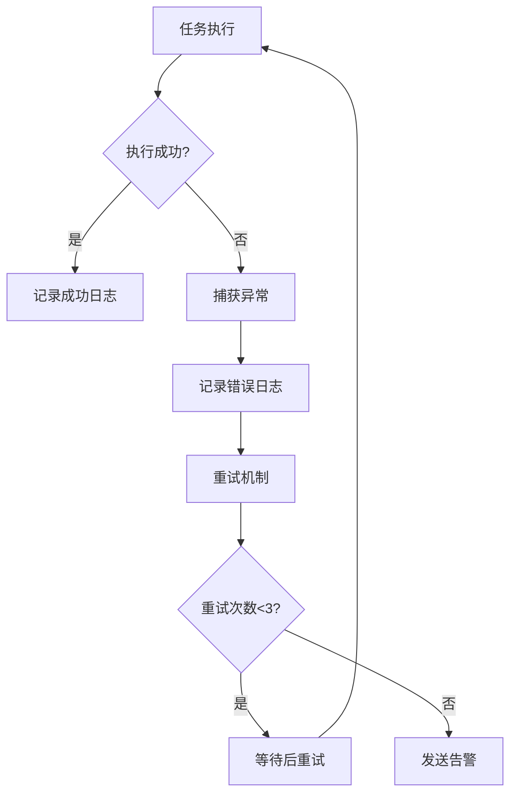

**图表来源**
- [HealthRecoveryTask.java](file://Life/src/main/java/com/bot/life/task/HealthRecoveryTask.java#L23-L28)

**节来源**
- [NoticeTask.java](file://Base/src/main/java/com/bot/base/task/NoticeTask.java#L32-L62)
- [HealthRecoveryTask.java](file://Life/src/main/java/com/bot/life/task/HealthRecoveryTask.java#L18-L30)

## 性能调优

### JVM参数优化

```properties
# 堆内存配置
-Xms2g
-Xmx4g
-XX:NewRatio=3
-XX:MaxMetaspaceSize=256m

# 垃圾回收优化
-XX:+UseG1GC
-XX:MaxGCPauseMillis=200
-XX:G1HeapRegionSize=16m
-XX:+UnlockExperimentalVMOptions
-XX:+UseStringDeduplication

# 监控参数
-XX:+PrintGCDetails
-XX:+PrintGCTimeStamps
-Xloggc:/data/logs/gc.log
```

### 数据库连接池优化

```properties
# Druid连接池配置
spring.datasource.druid.initial-size=5
spring.datasource.druid.min-idle=5
spring.datasource.druid.max-active=20
spring.datasource.druid.max-wait=60000
spring.datasource.druid.pool-prepared-statements=true
spring.datasource.druid.max-pool-prepared-statement-per-connection-size=20
```

### 缓存策略

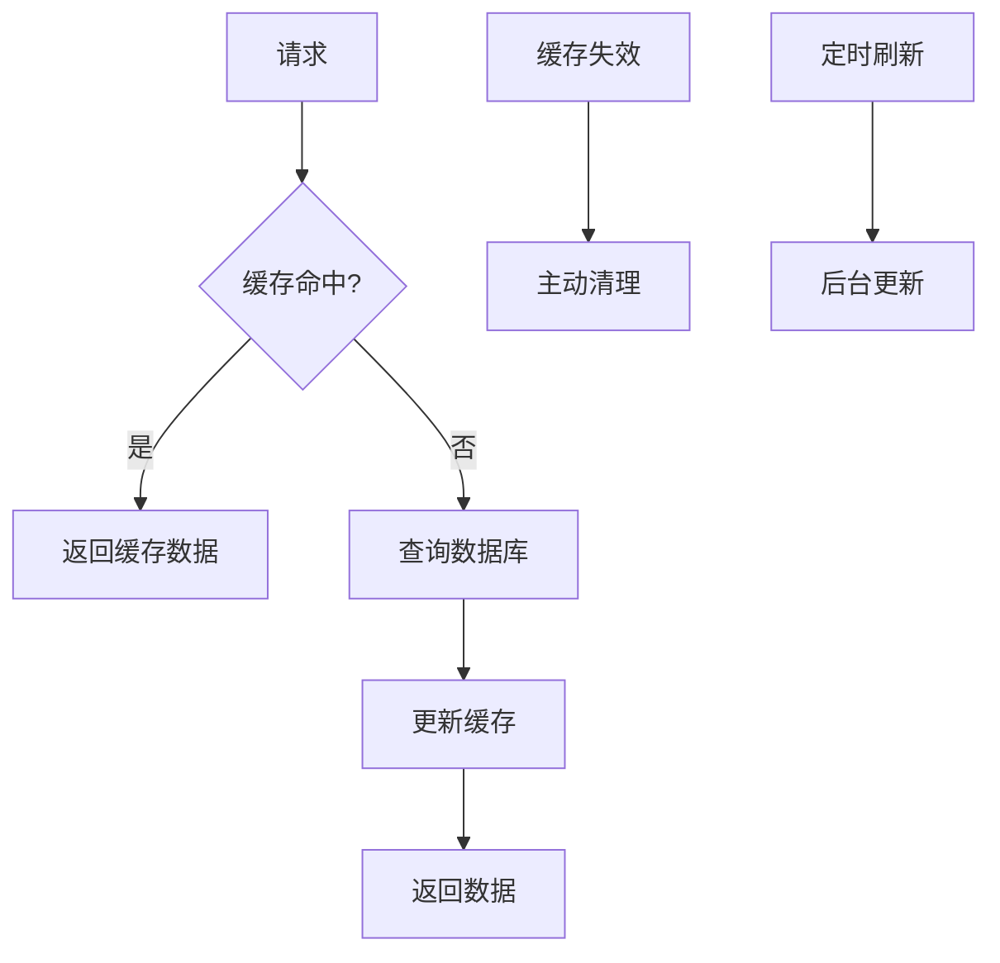

**图表来源**
- [application-prod.properties](file://Boot/src/main/resources/application-prod.properties#L75-L85)

## 安全加固

### 访问控制

- **密码保护**：管理员密码加密存储
- **会话管理**：超时自动登出
- **权限控制**：基于角色的访问控制
- **输入验证**：严格的数据格式验证

### 数据安全

- **敏感数据加密**：用户密码、支付信息等
- **传输安全**：HTTPS/TLS加密通信
- **审计日志**：关键操作记录
- **备份加密**：重要数据备份加密存储

### 网络安全

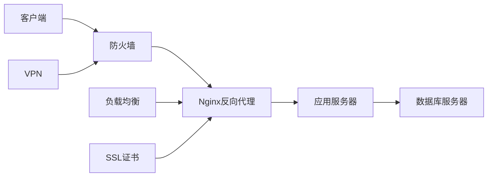

## 备份策略

### 备份计划

```mermaid
gantt
title 数据备份时间表
dateFormat HH:mm
axisFormat %H:%M
section 全量备份
每周日 2:00 :done, weekly, 2024-01-07 02:00, 1h
section 增量备份
每日凌晨 1:00 :active, daily, 2024-01-01 01:00, 1h
section 实时同步
24小时实时 :realtime, 2024-01-01 00:00, 24h
```

### 备份内容

| 备份类型 | 包含内容 | 备份频率 | 保留期限 |
|---------|---------|---------|---------|
| 全量备份 | 所有业务数据 | 每周 | 30天 |
| 增量备份 | 变更数据 | 每日 | 7天 |
| 日志备份 | 应用日志 | 实时 | 30天 |
| 配置备份 | 系统配置 | 变更时 | 永久 |

### 恢复流程

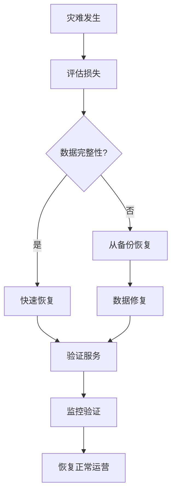

## 故障排除

### 常见问题诊断

#### 应用启动失败

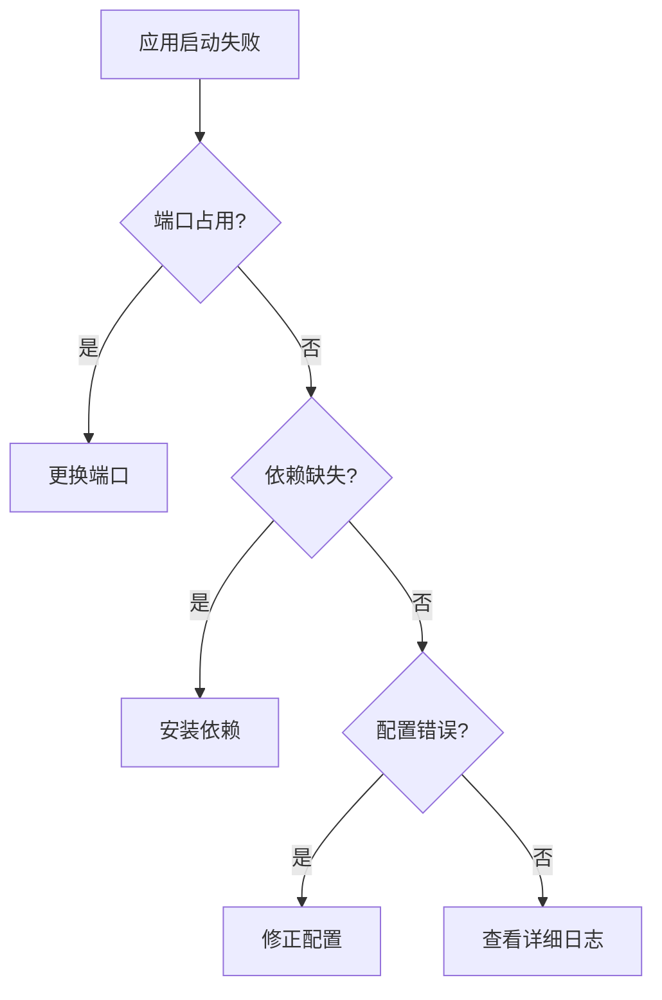

#### 数据库连接问题

| 问题症状 | 可能原因 | 解决方案 |
|---------|---------|---------|
| 连接超时 | 网络延迟 | 检查网络连接 |
| 权限拒绝 | 用户权限不足 | 重新授权 |
| 连接池耗尽 | 配置不当 | 调整连接池参数 |
| 查询超时 | SQL性能差 | 优化查询语句 |

### 监控告警

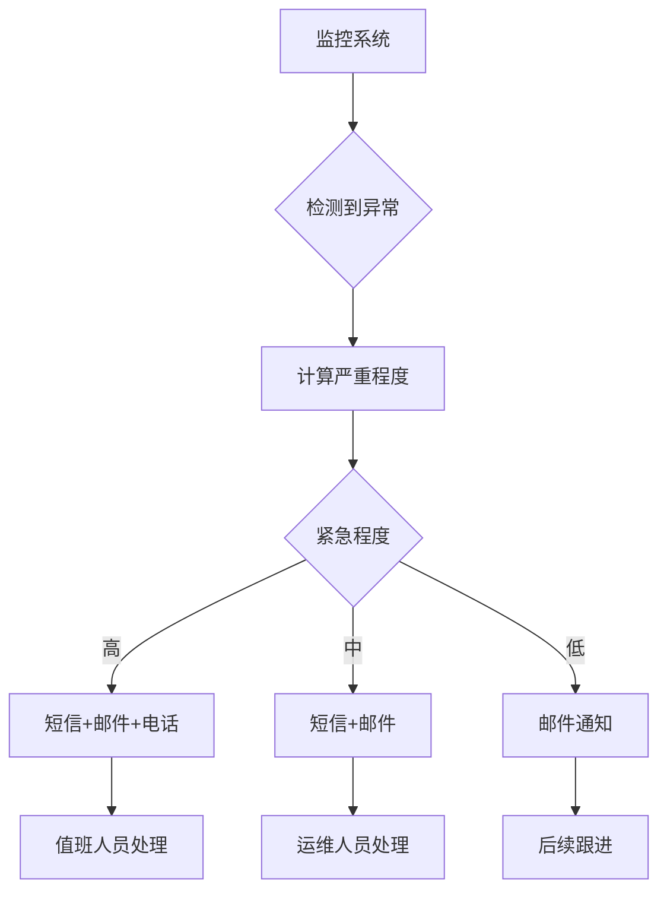

**节来源**
- [Life_Deployment_Guide.md](file://Life_Deployment_Guide.md#L125-L167)

## 运维最佳实践

### 部署规范

1. **环境隔离**：开发、测试、生产环境完全分离
2. **版本控制**：所有配置文件纳入版本管理
3. **自动化部署**：使用CI/CD流水线
4. **蓝绿部署**：零停机时间更新

### 监控最佳实践

1. **多维度监控**：应用、系统、业务三个层面
2. **智能告警**：避免告警疲劳，设置合理的阈值
3. **可视化展示**：使用监控面板实时掌握系统状态
4. **容量规划**：基于历史数据预测资源需求

### 维护流程

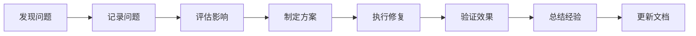

### 团队协作

- **值班制度**：建立7x24小时值班机制
- **知识共享**：定期技术分享和经验总结
- **应急预案**：针对不同场景制定详细预案
- **培训计划**：持续提升团队技术能力

### 持续改进

1. **定期评估**：每季度评估监控体系有效性
2. **工具升级**：跟踪新技术发展，适时升级工具
3. **流程优化**：根据实践经验不断优化运维流程
4. **标准化**：建立标准化的操作手册和规范

通过实施这些监控与维护措施，可以确保Bot项目在生产环境中稳定、高效地运行，为用户提供优质的服务体验。同时，完善的监控体系也为系统的持续优化和扩展提供了有力支撑。