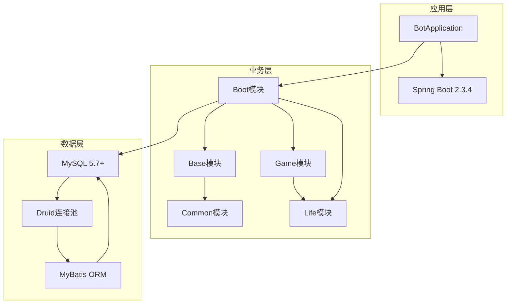
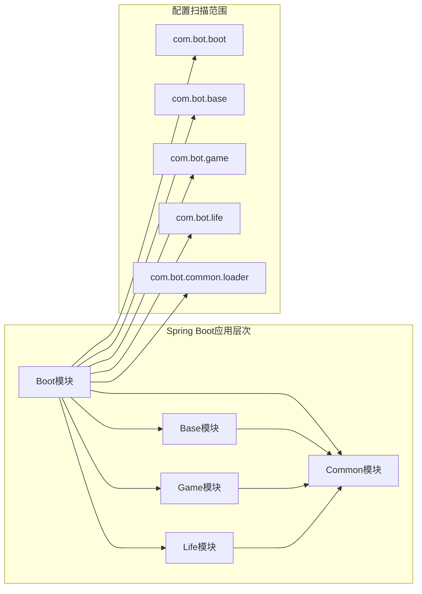
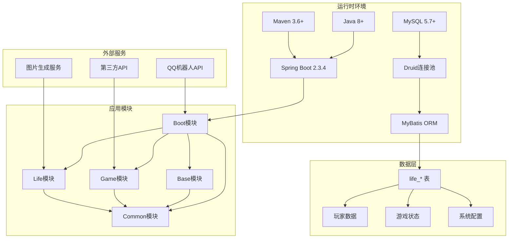
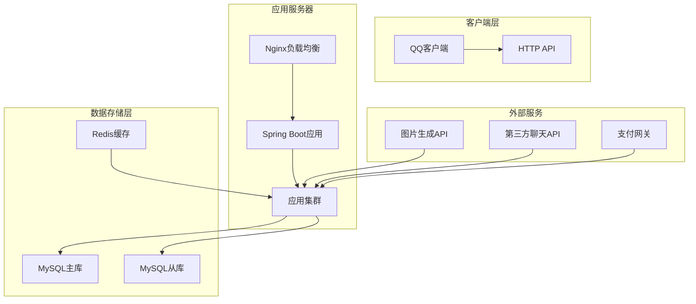

# 环境准备

<cite>
**本文档引用的文件**
- [Life_Deployment_Guide.md](file://Life_Deployment_Guide.md)
- [pom.xml](file://pom.xml)
- [Boot/pom.xml](file://Boot/pom.xml)
- [Base/pom.xml](file://Base/pom.xml)
- [Game/pom.xml](file://Game/pom.xml)
- [Life/pom.xml](file://Life/pom.xml)
- [Boot/src/main/resources/application.properties](file://Boot/src/main/resources/application.properties)
- [Boot/src/main/resources/application-dev.properties](file://Boot/src/main/resources/application-dev.properties)
- [Boot/src/main/resources/application-prod.properties](file://Boot/src/main/resources/application-prod.properties)
- [Boot/src/main/java/com/bot/boot/BotApplication.java](file://Boot/src/main/java/com/bot/boot/BotApplication.java)
- [Life_Database_Init.sql](file://Life_Database_Init.sql)
</cite>

## 目录
1. [概述](#概述)
2. [核心环境要求](#核心环境要求)
3. [Java环境配置](#java环境配置)
4. [MySQL数据库配置](#mysql数据库配置)
5. [Maven构建工具配置](#maven构建工具配置)
6. [Spring Boot框架配置](#spring-boot框架配置)
7. [操作系统差异化安装指南](#操作系统差异化安装指南)
8. [环境验证方法](#环境验证方法)
9. [常见问题解决方案](#常见问题解决方案)
10. [系统架构依赖关系](#系统架构依赖关系)

## 概述

Bot项目是一个基于Spring Boot框架的QQ聊天机器人系统，采用模块化架构设计，包含基础功能模块、游戏模块和浮生卷修仙游戏模块。部署该项目需要满足特定的环境要求，包括Java运行时环境、数据库系统、构建工具和框架版本等。

## 核心环境要求

根据项目配置文件分析，Bot项目的核心环境要求如下：

### 基础技术栈要求

| 组件 | 版本要求 | 必要性 | 说明 |
|------|----------|--------|------|
| Java | 8+ | 必需 | 运行时环境，支持JDK 8及以上版本 |
| MySQL | 5.7+ | 必需 | 数据库管理系统，支持5.7及以上版本 |
| Maven | 3.6+ | 必需 | 构建和依赖管理工具 |
| Spring Boot | 2.3.4 | 必需 | 应用框架，提供微服务基础设施 |

### 项目架构要求



**图表来源**
- [Boot/src/main/java/com/bot/boot/BotApplication.java](file://Boot/src/main/java/com/bot/boot/BotApplication.java#L12-L21)
- [pom.xml](file://pom.xml#L14-L17)

**章节来源**
- [Life_Deployment_Guide.md](file://Life_Deployment_Guide.md#L5-L8)
- [pom.xml](file://pom.xml#L14-L17)

## Java环境配置

### 版本要求与验证

Java是Bot项目运行的基础环境，必须满足以下要求：

- **最低版本**: Java 8 (JDK 1.8)
- **推荐版本**: Java 11或更高版本
- **支持类型**: JDK (Java Development Kit)

### 安装步骤

#### Windows系统

1. **下载JDK**
   - 访问Oracle官网或OpenJDK官方下载页面
   - 选择对应Windows版本的JDK安装包

2. **安装配置**
   ```cmd
   # 解压安装包到指定目录
   x:\jdk-11\bin\javac.exe
   
   # 设置环境变量
   set JAVA_HOME=x:\jdk-11
   set PATH=%JAVA_HOME%\bin;%PATH%
   ```

3. **验证安装**
   ```cmd
   java -version
   javac -version
   ```

#### Linux系统

1. **使用包管理器安装**
   ```bash
   # Ubuntu/Debian
   sudo apt update
   sudo apt install openjdk-11-jdk
   
   # CentOS/RHEL
   sudo yum install java-11-openjdk-devel
   ```

2. **手动安装**
   ```bash
   # 下载并解压
   wget https://download.java.net/openjdk/jdk11/ri/openjdk-11+28_linux-x64_bin.tar.gz
   tar -xzf openjdk-11+28_linux-x64_bin.tar.gz
   
   # 配置环境变量
   export JAVA_HOME=/opt/jdk-11
   export PATH=$JAVA_HOME/bin:$PATH
   ```

#### macOS系统

1. **使用Homebrew安装**
   ```bash
   brew install openjdk@11
   echo 'export PATH="/usr/local/opt/openjdk@11/bin:$PATH"' >> ~/.zshrc
   ```

2. **手动安装**
   ```bash
   # 下载.pkg文件并安装
   # 验证安装
   /usr/libexec/java_home -V
   ```

### 环境变量配置

确保系统环境变量正确配置：

```bash
# Linux/macOS
export JAVA_HOME=/path/to/jdk
export PATH=$JAVA_HOME/bin:$PATH

# Windows
set JAVA_HOME=C:\Program Files\Java\jdk-11
set PATH=%JAVA_HOME%\bin;%PATH%
```

**章节来源**
- [pom.xml](file://pom.xml#L26)
- [Boot/src/main/resources/application.properties](file://Boot/src/main/resources/application.properties#L48-L51)

## MySQL数据库配置

### 版本要求与特性支持

MySQL作为Bot项目的数据存储系统，需要满足以下要求：

- **最低版本**: MySQL 5.7+
- **推荐版本**: MySQL 8.0+
- **存储引擎**: InnoDB（支持事务）
- **字符集**: utf8mb4（支持完整的Unicode字符）

### 安装配置步骤

#### Windows系统

1. **下载安装**
   - 访问MySQL官网下载MySQL Installer
   - 选择"Server Only"安装选项

2. **配置安装**
   ```sql
   -- 使用MySQL命令行工具
   mysql -u root -p
   
   -- 创建数据库
   CREATE DATABASE IF NOT EXISTS bot DEFAULT CHARSET utf8mb4 COLLATE utf8mb4_unicode_ci;
   
   -- 创建用户并授权
   CREATE USER 'bot_user'@'localhost' IDENTIFIED BY 'secure_password';
   GRANT ALL PRIVILEGES ON bot.* TO 'bot_user'@'localhost';
   FLUSH PRIVILEGES;
   ```

3. **配置文件优化**
   ```ini
   # my.ini/my.cnf
   [mysqld]
   character-set-server=utf8mb4
   collation-server=utf8mb4_unicode_ci
   innodb_buffer_pool_size=1G
   innodb_log_file_size=256M
   max_connections=200
   ```

#### Linux系统

1. **包管理器安装**
   ```bash
   # Ubuntu/Debian
   sudo apt install mysql-server
   
   # CentOS/RHEL
   sudo yum install mysql-server
   ```

2. **配置优化**
   ```bash
   # 编辑配置文件
   sudo nano /etc/mysql/mysql.conf.d/mysqld.cnf
   
   # 添加以下配置
   [mysqld]
   character-set-server=utf8mb4
   collation-server=utf8mb4_unicode_ci
   ```

#### macOS系统

1. **使用Homebrew安装**
   ```bash
   brew install mysql
   brew services start mysql
   ```

2. **安全配置**
   ```bash
   mysql_secure_installation
   ```

### 数据库初始化

项目提供了完整的数据库初始化脚本，执行以下步骤：

1. **连接数据库**
   ```bash
   mysql -u root -p
   ```

2. **执行初始化脚本**
   ```sql
   -- 创建数据库
   CREATE DATABASE IF NOT EXISTS bot DEFAULT CHARSET utf8mb4;
   
   -- 切换到bot数据库
   USE bot;
   
   -- 执行初始化脚本
   SOURCE Life_Database_Init.sql;
   ```

### 数据库连接配置

根据项目配置，数据库连接参数如下：

| 参数 | 开发环境 | 生产环境 | 说明 |
|------|----------|----------|------|
| URL | jdbc:mysql://47.92.127.30:3306/bot | jdbc:mysql://localhost:3306/bot | 数据库连接地址 |
| 用户名 | root | root | 数据库用户名 |
| 密码 | gouzaizi@123 | 自定义密码 | 数据库访问密码 |
| 驱动类 | com.mysql.cj.jdbc.Driver | com.mysql.cj.jdbc.Driver | JDBC驱动类 |

**章节来源**
- [Life_Deployment_Guide.md](file://Life_Deployment_Guide.md#L14-L26)
- [Boot/src/main/resources/application.properties](file://Boot/src/main/resources/application.properties#L48-L51)

## Maven构建工具配置

### 版本要求与功能特性

Maven是Bot项目的构建和依赖管理工具，必须满足：

- **最低版本**: Maven 3.6+
- **推荐版本**: Maven 3.8+ 或 Maven 3.9+
- **功能要求**: 支持多模块项目构建、依赖管理和插件扩展

### 安装配置步骤

#### Windows系统

1. **下载Maven**
   - 访问Apache Maven官网下载页面
   - 下载二进制zip文件

2. **解压配置**
   ```cmd
   rem 解压到指定目录
   x:\apache-maven-3.8.8\bin\mvn.bat
   
   rem 设置环境变量
   set MAVEN_HOME=x:\apache-maven-3.8.8
   set PATH=%MAVEN_HOME%\bin;%PATH%
   ```

3. **验证安装**
   ```cmd
   mvn -v
   ```

#### Linux系统

1. **包管理器安装**
   ```bash
   # Ubuntu/Debian
   sudo apt install maven
   
   # CentOS/RHEL
   sudo yum install maven
   ```

2. **手动安装**
   ```bash
   # 下载并解压
   wget https://downloads.apache.org/maven/maven-3/3.8.8/binaries/apache-maven-3.8.8-bin.tar.gz
   tar -xzf apache-maven-3.8.8-bin.tar.gz
   
   # 配置环境变量
   export MAVEN_HOME=/opt/apache-maven-3.8.8
   export PATH=$MAVEN_HOME/bin:$PATH
   ```

#### macOS系统

1. **使用Homebrew安装**
   ```bash
   brew install maven
   ```

2. **验证安装**
   ```bash
   mvn -v
   ```

### Maven配置优化

#### 本地仓库配置

编辑`~/.m2/settings.xml`文件：

```xml
<settings>
  <localRepository>/path/to/custom/repository</localRepository>
  <mirrors>
    <mirror>
      <id>aliyun-maven</id>
      <name>Aliyun Maven</name>
      <url>https://maven.aliyun.com/repository/public</url>
      <mirrorOf>central</mirrorOf>
    </mirror>
  </mirrors>
</settings>
```

#### 构建配置

项目使用Maven多模块结构，主要模块包括：

- **boot**: 主应用模块
- **base**: 基础功能模块
- **common**: 公共组件模块
- **game**: 游戏功能模块
- **life**: 浮生卷游戏模块

### 构建命令

```bash
# 清理并编译
mvn clean compile

# 完整构建（跳过测试）
mvn clean package -DskipTests

# 开发环境构建
mvn clean package -Pdev

# 生产环境构建
mvn clean package -Pprod
```

**章节来源**
- [Life_Deployment_Guide.md](file://Life_Deployment_Guide.md#L48-L56)
- [pom.xml](file://pom.xml#L125-L144)

## Spring Boot框架配置

### 版本要求与特性支持

Spring Boot 2.3.4是项目的核心框架，提供以下关键特性：

- **自动配置**: 减少样板配置
- **嵌入式服务器**: 支持Tomcat、Jetty等
- **生产就绪**: 提供健康检查、指标监控
- **微服务支持**: 集成各种微服务功能

### 框架配置要点

#### 应用程序配置

```java
// BotApplication.java
@SpringBootApplication(
    scanBasePackages = {
        "com.bot.boot",
        "com.bot.base", 
        "com.bot.game", 
        "com.bot.life", 
        "com.bot.common.loader"
    }
)
@MapperScan({
    "com.bot.game.dao.mapper", 
    "com.bot.life.dao.mapper"
})
@EnableScheduling
public class BotApplication {
    // 应用启动逻辑
}
```

#### 数据源配置

项目使用Druid连接池和MyBatis ORM：

```properties
# 数据源配置
spring.datasource.url=jdbc:mysql://localhost:3306/bot?useUnicode=true&characterEncoding=utf8&useSSL=false&serverTimezone=UTC
spring.datasource.username=root
spring.datasource.password=your_password
spring.datasource.driver-class-name=com.mysql.cj.jdbc.Driver
spring.datasource.type=com.alibaba.druid.pool.DruidDataSource

# Druid连接池配置
spring.datasource.druid.initial-size=1
spring.datasource.druid.max-active=20
spring.datasource.druid.min-idle=3
spring.datasource.druid.max-wait=60000
```

#### MyBatis配置

```properties
# MyBatis配置
mybatis.configuration.map-underscore-to-camel-case=true
mybatis.configuration.default-fetch-size=100
mybatis.configuration.default-statement-timeout=3000
mybatis.type-aliases-package=com.bot.*.dao.entity
mybatis.mapper-locations=classpath*:mapper/*.xml
```

### 模块化架构



**图表来源**
- [Boot/src/main/java/com/bot/boot/BotApplication.java](file://Boot/src/main/java/com/bot/boot/BotApplication.java#L12-L21)

**章节来源**
- [pom.xml](file://pom.xml#L14-L17)
- [Boot/src/main/resources/application.properties](file://Boot/src/main/resources/application.properties#L48-L69)

## 操作系统差异化安装指南

### Windows系统

#### 环境准备
```cmd
REM 检查Java版本
java -version

REM 检查Maven版本
mvn -v

REM 检查MySQL版本
mysql --version
```

#### 安装流程
1. **下载安装包**
   - Java: Oracle JDK或OpenJDK
   - Maven: Apache Maven
   - MySQL: MySQL Community Server

2. **环境变量配置**
   ```cmd
   REM 设置系统环境变量
   setx JAVA_HOME "C:\Program Files\Java\jdk-11"
   setx MAVEN_HOME "C:\apache-maven-3.8.8"
   setx MYSQL_HOME "C:\Program Files\MySQL\MySQL Server 8.0"
   
   REM 添加到PATH
   setx PATH "%JAVA_HOME%\bin;%MAVEN_HOME%\bin;%MYSQL_HOME%\bin;%PATH%"
   ```

3. **数据库初始化**
   ```cmd
   REM 启动MySQL服务
   net start mysql
   
   REM 初始化数据库
   mysql -u root -p < Life_Database_Init.sql
   ```

### Linux系统

#### 包管理器安装
```bash
# Ubuntu/Debian
sudo apt update
sudo apt install openjdk-11-jdk maven mysql-server

# CentOS/RHEL
sudo yum install java-11-openjdk-devel maven mysql-server

# 启动MySQL服务
sudo systemctl start mysqld
sudo systemctl enable mysqld
```

#### 手动安装配置
```bash
# 创建部署目录
sudo mkdir -p /opt/bot
sudo chown $USER:$USER /opt/bot

# 配置MySQL
sudo mysql_secure_installation

# 创建数据库用户
sudo mysql -e "
CREATE DATABASE bot CHARACTER SET utf8mb4 COLLATE utf8mb4_unicode_ci;
CREATE USER 'bot_user'@'localhost' IDENTIFIED BY 'password';
GRANT ALL PRIVILEGES ON bot.* TO 'bot_user'@'localhost';
FLUSH PRIVILEGES;"
```

### macOS系统

#### Homebrew安装
```bash
# 安装Java
brew install openjdk@11

# 安装Maven
brew install maven

# 安装MySQL
brew install mysql

# 启动MySQL服务
brew services start mysql
```

#### 系统配置
```bash
# 配置环境变量
echo 'export JAVA_HOME=$(/usr/libexec/java_home -v 11)' >> ~/.zshrc
echo 'export PATH="$JAVA_HOME/bin:$PATH"' >> ~/.zshrc
echo 'export MAVEN_HOME=/usr/local/opt/maven' >> ~/.zshrc
echo 'export PATH="$MAVEN_HOME/bin:$PATH"' >> ~/.zshrc

# 重新加载配置
source ~/.zshrc
```

## 环境验证方法

### 版本验证命令

#### Java环境验证
```bash
# 检查Java版本
java -version
javac -version

# 验证Java环境变量
echo $JAVA_HOME
which java

# 检查Java特性支持
java -XshowSettings:properties -version 2>&1 | grep -E "(java.version|java.home)"
```

#### MySQL环境验证
```bash
# 检查MySQL版本
mysql --version

# 验证MySQL服务状态
mysqladmin -u root version

# 测试数据库连接
mysql -u root -p -e "SELECT VERSION();"

# 检查字符集支持
mysql -u root -p -e "SHOW VARIABLES LIKE 'character_set%';"
```

#### Maven环境验证
```bash
# 检查Maven版本
mvn -v

# 验证Maven配置
mvn help:system

# 测试Maven仓库连接
mvn dependency:resolve
```

#### Spring Boot验证
```bash
# 启动应用验证
java -jar Boot/target/Boot-1.5.0.0.jar --spring.profiles.active=dev

# 检查应用状态
curl http://localhost:9091/bot/actuator/health

# 查看应用信息
curl http://localhost:9091/bot/actuator/info
```

### 功能验证清单

#### 数据库连接验证
```sql
-- 检查数据库连接
SELECT DATABASE();

-- 验证表结构
SHOW TABLES LIKE 'life_%';

-- 检查初始数据
SELECT COUNT(*) FROM life_player;
SELECT COUNT(*) FROM life_map;
SELECT COUNT(*) FROM life_monster;
```

#### 应用功能验证
```bash
# 检查应用启动日志
tail -f logs/application.log

# 验证API端点
curl -X POST http://localhost:9091/bot/api/test \
     -H "Content-Type: application/json" \
     -d '{"message":"test"}'

# 检查内存使用
jstat -gc <pid>
```

### 自动化验证脚本

创建环境验证脚本`verify_env.sh`：

```bash
#!/bin/bash
# 环境验证脚本

echo "=== Bot项目环境验证 ==="

# Java验证
echo "1. Java环境检查..."
if command -v java >/dev/null 2>&1; then
    java -version
else
    echo "❌ Java未安装"
fi

# Maven验证
echo "2. Maven环境检查..."
if command -v mvn >/dev/null 2>&1; then
    mvn -v
else
    echo "❌ Maven未安装"
fi

# MySQL验证
echo "3. MySQL环境检查..."
if command -v mysql >/dev/null 2>&1; then
    mysql --version
    mysql -u root -p -e "SELECT 1;" > /dev/null 2>&1
    if [ $? -eq 0 ]; then
        echo "✅ MySQL连接成功"
    else
        echo "❌ MySQL连接失败"
    fi
else
    echo "❌ MySQL未安装"
fi

# 应用启动验证
echo "4. 应用启动检查..."
cd /path/to/bot
mvn clean compile
java -jar Boot/target/Boot-1.5.0.0.jar --spring.profiles.active=dev &
APP_PID=$!

sleep 10

if ps -p $APP_PID > /dev/null; then
    echo "✅ 应用启动成功"
    kill $APP_PID
else
    echo "❌ 应用启动失败"
fi

echo "=== 验证完成 ==="
```

**章节来源**
- [Life_Deployment_Guide.md](file://Life_Deployment_Guide.md#L69-L93)

## 常见问题解决方案

### 环境变量配置问题

#### 问题1: Java_HOME未设置
```bash
# 错误信息
Error: JAVA_HOME is not set and could not be found.

# 解决方案
# Windows
set JAVA_HOME=C:\Program Files\Java\jdk-11
set PATH=%JAVA_HOME%\bin;%PATH%

# Linux/macOS
export JAVA_HOME=/usr/lib/jvm/java-11-openjdk
export PATH=$JAVA_HOME/bin:$PATH
```

#### 问题2: Maven找不到Java
```bash
# 错误信息
Could not find java in JAVA_HOME

# 解决方案
# 确保JAVA_HOME指向正确的JDK目录
# Linux/macOS检查符号链接
ls -la $JAVA_HOME
```

### 数据库连接问题

#### 问题3: MySQL连接失败
```bash
# 错误信息
Access denied for user 'root'@'localhost'

# 解决方案
# 1. 检查MySQL服务状态
sudo systemctl status mysql

# 2. 重置root密码
sudo mysql -u root
ALTER USER 'root'@'localhost' IDENTIFIED WITH mysql_native_password BY 'new_password';

# 3. 检查防火墙设置
sudo ufw allow 3306
```

#### 问题4: 字符集不匹配
```sql
-- 错误信息
Incorrect string value: '\xF0\x9F\x98\x8A' for column

-- 解决方案
-- 修改数据库字符集
ALTER DATABASE bot CHARACTER SET = utf8mb4 COLLATE = utf8mb4_unicode_ci;

-- 修改表字符集
ALTER TABLE life_player CONVERT TO CHARACTER SET utf8mb4 COLLATE utf8mb4_unicode_ci;
```

### 权限问题

#### 问题5: 文件权限不足
```bash
# 错误信息
Permission denied: '/path/to/file'

# 解决方案
# Linux/macOS
chmod +x script.sh
chown $USER:$USER /path/to/directory

# Windows
icacls "C:\path\to\directory" /grant "%USERNAME%:(OI)(CI)F"
```

#### 问题6: 端口占用
```bash
# 错误信息
Address already in use: bind

# 解决方案
# 查找占用端口的进程
netstat -tulpn | grep :9091
lsof -i :9091

# 终止占用进程
kill -9 <PID>
```

### Maven构建问题

#### 问题7: 依赖下载失败
```bash
# 错误信息
Could not resolve dependencies

# 解决方案
# 1. 清理本地仓库
rm -rf ~/.m2/repository/org/springframework

# 2. 使用国内镜像
# 编辑 ~/.m2/settings.xml
<mirror>
  <id>aliyun-maven</id>
  <name>Aliyun Maven</name>
  <url>https://maven.aliyun.com/repository/public</url>
  <mirrorOf>central</mirrorOf>
</mirror>

# 3. 强制更新依赖
mvn clean install -U
```

#### 问题8: 内存不足
```bash
# 错误信息
OutOfMemoryError: Java heap space

# 解决方案
# 设置Maven JVM参数
export MAVEN_OPTS="-Xmx2g -XX:MaxPermSize=512m"

# 或在pom.xml中配置
<plugin>
    <groupId>org.apache.maven.plugins</groupId>
    <artifactId>maven-compiler-plugin</artifactId>
    <configuration>
        <fork>true</fork>
        <meminitial>512m</meminitial>
        <maxmem>2048m</maxmem>
    </configuration>
</plugin>
```

### Spring Boot启动问题

#### 问题9: 端口冲突
```bash
# 错误信息
Port 9091 was already occupied

# 解决方案
# 1. 修改application.properties
server.port=9092

# 2. 或使用命令行参数
java -jar app.jar --server.port=9092
```

#### 问题10: 配置文件缺失
```bash
# 错误信息
Could not resolve placeholder 'some.property'

# 解决方案
# 1. 检查配置文件路径
ls -la src/main/resources/

# 2. 确保配置文件存在
# application.properties
# application-dev.properties
# application-prod.properties

# 3. 检查文件编码
file -bi application.properties
```

### 性能优化建议

#### 数据库性能调优
```sql
-- 优化查询性能
EXPLAIN SELECT * FROM life_player WHERE nickname = 'test';

-- 优化索引
CREATE INDEX idx_nickname ON life_player(nickname);
CREATE INDEX idx_user_id ON life_player(user_id);

-- 监控慢查询
SET GLOBAL slow_query_log = 'ON';
SET GLOBAL long_query_time = 1;
```

#### JVM性能调优
```bash
# 生产环境JVM参数
java -Xms2g -Xmx4g \
     -XX:+UseG1GC \
     -XX:MaxGCPauseMillis=200 \
     -XX:+HeapDumpOnOutOfMemoryError \
     -jar app.jar
```

**章节来源**
- [Life_Deployment_Guide.md](file://Life_Deployment_Guide.md#L127-L143)

## 系统架构依赖关系

### 组件间依赖图



**图表来源**
- [Boot/src/main/java/com/bot/boot/BotApplication.java](file://Boot/src/main/java/com/bot/boot/BotApplication.java#L12-L21)
- [pom.xml](file://pom.xml#L6-L11)

### 依赖关系详解

#### 核心依赖链

1. **Java运行时依赖**
   ```
   Java 8+ → Spring Boot 2.3.4 → MyBatis 3.0+ → MySQL Connector
   ```

2. **构建工具依赖**
   ```
   Maven 3.6+ → Spring Boot Maven Plugin → 多模块构建
   ```

3. **数据库依赖**
   ```
   MySQL 5.7+ → Druid连接池 → MyBatis ORM → DAO层
   ```

4. **应用模块依赖**
   ```
   Boot模块 → Base/Game/Life/Common模块
   ```

#### 版本兼容性矩阵

| 组件 | 当前版本 | 推荐版本 | 兼容版本范围 | 说明 |
|------|----------|----------|--------------|------|
| Java | 8+ | 11+ | 8-17 | 支持长期支持版 |
| Spring Boot | 2.3.4 | 2.7+ | 2.3-3.0 | 保持向后兼容 |
| MyBatis | 1.2.0 | 2.2+ | 1.2-2.3 | ORM框架 |
| MySQL Connector | 8.0+ | 8.0+ | 5.7-8.0 | 数据库驱动 |
| Druid | 1.1.0 | 1.2+ | 1.1-1.3 | 连接池 |

### 部署架构图



### 性能监控指标

#### 关键性能指标(KPI)

1. **应用性能指标**
   - 响应时间: < 500ms
   - 吞吐量: > 1000 TPS
   - 错误率: < 0.1%
   - 可用性: > 99.9%

2. **数据库性能指标**
   - 连接池使用率: < 80%
   - 查询响应时间: < 100ms
   - 死锁频率: < 0.01次/小时

3. **系统资源指标**
   - CPU使用率: < 70%
   - 内存使用率: < 80%
   - 磁盘IO: < 80%

**章节来源**
- [pom.xml](file://pom.xml#L14-L17)
- [Boot/src/main/resources/application.properties](file://Boot/src/main/resources/application.properties#L48-L69)

## 总结

Bot项目的环境准备涉及多个技术组件的协调配置，包括Java运行时环境、MySQL数据库、Maven构建工具和Spring Boot框架。通过遵循本文档提供的详细安装指南和配置说明，开发者可以成功搭建完整的开发和生产环境。

关键成功要素包括：

1. **版本兼容性**: 确保所有组件版本符合项目要求
2. **环境隔离**: 开发、测试、生产环境的独立配置
3. **性能优化**: 合理的资源配置和性能调优
4. **监控维护**: 建立完善的监控和维护机制

建议开发者在部署前仔细阅读相关配置文件，理解各组件的作用和相互依赖关系，以便更好地进行环境配置和故障排查。