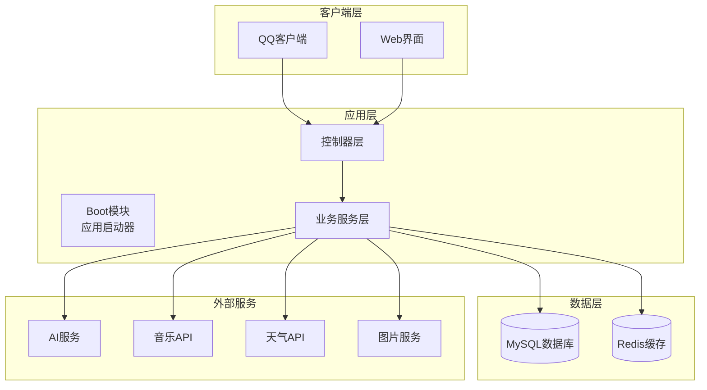
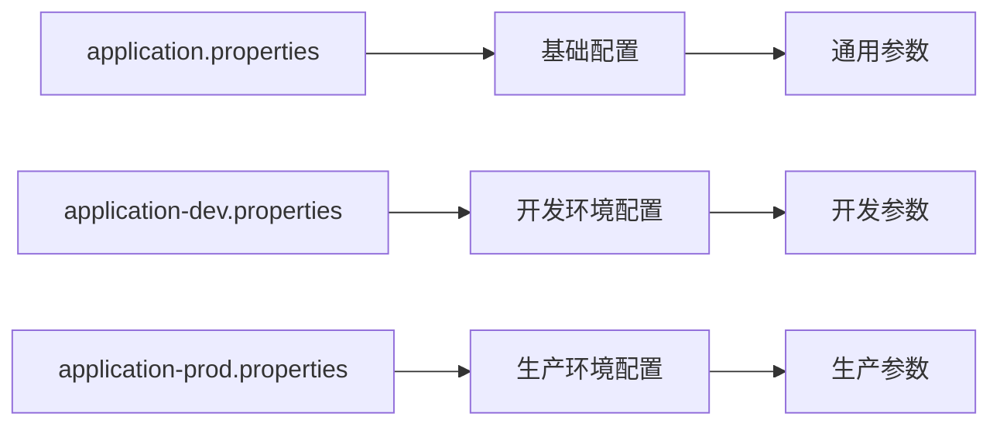

# Bot项目部署指南

<cite>
**本文档引用的文件**
- [Life_Deployment_Guide.md](file://Life_Deployment_Guide.md)
- [application.properties](file://Boot/src/main/resources/application.properties)
- [application-dev.properties](file://Boot/src/main/resources/application-dev.properties)
- [application-prod.properties](file://Boot/src/main/resources/application-prod.properties)
- [pom.xml](file://pom.xml)
- [BotApplication.java](file://Boot/src/main/java/com/bot/boot/BotApplication.java)
- [logback-spring.xml](file://Boot/src/main/resources/logback-spring.xml)
- [Life_Database_Init.sql](file://Life_Database_Init.sql)
- [Life_Image_Service_Update.md](file://Life_Image_Service_Update.md)
</cite>

## 目录
1. [项目概述](#项目概述)
2. [环境要求](#环境要求)
3. [系统架构](#系统架构)
4. [部署前准备](#部署前准备)
5. [数据库部署](#数据库部署)
6. [应用配置](#应用配置)
7. [构建与打包](#构建与打包)
8. [启动部署](#启动部署)
9. [环境差异对比](#环境差异对比)
10. [部署验证](#部署验证)
11. [故障排除](#故障排除)
12. [运维监控](#运维监控)
13. [最佳实践](#最佳实践)

## 项目概述

Bot项目是一个基于QQ聊天机器人的多功能应用，包含游戏、生活助手、娱乐等功能模块。项目采用Spring Boot框架，支持多模块架构，具备良好的扩展性和维护性。

### 核心功能模块
- **Base模块**: 基础服务和通用组件
- **Boot模块**: 应用启动和控制器
- **Common模块**: 公共配置和工具类
- **Game模块**: 游戏业务逻辑
- **Life模块**: 生活助手和浮生卷游戏

## 环境要求

### 系统环境
- **操作系统**: Windows/Linux/macOS
- **Java版本**: Java 8+ (推荐使用JDK 1.8)
- **内存要求**: 至少2GB RAM
- **磁盘空间**: 至少1GB可用空间

### 数据库要求
- **MySQL版本**: 5.7+
- **字符集**: utf8mb4
- **存储引擎**: InnoDB

### 构建工具
- **Maven版本**: 3.6+
- **网络要求**: 可访问外网进行依赖下载

## 系统架构



**图表来源**
- [BotApplication.java](file://Boot/src/main/java/com/bot/boot/BotApplication.java#L12-L21)
- [pom.xml](file://pom.xml#L6-L11)

## 部署前准备

### 1. 环境检查

```bash
# 检查Java版本
java -version

# 检查Maven版本
mvn -version

# 检查MySQL版本
mysql --version
```

### 2. 系统资源准备

```bash
# 创建项目目录
mkdir -p /data/project/bot
cd /data/project/bot

# 创建日志目录
mkdir -p logs

# 创建文件存储目录
mkdir -p files
mkdir -p files/life_pic
mkdir -p files/template
```

### 3. 权限设置

```bash
# 设置目录权限
chmod -R 755 /data/project/bot
chown -R tomcat:tomcat /data/project/bot  # 根据实际情况修改
```

## 数据库部署

### 1. 数据库初始化

执行数据库初始化脚本创建必要的表结构和初始数据：

```sql
-- 连接数据库
mysql -u root -p

-- 创建数据库
CREATE DATABASE IF NOT EXISTS bot DEFAULT CHARSET utf8mb4 COLLATE utf8mb4_unicode_ci;

-- 使用数据库
USE bot;

-- 执行初始化脚本
SOURCE /path/to/Life_Database_Init.sql;
```

### 2. 数据库配置验证

```sql
-- 检查主要表是否创建成功
SHOW TABLES LIKE 'life_%';

-- 验证玩家表结构
DESCRIBE life_player;

-- 检查系统配置表
SELECT * FROM life_system_config;
```

### 3. 数据库连接优化

```properties
# MySQL连接池优化配置
spring.datasource.hikari.maximum-pool-size=20
spring.datasource.hikari.minimum-idle=5
spring.datasource.hikari.idle-timeout=30000
spring.datasource.hikari.connection-timeout=20000
spring.datasource.hikari.max-lifetime=1800000
```

**章节来源**
- [Life_Deployment_Guide.md](file://Life_Deployment_Guide.md#L12-L26)
- [Life_Database_Init.sql](file://Life_Database_Init.sql#L1-L50)

## 应用配置

### 1. 配置文件结构

项目使用Spring Boot的多环境配置机制：



**图表来源**
- [application.properties](file://Boot/src/main/resources/application.properties#L1-L70)
- [application-dev.properties](file://Boot/src/main/resources/application-dev.properties#L1-L59)
- [application-prod.properties](file://Boot/src/main/resources/application-prod.properties#L1-L92)

### 2. 关键配置项说明

#### 数据库连接配置

| 配置项 | 开发环境 | 生产环境 | 说明 |
|--------|----------|----------|------|
| spring.datasource.url | jdbc:mysql://47.92.127.30:3306/bot | jdbc:mysql://localhost:3306/bot | 数据库连接URL |
| spring.datasource.username | root | root | 数据库用户名 |
| spring.datasource.password | gouzaizi@123 | [生产密码] | 数据库密码 |
| spring.datasource.driver-class-name | com.mysql.cj.jdbc.Driver | com.mysql.cj.jdbc.Driver | JDBC驱动类 |

#### 日志配置

| 配置项 | 开发环境 | 生产环境 | 说明 |
|--------|----------|----------|------|
| logback.rootPath | D:\\home\\gardpay\\reconciliation\\logs\\ | /data/project/bot/logs | 日志文件路径 |
| logback.level | INFO | INFO | 日志级别 |
| logback.pattern | 时间格式 | 时间格式 | 日志输出格式 |

#### 文件存储配置

| 配置项 | 开发环境 | 生产环境 | 说明 |
|--------|----------|----------|------|
| text.path | C:\\publish\\botText\\ | /data/project/bot/text/ | 文本文件路径 |
| base.file.path | /data/files | /data/files | 基础文件路径 |
| pic.create.url | 本地地址 | http://113.45.63.97/file/life_pic/ | 图片生成URL |

### 3. 图片生成服务配置

根据最新更新，图片生成服务配置如下：

```java
// ImageGenerationServiceImpl配置
private static final String BACKGROUND_IMAGE_PATH = "life_back.png";
private static final String OUTPUT_DIR = "/data/files/life_pic/";
private static final String BASE_URL = "http://113.45.63.97/file/life_pic/";
```

**章节来源**
- [application.properties](file://Boot/src/main/resources/application.properties#L47-L70)
- [application-dev.properties](file://Boot/src/main/resources/application-dev.properties#L33-L59)
- [application-prod.properties](file://Boot/src/main/resources/application-prod.properties#L71-L92)
- [Life_Image_Service_Update.md](file://Life_Image_Service_Update.md#L16-L28)

## 构建与打包

### 1. Maven构建配置

项目使用Maven进行构建管理，支持多环境打包：

```xml
<!-- Maven Profile配置 -->
<profiles>
    <profile>
        <id>dev</id>
        <properties>
            <profileActive>dev</profileActive>
        </properties>
        <activation>
            <activeByDefault>true</activeByDefault>
        </activation>
    </profile>
    <profile>
        <id>prod</id>
        <properties>
            <profileActive>prod</profileActive>
        </properties>
    </profile>
</profiles>
```

### 2. 构建命令

#### 开发环境构建
```bash
# 清理并编译
mvn clean compile

# 完整构建（跳过测试）
mvn clean package -DskipTests

# 开发环境构建
mvn clean package -P dev -DskipTests
```

#### 生产环境构建
```bash
# 生产环境构建
mvn clean package -P prod -DskipTests

# 包含测试的完整构建
mvn clean package
```

### 3. 构建产物

构建完成后，可在以下位置找到可执行文件：
- `Boot/target/Boot-1.5.0.0.jar` (Spring Boot可执行JAR)
- `Boot/target/Boot-1.5.0.0.war` (WAR包，用于传统应用服务器)

**章节来源**
- [pom.xml](file://pom.xml#L125-L144)

## 启动部署

### 1. 应用启动方式

#### 方式一：直接运行JAR文件
```bash
# 开发环境启动
java -jar Boot/target/Boot-1.5.0.0.jar --spring.profiles.active=dev

# 生产环境启动
java -jar Boot/target/Boot-1.5.0.0.jar --spring.profiles.active=prod

# 指定配置文件启动
java -jar Boot/target/Boot-1.5.0.0.jar --spring.config.location=/data/project/bot/application-prod.properties
```

#### 方式二：使用Maven插件
```bash
# 开发环境启动
mvn spring-boot:run -pl Boot -Dspring-boot.run.profiles=dev

# 生产环境启动
mvn spring-boot:run -pl Boot -Dspring-boot.run.profiles=prod
```

#### 方式三：后台服务启动
```bash
# 创建启动脚本
#!/bin/bash
nohup java -jar Boot/target/Boot-1.5.0.0.jar \
  --spring.profiles.active=prod \
  --logging.file.path=/data/project/bot/logs \
  > /data/project/bot/logs/startup.log 2>&1 &
```

### 2. 启动参数配置

```bash
# JVM参数优化
JAVA_OPTS="-Xms512m -Xmx2g -XX:+UseG1GC -XX:MaxGCPauseMillis=200"

# 应用参数
APP_ARGS="--server.port=9091 --server.servlet.context-path=/bot"

# 完整启动命令
java $JAVA_OPTS $APP_ARGS -jar Boot/target/Boot-1.5.0.0.jar
```

### 3. 服务注册与发现

```bash
# 注册为系统服务（Linux）
sudo tee /etc/systemd/system/bot.service << EOF
[Unit]
Description=Bot Application
After=network.target

[Service]
Type=simple
User=tomcat
WorkingDirectory=/data/project/bot
ExecStart=/usr/bin/java -jar /data/project/bot/Boot/target/Boot-1.5.0.0.jar --spring.profiles.active=prod
Restart=always
RestartSec=10

[Install]
WantedBy=multi-user.target
EOF

# 启动服务
sudo systemctl daemon-reload
sudo systemctl enable bot
sudo systemctl start bot
```

**章节来源**
- [Life_Deployment_Guide.md](file://Life_Deployment_Guide.md#L58-L66)
- [BotApplication.java](file://Boot/src/main/java/com/bot/boot/BotApplication.java#L17-L19)

## 环境差异对比

### 开发环境 vs 生产环境

| 配置项 | 开发环境 | 生产环境 | 说明 |
|--------|----------|----------|------|
| 数据库连接 | 远程数据库 | 本地数据库 | 提高开发效率 |
| 日志级别 | DEBUG | INFO | 减少生产环境日志开销 |
| 文件路径 | 绝对路径 | 相对路径 | 适应不同部署环境 |
| 外部服务 | 测试接口 | 正式接口 | 避免测试数据污染 |
| 缓存策略 | 内存缓存 | Redis缓存 | 提高生产环境性能 |
| 错误页面 | 开发模式 | 生产模式 | 改善用户体验 |

### 环境切换配置

```bash
# 开发环境启动
export SPRING_PROFILES_ACTIVE=dev
./startup.sh

# 生产环境启动  
export SPRING_PROFILES_ACTIVE=prod
./startup.sh
```

**章节来源**
- [application-dev.properties](file://Boot/src/main/resources/application-dev.properties#L1-L59)
- [application-prod.properties](file://Boot/src/main/resources/application-prod.properties#L1-L92)

## 部署验证

### 1. 基础功能验证

#### 启动日志检查
```bash
# 查看启动日志
tail -f logs/bot-controller/bot.2024-01-01.log

# 关键日志关键字
grep -E "(Started|ERROR|WARN)" logs/bot-controller/bot.*
```

#### 服务健康检查
```bash
# 检查端口监听
netstat -tlnp | grep 9091

# 检查进程状态
ps aux | grep Boot-1.5.0.0.jar

# 检查内存使用
jstat -gc <pid>
```

### 2. 功能模块测试

#### 游戏功能测试
```bash
# 发送测试消息
curl -X POST http://localhost:9091/bot/test \
  -H "Content-Type: application/json" \
  -d '{"message":"浮生卷","userId":"test_user"}'
```

#### 数据库连接测试
```sql
-- 检查数据库连接
SELECT COUNT(*) FROM life_player;

-- 检查系统配置
SELECT config_key, config_value FROM life_system_config;
```

### 3. 性能基准测试

```bash
# 响应时间测试
time curl -s http://localhost:9091/bot/api/ping

# 并发测试
ab -n 1000 -c 10 http://localhost:9091/bot/api/ping
```

**章节来源**
- [Life_Deployment_Guide.md](file://Life_Deployment_Guide.md#L68-L94)

## 故障排除

### 1. 常见启动问题

#### 数据库连接失败
```bash
# 问题诊断
telnet localhost 3306
mysql -h localhost -u root -p

# 解决方案
1. 检查MySQL服务状态
2. 验证连接凭据
3. 检查防火墙设置
4. 确认数据库权限
```

#### 端口占用问题
```bash
# 查找占用端口的进程
lsof -i :9091
netstat -tlnp | grep 9091

# 杀死占用进程
kill -9 <PID>
```

#### 内存不足问题
```bash
# 增加JVM堆内存
java -Xms1g -Xmx2g -jar Boot-1.5.0.0.jar

# 监控内存使用
jstat -gc <pid> 1s
```

### 2. 运行时问题

#### 图片生成失败
```bash
# 检查图片目录权限
ls -la /data/files/life_pic/
chmod -R 755 /data/files/life_pic/

# 检查背景图片文件
ls -la life_back.png
```

#### 外部API调用失败
```bash
# 检查网络连接
curl -I https://api.example.com

# 检查API密钥
grep -E "(key|token)" application-prod.properties
```

### 3. 日志分析

#### 日志配置优化
```xml
<!-- logback-spring.xml 配置 -->
<logger name="com.bot" level="DEBUG"/>
<logger name="org.springframework" level="INFO"/>
<logger name="com.mysql" level="INFO"/>
```

#### 关键错误模式识别
```bash
# 查找异常堆栈
grep -A 10 -B 5 "ERROR" logs/bot-controller/*

# 查找特定异常
grep "NullPointerException" logs/bot-controller/*
grep "Connection refused" logs/bot-controller/*
```

**章节来源**
- [Life_Deployment_Guide.md](file://Life_Deployment_Guide.md#L125-L167)

## 运维监控

### 1. 监控指标

#### 系统指标
```bash
# CPU使用率
top -p $(pgrep -f Boot-1.5.0.0.jar)

# 内存使用率
free -h

# 磁盘使用率
df -h

# 网络连接数
ss -tuln | grep :9091
```

#### 应用指标
```bash
# JVM内存使用
jstat -gc <pid>

# GC统计
jstat -gcutil <pid>

# 类加载统计
jstat -class <pid>
```

### 2. 自动化监控

#### 监控脚本示例
```bash
#!/bin/bash
# bot_monitor.sh

PID=$(pgrep -f Boot-1.5.0.0.jar)
if [ -z "$PID" ]; then
    echo "$(date): Bot process died, restarting..."
    /data/project/bot/startup.sh
fi
```

#### 定时任务配置
```bash
# 添加到crontab
echo "*/5 * * * * /data/project/bot/bot_monitor.sh" >> /var/spool/cron/root
```

### 3. 告警机制

#### 邮件告警配置
```bash
# 配置邮件通知
tee /data/project/bot/alert.sh << EOF
#!/bin/bash
echo "\$1" | mail -s "Bot Alert" admin@example.com
EOF
chmod +x /data/project/bot/alert.sh
```

#### 日志轮转配置
```bash
# logrotate配置
tee /etc/logrotate.d/bot << EOF
/data/project/bot/logs/*.log {
    daily
    rotate 30
    compress
    delaycompress
    missingok
    notifempty
    copytruncate
}
EOF
```

**章节来源**
- [Life_Deployment_Guide.md](file://Life_Deployment_Guide.md#L168-L200)

## 最佳实践

### 1. 部署安全

#### 访问控制
```bash
# 设置严格的文件权限
chmod 600 application-prod.properties
chmod 755 startup.sh

# 创建专用用户
useradd -r -s /bin/false bot
chown -R bot:bot /data/project/bot
```

#### 密钥管理
```bash
# 使用环境变量存储敏感信息
export DB_PASSWORD="production_password"
export API_KEY="production_api_key"

# 在配置文件中使用占位符
spring.datasource.password=${DB_PASSWORD}
```

### 2. 性能优化

#### JVM调优
```bash
# 生产环境JVM参数
JAVA_OPTS="-server \
  -Xms2g -Xmx4g \
  -XX:+UseG1GC \
  -XX:MaxGCPauseMillis=200 \
  -XX:+HeapDumpOnOutOfMemoryError \
  -XX:HeapDumpPath=/data/project/bot/dumps/"
```

#### 数据库优化
```sql
-- 优化查询性能
CREATE INDEX idx_life_player_user_id ON life_player(user_id);
CREATE INDEX idx_life_game_status_player_id ON life_game_status(player_id);

-- 优化存储过程
DELIMITER //
CREATE PROCEDURE cleanup_expired_data()
BEGIN
    DELETE FROM life_temp_files WHERE expire_time < NOW();
END//
DELIMITER ;
```

### 3. 备份策略

#### 数据库备份
```bash
#!/bin/bash
# db_backup.sh

DATE=$(date +%Y%m%d_%H%M%S)
BACKUP_DIR="/data/backups/db"
DB_NAME="bot"

mysqldump -u root -p$DB_PASSWORD $DB_NAME \
  --single-transaction \
  --routines \
  --triggers \
  > $BACKUP_DIR/bot_$DATE.sql

gzip $BACKUP_DIR/bot_$DATE.sql
```

#### 文件备份
```bash
#!/bin/bash
# file_backup.sh

DATE=$(date +%Y%m%d_%H%M%S)
BACKUP_DIR="/data/backups/files"

tar -czf $BACKUP_DIR/files_$DATE.tar.gz \
  /data/files/life_pic/ \
  /data/files/template/
```

### 4. 升级维护

#### 滚动升级
```bash
#!/bin/bash
# rolling_update.sh

# 1. 停止旧版本
kill $(pgrep -f Boot-1.5.0.0.jar)

# 2. 部署新版本
cp new_version.jar Boot/target/Boot-1.5.0.0.jar

# 3. 启动新版本
nohup java -jar Boot/target/Boot-1.5.0.0.jar --spring.profiles.active=prod &

# 4. 验证启动
sleep 30
if ! pgrep -f Boot-1.5.0.0.jar > /dev/null; then
    echo "启动失败，回滚..."
    # 回滚操作
fi
```

#### 版本管理
```bash
# 版本标记
git tag v1.5.0.0
git push origin v1.5.0.0

# 版本发布清单
echo "部署版本: v1.5.0.0"
echo "更新日期: $(date)"
echo "变更内容: 新增功能、Bug修复"
echo "回滚计划: 已准备"
```

### 5. 文档维护

#### 部署手册更新
```bash
# 维护部署检查清单
tee DEPLOYMENT_CHECKLIST.md << EOF
## 部署检查清单

### 前置检查
- [ ] Java版本验证
- [ ] Maven版本验证
- [ ] MySQL服务状态
- [ ] 磁盘空间充足

### 部署阶段
- [ ] 数据库初始化完成
- [ ] 配置文件正确
- [ ] 构建成功
- [ ] 服务启动正常

### 验证阶段
- [ ] 健康检查通过
- [ ] 功能测试完成
- [ ] 性能基准达标
- [ ] 监控配置就绪
EOF
```

这个部署指南涵盖了Bot项目的完整部署流程，从环境准备到生产部署的各个环节。通过遵循这些步骤和最佳实践，可以确保项目的稳定运行和高效维护。