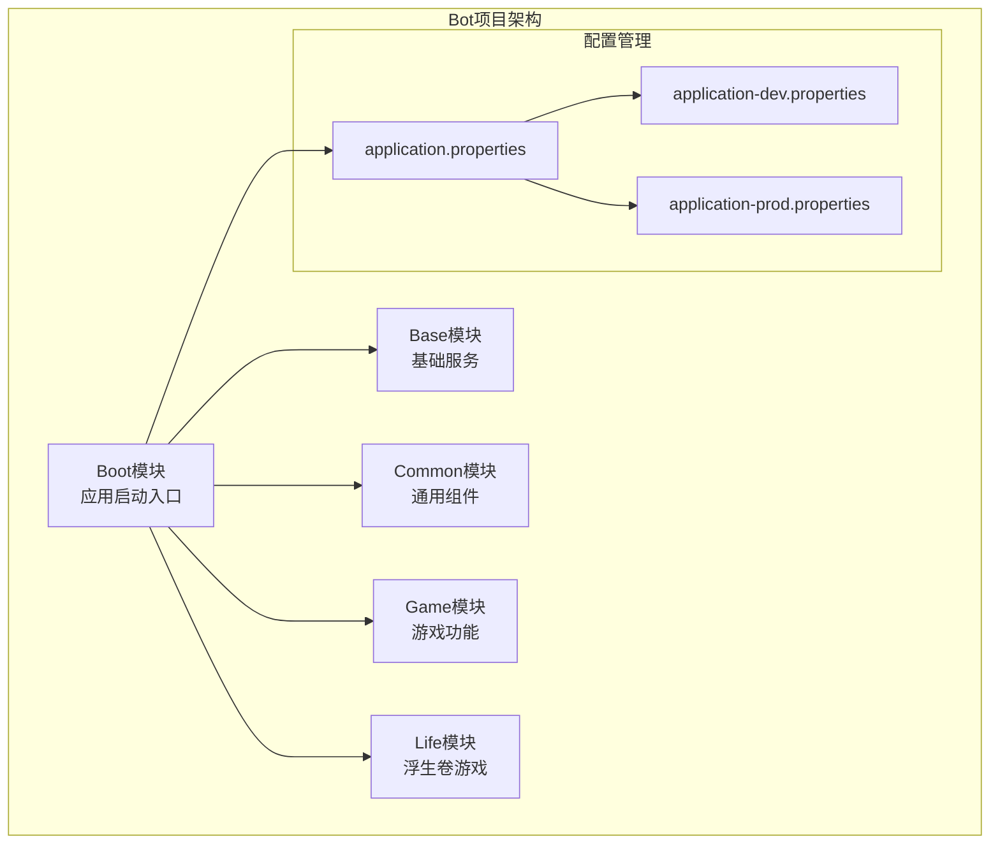
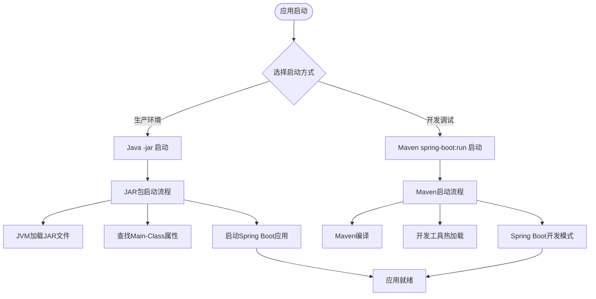
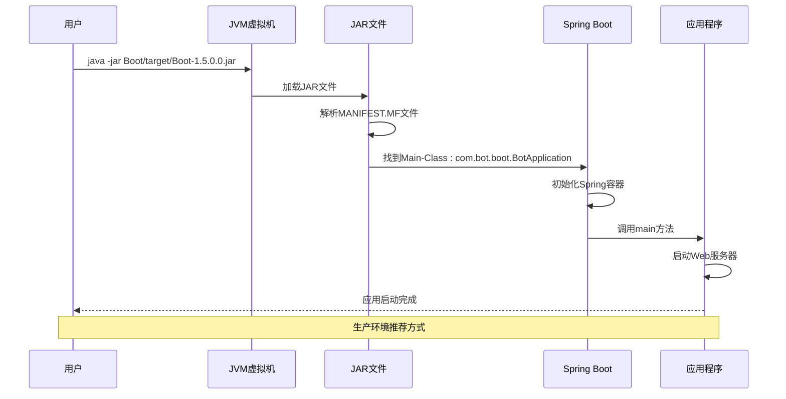
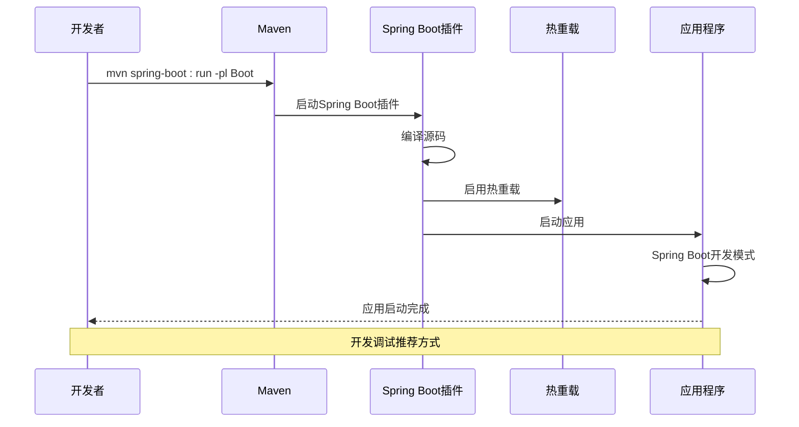
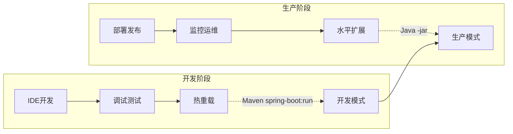

# 应用启动

<cite>
**本文档引用的文件**
- [BotApplication.java](file://Boot/src/main/java/com/bot/boot/BotApplication.java)
- [pom.xml](file://Boot/pom.xml)
- [Life_Deployment_Guide.md](file://Life_Deployment_Guide.md)
- [application.properties](file://Boot/src/main/resources/application.properties)
- [application-dev.properties](file://Boot/src/main/resources/application-dev.properties)
- [application-prod.properties](file://Boot/src/main/resources/application-prod.properties)
- [pom.xml](file://pom.xml)
- [mvnw.cmd](file://mvnw.cmd)
</cite>

## 目录
1. [概述](#概述)
2. [应用架构](#应用架构)
3. [启动方式详解](#启动方式详解)
4. [Java -jar 启动方式](#java---jar-启动方式)
5. [Maven spring-boot:run 启动方式](#maven-spring-bootrun-启动方式)
6. [启动方式对比](#启动方式对比)
7. [JVM 参数配置](#jvm-参数配置)
8. [自动化启动脚本](#自动化启动脚本)
9. [故障排除](#故障排除)
10. [最佳实践](#最佳实践)

## 概述

Bot项目是一个基于Spring Boot框架的QQ机器人应用，采用多模块架构设计。项目提供了两种主要的应用启动方式，分别适用于不同的开发和生产环境需求。本文档详细说明了这两种启动方式的工作原理、适用场景以及配置方法。

## 应用架构

Bot项目采用分层架构设计，包含以下核心模块：



**图表来源**
- [BotApplication.java](file://Boot/src/main/java/com/bot/boot/BotApplication.java#L12-L21)
- [pom.xml](file://pom.xml#L6-L11)

**章节来源**
- [BotApplication.java](file://Boot/src/main/java/com/bot/boot/BotApplication.java#L1-L22)
- [pom.xml](file://pom.xml#L1-L148)

## 启动方式详解

Bot项目提供两种主要的应用启动方式，每种方式都有其特定的使用场景和优势：

### 启动方式概览



## Java -jar 启动方式

### 工作原理

Java -jar 启动方式是生产环境的标准启动方式，它直接运行编译后的JAR包文件。

#### 启动流程详解



**图表来源**
- [BotApplication.java](file://Boot/src/main/java/com/bot/boot/BotApplication.java#L17-L19)
- [pom.xml](file://Boot/pom.xml#L40-L42)

#### 关键特性

1. **独立运行**: 包含所有依赖，无需外部环境
2. **性能优化**: JIT编译优化，启动速度快
3. **资源隔离**: 独立的类加载器，避免依赖冲突
4. **生产就绪**: 适合容器化部署和集群环境

### 启动命令格式

```bash
java -jar Boot/target/Boot-1.5.0.0.jar
```

### 启动参数说明

| 参数 | 说明 | 示例 |
|------|------|------|
| `-Dspring.profiles.active=prod` | 指定环境配置 | `java -Dspring.profiles.active=prod -jar ...` |
| `-Xms512m` | 设置初始堆内存 | `java -Xms512m -jar ...` |
| `-Xmx2g` | 设置最大堆内存 | `java -Xmx2g -jar ...` |
| `-XX:+UseG1GC` | 使用G1垃圾回收器 | `java -XX:+UseG1GC -jar ...` |

**章节来源**
- [Life_Deployment_Guide.md](file://Life_Deployment_Guide.md#L61-L62)

## Maven spring-boot:run 启动方式

### 工作原理

Maven spring-boot:run 启动方式主要用于开发和调试阶段，它通过Maven插件直接运行源码。

#### 启动流程详解



**图表来源**
- [pom.xml](file://Boot/pom.xml#L40-L42)
- [pom.xml](file://pom.xml#L125-L144)

#### 关键特性

1. **热重载**: 支持代码变更自动重启
2. **开发工具**: 集成Spring Boot DevTools
3. **调试友好**: 支持断点调试和远程调试
4. **灵活配置**: 可以指定激活的配置文件

### 启动命令格式

```bash
# 基本启动
mvn spring-boot:run -pl Boot

# 指定环境配置
mvn spring-boot:run -pl Boot -Dspring-boot.run.profiles=dev

# 远程调试
mvn spring-boot:run -pl Boot -Dspring-boot.run.jvmArguments="-agentlib:jdwp=transport=dt_socket,server=y,suspend=n,address=5005"
```

### -pl 参数说明

`-pl` 是 Maven 的 `--projects` 参数缩写，用于指定要构建的模块：

| 参数 | 说明 | 示例 |
|------|------|------|
| `-pl Boot` | 只构建并运行Boot模块 | `mvn spring-boot:run -pl Boot` |
| `-pl Boot,Base` | 构建多个模块 | `mvn spring-boot:run -pl Boot,Base` |
| `-am` | 同时构建依赖模块 | `mvn spring-boot:run -pl Boot -am` |

**章节来源**
- [Life_Deployment_Guide.md](file://Life_Deployment_Guide.md#L64-L65)

## 启动方式对比

### 功能对比表

| 特性 | Java -jar 启动 | Maven spring-boot:run 启动 |
|------|----------------|----------------------------|
| **启动速度** | 快速启动 | 较慢（需编译） |
| **内存占用** | 较低 | 较高（包含编译器） |
| **热重载** | 不支持 | 支持 |
| **调试支持** | 支持远程调试 | 支持断点调试 |
| **开发效率** | 低 | 高 |
| **生产就绪** | ✓ | ✗ |
| **依赖管理** | 自包含 | 依赖Maven环境 |

### 适用场景



## JVM 参数配置

### 内存配置

#### 开发环境配置

```bash
# 基础开发配置
java -Xms512m -Xmx1024m \
     -XX:+UseG1GC \
     -XX:MaxGCPauseMillis=200 \
     -XX:+PrintGCDetails \
     -jar Boot/target/Boot-1.5.0.0.jar

# 调试配置
java -Xms512m -Xmx1024m \
     -Xdebug \
     -Xrunjdwp:transport=dt_socket,server=y,suspend=n,address=5005 \
     -jar Boot/target/Boot-1.5.0.0.jar
```

#### 生产环境配置

```bash
# 生产环境推荐配置
java -Xms2g -Xmx4g \
     -XX:+UseG1GC \
     -XX:MaxGCPauseMillis=200 \
     -XX:+HeapDumpOnOutOfMemoryError \
     -XX:HeapDumpPath=/data/logs/heapdump.hprof \
     -XX:+PrintGCDetails \
     -XX:+PrintGCTimeStamps \
     -Xloggc:/data/logs/gc.log \
     -jar Boot/target/Boot-1.5.0.0.jar
```

### JVM 参数详解

| 参数 | 说明 | 推荐值 |
|------|------|--------|
| `-Xms` | 初始堆内存 | 物理内存的1/4 |
| `-Xmx` | 最大堆内存 | 物理内存的1/2 |
| `-XX:+UseG1GC` | 使用G1垃圾回收器 | 生产环境推荐 |
| `-XX:MaxGCPauseMillis` | 最大GC暂停时间 | 200ms |
| `-XX:+HeapDumpOnOutOfMemoryError` | OOM时生成堆转储 | 生产环境必需 |
| `-XX:HeapDumpPath` | 堆转储文件路径 | /data/logs/ |

### 环境变量配置

```bash
# 设置JVM选项
export JAVA_OPTS="-Xms2g -Xmx4g -XX:+UseG1GC"

# 设置应用配置
export SPRING_PROFILES_ACTIVE=prod
export LOG_PATH=/data/logs/bot

# 启动应用
java $JAVA_OPTS -Dspring.profiles.active=$SPRING_PROFILES_ACTIVE \
      -Dlogging.file.path=$LOG_PATH \
      -jar Boot/target/Boot-1.5.0.0.jar
```

**章节来源**
- [application.properties](file://Boot/src/main/resources/application.properties#L1-L70)
- [application-prod.properties](file://Boot/src/main/resources/application-prod.properties#L1-L92)

## 自动化启动脚本

### Shell启动脚本

#### 基础启动脚本

```bash
#!/bin/bash
# Bot应用启动脚本

APP_NAME="Bot"
APP_JAR="Boot/target/Boot-1.5.0.0.jar"
LOG_DIR="/data/logs/bot"
PID_FILE="/var/run/bot.pid"

# 创建日志目录
mkdir -p $LOG_DIR

# 启动函数
start() {
    echo "Starting $APP_NAME..."
    
    # 检查是否已经运行
    if [ -f $PID_FILE ]; then
        PID=$(cat $PID_FILE)
        if ps -p $PID > /dev/null; then
            echo "$APP_NAME is already running (PID: $PID)"
            exit 1
        fi
    fi
    
    # 启动应用
    nohup java -Xms2g -Xmx4g \
           -XX:+UseG1GC \
           -XX:MaxGCPauseMillis=200 \
           -XX:+HeapDumpOnOutOfMemoryError \
           -XX:HeapDumpPath=$LOG_DIR/heapdump.hprof \
           -Dspring.profiles.active=prod \
           -Dlogging.file.path=$LOG_DIR \
           -jar $APP_JAR > $LOG_DIR/startup.log 2>&1 &
    
    echo $! > $PID_FILE
    echo "$APP_NAME started (PID: $!)"
}

# 停止函数
stop() {
    echo "Stopping $APP_NAME..."
    
    if [ -f $PID_FILE ]; then
        PID=$(cat $PID_FILE)
        if ps -p $PID > /dev/null; then
            kill $PID
            rm -f $PID_FILE
            echo "$APP_NAME stopped"
        else
            echo "$APP_NAME was not running"
            rm -f $PID_FILE
        fi
    else
        echo "$APP_NAME PID file not found"
    fi
}

# 状态检查
status() {
    if [ -f $PID_FILE ]; then
        PID=$(cat $PID_FILE)
        if ps -p $PID > /dev/null; then
            echo "$APP_NAME is running (PID: $PID)"
        else
            echo "$APP_NAME is not running (PID file exists but process not found)"
            rm -f $PID_FILE
        fi
    else
        echo "$APP_NAME is not running"
    fi
}

# 主程序
case "$1" in
    start)
        start
        ;;
    stop)
        stop
        ;;
    restart)
        stop
        sleep 2
        start
        ;;
    status)
        status
        ;;
    *)
        echo "Usage: $0 {start|stop|restart|status}"
        exit 1
        ;;
esac
```

#### Maven启动脚本

```bash
#!/bin/bash
# Bot Maven开发启动脚本

PROJECT_ROOT=$(pwd)
BOOT_MODULE="$PROJECT_ROOT/Boot"
LOG_DIR="$PROJECT_ROOT/logs"
PID_FILE="$PROJECT_ROOT/bot.pid"

# 创建日志目录
mkdir -p $LOG_DIR

# 启动函数
start_dev() {
    echo "Starting Bot in development mode..."
    
    # 检查Maven是否可用
    if ! command -v mvn &> /dev/null; then
        echo "Maven not found. Please install Maven 3.6+"
        exit 1
    fi
    
    # 检查Java环境
    if ! command -v java &> /dev/null; then
        echo "Java not found. Please install Java 8+"
        exit 1
    fi
    
    # 启动应用
    cd $BOOT_MODULE
    nohup mvn spring-boot:run \
           -Dspring-boot.run.profiles=dev \
           -Dspring-boot.run.jvmArguments="-Xdebug -Xrunjdwp:transport=dt_socket,server=y,suspend=n,address=5005" \
           > $LOG_DIR/dev-startup.log 2>&1 &
    
    echo $! > $PID_FILE
    echo "Bot development server started (PID: $!)"
    echo "Access at http://localhost:9091/bot"
}

# 停止函数
stop_dev() {
    echo "Stopping Bot development server..."
    
    if [ -f $PID_FILE ]; then
        PID=$(cat $PID_FILE)
        if ps -p $PID > /dev/null; then
            kill $PID
            rm -f $PID_FILE
            echo "Development server stopped"
        else
            echo "Development server was not running"
            rm -f $PID_FILE
        fi
    else
        echo "Development server PID file not found"
    fi
}

# 主程序
case "$1" in
    start)
        start_dev
        ;;
    stop)
        stop_dev
        ;;
    restart)
        stop_dev
        sleep 2
        start_dev
        ;;
    *)
        echo "Usage: $0 {start|stop|restart}"
        exit 1
        ;;
esac
```

### Docker启动配置

#### Docker Compose配置

```yaml
version: '3.8'
services:
  bot:
    image: bot-app:latest
    container_name: bot-server
    ports:
      - "9091:9091"
    volumes:
      - ./logs:/app/logs
      - ./config:/app/config
    environment:
      - SPRING_PROFILES_ACTIVE=prod
      - JAVA_OPTS=-Xms2g -Xmx4g -XX:+UseG1GC
    restart: always
    healthcheck:
      test: ["CMD", "curl", "-f", "http://localhost:9091/bot/health"]
      interval: 30s
      timeout: 10s
      retries: 3
    logging:
      driver: "json-file"
      options:
        max-size: "100m"
        max-file: "3"
```

#### Dockerfile配置

```dockerfile
FROM openjdk:8-jre-alpine

# 创建应用目录
RUN mkdir -p /app/logs /app/config
WORKDIR /app

# 复制JAR文件
COPY Boot/target/Boot-1.5.0.0.jar app.jar

# 创建非root用户
RUN addgroup -g 1000 bot && \
    adduser -D -s /bin/sh -u 1000 -G bot bot

# 设置权限
USER bot

# 暴露端口
EXPOSE 9091

# 健康检查
HEALTHCHECK --interval=30s --timeout=10s --start-period=5s --retries=3 \
    CMD curl -f http://localhost:9091/bot/health || exit 1

# 启动命令
ENTRYPOINT ["sh", "-c", "java $JAVA_OPTS -jar app.jar"]
```

**章节来源**
- [Life_Deployment_Guide.md](file://Life_Deployment_Guide.md#L1-L234)

## 故障排除

### 常见启动问题

#### 1. Java版本不兼容

```bash
# 检查Java版本
java -version

# 错误信息
# Error: Could not create the Java Virtual Machine.
# Error: A fatal exception has occurred. Program will exit.

# 解决方案
# 升级到Java 8或更高版本
# Ubuntu: sudo apt-get install openjdk-8-jdk
# CentOS: sudo yum install java-1.8.0-openjdk-devel
```

#### 2. 内存不足

```bash
# 错误信息
# java.lang.OutOfMemoryError: Java heap space

# 解决方案
java -Xms1g -Xmx2g -jar Boot/target/Boot-1.5.0.0.jar
```

#### 3. 端口被占用

```bash
# 检查端口占用
netstat -tulpn | grep :9091

# 杀死占用进程
sudo kill -9 $(sudo lsof -t -i:9091)

# 或修改配置文件中的端口号
```

#### 4. 配置文件错误

```bash
# 检查配置文件语法
java -jar Boot/target/Boot-1.5.0.0.jar --spring.config.location=custom-application.properties

# 启用调试模式查看详细错误
java -Ddebug -jar Boot/target/Boot-1.5.0.0.0.jar
```

### 日志分析

#### 启动日志位置

| 环境 | 日志路径 | 说明 |
|------|----------|------|
| 开发环境 | `logs/` 目录 | 控制台输出重定向 |
| 生产环境 | `/data/logs/bot/` | 标准日志文件 |
| Docker环境 | `/app/logs/` | 容器内日志 |

#### 关键日志信息

```bash
# 查看启动日志
tail -f /data/logs/bot/startup.log

# 关键日志模式
grep -E "(ERROR|WARN|INFO)" /data/logs/bot/startup.log

# 搜索特定模块
grep "com.bot.boot" /data/logs/bot/startup.log
```

### 性能监控

#### JVM监控脚本

```bash
#!/bin/bash
# JVM性能监控脚本

PID=$(jps | grep Boot-1.5.0.0.jar | awk '{print $1}')
if [ -z "$PID" ]; then
    echo "Bot application not running"
    exit 1
fi

echo "Monitoring Bot application (PID: $PID)"
echo "====================================="

while true; do
    # CPU使用率
    CPU_USAGE=$(ps -p $PID -o %cpu --no-headers | xargs printf "%.1f")
    
    # 内存使用
    MEM_USAGE=$(ps -p $PID -o rss --no-headers | xargs)
    MEM_MB=$((MEM_USAGE / 1024))
    
    # GC统计
    GC_STATS=$(jstat -gc $PID 1000 1 | tail -1 | xargs)
    
    echo "$(date): CPU: ${CPU_USAGE}%, Memory: ${MEM_MB}MB, GC: $GC_STATS"
    
    sleep 5
done
```

**章节来源**
- [Life_Deployment_Guide.md](file://Life_Deployment_Guide.md#L125-L143)

## 最佳实践

### 生产环境部署

1. **使用Java -jar启动**
   - 适用于生产环境的稳定性和性能
   - 避免开发工具带来的额外开销

2. **合理的JVM配置**
   - 根据硬件资源调整内存设置
   - 使用G1垃圾回收器优化性能

3. **监控和日志**
   - 配置健康检查端点
   - 设置日志轮转策略
   - 监控应用性能指标

### 开发环境配置

1. **使用Maven启动**
   - 利用热重载提高开发效率
   - 支持断点调试和远程调试

2. **环境分离**
   - 开发环境使用dev配置
   - 生产环境使用prod配置
   - 避免敏感信息泄露

3. **版本控制**
   - 不要提交target目录
   - 配置.gitignore排除编译产物

### 安全考虑

1. **端口安全**
   ```bash
   # 限制访问端口
   iptables -A INPUT -p tcp --dport 9091 -s 192.168.1.0/24 -j ACCEPT
   iptables -A INPUT -p tcp --dport 9091 -j DROP
   ```

2. **配置文件保护**
   ```bash
   # 设置适当的文件权限
   chmod 600 application-prod.properties
   chown bot:bot application-prod.properties
   ```

3. **健康检查**
   ```yaml
   # 在Docker中配置健康检查
   HEALTHCHECK --interval=30s --timeout=10s --start-period=5s --retries=3 \
       CMD curl -f http://localhost:9091/bot/health || exit 1
   ```

### 自动化运维

1. **CI/CD集成**
   - 使用Maven进行自动化构建
   - 集成Docker镜像构建
   - 自动化部署流程

2. **配置管理**
   - 使用环境变量传递配置
   - 支持配置热更新
   - 避免硬编码敏感信息

3. **备份策略**
   - 定期备份数据库
   - 备份应用配置文件
   - 测试恢复流程

通过遵循这些最佳实践，可以确保Bot应用在各种环境下稳定、高效地运行，同时提高开发效率和运维质量。