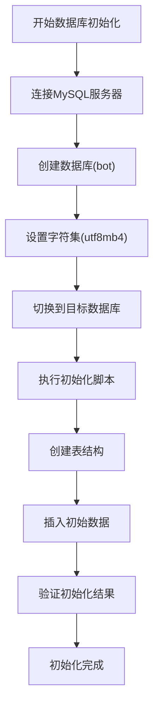
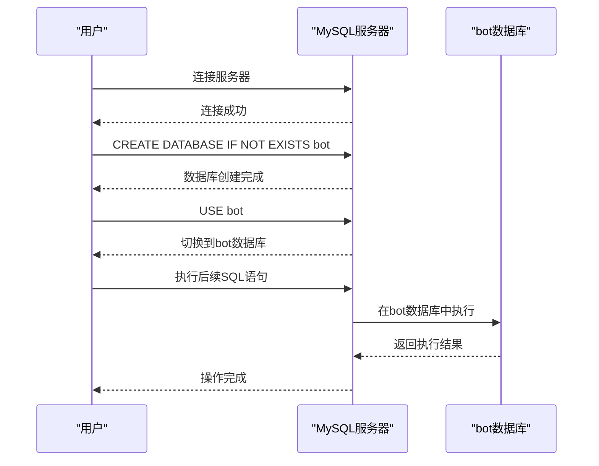
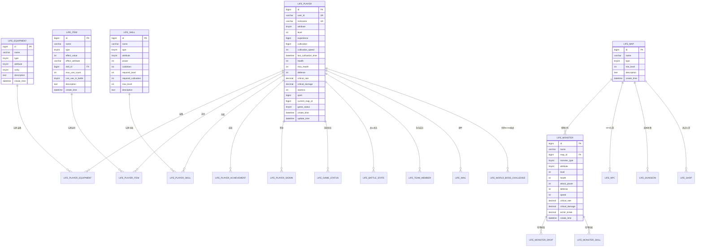

# 数据库初始化

<cite>
**本文档引用的文件**
- [Life_Database_Init.sql](file://Life_Database_Init.sql)
- [Life_Deployment_Guide.md](file://Life_Deployment_Guide.md)
- [application.properties](file://Boot/src/main/resources/application.properties)
- [application-dev.properties](file://Boot/src/main/resources/application-dev.properties)
</cite>

## 目录
1. [简介](#简介)
2. [数据库初始化概述](#数据库初始化概述)
3. [MySQL连接配置](#mysql连接配置)
4. [数据库创建与字符集设置](#数据库创建与字符集设置)
5. [SQL脚本执行流程](#sql脚本执行流程)
6. [表结构分析](#表结构分析)
7. [初始化脚本详解](#初始化脚本详解)
8. [自动化部署脚本](#自动化部署脚本)
9. [故障排除指南](#故障排除指南)
10. [最佳实践建议](#最佳实践建议)

## 简介

本文档详细说明了浮生卷模块的数据库初始化流程，基于Life_Database_Init.sql脚本的完整执行过程。该脚本负责创建所有必要的数据库表结构并插入初始数据，为游戏系统的正常运行奠定基础。

## 数据库初始化概述

浮生卷模块采用MySQL作为主要数据库，通过专门的初始化脚本建立完整的数据模型。整个初始化过程包含以下关键步骤：

- **数据库创建**：创建专用数据库实例
- **表结构定义**：定义22个核心业务表
- **数据初始化**：插入基础配置和初始数据
- **索引优化**：建立必要的索引提高查询性能



**图表来源**
- [Life_Deployment_Guide.md](file://Life_Deployment_Guide.md#L12-L26)

## MySQL连接配置

### 基本连接语法

数据库初始化的第一步是建立与MySQL服务器的连接：

```sql
-- 使用root用户连接MySQL
mysql -u root -p
```

### 生产环境连接配置

对于生产环境，推荐使用专用数据库用户：

```sql
-- 创建专用数据库用户
CREATE USER 'bot_user'@'%' IDENTIFIED BY 'secure_password';
GRANT ALL PRIVILEGES ON bot.* TO 'bot_user'@'%';
FLUSH PRIVILEGES;
```

### 连接参数说明

| 参数 | 说明 | 示例值 |
|------|------|--------|
| 用户名 | 数据库访问用户名 | root |
| 密码 | 数据库访问密码 | your_password |
| 主机地址 | MySQL服务器地址 | localhost |
| 端口 | MySQL服务端口 | 3306 |

**章节来源**
- [Life_Deployment_Guide.md](file://Life_Deployment_Guide.md#L17-L19)

## 数据库创建与字符集设置

### CREATE DATABASE IF NOT EXISTS语句

这是数据库初始化的核心语句，具有以下重要特性：

```sql
CREATE DATABASE IF NOT EXISTS bot DEFAULT CHARSET utf8mb4;
```

#### 语句解析

- **IF NOT EXISTS**：防止重复创建导致错误
- **DEFAULT CHARSET utf8mb4**：设置数据库默认字符集
- **bot**：指定数据库名称

#### 字符集选择的重要性

**utf8mb4字符集的优势**：
- 支持完整的Unicode字符集
- 包含表情符号(Emoji)支持
- 兼容国际化的文本内容
- 避免中文乱码问题

#### 字符集配置对比

| 字符集 | 存储空间 | 支持字符范围 | 适用场景 |
|--------|----------|--------------|----------|
| latin1 | 1字节 | ASCII字符 | 英文网站 |
| utf8 | 3字节 | 基本多语言 | 简单国际化 |
| utf8mb4 | 4字节 | 完整Unicode | 现代Web应用 |

### USE语句的作用

```sql
USE bot;
```

**USE语句的必要性**：
1. **上下文切换**：明确指定操作的目标数据库
2. **避免歧义**：防止在多个数据库间误操作
3. **性能优化**：减少数据库查找开销
4. **权限管理**：确保用户只能访问授权的数据库



**图表来源**
- [Life_Deployment_Guide.md](file://Life_Deployment_Guide.md#L20-L22)

**章节来源**
- [Life_Deployment_Guide.md](file://Life_Deployment_Guide.md#L20-L22)

## SQL脚本执行流程

### source命令执行

```sql
source Life_Database_Init.sql;
```

#### source命令特点

- **批处理执行**：一次性执行整个脚本文件
- **错误处理**：遇到错误时停止执行
- **进度跟踪**：显示执行进度信息
- **资源管理**：自动管理数据库连接

#### 执行前准备

```sql
-- 检查MySQL版本兼容性
SELECT VERSION();

-- 检查字符集设置
SHOW VARIABLES LIKE 'character_set_database';
SHOW VARIABLES LIKE 'collation_database';
```

#### 执行监控

```sql
-- 监控执行状态
SHOW PROCESSLIST;

-- 检查执行时间
SET @start_time = NOW();
-- 执行脚本
SELECT TIMEDIFF(NOW(), @start_time) AS execution_time;
```

### 批量执行替代方案

对于自动化部署，可以使用命令行批量执行：

```bash
# Linux/MacOS
mysql -u root -p bot < Life_Database_Init.sql

# Windows
mysql -u root -p bot < Life_Database_Init.sql
```

**章节来源**
- [Life_Deployment_Guide.md](file://Life_Deployment_Guide.md#L24)

## 表结构分析

### 核心业务表架构

浮生卷模块包含22个核心业务表，按功能分为以下几个类别：



**图表来源**
- [Life_Database_Init.sql](file://Life_Database_Init.sql#L6-L48)
- [Life_Database_Init.sql](file://Life_Database_Init.sql#L51-L74)
- [Life_Database_Init.sql](file://Life_Database_Init.sql#L89-L115)
- [Life_Database_Init.sql](file://Life_Database_Init.sql#L117-L138)
- [Life_Database_Init.sql](file://Life_Database_Init.sql#L140-L176)
- [Life_Database_Init.sql](file://Life_Database_Init.sql#L187-L201)

### 表创建顺序与依赖关系

#### 第一阶段：基础数据表

1. **玩家角色表 (life_player)** - 核心实体表
2. **装备基础表 (life_equipment)** - 装备系统基础
3. **技能基础表 (life_skill)** - 技能系统基础
4. **地图表 (life_map)** - 地图系统基础
5. **怪物表 (life_monster)** - 怪物系统基础
6. **道具表 (life_item)** - 道具系统基础

#### 第二阶段：关联关系表

7. **玩家装备表 (life_player_equipment)** - 玩家与装备关联
8. **玩家道具表 (life_player_item)** - 玩家与道具关联
9. **玩家技能表 (life_player_skill)** - 玩家与技能关联
10. **怪物掉落配置表 (life_monster_drop)** - 怪物掉落规则
11. **怪物技能表 (life_monster_skill)** - 怪物技能关联

#### 第三阶段：高级功能表

12. **成就表 (life_achievement)** - 成就系统
13. **好友表 (life_friend)** - 好友系统
14. **邮件表 (life_mail)** - 邮件系统
15. **世界BOSS表 (life_world_boss)** - BOSS系统
16. **副本表 (life_dungeon)** - 副本系统
17. **商店表 (life_shop)** - 商店系统
18. **队伍表 (life_team)** - 组队系统
19. **签到记录表 (life_player_signin)** - 签到系统
20. **战斗状态表 (life_battle_state)** - 战斗状态
21. **境界配置表 (life_realm_config)** - 境界系统
22. **系统配置表 (life_system_config)** - 系统配置

### 索引设计原则

#### 主键索引
- 所有表都定义了自增主键
- 提供唯一标识符保证数据完整性

#### 外键索引
- 在关联字段上建立索引
- 支持高效的关联查询
- 维护数据一致性

#### 唯一约束
- 用户ID唯一性 (user_id)
- 角色昵称唯一性 (nickname)
- 玩家技能组合唯一性 (player_id, skill_id)

**章节来源**
- [Life_Database_Init.sql](file://Life_Database_Init.sql#L1-L646)

## 初始化脚本详解

### 数据库结构定义

#### 玩家角色表 (life_player)

玩家角色表是整个游戏系统的核心实体，包含修仙者的所有基本信息：

```sql
CREATE TABLE IF NOT EXISTS `life_player` (
    `id` bigint NOT NULL AUTO_INCREMENT,
    `user_id` varchar(50) NOT NULL COMMENT '用户ID',
    `nickname` varchar(21) NOT NULL COMMENT '角色昵称',
    `attribute` tinyint NOT NULL COMMENT '角色属性',
    `level` int DEFAULT 1 COMMENT '等级',
    `experience` bigint DEFAULT 0 COMMENT '经验值',
    `cultivation` bigint DEFAULT 0 COMMENT '修为',
    `cultivation_speed` int DEFAULT 10 COMMENT '修炼速度',
    `last_cultivation_time` datetime DEFAULT CURRENT_TIMESTAMP COMMENT '最后修炼时间',
    -- ... 更多字段
    PRIMARY KEY (`id`),
    UNIQUE KEY `uk_user_id` (`user_id`),
    UNIQUE KEY `uk_nickname` (`nickname`)
) ENGINE=InnoDB DEFAULT CHARSET=utf8mb4 COMMENT='玩家角色表';
```

#### 关键字段说明

| 字段名 | 类型 | 说明 | 默认值 |
|--------|------|------|--------|
| user_id | varchar(50) | 用户唯一标识 | 必填 |
| nickname | varchar(21) | 角色昵称 | 必填 |
| attribute | tinyint | 五行属性(1-5) | 必填 |
| level | int | 当前等级 | 1 |
| experience | bigint | 当前经验 | 0 |
| cultivation | bigint | 修为值 | 0 |
| spirit | bigint | 灵粹数量 | 1000 |

### 初始数据插入

#### 地图数据初始化

```sql
INSERT INTO `life_map` (`id`, `name`, `type`, `min_level`, `description`) VALUES
(1, '新手村', 1, 1, '修仙者的起始之地'),
(2, '青云山', 1, 10, '灵气充沛的修炼圣地'),
(3, '幽冥谷', 1, 20, '阴气森森的危险之地');
```

#### 怪物数据初始化

```sql
INSERT INTO `life_monster` (`id`, `name`, `map_id`, `monster_type`, `attribute`, `level`, `health`, `attack_power`, `defense`, `speed`) VALUES
(1, '野狼', 1, 1, 0, 1, 50, 15, 5, 8),
(2, '山贼', 1, 1, 0, 2, 80, 20, 8, 10);
```

#### 技能数据初始化

```sql
INSERT INTO `life_skill` (`id`, `name`, `type`, `attribute`, `power`, `cooldown`, `required_level`, `max_level`, `description`) VALUES
(1, '金元斩', 1, 1, 120, 3, 1, 10, '金属性基础攻击技能'),
(2, '木灵术', 1, 2, 110, 3, 1, 10, '木属性基础攻击技能');
```

### 系统配置数据

#### 核心算法配置

```sql
INSERT INTO `life_system_config` (`config_key`, `config_value`, `description`) VALUES
('speed_armor_break_rate', '0.005', '每点速度增加的破防率'),
('constitution_health_rate', '10', '每点体质增加的血量'),
('spirit_critical_rate', '0.01', '每点灵力增加的会心率'),
('strength_attack_rate', '6', '每点力量增加的攻击力');
```

#### 配置项分类

| 配置类别 | 配置项 | 默认值 | 作用 |
|----------|--------|--------|------|
| 属性计算 | speed_armor_break_rate | 0.005 | 速度对破防的影响 |
| 属性计算 | constitution_health_rate | 10 | 体质对血量的影响 |
| 战斗系统 | spirit_critical_rate | 0.01 | 灵力对会心率的影响 |
| 战斗系统 | strength_attack_rate | 6 | 力量对攻击力的影响 |
| 游戏机制 | stamina_recover_interval | 5 | 体力恢复间隔(分钟) |

**章节来源**
- [Life_Database_Init.sql](file://Life_Database_Init.sql#L393-L646)

## 自动化部署脚本

### Shell脚本示例

#### Linux/MacOS脚本

```bash
#!/bin/bash
# 浮生卷数据库初始化脚本

set -e

echo "开始浮生卷数据库初始化..."

# 配置变量
MYSQL_USER="root"
MYSQL_PASSWORD="your_password"
DATABASE_NAME="bot"
INIT_SCRIPT="Life_Database_Init.sql"

# 检查MySQL客户端
if ! command -v mysql &> /dev/null; then
    echo "错误：未找到MySQL客户端"
    exit 1
fi

# 创建数据库
echo "创建数据库 $DATABASE_NAME..."
mysql -u $MYSQL_USER -p$MYSQL_PASSWORD -e "
CREATE DATABASE IF NOT EXISTS $DATABASE_NAME DEFAULT CHARSET utf8mb4;
USE $DATABASE_NAME;
SOURCE $INIT_SCRIPT;
"

# 验证表创建
echo "验证表创建..."
TABLE_COUNT=$(mysql -u $MYSQL_USER -p$MYSQL_PASSWORD -D $DATABASE_NAME -N -e "
SHOW TABLES LIKE 'life_%';
SELECT COUNT(*) FROM information_schema.tables WHERE table_schema='$DATABASE_NAME' AND table_name LIKE 'life_%';
")

if [ "$TABLE_COUNT" -ge 22 ]; then
    echo "✅ 数据库初始化成功，共创建 $TABLE_COUNT 张表"
else
    echo "❌ 数据库初始化失败，检测到 $TABLE_COUNT 张表"
    exit 1
fi

# 插入初始数据
echo "插入初始数据..."
mysql -u $MYSQL_USER -p$MYSQL_PASSWORD -D $DATABASE_NAME -e "
-- 验证数据插入
SELECT COUNT(*) as player_count FROM life_player;
SELECT COUNT(*) as map_count FROM life_map;
SELECT COUNT(*) as monster_count FROM life_monster;
"

echo "🎉 浮生卷数据库初始化完成！"
```

#### Windows批处理脚本

```batch
@echo off
REM 浮生卷数据库初始化脚本

set MYSQL_USER=root
set MYSQL_PASSWORD=your_password
set DATABASE_NAME=bot
set INIT_SCRIPT=Life_Database_Init.sql

echo 开始浮生卷数据库初始化...

REM 检查MySQL客户端
where mysql >nul 2>nul
if %ERRORLEVEL% neq 0 (
    echo 错误：未找到MySQL客户端
    pause
    exit /b 1
)

REM 创建数据库并执行初始化脚本
echo 创建数据库 %DATABASE_NAME%...
mysql -u %MYSQL_USER% -p%MYSQL_PASSWORD% -e ^
"CREATE DATABASE IF NOT EXISTS %DATABASE_NAME% DEFAULT CHARSET utf8mb4;^
USE %DATABASE_NAME%;^
SOURCE %INIT_SCRIPT%;"

REM 验证表创建
echo 验证表创建...
FOR /F "tokens=*" %%i IN ('mysql -u %MYSQL_USER% -p%MYSQL_PASSWORD% -D %DATABASE_NAME% -N -e "SHOW TABLES LIKE 'life_%'; SELECT COUNT(*) FROM information_schema.tables WHERE table_schema='%DATABASE_NAME%' AND table_name LIKE 'life_%';"') DO (
    set RESULT=%%i
)

echo 结果：%RESULT%

if %RESULT% geq 22 (
    echo ✅ 数据库初始化成功
) else (
    echo ❌ 数据库初始化失败
    pause
    exit /b 1
)

echo 🎉 浮生卷数据库初始化完成！
pause
```

### Python自动化脚本

```python
#!/usr/bin/env python3
# -*- coding: utf-8 -*-
"""
浮生卷数据库初始化自动化脚本
"""

import subprocess
import sys
import os
import time
from typing import Dict, List, Optional

class DatabaseInitializer:
    def __init__(self):
        self.config = {
            'mysql_user': 'root',
            'mysql_password': 'your_password',
            'database_name': 'bot',
            'init_script': 'Life_Database_Init.sql',
            'expected_tables': 22
        }
        
    def check_mysql_client(self) -> bool:
        """检查MySQL客户端是否可用"""
        try:
            subprocess.run(['mysql', '--version'], 
                          capture_output=True, 
                          timeout=5)
            return True
        except (subprocess.TimeoutExpired, FileNotFoundError):
            print("错误：未找到MySQL客户端")
            return False
            
    def create_database(self) -> bool:
        """创建数据库"""
        try:
            cmd = [
                'mysql', '-u', self.config['mysql_user'],
                f'-p{self.config["mysql_password"]}',
                '-e',
                f'CREATE DATABASE IF NOT EXISTS {self.config["database_name"]} DEFAULT CHARSET utf8mb4;'
            ]
            
            result = subprocess.run(cmd, capture_output=True, text=True, timeout=30)
            
            if result.returncode == 0:
                print(f"✅ 数据库 {self.config['database_name']} 创建成功")
                return True
            else:
                print(f"❌ 数据库创建失败: {result.stderr}")
                return False
                
        except subprocess.TimeoutExpired:
            print("❌ 数据库创建超时")
            return False
            
    def execute_init_script(self) -> bool:
        """执行初始化脚本"""
        try:
            # 切换到脚本所在目录
            script_dir = os.path.dirname(os.path.abspath(__file__))
            init_script_path = os.path.join(script_dir, self.config['init_script'])
            
            if not os.path.exists(init_script_path):
                print(f"❌ 初始化脚本不存在: {init_script_path}")
                return False
                
            cmd = [
                'mysql', '-u', self.config['mysql_user'],
                f'-p{self.config["mysql_password"]}',
                self.config['database_name'],
                '<', init_script_path
            ]
            
            result = subprocess.run(' '.join(cmd), shell=True, 
                                  capture_output=True, text=True, timeout=120)
            
            if result.returncode == 0:
                print("✅ 初始化脚本执行成功")
                return True
            else:
                print(f"❌ 初始化脚本执行失败: {result.stderr}")
                return False
                
        except subprocess.TimeoutExpired:
            print("❌ 初始化脚本执行超时")
            return False
            
    def verify_tables(self) -> int:
        """验证表创建数量"""
        try:
            cmd = [
                'mysql', '-u', self.config['mysql_user'],
                f'-p{self.config["mysql_password"]}',
                '-D', self.config['database_name'],
                '-N', '-e',
                "SELECT COUNT(*) FROM information_schema.tables WHERE table_schema='{}' AND table_name LIKE 'life_%';".format(
                    self.config['database_name']
                )
            ]
            
            result = subprocess.run(cmd, capture_output=True, text=True, timeout=10)
            
            if result.returncode == 0:
                count = int(result.stdout.strip())
                print(f"✅ 检测到 {count} 张life_*表")
                return count
            else:
                print(f"❌ 表验证失败: {result.stderr}")
                return 0
                
        except subprocess.TimeoutExpired:
            print("❌ 表验证超时")
            return 0
            
    def run(self) -> bool:
        """运行完整初始化流程"""
        print("=" * 50)
        print("浮生卷数据库初始化程序")
        print("=" * 50)
        
        # 步骤1: 检查MySQL客户端
        print("\n1. 检查MySQL客户端...")
        if not self.check_mysql_client():
            return False
            
        # 步骤2: 创建数据库
        print("\n2. 创建数据库...")
        if not self.create_database():
            return False
            
        # 步骤3: 执行初始化脚本
        print("\n3. 执行初始化脚本...")
        if not self.execute_init_script():
            return False
            
        # 步骤4: 验证表创建
        print("\n4. 验证表创建...")
        table_count = self.verify_tables()
        
        if table_count >= self.config['expected_tables']:
            print(f"\n🎉 数据库初始化完成！共创建 {table_count} 张表")
            return True
        else:
            print(f"\n❌ 数据库初始化失败，期望至少 {self.config['expected_tables']} 张表，实际创建 {table_count} 张")
            return False

if __name__ == "__main__":
    initializer = DatabaseInitializer()
    success = initializer.run()
    sys.exit(0 if success else 1)
```

### Docker部署脚本

```dockerfile
# Dockerfile for automated database initialization
FROM mysql:8.0

# 设置环境变量
ENV MYSQL_ROOT_PASSWORD=your_root_password
ENV MYSQL_DATABASE=bot
ENV MYSQL_USER=bot_user
ENV MYSQL_PASSWORD=bot_password

# 复制初始化脚本
COPY Life_Database_Init.sql /docker-entrypoint-initdb.d/

# 设置字符集
RUN echo "[mysqld]" >> /etc/mysql/conf.d/custom.cnf && \
    echo "character-set-server=utf8mb4" >> /etc/mysql/conf.d/custom.cnf && \
    echo "collation-server=utf8mb4_unicode_ci" >> /etc/mysql/conf.d/custom.cnf

EXPOSE 3306
```

```yaml
# docker-compose.yml
version: '3.8'

services:
  mysql:
    image: mysql:8.0
    container_name: bot_mysql
    environment:
      MYSQL_ROOT_PASSWORD: your_root_password
      MYSQL_DATABASE: bot
      MYSQL_USER: bot_user
      MYSQL_PASSWORD: bot_password
    ports:
      - "3306:3306"
    volumes:
      - ./data:/var/lib/mysql
      - ./Life_Database_Init.sql:/docker-entrypoint-initdb.d/Life_Database_Init.sql
    command: --default-authentication-plugin=mysql_native_password
    restart: unless-stopped
    healthcheck:
      test: ["CMD", "mysqladmin", "ping", "-h", "localhost"]
      interval: 30s
      timeout: 10s
      retries: 3
```

**章节来源**
- [Life_Deployment_Guide.md](file://Life_Deployment_Guide.md#L12-L26)

## 故障排除指南

### 常见问题及解决方案

#### 1. MySQL连接问题

**问题症状**：
```
ERROR 2003 (HY000): Can't connect to MySQL server on 'localhost' (10061)
```

**解决方案**：
```bash
# 检查MySQL服务状态
sudo systemctl status mysql
# 启动MySQL服务
sudo systemctl start mysql
# 检查端口占用
netstat -tlnp | grep 3306
```

#### 2. 字符集编码问题

**问题症状**：
```
ERROR 1300 (HY000): Invalid utf8 character string
```

**解决方案**：
```sql
-- 检查当前字符集设置
SHOW VARIABLES LIKE 'character_set%';
SHOW VARIABLES LIKE 'collation%';

-- 修改数据库字符集
ALTER DATABASE bot CHARACTER SET = utf8mb4 COLLATE = utf8mb4_unicode_ci;
```

#### 3. 权限不足问题

**问题症状**：
```
ERROR 1044 (42000): Access denied for user
```

**解决方案**：
```sql
-- 授予数据库权限
GRANT ALL PRIVILEGES ON bot.* TO 'username'@'%' IDENTIFIED BY 'password';
FLUSH PRIVILEGES;

-- 检查权限
SHOW GRANTS FOR 'username'@'%';
```

#### 4. 脚本执行中断

**问题症状**：
```
ERROR 1050 (42S01): Table already exists
```

**解决方案**：
```sql
-- 检查表是否存在
SHOW TABLES LIKE 'life_%';

-- 删除现有表（谨慎操作）
DROP TABLE IF EXISTS life_player;
-- 重新执行脚本
```

### 调试工具和技巧

#### 日志分析

```sql
-- 启用慢查询日志
SET GLOBAL slow_query_log = 'ON';
SET GLOBAL long_query_time = 1;

-- 查看错误日志
SHOW VARIABLES LIKE 'log_error';
```

#### 性能监控

```sql
-- 监控表大小
SELECT 
    table_name,
    ROUND(((data_length + index_length) / 1024 / 1024), 2) AS 'Size in MB'
FROM information_schema.TABLES 
WHERE table_schema = 'bot'
ORDER BY (data_length + index_length) DESC;

-- 监控索引使用
SELECT 
    table_name, 
    index_name, 
    last_used
FROM performance_schema.table_io_waits_summary_by_index_usage 
WHERE object_schema = 'bot';
```

#### 数据完整性检查

```sql
-- 检查外键约束
SELECT 
    CONSTRAINT_NAME, 
    TABLE_NAME, 
    REFERENCED_TABLE_NAME
FROM INFORMATION_SCHEMA.KEY_COLUMN_USAGE 
WHERE CONSTRAINT_SCHEMA = 'bot' 
AND REFERENCED_TABLE_NAME IS NOT NULL;

-- 检查数据一致性
SELECT 
    COUNT(*) as total_records,
    SUM(CASE WHEN user_id IS NULL THEN 1 ELSE 0 END) as null_user_id,
    SUM(CASE WHEN nickname IS NULL THEN 1 ELSE 0 END) as null_nickname
FROM life_player;
```

**章节来源**
- [Life_Deployment_Guide.md](file://Life_Deployment_Guide.md#L129-L143)

## 最佳实践建议

### 数据库设计原则

#### 1. 字符集统一

```sql
-- 在所有表中强制使用utf8mb4
ALTER TABLE life_player CONVERT TO CHARACTER SET utf8mb4 COLLATE utf8mb4_unicode_ci;
```

#### 2. 索引优化

```sql
-- 为频繁查询的字段添加索引
CREATE INDEX idx_player_user_id ON life_player(user_id);
CREATE INDEX idx_player_nickname ON life_player(nickname);

-- 为关联查询添加复合索引
CREATE INDEX idx_player_item_player_id ON life_player_item(player_id);
CREATE INDEX idx_player_skill_player_id ON life_player_skill(player_id);
```

#### 3. 数据类型选择

```sql
-- 使用更精确的数据类型
ALTER TABLE life_player MODIFY COLUMN experience BIGINT UNSIGNED;
ALTER TABLE life_player MODIFY COLUMN cultivation BIGINT UNSIGNED;
ALTER TABLE life_player MODIFY COLUMN spirit BIGINT UNSIGNED;
```

### 性能优化建议

#### 1. 查询优化

```sql
-- 使用EXPLAIN分析查询计划
EXPLAIN SELECT * FROM life_player 
WHERE user_id = 'test_user' 
AND game_status = 0;

-- 避免全表扫描
CREATE INDEX idx_player_status ON life_player(game_status);
```

#### 2. 分区策略

```sql
-- 对大型表进行分区
ALTER TABLE life_player 
PARTITION BY RANGE (YEAR(create_time)) (
    PARTITION p2024 VALUES LESS THAN (2025),
    PARTITION p2025 VALUES LESS THAN (2026),
    PARTITION p_future VALUES LESS THAN MAXVALUE
);
```

#### 3. 缓存策略

```sql
-- 配置查询缓存
SET GLOBAL query_cache_size = 64 * 1024 * 1024;
SET GLOBAL query_cache_type = 1;
```

### 安全加固措施

#### 1. 访问控制

```sql
-- 创建只读用户
CREATE USER 'bot_reader'@'%' IDENTIFIED BY 'reader_password';
GRANT SELECT ON bot.* TO 'bot_reader'@'%';

-- 创建受限用户
CREATE USER 'bot_app'@'%' IDENTIFIED BY 'app_password';
GRANT SELECT, INSERT, UPDATE ON bot.life_player TO 'bot_app'@'%';
REVOKE DELETE ON bot.* FROM 'bot_app'@'%';
```

#### 2. 数据加密

```sql
-- 启用传输加密
SET GLOBAL ssl_ca = '/path/to/ca-cert.pem';
SET GLOBAL ssl_cert = '/path/to/server-cert.pem';
SET GLOBAL ssl_key = '/path/to/server-key.pem';
```

#### 3. 审计日志

```sql
-- 启用审计日志
SET GLOBAL audit_log_policy = 'ALL';
SET GLOBAL audit_log_format = 'JSON';
```

### 备份和恢复策略

#### 1. 定期备份

```bash
#!/bin/bash
# 数据库备份脚本

BACKUP_DIR="/backup/mysql"
DATE=$(date +%Y%m%d_%H%M%S)
DB_NAME="bot"

mkdir -p $BACKUP_DIR

# 全量备份
mysqldump -u root -p$MYSQL_PASSWORD \
    --single-transaction \
    --routines \
    --triggers \
    --databases $DB_NAME \
    > $BACKUP_DIR/$DB_NAME-full-$DATE.sql

# 压缩备份文件
gzip $BACKUP_DIR/$DB_NAME-full-$DATE.sql

echo "备份完成: $BACKUP_DIR/$DB_NAME-full-$DATE.sql.gz"
```

#### 2. 增量备份

```bash
# 增量备份配置
SET GLOBAL binlog_format = 'ROW';
SET GLOBAL log_bin = 'mysql-bin';
SET GLOBAL expire_logs_days = 7;
```

#### 3. 恢复测试

```bash
# 恢复测试脚本
TEST_DB="bot_test"
RESTORE_FILE="$BACKUP_DIR/$DB_NAME-full-latest.sql.gz"

# 创建测试数据库
mysql -u root -p$MYSQL_PASSWORD -e "CREATE DATABASE IF NOT EXISTS $TEST_DB;"

# 恢复数据
gunzip -c $RESTORE_FILE | mysql -u root -p$MYSQL_PASSWORD $TEST_DB

# 验证数据完整性
mysql -u root -p$MYSQL_PASSWORD -D $TEST_DB -e "
SELECT '验证表结构' as test, COUNT(*) as count FROM information_schema.tables WHERE table_schema='$TEST_DB';
SELECT '验证关键数据' as test, COUNT(*) as count FROM life_player WHERE level > 1;
"
```

### 监控和维护

#### 1. 性能监控

```sql
-- 监控慢查询
SELECT 
    query_time,
    lock_time,
    rows_sent,
    rows_examined,
    sql_text
FROM performance_schema.events_statements_summary_by_digest 
WHERE query_time > 1000000  -- 超过1秒的查询
ORDER BY query_time DESC;
```

#### 2. 空间管理

```sql
-- 监控表空间使用
SELECT 
    table_schema,
    table_name,
    ROUND((data_length + index_length) / 1024 / 1024, 2) as size_mb
FROM information_schema.tables 
WHERE table_schema = 'bot'
ORDER BY size_mb DESC;
```

#### 3. 定期维护

```sql
-- 优化表
OPTIMIZE TABLE life_player;
OPTIMIZE TABLE life_game_status;

-- 清理历史数据
DELETE FROM life_temp_files WHERE expire_time < NOW();
```

通过遵循这些最佳实践，可以确保浮生卷模块的数据库系统稳定、高效、安全地运行，为游戏用户提供优质的修仙体验。