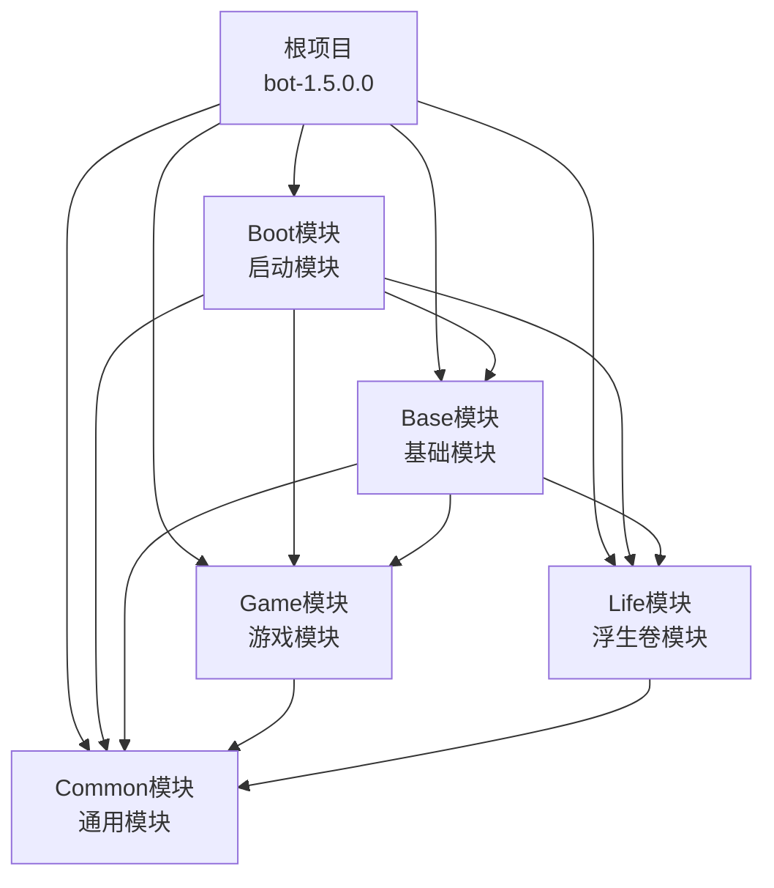
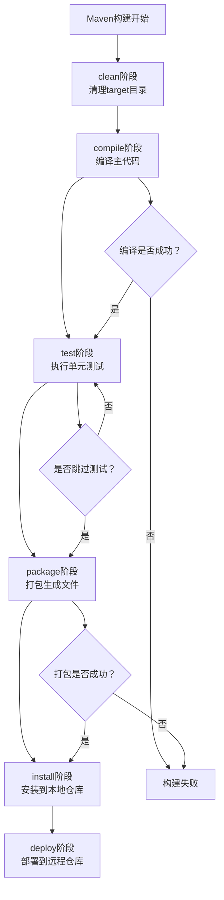
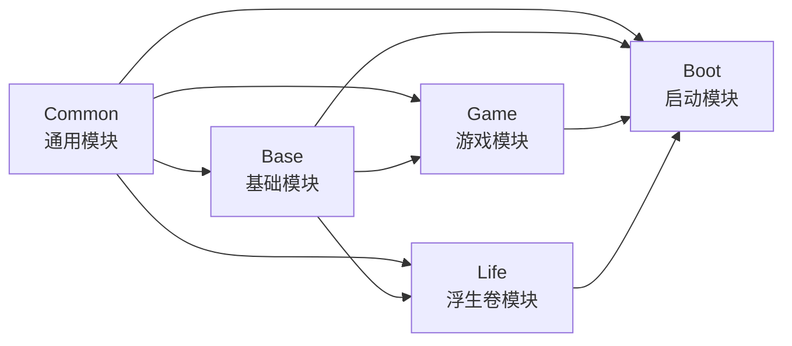

# 编译构建

<cite>
**本文档引用的文件**
- [pom.xml](file://pom.xml)
- [Life_Deployment_Guide.md](file://Life_Deployment_Guide.md)
- [Boot/pom.xml](file://Boot/pom.xml)
- [Base/pom.xml](file://Base/pom.xml)
- [Common/pom.xml](file://Common/pom.xml)
- [Game/pom.xml](file://Game/pom.xml)
- [Life/pom.xml](file://Life/pom.xml)
- [mvnw.cmd](file://mvnw.cmd)
- [Boot/src/main/resources/application.properties](file://Boot/src/main/resources/application.properties)
- [Boot/src/main/resources/application-dev.properties](file://Boot/src/main/resources/application-dev.properties)
- [Life_Compilation_Fix_Summary.md](file://Life_Compilation_Fix_Summary.md)
- [Life_Compile_Error_Fix.md](file://Life_Compile_Error_Fix.md)
</cite>

## 目录
1. [概述](#概述)
2. [项目结构与Maven配置](#项目结构与maven配置)
3. [Maven编译命令详解](#maven编译命令详解)
4. [构建目标分析](#构建目标分析)
5. [多模块项目构建](#多模块项目构建)
6. [持续集成构建脚本](#持续集成构建脚本)
7. [常见构建问题与解决方案](#常见构建问题与解决方案)
8. [性能优化建议](#性能优化建议)
9. [最佳实践](#最佳实践)

## 概述

本项目是一个基于Spring Boot的多模块Maven项目，采用标准的Maven构建生命周期。项目包含五个主要模块：Boot（启动模块）、Base（基础模块）、Common（通用模块）、Game（游戏模块）和Life（浮生卷模块）。本文档详细说明了Maven编译构建过程，包括不同构建命令的区别、适用场景以及最佳实践。

## 项目结构与Maven配置

### 多模块项目架构



**图表来源**
- [pom.xml](file://pom.xml#L6-L11)
- [Boot/pom.xml](file://Boot/pom.xml#L15-L33)
- [Base/pom.xml](file://Base/pom.xml#L20-L33)

### 核心配置文件

项目采用分层的配置管理策略：

| 配置文件 | 用途 | 作用范围 |
|---------|------|----------|
| `pom.xml` | 根项目配置 | 定义模块结构、全局属性、依赖管理 |
| `application.properties` | 基础配置 | 开发环境默认配置 |
| `application-dev.properties` | 开发环境配置 | 开发服务器专用配置 |
| `application-prod.properties` | 生产环境配置 | 生产服务器专用配置 |

**节来源**
- [pom.xml](file://pom.xml#L25-L35)
- [Boot/pom.xml](file://Boot/pom.xml#L37-L54)
- [Boot/src/main/resources/application.properties](file://Boot/src/main/resources/application.properties#L1-L70)

## Maven编译命令详解

### 基本编译命令对比

根据部署指南，项目提供了两种主要的Maven编译命令：

#### 1. mvn clean compile

```bash
# 在项目根目录执行
mvn clean compile
```

**功能说明：**
- **clean目标**：清理target目录，删除之前构建产生的所有文件
- **compile目标**：编译主代码源文件到target/classes目录
- **适用场景**：
  - 开发阶段快速验证代码编译
  - 检查语法错误和编译警告
  - 不需要生成可执行文件的场景

#### 2. mvn clean package -DskipTests

```bash
# 在项目根目录执行
mvn clean package -DskipTests
```

**功能说明：**
- **clean目标**：清理target目录
- **package目标**：将编译结果打包成JAR/WAR文件
- **-DskipTests参数**：跳过单元测试执行，加快构建速度
- **适用场景**：
  - 生产环境部署准备
  - 需要生成可执行文件的场景
  - CI/CD流水线中的构建阶段

### 命令差异对比

| 特性 | mvn clean compile | mvn clean package -DskipTests |
|------|-------------------|-------------------------------|
| **构建内容** | 仅编译主代码 | 编译并打包 |
| **测试执行** | 执行所有测试 | 跳过测试 |
| **输出目录** | target/classes | target/ |
| **文件类型** | .class文件 | .jar/.war文件 |
| **构建时间** | 较短 | 较长（包含打包） |
| **适用场景** | 开发调试 | 部署准备 |

**节来源**
- [Life_Deployment_Guide.md](file://Life_Deployment_Guide.md#L48-L55)

## 构建目标分析

### 生命周期阶段详解



### 各阶段详细说明

#### 1. clean阶段
- **作用**：删除target目录及其所有内容
- **清理范围**：
  - `target/` 目录下的所有文件
  - 编译生成的.class文件
  - 打包生成的.jar/.war文件
  - 测试报告和日志文件

#### 2. compile阶段
- **作用**：编译主代码源文件
- **编译范围**：
  - `src/main/java/` 目录下的Java源文件
  - `src/main/resources/` 目录下的资源文件
  - 复制到 `target/classes/` 目录

#### 3. package阶段
- **作用**：将编译结果打包
- **打包类型**：
  - JAR：适用于独立应用程序
  - WAR：适用于Web应用程序
  - POM：适用于父项目
- **输出位置**：`target/` 目录下

**节来源**
- [Boot/pom.xml](file://Boot/pom.xml#L38-L54)

## 多模块项目构建

### 模块依赖关系



**图表来源**
- [Base/pom.xml](file://Base/pom.xml#L20-L33)
- [Boot/pom.xml](file://Boot/pom.xml#L15-L33)
- [Game/pom.xml](file://Game/pom.xml#L15-L19)
- [Life/pom.xml](file://Life/pom.xml#L15-L19)

### 模块构建策略

#### 1. 全局构建
```bash
# 在项目根目录执行
mvn clean install
```

**特点**：
- 按依赖顺序依次构建所有模块
- 自动处理模块间的依赖关系
- 将构建结果安装到本地Maven仓库

#### 2. 单模块构建
```bash
# 构建特定模块
mvn clean install -pl Boot
```

**参数说明**：
- `-pl`：指定要构建的模块（project list）
- 支持逗号分隔的多个模块
- 可以结合`-am`（also make）自动构建依赖模块

#### 3. 排除模块构建
```bash
# 构建除特定模块外的所有模块
mvn clean install -pl !Common
```

### 构建顺序规则

Maven遵循以下构建顺序规则：

1. **依赖优先**：先构建被依赖的模块
2. **拓扑排序**：按照依赖关系进行拓扑排序
3. **并行构建**：相同层级的模块可以并行构建

**节来源**
- [pom.xml](file://pom.xml#L6-L11)

## 持续集成构建脚本

### Jenkins Pipeline示例

```groovy
pipeline {
    agent any
    
    stages {
        stage('Checkout') {
            steps {
                git 'https://github.com/your-repo/bot.git'
            }
        }
        
        stage('Environment Setup') {
            steps {
                sh 'export JAVA_HOME=/usr/lib/jvm/java-8-openjdk'
                sh 'export PATH=$JAVA_HOME/bin:$PATH'
                sh 'mvn -v'
            }
        }
        
        stage('Dependency Check') {
            steps {
                sh 'mvn dependency:resolve'
                sh 'mvn dependency:tree'
            }
        }
        
        stage('Compile') {
            steps {
                sh 'mvn clean compile'
            }
            post {
                always {
                    archiveArtifacts artifacts: '**/target/classes/**/*', fingerprint: true
                }
            }
        }
        
        stage('Package') {
            steps {
                sh 'mvn clean package -DskipTests'
            }
            post {
                always {
                    archiveArtifacts artifacts: '**/target/*.jar', fingerprint: true
                    publishHTML([
                        allowMissing: false,
                        alwaysLinkToLastBuild: true,
                        keepAll: true,
                        reportDir: 'target/site',
                        reportFiles: 'index.html',
                        reportName: 'Maven Site'
                    ])
                }
            }
        }
        
        stage('Integration Tests') {
            steps {
                sh 'mvn test -DskipITs=false'
            }
            post {
                always {
                    junit '**/target/surefire-reports/*.xml'
                }
            }
        }
    }
    
    post {
        always {
            cleanWs()
        }
        failure {
            emailext (
                subject: "构建失败: ${env.JOB_NAME} - ${env.BUILD_NUMBER}",
                body: "请查看构建日志: ${env.BUILD_URL}",
                to: "${env.CHANGE_AUTHOR_EMAIL}"
            )
        }
    }
}
```

### GitHub Actions Workflow

```yaml
name: Maven Build

on:
  push:
    branches: [ main, develop ]
  pull_request:
    branches: [ main ]

jobs:
  build:
    runs-on: ubuntu-latest
    
    steps:
    - uses: actions/checkout@v2
    
    - name: Set up JDK 8
      uses: actions/setup-java@v2
      with:
        java-version: '8'
        distribution: 'temurin'
        cache: maven
        
    - name: Cache Maven packages
      uses: actions/cache@v2
      with:
        path: ~/.m2
        key: ${{ runner.os }}-m2-${{ hashFiles('**/pom.xml') }}
        restore-keys: ${{ runner.os }}-m2
        
    - name: Build with Maven
      run: |
        mvn clean package -DskipTests \
          -B \
          -V \
          --file pom.xml \
          --settings .github/settings.xml
        
    - name: Run Tests
      run: mvn test
        
    - name: Upload Test Results
      uses: actions/upload-artifact@v2
      if: always()
      with:
        name: test-results
        path: target/surefire-reports/*.xml
        
    - name: Upload Build Artifacts
      uses: actions/upload-artifact@v2
      with:
        name: application-jar
        path: Boot/target/Boot-*.jar
```

### Docker构建脚本

```dockerfile
FROM maven:3.8.4-openjdk-8 AS builder

WORKDIR /app

# 复制项目文件
COPY pom.xml .
COPY .mvn .mvn/
COPY Boot/Boot.iml Boot/
COPY Base/Base.iml Base/
COPY Common/Common.iml Common/
COPY Game/Game.iml Game/
COPY Life/Life.iml Life/

# 复制源代码
COPY Boot/src Boot/src/
COPY Base/src Base/src/
COPY Common/src Common/src/
COPY Game/src Game/src/
COPY Life/src Life/src/

# 设置环境变量
ENV MAVEN_OPTS="-Xmx1024m -XX:MaxPermSize=256m"

# 执行构建
RUN mvn clean package -DskipTests

# 生产镜像
FROM openjdk:8-jre-alpine

WORKDIR /app

# 复制构建产物
COPY --from=builder /app/Boot/target/Boot-*.jar /app/app.jar

# 复制配置文件
COPY Boot/src/main/resources/application-prod.properties /app/application.properties

EXPOSE 9091

ENTRYPOINT ["java", "-jar", "/app/app.jar"]
```

## 常见构建问题与解决方案

### Java版本兼容性问题

根据编译修复文档，项目存在Java 8兼容性问题：

#### 问题1：`List.of()` 方法不存在
**错误表现**：Java 8不支持 `List.of()` 方法
**解决方案**：替换为传统集合创建方式

```java
// 错误写法（Java 9+）
List<String> list = List.of("item1", "item2");

// 正确写法（Java 8兼容）
List<String> list = new ArrayList<>();
list.add("item1");
list.add("item2");
```

#### 问题2：`var` 关键字不支持
**错误表现**：Java 8不支持局部变量类型推断
**解决方案**：显式声明变量类型

```java
// 错误写法（Java 10+）
var list = new ArrayList<>();

// 正确写法（Java 8兼容）
List<String> list = new ArrayList<>();
```

#### 问题3：日期API兼容性
**错误表现**：`Date.toLocalDate()` 方法不存在
**解决方案**：使用传统日期处理方式

```java
// 错误写法（Java 8+）
Date date = new Date();
LocalDate localDate = date.toLocalDate();

// 正确写法（Java 8兼容）
Calendar calendar = Calendar.getInstance();
calendar.setTime(date);
calendar.set(Calendar.HOUR_OF_DAY, 0);
calendar.set(Calendar.MINUTE, 0);
calendar.set(Calendar.SECOND, 0);
calendar.set(Calendar.MILLISECOND, 0);
Date midnight = calendar.getTime();
```

### 依赖冲突解决

#### Maven依赖树分析
```bash
# 查看依赖树
mvn dependency:tree

# 分析依赖冲突
mvn dependency:analyze

# 解决依赖冲突
mvn dependency:resolve
```

#### 依赖版本管理
```xml
<!-- 在父POM中统一管理版本 -->
<properties>
    <spring-boot.version>2.3.4.RELEASE</spring-boot.version>
    <hutool.version>5.7.6</hutool.version>
    <mysql.version>8.0.23</mysql.version>
</properties>

<!-- 子模块中引用 -->
<dependency>
    <groupId>org.springframework.boot</groupId>
    <artifactId>spring-boot-starter-web</artifactId>
    <version>${spring-boot.version}</version>
</dependency>
```

### 编译性能优化

#### 1. 并行编译
```bash
# 使用多个CPU核心并行编译
mvn clean compile -T 4
```

#### 2. 跳过不必要的阶段
```bash
# 只编译不测试
mvn compile -DskipTests

# 只编译不打包
mvn compile -Dmaven.test.skip=true
```

#### 3. 本地仓库优化
```bash
# 清理本地仓库中损坏的构件
mvn dependency:purge-local-repository
```

**节来源**
- [Life_Compilation_Fix_Summary.md](file://Life_Compilation_Fix_Summary.md#L5-L19)
- [Life_Compile_Error_Fix.md](file://Life_Compile_Error_Fix.md#L1-L184)

## 性能优化建议

### 构建性能优化

#### 1. Maven配置优化

```xml
<!-- settings.xml中的优化配置 -->
<mirrors>
    <mirror>
        <id>aliyun-maven</id>
        <name>Aliyun Maven</name>
        <url>https://maven.aliyun.com/repository/public</url>
        <mirrorOf>central</mirrorOf>
    </mirror>
</mirrors>

<servers>
    <server>
        <id>repository</id>
        <username>deployment</username>
        <password>password</password>
    </server>
</servers>

<profiles>
    <profile>
        <id>fast-build</id>
        <properties>
            <maven.test.skip>true</maven.test.skip>
            <maven.compile.fork>true</maven.compile.fork>
            <maven.compiler.source>1.8</maven.compiler.source>
            <maven.compiler.target>1.8</maven.compiler.target>
        </properties>
    </profile>
</profiles>
```

#### 2. 环境变量优化

```bash
# Linux/macOS
export MAVEN_OPTS="-Xmx2g -XX:MaxPermSize=512m -XX:+UseParallelGC"

# Windows
set MAVEN_OPTS=-Xmx2g -XX:MaxPermSize=512m -XX:+UseParallelGC
```

#### 3. 本地仓库优化

```bash
# 清理本地仓库
mvn dependency:purge-local-repository

# 预热本地仓库
mvn dependency:resolve
```

### 持续集成优化

#### 1. 缓存策略
```yaml
# GitHub Actions 缓存示例
- name: Cache Maven dependencies
  uses: actions/cache@v2
  with:
    path: ~/.m2
    key: ${{ runner.os }}-m2-${{ hashFiles('**/pom.xml') }}
    restore-keys: |
      ${{ runner.os }}-m2-
```

#### 2. 分阶段构建
```bash
# 第一阶段：编译检查
mvn clean compile -DskipTests

# 第二阶段：打包
mvn package -DskipTests

# 第三阶段：测试
mvn test
```

## 最佳实践

### 1. 构建命令选择原则

| 场景 | 推荐命令 | 参数说明 |
|------|----------|----------|
| **日常开发** | `mvn clean compile` | 快速验证代码 |
| **提交前检查** | `mvn clean test` | 包含单元测试 |
| **发布准备** | `mvn clean package -DskipTests` | 跳过测试，生成发布包 |
| **CI/CD流水线** | `mvn clean install` | 完整构建并安装到本地仓库 |

### 2. 模块化构建策略

#### 开发阶段
```bash
# 快速迭代开发
mvn compile -pl Boot -am

# 验证特定模块
mvn test -pl Game
```

#### 发布阶段
```bash
# 完整构建
mvn clean package -DskipTests

# 多环境构建
mvn clean package -DskipTests -Pprod
```

### 3. 版本管理策略

```xml
<!-- 版本号规范 -->
<version>1.5.0.${build.number}</version>

<!-- 构建号自动递增 -->
<properties>
    <build.number>${BUILD_NUMBER}</build.number>
</properties>
```

### 4. 构建质量保证

#### 代码覆盖率检查
```bash
# 使用JaCoCo插件
mvn jacoco:prepare-agent test jacoco:report
```

#### 代码质量分析
```bash
# 使用SonarQube
mvn sonar:sonar \
  -Dsonar.host.url=http://sonarqube.example.com \
  -Dsonar.login=${SONAR_TOKEN}
```

### 5. 文档化最佳实践

#### 构建脚本注释
```bash
#!/bin/bash
# @file build.sh
# @brief 项目构建脚本
# @details 提供标准化的构建流程

set -e  # 遇到错误立即退出

echo "=== 开始构建 ==="

# 清理旧构建
echo "清理旧构建..."
mvn clean

# 编译项目
echo "编译项目..."
mvn compile

# 运行测试
echo "运行测试..."
mvn test

# 打包应用
echo "打包应用..."
mvn package -DskipTests

echo "=== 构建完成 ==="
```

#### 构建状态监控
```bash
#!/bin/bash
# 构建状态检查脚本

BUILD_STATUS=$(mvn help:evaluate -Dexpression=project.version -q -DforceStdout)

if [ $? -eq 0 ]; then
    echo "构建状态: 成功"
    echo "当前版本: $BUILD_STATUS"
else
    echo "构建状态: 失败"
    exit 1
fi
```

通过遵循这些最佳实践，可以确保项目的构建过程稳定、高效且可维护。Maven作为成熟的构建工具，在正确的配置和使用下，能够为大型Java项目提供可靠的构建保障。

**节来源**
- [Life_Deployment_Guide.md](file://Life_Deployment_Guide.md#L48-L66)
- [Boot/src/main/resources/application.properties](file://Boot/src/main/resources/application.properties#L1-L70)