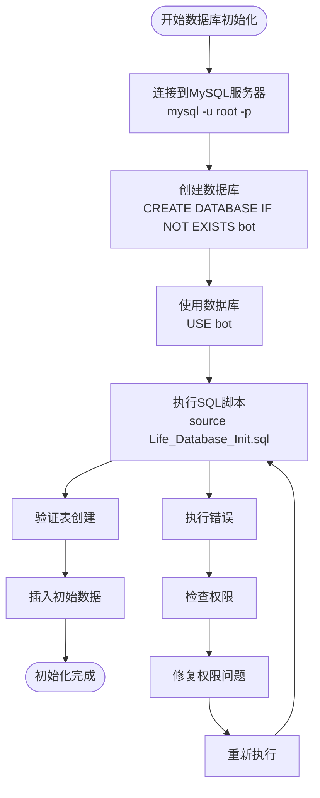
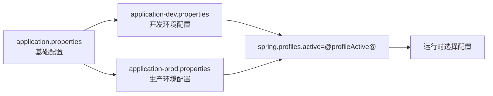
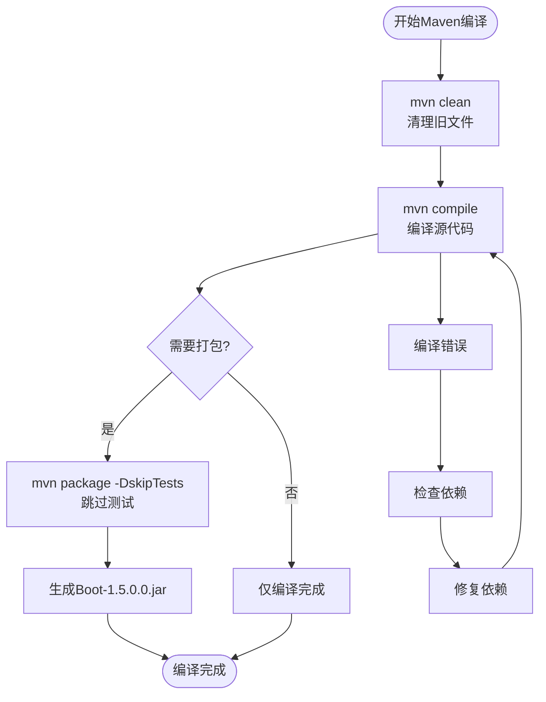
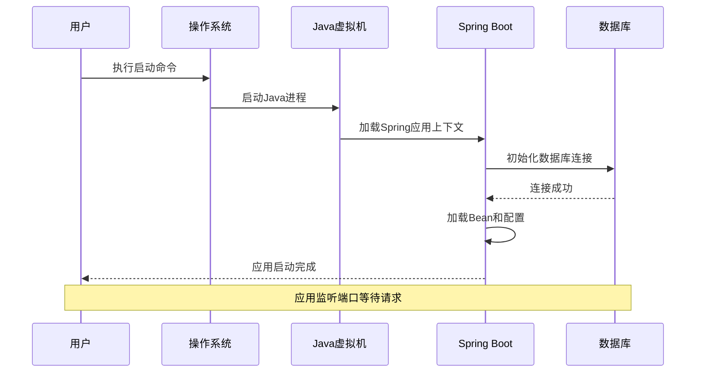
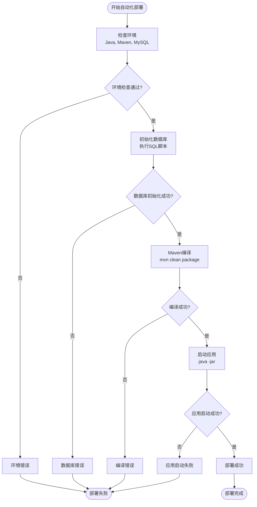

# 部署步骤

<cite>
**本文档引用的文件**
- [Life_Deployment_Guide.md](file://Life_Deployment_Guide.md)
- [Life_Database_Init.sql](file://Life_Database_Init.sql)
- [pom.xml](file://pom.xml)
- [Boot/pom.xml](file://Boot/pom.xml)
- [Boot/src/main/resources/application.properties](file://Boot/src/main/resources/application.properties)
- [Boot/src/main/resources/application-dev.properties](file://Boot/src/main/resources/application-dev.properties)
- [Boot/src/main/resources/application-prod.properties](file://Boot/src/main/resources/application-prod.properties)
- [mvnw.cmd](file://mvnw.cmd)
</cite>

## 目录
1. [环境要求](#环境要求)
2. [数据库初始化](#数据库初始化)
3. [配置文件配置](#配置文件配置)
4. [Maven编译](#maven编译)
5. [应用启动](#应用启动)
6. [验证部署](#验证部署)
7. [自动化部署脚本](#自动化部署脚本)
8. [故障排除](#故障排除)

## 环境要求

部署本项目需要以下环境组件：

### 必需组件
- **Java 8+**: 项目使用Java 8作为开发语言
- **MySQL 5.7+**: 数据库管理系统，推荐使用MySQL 5.7及以上版本
- **Maven 3.6+**: 构建工具，用于项目编译和依赖管理
- **Spring Boot 2.3.4**: 应用框架版本

### 可选组件
- **Git**: 用于代码版本控制和自动部署
- **Shell/Batch脚本支持**: 用于自动化部署流程

## 数据库初始化

### 执行数据库初始化脚本

按照部署指南，需要执行`Life_Database_Init.sql`脚本进行数据库初始化：

```sql
-- 连接到MySQL数据库
mysql -u root -p

-- 创建数据库（如果不存在）
CREATE DATABASE IF NOT EXISTS bot DEFAULT CHARSET utf8mb4;

-- 使用数据库
USE bot;

-- 执行初始化脚本
source Life_Database_Init.sql;
```

### 数据库初始化详细步骤



**图表来源**
- [Life_Database_Init.sql](file://Life_Database_Init.sql#L1-L50)

### 数据库表结构说明

初始化脚本创建了30个核心表，涵盖以下功能模块：

| 表名 | 功能描述 | 主要字段 |
|------|----------|----------|
| life_player | 玩家角色表 | user_id, nickname, level, experience, cultivation |
| life_monster | 怪物表 | name, map_id, attribute, health, attack_power |
| life_item | 道具表 | name, type, effect_value, description |
| life_skill | 技能基础表 | name, type, attribute, power |
| life_equipment | 装备表 | name, type, attribute, rarity |
| life_system_config | 系统配置表 | config_key, config_value |

**章节来源**
- [Life_Database_Init.sql](file://Life_Database_Init.sql#L1-L646)

## 配置文件配置

### 数据库连接配置

在`Boot/src/main/resources/application.properties`中配置数据库连接：

```properties
# 数据库配置
spring.datasource.url=jdbc:mysql://localhost:3306/bot?useSSL=false&serverTimezone=UTC&characterEncoding=utf8
spring.datasource.username=root
spring.datasource.password=your_password
spring.datasource.driver-class-name=com.mysql.cj.jdbc.Driver

# MyBatis配置
mybatis.mapper-locations=classpath:mapper/*.xml
mybatis.type-aliases-package=com.bot.*.dao.entity
```

### 开发环境配置

开发环境配置位于`application-dev.properties`：

```properties
# 日志配置
logback.level=INFO
logback.rootPath=D:\\home\\gardpay\\reconciliation\\logs\\

# 系统配置
system.robot.qq=2732151511
system.message.send.url=http://10.60.45.114:21213/SendTempIM.do

# 数据库配置
spring.datasource.url=jdbc:mysql://47.92.127.30:3306/bot?useUnicode=true&characterEncoding=utf8&useSSL=false&serverTimezone=UTC
spring.datasource.username=root
spring.datasource.password=gouzaizi@123
```

### 生产环境配置

生产环境配置位于`application-prod.properties`：

```properties
# 日志配置
logback.level=INFO
logback.rootPath=/data/project/bot/logs

# 系统配置
system.robot.qq=2732151511
system.message.send.url=http://127.0.0.1:21213/SendTempIM.do

# 数据库配置
spring.datasource.url=jdbc:mysql://47.92.127.30:3306/bot?useUnicode=true&characterEncoding=utf8&useSSL=false&serverTimezone=UTC
spring.datasource.username=root
spring.datasource.password=gouzaizi@123
```

### 配置文件优先级



**图表来源**
- [Boot/src/main/resources/application.properties](file://Boot/src/main/resources/application.properties#L1-L70)
- [Boot/src/main/resources/application-dev.properties](file://Boot/src/main/resources/application-dev.properties#L1-L59)
- [Boot/src/main/resources/application-prod.properties](file://Boot/src/main/resources/application-prod.properties#L1-L92)

**章节来源**
- [Boot/src/main/resources/application.properties](file://Boot/src/main/resources/application.properties#L1-L70)
- [Boot/src/main/resources/application-dev.properties](file://Boot/src/main/resources/application-dev.properties#L1-L59)
- [Boot/src/main/resources/application-prod.properties](file://Boot/src/main/resources/application-prod.properties#L1-L92)

## Maven编译

### 编译命令详解

项目使用Maven进行构建管理，提供了两种主要的编译方式：

#### 1. 清理并编译
```bash
# 在项目根目录执行
mvn clean compile
```

**参数说明：**
- `clean`: 清理之前的编译结果，删除target目录
- `compile`: 编译Java源代码到target/classes目录

#### 2. 完整构建（跳过测试）
```bash
# 在项目根目录执行
mvn clean package -DskipTests
```

**参数说明：**
- `package`: 将编译后的代码打包成JAR/WAR文件
- `-DskipTests`: 跳过单元测试，加快构建速度

### Maven Wrapper使用

项目包含Maven Wrapper（mvnw），可以在没有安装Maven的环境中使用：

```bash
# Linux/MacOS
./mvnw clean compile

# Windows
mvnw.cmd clean compile
```

### 模块化编译

项目采用多模块架构，使用`-pl`参数指定模块：

```bash
# 编译特定模块
mvn clean compile -pl Boot

# 编译多个模块
mvn clean compile -pl Boot,Life

# 完整构建特定模块
mvn clean package -pl Boot -DskipTests
```

### 编译流程图



**图表来源**
- [pom.xml](file://pom.xml#L1-L148)
- [Boot/pom.xml](file://Boot/pom.xml#L1-L55)

**章节来源**
- [Life_Deployment_Guide.md](file://Life_Deployment_Guide.md#L48-L56)
- [pom.xml](file://pom.xml#L1-L148)

## 应用启动

### 启动方式一：Java JAR包启动

```bash
# 启动Spring Boot应用
java -jar Boot/target/Boot-1.5.0.0.jar
```

**适用场景：**
- 生产环境部署
- 需要独立进程管理
- 使用系统服务管理

### 启动方式二：Maven Spring Boot插件启动

```bash
# 使用Maven启动
mvn spring-boot:run -pl Boot
```

**适用场景：**
- 开发环境调试
- 快速启动验证
- 热部署开发

### 启动参数配置

可以通过命令行参数覆盖配置文件：

```bash
# 指定运行环境
java -jar Boot/target/Boot-1.5.0.0.jar --spring.profiles.active=prod

# 指定端口
java -jar Boot/target/Boot-1.5.0.0.jar --server.port=9092

# 指定配置文件
java -jar Boot/target/Boot-1.5.0.0.jar --spring.config.location=custom-config/
```

### 应用启动流程



**图表来源**
- [Boot/pom.xml](file://Boot/pom.xml#L38-L42)

**章节来源**
- [Life_Deployment_Guide.md](file://Life_Deployment_Guide.md#L58-L66)

## 验证部署

### 日志检查

启动后检查控制台日志，确认以下内容：

1. **Spring容器正常启动**
   ```
   INFO  o.s.b.w.embedded.tomcat.TomcatWebServer - Tomcat started on port(s): 9091 (http) with context path '/bot'
   ```

2. **数据库连接成功**
   ```
   INFO  com.alibaba.druid.pool.DruidDataSource - {dataSource-1} inited
   ```

3. **Life模块的Bean正常加载**
   ```
   INFO  c.b.life.service.impl.PlayerServiceImpl - Life module initialized successfully
   ```

### 功能测试

1. **游戏入口测试**
   - 通过聊天机器人发送 `浮生卷` 测试游戏入口是否正常工作
   - 验证基本的游戏功能响应

2. **数据库验证**
   ```sql
   -- 查看Life模块相关表
   SHOW TABLES LIKE 'life_%';
   
   -- 检查初始数据
   SELECT * FROM life_map LIMIT 5;
   SELECT * FROM life_monster LIMIT 5;
   SELECT * FROM life_item LIMIT 5;
   ```

### 性能监控

监控以下关键指标：
- 在线游戏玩家数量
- 图片生成响应时间
- 数据库连接池状态
- 内存使用情况

**章节来源**
- [Life_Deployment_Guide.md](file://Life_Deployment_Guide.md#L68-L93)

## 自动化部署脚本

### Shell脚本示例（Linux/MacOS）

```bash
#!/bin/bash
# Bot自动化部署脚本

PROJECT_DIR="/opt/bot"
LOG_FILE="$PROJECT_DIR/deploy.log"
TIMESTAMP=$(date +"%Y%m%d_%H%M%S")

# 日志函数
log_message() {
    echo "[$(date '+%Y-%m-%d %H:%M:%S')] $1" | tee -a $LOG_FILE
}

# 检查环境
check_environment() {
    log_message "检查部署环境..."
    
    # 检查Java
    if ! command -v java >/dev/null 2>&1; then
        log_message "错误：未找到Java环境"
        exit 1
    fi
    
    # 检查MySQL
    if ! command -v mysql >/dev/null 2>&1; then
        log_message "警告：未找到MySQL客户端"
    fi
    
    # 检查Maven
    if ! command -v mvn >/dev/null 2>&1; then
        log_message "错误：未找到Maven"
        exit 1
    fi
    
    log_message "环境检查完成"
}

# 数据库初始化
initialize_database() {
    log_message "开始数据库初始化..."
    
    # 创建数据库
    mysql -u root -p <<EOF
CREATE DATABASE IF NOT EXISTS bot DEFAULT CHARSET utf8mb4;
USE bot;
SOURCE $PROJECT_DIR/Life_Database_Init.sql;
EOF
    
    if [ $? -eq 0 ]; then
        log_message "数据库初始化完成"
    else
        log_message "错误：数据库初始化失败"
        exit 1
    fi
}

# Maven编译
compile_project() {
    log_message "开始Maven编译..."
    
    cd $PROJECT_DIR
    ./mvnw clean package -DskipTests
    
    if [ $? -eq 0 ]; then
        log_message "Maven编译完成"
    else
        log_message "错误：Maven编译失败"
        exit 1
    fi
}

# 应用启动
start_application() {
    log_message "启动应用..."
    
    cd $PROJECT_DIR
    nohup java -jar Boot/target/Boot-1.5.0.0.jar > app.log 2>&1 &
    
    sleep 10
    
    if pgrep -f "Boot-1.5.0.0.jar" > /dev/null; then
        log_message "应用启动成功，PID: $(pgrep -f "Boot-1.5.0.0.jar")"
    else
        log_message "错误：应用启动失败"
        exit 1
    fi
}

# 主程序
main() {
    log_message "=== Bot自动化部署开始 ==="
    
    check_environment
    initialize_database
    compile_project
    start_application
    
    log_message "=== Bot自动化部署完成 ==="
}

# 执行主程序
main "$@"
```

### Batch脚本示例（Windows）

```batch
@echo off
REM Bot自动化部署脚本（Windows）

set PROJECT_DIR=%~dp0
set LOG_FILE=%PROJECT_DIR%deploy.log
set TIMESTAMP=%DATE:/=-%_%TIME::=-%

echo Logging to %LOG_FILE%

:log
echo [%DATE% %TIME%] %~1 >> %LOG_FILE%
goto :eof

:check_environment
call :log 检查部署环境...

REM 检查Java
where java >nul 2>nul
if %ERRORLEVEL% neq 0 (
    call :log 错误：未找到Java环境
    exit /b 1
)

REM 检查MySQL
where mysql >nul 2>nul
if %ERRORLEVEL% equ 0 (
    call :log 警告：未找到MySQL客户端
)

REM 检查Maven
where mvn >nul 2>nul
if %ERRORLEVEL% neq 0 (
    call :log 错误：未找到Maven
    exit /b 1
)

call :log 环境检查完成
goto :eof

:initialize_database
call :log 开始数据库初始化...

REM 创建数据库
mysql -u root -p < %PROJECT_DIR%Life_Database_Init.sql

if %ERRORLEVEL% equ 0 (
    call :log 数据库初始化完成
) else (
    call :log 错误：数据库初始化失败
    exit /b 1
)

goto :eof

:compile_project
call :log 开始Maven编译...

cd %PROJECT_DIR%
mvnw.cmd clean package -DskipTests

if %ERRORLEVEL% equ 0 (
    call :log Maven编译完成
) else (
    call :log 错误：Maven编译失败
    exit /b 1
)

goto :eof

:start_application
call :log 启动应用...

cd %PROJECT_DIR%
start java -jar Boot/target/Boot-1.5.0.0.jar

timeout /t 10 >nul

call :log 应用启动完成
goto :eof

:main
call :log === Bot自动化部署开始 ===

call :check_environment
call :initialize_database
call :compile_project
call :start_application

call :log === Bot自动化部署完成 ===
goto :eof

:main
```

### 部署流程图



**图表来源**
- [mvnw.cmd](file://mvnw.cmd#L1-L183)

## 故障排除

### 常见问题及解决方案

#### 1. 数据库连接失败

**症状：**
```
Failed to configure a DataSource: 'spring.datasource.url' is not specified and no embedded datasource could be configured.
```

**解决方案：**
- 检查数据库服务是否启动
- 验证连接字符串、用户名、密码
- 确认数据库权限设置

#### 2. 图片生成失败

**症状：**
```
java.io.FileNotFoundException: life_back.png (No such file or directory)
```

**解决方案：**
- 检查背景图片文件是否存在
- 确认输出目录权限
- 验证字体文件是否可用

#### 3. 模块加载失败

**症状：**
```
Field xxx in com.bot.xxx required a bean of type xxx that could not be found
```

**解决方案：**
- 检查Maven依赖是否正确
- 确认包扫描路径配置
- 验证Spring配置注解

### 日志配置

在`logback-spring.xml`中添加Life模块的日志配置：

```xml
<logger name="com.bot.life" level="DEBUG"/>
```

### 性能优化建议

#### 1. 数据库连接池配置
```properties
spring.datasource.hikari.maximum-pool-size=20
spring.datasource.hikari.minimum-idle=5
```

#### 2. 图片缓存机制
- 考虑实现图片缓存机制
- 定期清理临时文件

#### 3. 内存优化
- 监控游戏状态缓存大小
- 实现过期清理机制

### 监控和维护

#### 数据库维护
```sql
-- 清理过期临时文件记录
DELETE FROM life_temp_files WHERE expire_time < NOW();

-- 检查玩家数据完整性
SELECT COUNT(*) FROM life_player;
SELECT COUNT(*) FROM life_game_status;
```

#### 应用监控指标
- 在线游戏玩家数量
- 图片生成响应时间
- 数据库连接池状态
- 内存使用情况

**章节来源**
- [Life_Deployment_Guide.md](file://Life_Deployment_Guide.md#L125-L234)