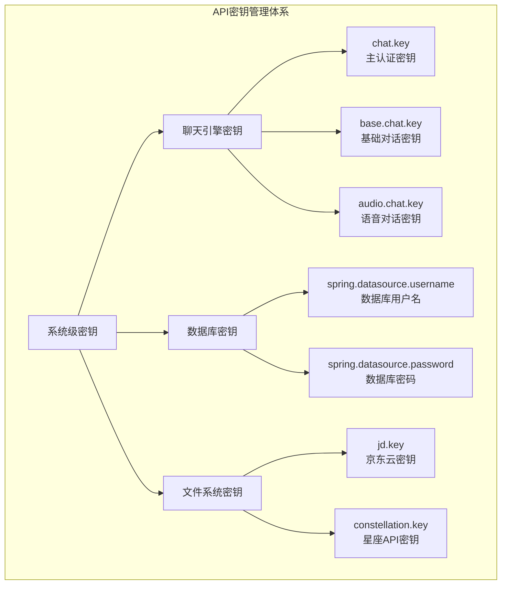

# API配置

<cite>
**本文档引用的文件**
- [application.properties](file://Boot/src/main/resources/application.properties)
- [application-prod.properties](file://Boot/src/main/resources/application-prod.properties)
- [ConstellationServiceImpl.java](file://Base/src/main/java/com/bot/base/service/impl/ConstellationServiceImpl.java)
- [DefaultChatServiceImpl.java](file://Base/src/main/java/com/bot/base/service/impl/DefaultChatServiceImpl.java)
- [SweetServiceImpl.java](file://Base/src/main/java/com/bot/base/service/impl/SweetServiceImpl.java)
- [CloudMusicServiceImpl.java](file://Base/src/main/java/com/bot/base/service/impl/CloudMusicServiceImpl.java)
- [TopTokenServiceImpl.java](file://Base/src/main/java/com/bot/base/service/impl/TopTokenServiceImpl.java)
- [HttpSenderUtil.java](file://Common/src/main/java/com/bot/common/util/HttpSenderUtil.java)
- [QQSender.java](file://Common/src/main/java/com/bot/common/util/QQSender.java)
</cite>

## 目录
1. [概述](#概述)
2. [配置文件结构](#配置文件结构)
3. [互动功能API配置](#互动功能api配置)
4. [第三方服务API配置](#第三方服务api配置)
5. [工具类API配置](#工具类api配置)
6. [开发环境与生产环境对比](#开发环境与生产环境对比)
7. [API密钥管理](#api密钥管理)
8. [安全最佳实践](#安全最佳实践)
9. [故障排除指南](#故障排除指南)

## 概述

Bot项目采用分层架构设计，通过多个配置文件管理系统中使用的各种外部API。系统主要包含三大类API配置：
- **互动功能API**：提供聊天、音乐、情话等交互功能
- **第三方服务API**：集成星座、游戏数据、图片生成等外部服务
- **工具类API**：支持网格工具、工作日常等专业功能

## 配置文件结构

### 主配置文件层次


**图表来源**
- [application.properties](file://Boot/src/main/resources/application.properties#L1-L70)
- [application-prod.properties](file://Boot/src/main/resources/application-prod.properties#L1-L92)

### 配置文件对比表

| 配置项 | 开发环境 | 生产环境 | 说明 |
|--------|----------|----------|------|
| 日志级别 | INFO | INFO | 生产环境日志配置 |
| 数据库路径 | C:\\logs\\bot | /data/project/bot/logs | 日志存储位置 |
| 文本路径 | C:\\publish\\botText\\ | /data/project/bot/text/ | 文本资源路径 |
| 文件基础路径 | C:\\publish\\botFile\\ | /data/files | 文件存储基础路径 |

**节来源**
- [application.properties](file://Boot/src/main/resources/application.properties#L11-L14)
- [application-prod.properties](file://Boot/src/main/resources/application-prod.properties#L2-L4)

## 互动功能API配置

### 聊天引擎API

聊天引擎是Bot的核心互动功能，支持多种AI模型和对话模式。

#### 核心配置参数


**图表来源**
- [application-prod.properties](file://Boot/src/main/resources/application-prod.properties#L20-L26)
- [DefaultChatServiceImpl.java](file://Base/src/main/java/com/bot/base/service/impl/DefaultChatServiceImpl.java#L30-L46)

#### 聊天引擎特性

| 功能模块 | 认证密钥 | 请求频率 | 特殊功能 |
|----------|----------|----------|----------|
| 基础对话 | app-utmEUEMRkTnw91hvOGxii2oI | 无限制 | 支持多轮对话 |
| 语音对话 | app-MTjenZpBOo3Pl85R5V3uamem | 限制5条消息 | 语音合成输出 |
| 群组对话 | app-mRhWaQTW9S01z7V4iZXRp9vJ | 限制10条消息 | 群组消息处理 |
| 审核对话 | app-yR7rDMIa6keCwG4EmFtHJ1P6 | 限制20条消息 | 内容审核过滤 |

**节来源**
- [DefaultChatServiceImpl.java](file://Base/src/main/java/com/bot/base/service/impl/DefaultChatServiceImpl.java#L125-L141)

### 音乐服务API

#### 配置详情

| 配置项 | 值 | 用途 | 请求频率 |
|--------|-----|------|----------|
| cloud.music.url | https://api.uomg.com/api/rand.music | 随机音乐获取 | 无限制 |
| Music.Sort数组 | ["华语", "欧美", "日韩", "经典", "网络"] | 音乐分类 | 无限制 |

**节来源**
- [application.properties](file://Boot/src/main/resources/application.properties#L29-L30)
- [CloudMusicServiceImpl.java](file://Base/src/main/java/com/bot/base/service/impl/CloudMusicServiceImpl.java#L23-L36)

### 情话服务API

#### 配置与特性

| 配置项 | 值 | 用途 | 特殊功能 |
|--------|-----|------|----------|
| sweet.url | https://api.lovelive.tools/api/SweetNothings | 土味情话获取 | 自动语音播报 |

**节来源**
- [application.properties](file://Boot/src/main/resources/application.properties#L28)
- [SweetServiceImpl.java](file://Base/src/main/java/com/bot/base/service/impl/SweetServiceImpl.java#L21-L29)

## 第三方服务API配置

### 星座运势API

#### 配置参数


**图表来源**
- [application.properties](file://Boot/src/main/resources/application.properties#L42-L43)
- [ConstellationServiceImpl.java](file://Base/src/main/java/com/bot/base/service/impl/ConstellationServiceImpl.java#L17-L21)

#### 星座API特性

| 参数 | 值 | 说明 |
|------|-----|------|
| 请求地址 | http://web.juhe.cn:8080/constellation/getAll | 星座运势API |
| API密钥 | 4a11bbcbf089edaf14c2d9bdb80c2ec4 | 星座查询密钥 |
| 支持类型 | 日、月、年、本周 | 不同时间维度的运势 |

**节来源**
- [ConstellationServiceImpl.java](file://Base/src/main/java/com/bot/base/service/impl/ConstellationServiceImpl.java#L25-L33)

### 游戏数据API

#### JX3游戏API配置

| 配置项 | 值 | 用途 | 请求频率 |
|--------|-----|------|----------|
| jx3.url | https://www.jx3api.com/data | 剑网3游戏数据 | 无限制 |
| jx.token | v2f3b70cea9bbbd45e | 游戏API密钥 | 无限制 |

**节来源**
- [application-prod.properties](file://Boot/src/main/resources/application-prod.properties#L55-L61)

#### 工作日常API配置


**图表来源**
- [application-prod.properties](file://Boot/src/main/resources/application-prod.properties#L57)

**节来源**
- [application-prod.properties](file://Boot/src/main/resources/application-prod.properties#L57)

### 图片服务API

#### 头像生成API

| 配置项 | 值 | 用途 | 特殊功能 |
|--------|-----|------|----------|
| picture.path | https://api.btstu.cn/sjtx/api.php | 随机头像获取 | 支持多种风格 |

**节来源**
- [application.properties](file://Boot/src/main/resources/application.properties#L38)

## 工具类API配置

### 图片生成功能

#### 配置参数


**图表来源**
- [application-prod.properties](file://Boot/src/main/resources/application-prod.properties#L28)
- [DefaultChatServiceImpl.java](file://Base/src/main/java/com/bot/base/service/impl/DefaultChatServiceImpl.java#L86-L91)

#### 图片生成API特性

| 参数 | 值 | 说明 |
|------|-----|------|
| API地址 | https://api.siliconflow.cn/v1/images/generations | 图片生成服务 |
| 模型支持 | Kwai-Kolors/Kolors | AI绘画模型 |
| 输出格式 | PNG/JPEG | 图片格式 |
| 存储路径 | /data/files/picCache/ | 本地缓存目录 |

**节来源**
- [DefaultChatServiceImpl.java](file://Base/src/main/java/com/bot/base/service/impl/DefaultChatServiceImpl.java#L86-L91)

### 网格工具API

#### 配置详情

| 功能模块 | API端点 | 请求方法 | 权限要求 |
|----------|---------|----------|----------|
| 绑定工号 | /bossAccount/bindDtAccount | POST | 管理员权限 |
| 检查工号 | /bossAccount/checkAccount | POST | 查询权限 |
| 退款处理 | /order/refund | POST | 财务权限 |
| Boss日志 | /log/fetchBossLog | POST | 监控权限 |
| 订单查询 | /order/queryOrder | POST | 查询权限 |
| 短信验证 | /sms/querySms | POST | 安全权限 |

**节来源**
- [TopTokenServiceImpl.java](file://Base/src/main/java/com/bot/base/service/impl/TopTokenServiceImpl.java#L19-L99)
- [ENGridKeyWord.java](file://Common/src/main/java/com/bot/common/enums/ENGridKeyWord.java#L10-L15)

### 其他工具API

#### 配置列表

| 功能类别 | API地址 | 用途 | 特殊配置 |
|----------|---------|------|----------|
| 女生视频 | https://tools.mgtv100.com/external/v1/pear/xjj | 视频内容获取 | 无需密钥 |
| 狗狗日记 | https://v2.xxapi.cn/api/dog | 狗狗图片获取 | 无需密钥 |
| 图转线稿 | https://v2.xxapi.cn/api/line | 图片处理 | 无需密钥 |
| 英文单词 | https://v2.xxapi.cn/api/randomenglishwords | 单词学习 | 无需密钥 |
| 安全日志 | https://api.linhun.vip/api/security | 安全监控 | apiKey: 773b810df449be0ecffb56cf48c7e610 |
| 白丝视频 | https://v2.xxapi.cn/api/baisi | 视频内容 | 无需密钥 |
| 黑丝视频 | https://v2.xxapi.cn/api/heisi | 视频内容 | 无需密钥 |
| 回答书籍 | https://v2.xxapi.cn/api/answers | 知识问答 | 无需密钥 |

**节来源**
- [application-prod.properties](file://Boot/src/main/resources/application-prod.properties#L40-L53)

## 开发环境与生产环境对比

### 配置差异分析

```mermaid
graph TB
subgraph "开发环境 vs 生产环境"
A[开发环境] --> B[本地路径配置]
C[生产环境] --> D[服务器路径配置]
B --> E[C:\\logs\\bot<br/>C:\\publish\\botText\\<br/>C:\\publish\\botFile\\]
D --> F[/data/project/bot/logs<br/>/data/project/bot/text/<br/>/data/files]
G[IP地址] --> H[localhost/内网IP]
I[API密钥] --> J[测试密钥]
K[数据库] --> L[本地MySQL]
end
```

**图表来源**
- [application.properties](file://Boot/src/main/resources/application.properties#L11-L14)
- [application-prod.properties](file://Boot/src/main/resources/application-prod.properties#L2-L4)

### 关键差异对比表

| 配置类别 | 开发环境 | 生产环境 | 影响范围 |
|----------|----------|----------|----------|
| 日志路径 | C:\\logs\\bot | /data/project/bot/logs | 日志管理 |
| 文本路径 | C:\\publish\\botText\\ | /data/project/bot/text/ | 资源加载 |
| 文件路径 | C:\\publish\\botFile\\ | /data/files | 文件存储 |
| 数据库连接 | localhost | 外网IP | 数据访问 |
| API密钥 | 测试密钥 | 生产密钥 | 功能可用性 |

**节来源**
- [application.properties](file://Boot/src/main/resources/application.properties#L47-L70)
- [application-prod.properties](file://Boot/src/main/resources/application-prod.properties#L70-L92)

## API密钥管理

### 密钥分类体系



**图表来源**
- [application-prod.properties](file://Boot/src/main/resources/application-prod.properties#L21-L26)
- [application-prod.properties](file://Boot/src/main/resources/application-prod.properties#L72-L73)

### 密钥安全配置

| 密钥类型 | 配置位置 | 安全级别 | 更新策略 |
|----------|----------|----------|----------|
| 聊天引擎密钥 | application-prod.properties | 高 | 定期轮换 |
| 数据库凭据 | application-prod.properties | 最高 | 严格保密 |
| 第三方API密钥 | application-prod.properties | 中等 | 按需更新 |
| 文件系统密钥 | application-prod.properties | 中等 | 年度检查 |

**节来源**
- [application-prod.properties](file://Boot/src/main/resources/application-prod.properties#L21-L26)
- [application-prod.properties](file://Boot/src/main/resources/application-prod.properties#L72-L73)

## 安全最佳实践

### API访问控制


**图表来源**
- [HttpSenderUtil.java](file://Common/src/main/java/com/bot/common/util/HttpSenderUtil.java#L188-L200)
- [QQSender.java](file://Common/src/main/java/com/bot/common/util/QQSender.java#L33-L49)

### 安全配置建议

#### 1. 密钥保护措施

| 措施 | 实现方式 | 安全等级 |
|------|----------|----------|
| 环境变量 | 敏感信息不直接写入配置文件 | 高 |
| 加密存储 | 数据库凭据加密存储 | 最高 |
| 访问控制 | IP白名单限制 | 高 |
| 审计日志 | 所有API调用记录 | 中等 |

#### 2. 请求频率限制

| API类型 | 限制策略 | 超限处理 |
|---------|----------|----------|
| 聊天引擎 | 按模型区分限制 | 返回等待提示 |
| 图片生成 | 异步队列处理 | 缓存机制 |
| 第三方服务 | 原始API限制 | 错峰调用 |
| 数据库 | 连接池控制 | 连接复用 |

#### 3. 网络安全配置


**节来源**
- [HttpSenderUtil.java](file://Common/src/main/java/com/bot/common/util/HttpSenderUtil.java#L57-L62)

## 故障排除指南

### 常见API问题诊断

#### 1. 聊天引擎连接问题

| 问题症状 | 可能原因 | 解决方案 |
|----------|----------|----------|
| 请求超时 | 网络不稳定 | 检查网络连接，增加重试机制 |
| 认证失败 | 密钥过期 | 更新API密钥 |
| 响应为空 | 服务不可用 | 切换备用API地址 |
| 频率限制 | 请求过于频繁 | 实现请求队列 |

#### 2. 图片生成失败


**图表来源**
- [DefaultChatServiceImpl.java](file://Base/src/main/java/com/bot/base/service/impl/DefaultChatServiceImpl.java#L86-L91)

#### 3. 数据库连接问题

| 错误类型 | 错误代码 | 解决步骤 |
|----------|----------|----------|
| 连接超时 | 2003 | 检查数据库服务状态 |
| 认证失败 | 1045 | 验证用户名密码 |
| 权限不足 | 1142 | 检查数据库权限 |
| 连接池满 | 08001 | 增加连接池大小 |

**节来源**
- [application-prod.properties](file://Boot/src/main/resources/application-prod.properties#L71-L85)

### 监控与告警配置

#### 关键指标监控

| 监控指标 | 告警阈值 | 处理动作 |
|----------|----------|----------|
| API响应时间 | >2秒 | 自动重试 |
| 错误率 | >5% | 发送告警邮件 |
| 连接成功率 | <95% | 启动备用服务 |
| 内存使用率 | >80% | 清理缓存 |

#### 日志分析要点


**节来源**
- [application-prod.properties](file://Boot/src/main/resources/application-prod.properties#L2-L6)

## 总结

Bot项目的API配置体系具有以下特点：

1. **分层管理**：清晰的配置文件层次结构，便于环境隔离
2. **多样化API**：涵盖聊天、娱乐、工具等多个功能领域
3. **安全优先**：完善的密钥管理和访问控制机制
4. **高可用性**：多重备份和故障转移机制
5. **易于扩展**：模块化设计支持新API的快速集成

通过合理的配置管理和安全措施，系统能够稳定运行并提供丰富的功能服务。建议定期审查配置文件，及时更新API密钥，并持续优化性能表现。