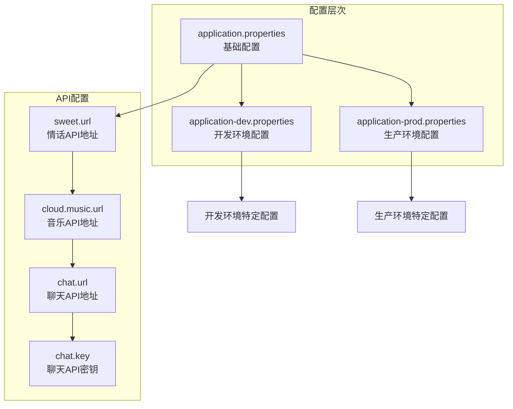
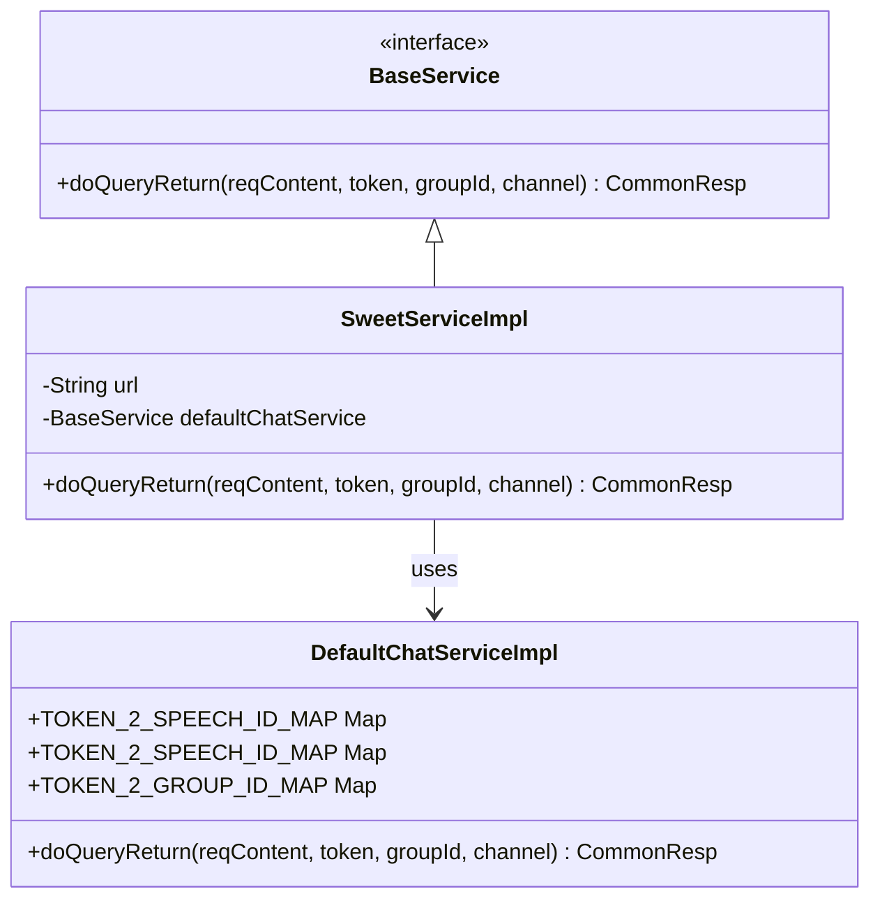
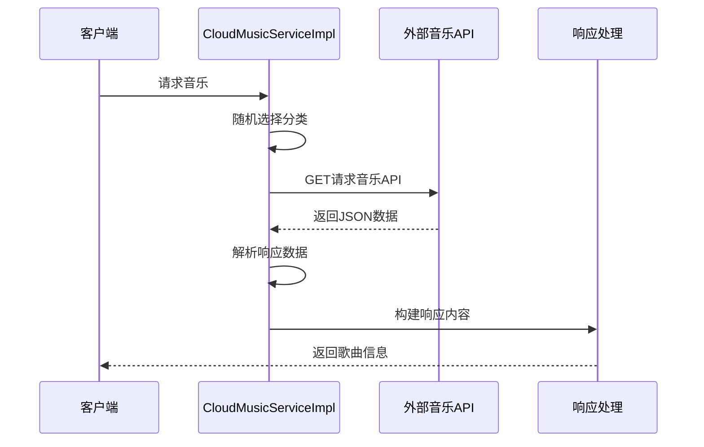
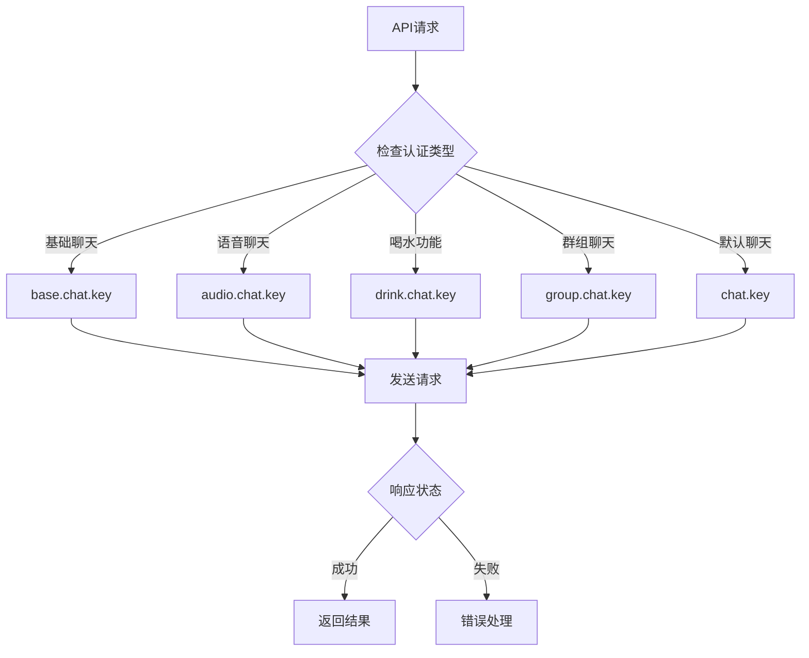
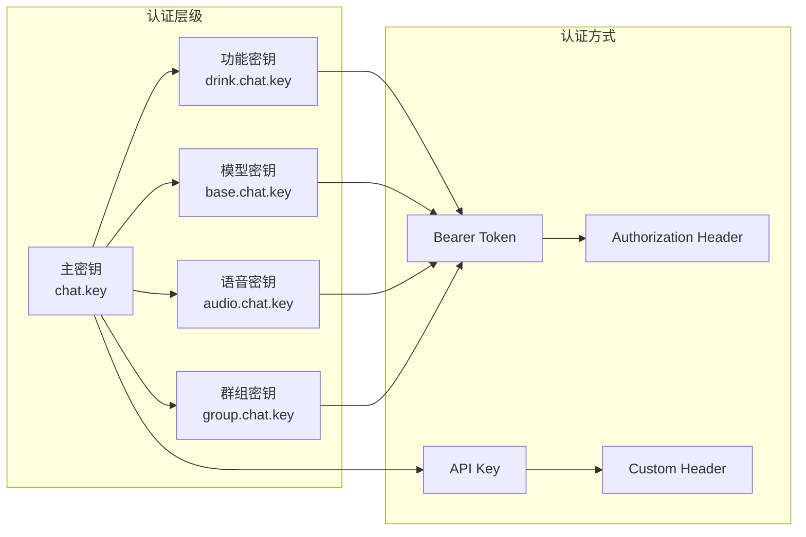
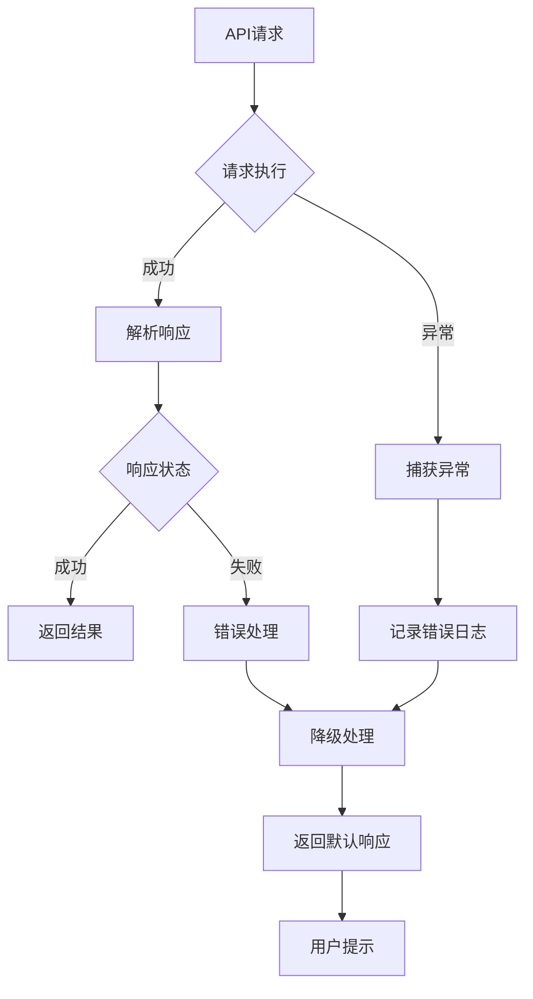
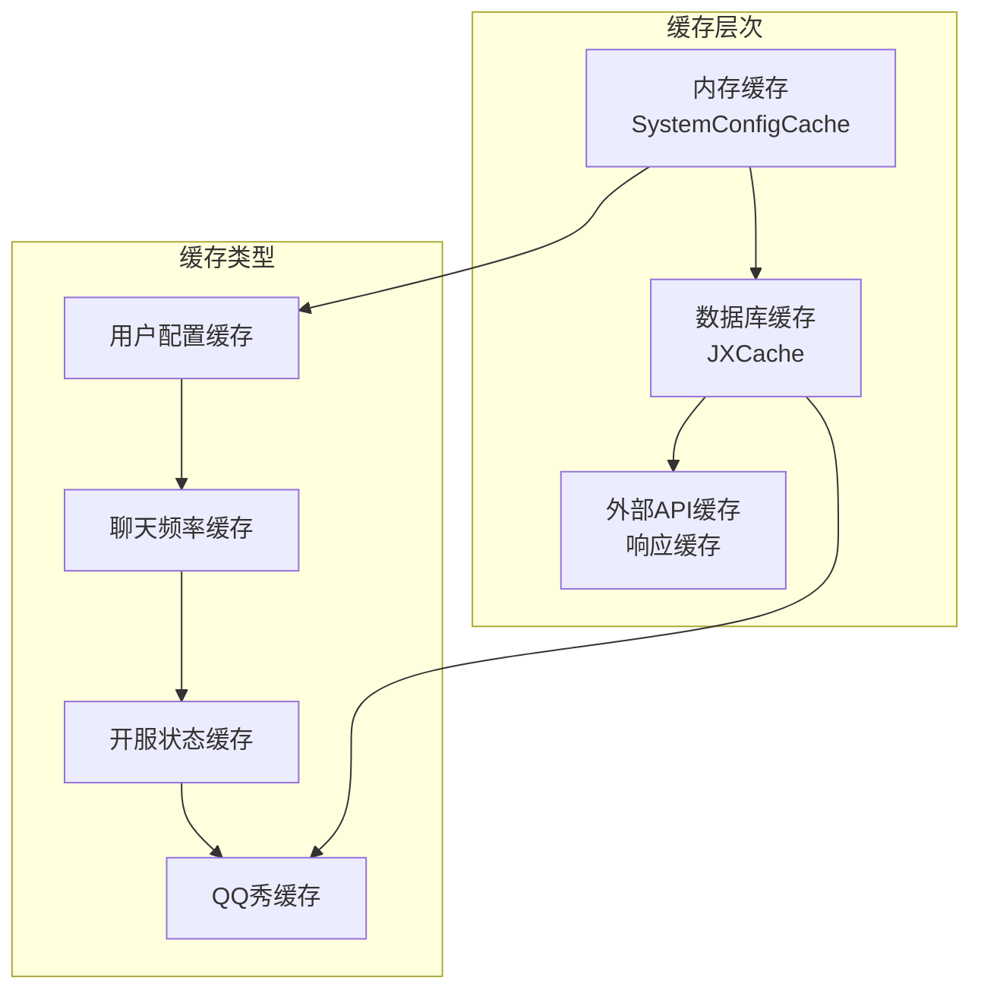

# 互动功能API配置文档

<cite>
**本文档引用的文件**
- [application.properties](file://Boot/src/main/resources/application.properties)
- [application-dev.properties](file://Boot/src/main/resources/application-dev.properties)
- [application-prod.properties](file://Boot/src/main/resources/application-prod.properties)
- [SweetServiceImpl.java](file://Base/src/main/java/com/bot/base/service/impl/SweetServiceImpl.java)
- [CloudMusicServiceImpl.java](file://Base/src/main/java/com/bot/base/service/impl/CloudMusicServiceImpl.java)
- [DefaultChatServiceImpl.java](file://Base/src/main/java/com/bot/base/service/impl/DefaultChatServiceImpl.java)
- [HttpSenderUtil.java](file://Common/src/main/java/com/bot/common/util/HttpSenderUtil.java)
- [BaseConsts.java](file://Common/src/main/java/com/bot/common/constant/BaseConsts.java)
- [SystemConfigCache.java](file://Common/src/main/java/com/bot/common/config/SystemConfigCache.java)
- [BotException.java](file://Common/src/main/java/com/bot/common/exception/BotException.java)
</cite>

## 目录
1. [概述](#概述)
2. [API配置总览](#api配置总览)
3. [情话API配置](#情话api配置)
4. [音乐API配置](#音乐api配置)
5. [聊天API配置](#聊天api配置)
6. [认证机制](#认证机制)
7. [错误处理与降级策略](#错误处理与降级策略)
8. [开发环境与生产环境差异](#开发环境与生产环境差异)
9. [缓存机制](#缓存机制)
10. [性能优化建议](#性能优化建议)

## 概述

本系统提供了三个核心的互动功能API：情话API（sweet.url）、音乐API（cloud.music.url）和聊天API（chat.url）。这些API通过Spring框架的依赖注入机制进行配置和管理，支持多种认证方式和错误处理策略。

## API配置总览

系统通过Spring Profile机制区分开发环境和生产环境，主要配置项如下：

**图表来源**
- [application.properties](file://Boot/src/main/resources/application.properties#L1-L70)
- [application-dev.properties](file://Boot/src/main/resources/application-dev.properties#L1-L59)
- [application-prod.properties](file://Boot/src/main/resources/application-prod.properties#L1-L92)

**章节来源**
- [application.properties](file://Boot/src/main/resources/application.properties#L28-L32)
- [application-dev.properties](file://Boot/src/main/resources/application-dev.properties#L20-L24)
- [application-prod.properties](file://Boot/src/main/resources/application-prod.properties#L16-L26)

## 情话API配置

### 基础配置

情话API通过`sweet.url`配置项进行管理，默认使用外部API服务：

| 配置项 | 值 | 描述 |
|--------|-----|------|
| sweet.url | https://api.lovelive.tools/api/SweetNothings | 情话API请求地址 |
| 请求方法 | GET | 使用HTTP GET请求 |
| 响应格式 | 文本 | 返回纯文本格式的情话内容 |

### 实现机制

情话服务通过`SweetServiceImpl`类实现，该类继承自`BaseService`接口：

**图表来源**
- [SweetServiceImpl.java](file://Base/src/main/java/com/bot/base/service/impl/SweetServiceImpl.java#L18-L41)
- [DefaultChatServiceImpl.java](file://Base/src/main/java/com/bot/base/service/impl/DefaultChatServiceImpl.java#L28-L78)

### 语音转换集成

当用户处于语音模式时，情话API会自动转换为语音回复：

| 功能特性 | 实现方式 | 触发条件 |
|----------|----------|----------|
| 语音模式检测 | 检查TOKEN_2_SPEECH_ID_MAP | 存在语音ID记录 |
| 自动语音转换 | 调用SiliconflowUtil.speech() | 语音模式启用 |
| 步数计数 | 更新SpeechIdDTO.step | 每次语音回复 |

**章节来源**
- [SweetServiceImpl.java](file://Base/src/main/java/com/bot/base/service/impl/SweetServiceImpl.java#L28-L41)
- [DefaultChatServiceImpl.java](file://Base/src/main/java/com/bot/base/service/impl/DefaultChatServiceImpl.java#L68-L78)

## 音乐API配置

### 基础配置

音乐API通过`cloud.music.url`配置项管理，支持多种音乐分类：

| 配置项 | 值 | 描述 |
|--------|-----|------|
| cloud.music.url | https://api.uomg.com/api/rand.music | 音乐API请求地址 |
| 请求参数 | sort, format | 分类排序和格式控制 |
| 响应格式 | JSON | 包含歌曲名称和播放链接 |

### 音乐分类

系统支持以下音乐分类：

| 分类名称 | 对应参数 | 描述 |
|----------|----------|------|
| 热歌榜 | 热歌榜 | 最受欢迎的歌曲 |
| 新歌榜 | 新歌榜 | 最新发行的歌曲 |
| 飙升榜 | 抖音榜 | 在抖音上流行的歌曲 |
| 电音榜 | 电音榜 | 电子音乐排行榜 |

### 实现流程

**图表来源**
- [CloudMusicServiceImpl.java](file://Base/src/main/java/com/bot/base/service/impl/CloudMusicServiceImpl.java#L26-L47)

**章节来源**
- [CloudMusicServiceImpl.java](file://Base/src/main/java/com/bot/base/service/impl/CloudMusicServiceImpl.java#L23-L47)
- [BaseConsts.java](file://Common/src/main/java/com/bot/common/constant/BaseConsts.java#L117-L118)

## 聊天API配置

### 基础配置

聊天API通过多个配置项进行管理，支持多模型和多场景：

| 配置项 | 值 | 描述 |
|--------|-----|------|
| chat.url | http://113.45.63.97/v1/chat-messages | 聊天API请求地址 |
| chat.key | sk-ymrdvcfjszkwtelpdclkixnyrouixanwyjrrvktsxazjhijw | 主要聊天密钥 |
| base.chat.key | app-utmEUEMRkTnw91hvOGxii2oI | 基础聊天模型密钥 |
| audio.chat.key | app-MTjenZpBOo3Pl85R5V3uamem | 语音聊天模型密钥 |
| drink.chat.key | app-BMiSrPRblhNvHAbusfIjrSau | 喝水功能密钥 |
| group.chat.key | app-mRhWaQTW9S01z7V4iZXRp9vJ | 群组聊天密钥 |

### 认证机制

聊天API采用多层次的认证机制：

**图表来源**
- [DefaultChatServiceImpl.java](file://Base/src/main/java/com/bot/base/service/impl/DefaultChatServiceImpl.java#L30-L46)

### 会话管理

系统维护多个会话映射表：

| 映射表 | 键类型 | 值类型 | 用途 |
|--------|--------|--------|------|
| TOKEN_2_BASE_CHAT_ID_MAP | String | ChatIdDTO | 基础聊天ID记录 |
| TOKEN_2_SPEECH_ID_MAP | String | SpeechIdDTO | 语音聊天和步数记录 |
| TOKEN_2_GROUP_ID_MAP | String | String | 群组ID记录 |

**章节来源**
- [DefaultChatServiceImpl.java](file://Base/src/main/java/com/bot/base/service/impl/DefaultChatServiceImpl.java#L30-L62)

## 认证机制

### 密钥管理

系统采用分层密钥管理策略：

**图表来源**
- [application-prod.properties](file://Boot/src/main/resources/application-prod.properties#L20-L26)
- [HttpSenderUtil.java](file://Common/src/main/java/com/bot/common/util/HttpSenderUtil.java#L168-L225)

### 请求头配置

不同类型的API请求使用不同的认证方式：

| API类型 | 认证方式 | 示例 |
|---------|----------|------|
| 基础聊天 | Bearer Token | Authorization: Bearer {token} |
| 音乐API | 无认证 | 直接GET请求 |
| 情话API | 无认证 | 直接GET请求 |

**章节来源**
- [HttpSenderUtil.java](file://Common/src/main/java/com/bot/common/util/HttpSenderUtil.java#L168-L225)

## 错误处理与降级策略

### 错误处理机制

系统实现了完善的错误处理机制：

**图表来源**
- [HttpSenderUtil.java](file://Common/src/main/java/com/bot/common/util/HttpSenderUtil.java#L289-L326)
- [BotException.java](file://Common/src/main/java/com/bot/common/exception/BotException.java#L1-L19)

### 降级策略

| API类型 | 降级方案 | 触发条件 |
|---------|----------|----------|
| 情话API | 返回固定文本 | API调用失败 |
| 音乐API | 返回错误提示 | API响应异常 |
| 聊天API | 返回默认回复 | 认证失败或超时 |

### 超时配置

系统设置了合理的超时配置：

| 超时类型 | 时间设置 | 说明 |
|----------|----------|------|
| 连接超时 | 180秒 | 建立连接的最大时间 |
| Socket超时 | 180秒 | 数据传输的最大时间 |

**章节来源**
- [HttpSenderUtil.java](file://Common/src/main/java/com/bot/common/util/HttpSenderUtil.java#L57-L62)

## 开发环境与生产环境差异

### 配置对比

| 配置项 | 开发环境 | 生产环境 | 说明 |
|--------|----------|----------|------|
| sweet.url | https://api.lovelive.tools/api/SweetNothings | 同上 | 情话API地址 |
| cloud.music.url | https://api.uomg.com/api/rand.music | 同上 | 音乐API地址 |
| chat.url | http://113.45.63.97/v1/chat-messages | 同上 | 聊天API地址 |
| chat.key | 无 | sk-ymrdvcfjszkwtelpdclkixnyrouixanwyjrrvktsxazjhijw | 主要聊天密钥 |
| base.chat.key | 无 | app-utmEUEMRkTnw91hvOGxii2oI | 基础聊天模型密钥 |
| audio.chat.key | 无 | app-MTjenZpBOo3Pl85R5V3uamem | 语音聊天模型密钥 |

### 日志配置差异

| 配置项 | 开发环境 | 生产环境 | 影响 |
|--------|----------|----------|------|
| logback.rootPath | D:\\home\\gardpay\\reconciliation\\logs\\ | /data/project/bot/logs | 日志存储位置 |
| text.path | 无 | /data/project/bot/text/ | 文本文件路径 |
| spring.datasource.url | MySQL连接 | 同上 | 数据库连接 |

**章节来源**
- [application-dev.properties](file://Boot/src/main/resources/application-dev.properties#L1-L59)
- [application-prod.properties](file://Boot/src/main/resources/application-prod.properties#L1-L92)

## 缓存机制

### 缓存策略

系统实现了多层缓存机制来提高API响应性能：

**图表来源**
- [SystemConfigCache.java](file://Common/src/main/java/com/bot/common/config/SystemConfigCache.java#L86-L116)

### 缓存配置

| 缓存类型 | 过期时间 | 缓存键 | 用途 |
|----------|----------|--------|------|
| 聊天频率 | 无限制 | 用户ID | 控制回复频率 |
| 开服状态 | 2分钟 | 服务器名称 | 减少API调用 |
| QQ秀 | 10分钟 | 服务器-角色名 | 提高响应速度 |

**章节来源**
- [SystemConfigCache.java](file://Common/src/main/java/com/bot/common/config/SystemConfigCache.java#L86-L116)

## 性能优化建议

### 请求优化

1. **连接池管理**：使用Apache HttpClient连接池减少连接开销
2. **超时设置**：合理设置连接和读取超时时间
3. **压缩传输**：启用gzip压缩减少网络传输量

### 缓存优化

1. **预热机制**：启动时预加载常用配置
2. **异步更新**：后台异步更新缓存数据
3. **容量控制**：设置合理的缓存大小限制

### 监控指标

建议监控以下关键指标：
- API响应时间
- 错误率统计
- 缓存命中率
- 并发请求数

**章节来源**
- [HttpSenderUtil.java](file://Common/src/main/java/com/bot/common/util/HttpSenderUtil.java#L46-L62)