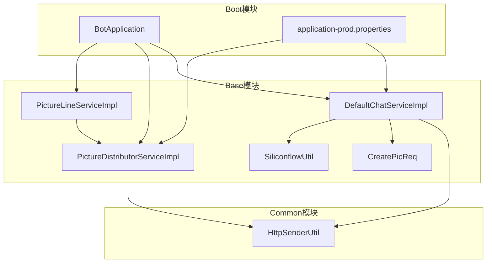
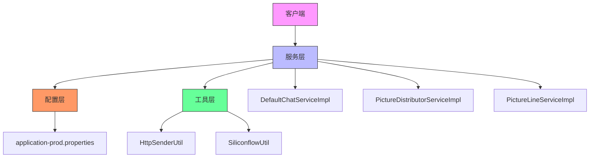
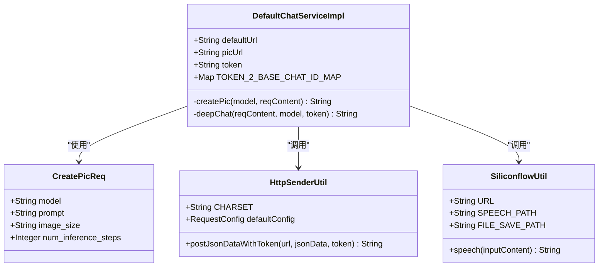
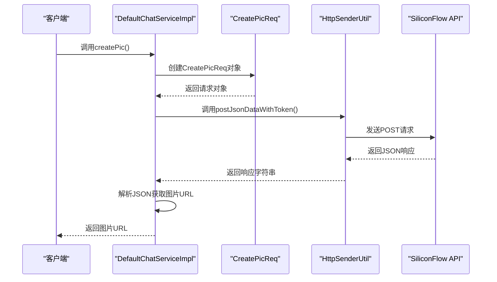
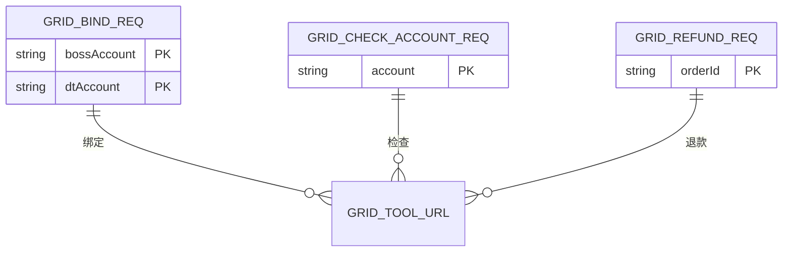
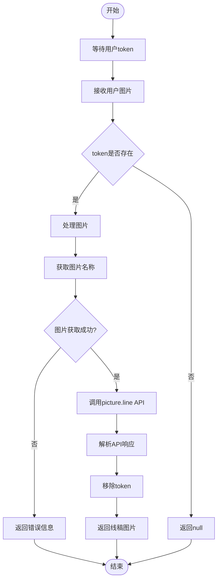
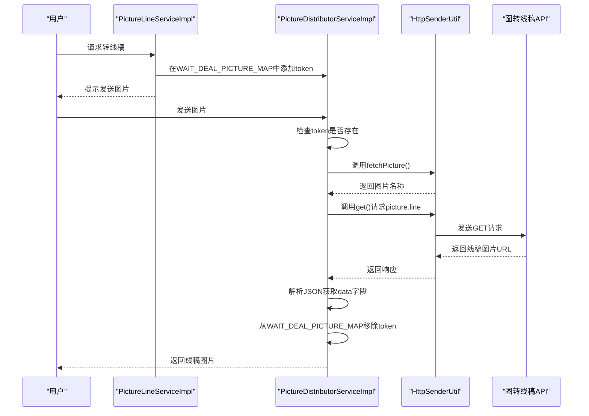
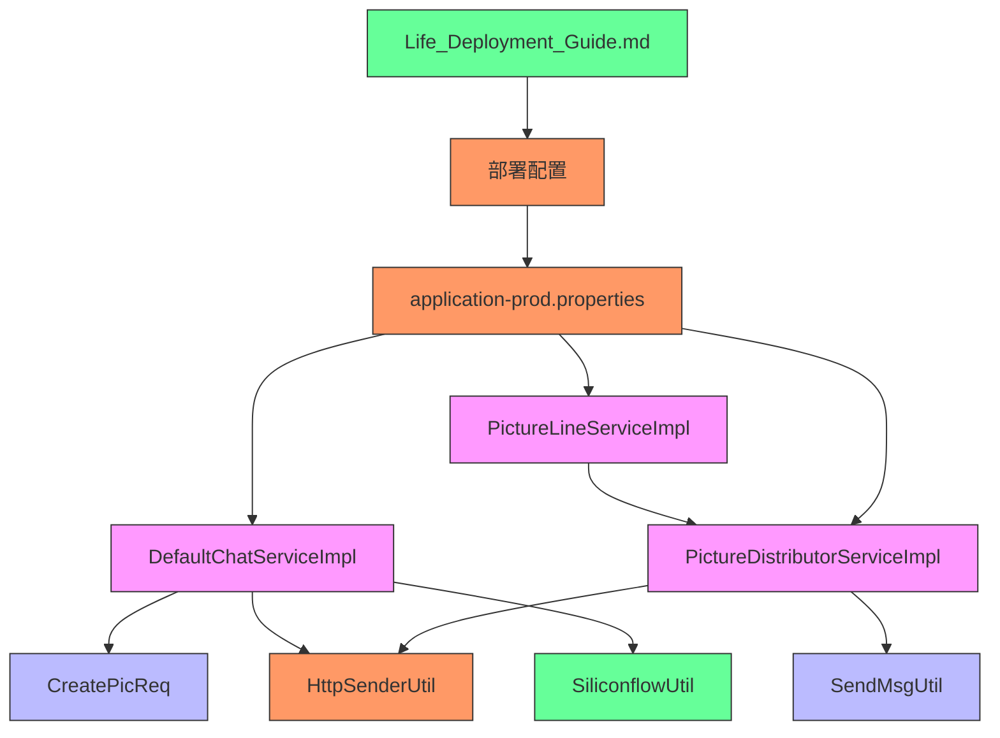

# 工具类API

<cite>
**本文档引用的文件**
- [DefaultChatServiceImpl.java](file://Base/src/main/java/com/bot/base/service/impl/DefaultChatServiceImpl.java)
- [PictureDistributorServiceImpl.java](file://Base/src/main/java/com/bot/base/service/impl/PictureDistributorServiceImpl.java)
- [PictureLineServiceImpl.java](file://Base/src/main/java/com/bot/base/service/impl/PictureLineServiceImpl.java)
- [CreatePicReq.java](file://Base/src/main/java/com/bot/base/dto/CreatePicReq.java)
- [SiliconflowUtil.java](file://Base/src/main/java/com/bot/base/util/SiliconflowUtil.java)
- [HttpSenderUtil.java](file://Common/src/main/java/com/bot/common/util/HttpSenderUtil.java)
- [application-prod.properties](file://Boot/src/main/resources/application-prod.properties)
- [Life_Deployment_Guide.md](file://Life_Deployment_Guide.md)
</cite>

## 目录
1. [简介](#简介)
2. [项目结构](#项目结构)
3. [核心组件](#核心组件)
4. [架构概述](#架构概述)
5. [详细组件分析](#详细组件分析)
6. [依赖分析](#依赖分析)
7. [性能考虑](#性能考虑)
8. [故障排除指南](#故障排除指南)
9. [结论](#结论)

## 简介
本文档深入解析Bot项目中的工具类API，包括图片生成API(pic.create.url)、网格工具API(grid.tool.url)和图转线稿API(picture.line)。文档详细说明这些API的请求头配置、数据格式要求和响应处理机制，并结合部署指南提供性能优化建议和故障恢复方案。

## 项目结构
Bot项目采用模块化设计，主要包含Base、Boot、Common、Game和Life五个模块。工具类API主要在Base模块中实现，通过Boot模块启动，依赖Common模块的通用工具类。



**图表来源**
- [DefaultChatServiceImpl.java](file://Base/src/main/java/com/bot/base/service/impl/DefaultChatServiceImpl.java)
- [PictureDistributorServiceImpl.java](file://Base/src/main/java/com/bot/base/service/impl/PictureDistributorServiceImpl.java)
- [PictureLineServiceImpl.java](file://Base/src/main/java/com/bot/base/service/impl/PictureLineServiceImpl.java)
- [CreatePicReq.java](file://Base/src/main/java/com/bot/base/dto/CreatePicReq.java)
- [SiliconflowUtil.java](file://Base/src/main/java/com/bot/base/util/SiliconflowUtil.java)
- [HttpSenderUtil.java](file://Common/src/main/java/com/bot/common/util/HttpSenderUtil.java)
- [application-prod.properties](file://Boot/src/main/resources/application-prod.properties)

**章节来源**
- [Base](file://Base)
- [Common](file://Common)
- [Boot](file://Boot)

## 核心组件
工具类API的核心组件包括图片生成服务、网格工具服务和图转线稿服务。这些服务通过Spring框架注入配置，并使用HTTP工具类与外部服务通信。

**章节来源**
- [DefaultChatServiceImpl.java](file://Base/src/main/java/com/bot/base/service/impl/DefaultChatServiceImpl.java#L26-L128)
- [PictureDistributorServiceImpl.java](file://Base/src/main/java/com/bot/base/service/impl/PictureDistributorServiceImpl.java#L18-L48)
- [PictureLineServiceImpl.java](file://Base/src/main/java/com/bot/base/service/impl/PictureLineServiceImpl.java#L10-L20)

## 架构概述
工具类API采用分层架构，包括配置层、服务层和工具层。配置层通过properties文件管理API URL和密钥，服务层实现业务逻辑，工具层提供HTTP通信和数据处理功能。



**图表来源**
- [DefaultChatServiceImpl.java](file://Base/src/main/java/com/bot/base/service/impl/DefaultChatServiceImpl.java)
- [PictureDistributorServiceImpl.java](file://Base/src/main/java/com/bot/base/service/impl/PictureDistributorServiceImpl.java)
- [PictureLineServiceImpl.java](file://Base/src/main/java/com/bot/base/service/impl/PictureLineServiceImpl.java)
- [HttpSenderUtil.java](file://Common/src/main/java/com/bot/common/util/HttpSenderUtil.java)
- [SiliconflowUtil.java](file://Base/src/main/java/com/bot/base/util/SiliconflowUtil.java)
- [application-prod.properties](file://Boot/src/main/resources/application-prod.properties)

## 详细组件分析

### 图片生成API分析
图片生成API基于SiliconFlow服务实现，通过`pic.create.url`配置项指定API地址。服务使用`CreatePicReq`对象封装请求参数，包括模型、提示词、图像尺寸和推理步数。

#### 类图


**图表来源**
- [DefaultChatServiceImpl.java](file://Base/src/main/java/com/bot/base/service/impl/DefaultChatServiceImpl.java#L30-L116)
- [CreatePicReq.java](file://Base/src/main/java/com/bot/base/dto/CreatePicReq.java#L8-L18)
- [SiliconflowUtil.java](file://Base/src/main/java/com/bot/base/util/SiliconflowUtil.java#L16-L82)
- [HttpSenderUtil.java](file://Common/src/main/java/com/bot/common/util/HttpSenderUtil.java#L45-L206)

#### 请求流程


**图表来源**
- [DefaultChatServiceImpl.java](file://Base/src/main/java/com/bot/base/service/impl/DefaultChatServiceImpl.java#L100-L116)
- [HttpSenderUtil.java](file://Common/src/main/java/com/bot/common/util/HttpSenderUtil.java#L188-L206)
- [CreatePicReq.java](file://Base/src/main/java/com/bot/base/dto/CreatePicReq.java)

**章节来源**
- [DefaultChatServiceImpl.java](file://Base/src/main/java/com/bot/base/service/impl/DefaultChatServiceImpl.java)
- [CreatePicReq.java](file://Base/src/main/java/com/bot/base/dto/CreatePicReq.java)
- [HttpSenderUtil.java](file://Common/src/main/java/com/bot/common/util/HttpSenderUtil.java)

### 网格工具API分析
网格工具API用于数据处理，通过`grid.tool.url`配置项指定API地址。该API主要用于账户绑定、状态检查和退款处理等操作。

#### 数据结构


**图表来源**
- [GridBindReq.java](file://Base/src/main/java/com/bot/base/dto/GridBindReq.java)
- [GridCheckAccountReq.java](file://Base/src/main/java/com/bot/base/dto/GridCheckAccountReq.java)
- [GridRefundReq.java](file://Base/src/main/java/com/bot/base/dto/GridRefundReq.java)
- [application-prod.properties](file://Boot/src/main/resources/application-prod.properties)

**章节来源**
- [GridBindReq.java](file://Base/src/main/java/com/bot/base/dto/GridBindReq.java)
- [GridCheckAccountReq.java](file://Base/src/main/java/com/bot/base/dto/GridCheckAccountReq.java)
- [GridRefundReq.java](file://Base/src/main/java/com/bot/base/dto/GridRefundReq.java)

### 图转线稿API分析
图转线稿API通过`picture.line`配置项指定API地址，用于将普通图片转换为线稿。该功能通过`PictureDistributorServiceImpl`和`PictureLineServiceImpl`协同工作实现。

#### 工作流程


**图表来源**
- [PictureDistributorServiceImpl.java](file://Base/src/main/java/com/bot/base/service/impl/PictureDistributorServiceImpl.java#L30-L45)
- [PictureLineServiceImpl.java](file://Base/src/main/java/com/bot/base/service/impl/PictureLineServiceImpl.java#L14-L17)
- [application-prod.properties](file://Boot/src/main/resources/application-prod.properties)

#### 服务交互


**图表来源**
- [PictureLineServiceImpl.java](file://Base/src/main/java/com/bot/base/service/impl/PictureLineServiceImpl.java#L14-L17)
- [PictureDistributorServiceImpl.java](file://Base/src/main/java/com/bot/base/service/impl/PictureDistributorServiceImpl.java#L30-L45)
- [HttpSenderUtil.java](file://Common/src/main/java/com/bot/common/util/HttpSenderUtil.java#L289-L326)

**章节来源**
- [PictureDistributorServiceImpl.java](file://Base/src/main/java/com/bot/base/service/impl/PictureDistributorServiceImpl.java)
- [PictureLineServiceImpl.java](file://Base/src/main/java/com/bot/base/service/impl/PictureLineServiceImpl.java)

## 依赖分析
工具类API的依赖关系复杂，涉及多个模块和外部服务。通过分析依赖关系，可以更好地理解系统的整体架构和组件交互。



**图表来源**
- [DefaultChatServiceImpl.java](file://Base/src/main/java/com/bot/base/service/impl/DefaultChatServiceImpl.java)
- [CreatePicReq.java](file://Base/src/main/java/com/bot/base/dto/CreatePicReq.java)
- [HttpSenderUtil.java](file://Common/src/main/java/com/bot/common/util/HttpSenderUtil.java)
- [SiliconflowUtil.java](file://Base/src/main/java/com/bot/base/util/SiliconflowUtil.java)
- [PictureDistributorServiceImpl.java](file://Base/src/main/java/com/bot/base/service/impl/PictureDistributorServiceImpl.java)
- [SendMsgUtil.java](file://Common/src/main/java/com/bot/common/util/SendMsgUtil.java)
- [PictureLineServiceImpl.java](file://Base/src/main/java/com/bot/base/service/impl/PictureLineServiceImpl.java)
- [application-prod.properties](file://Boot/src/main/resources/application-prod.properties)
- [Life_Deployment_Guide.md](file://Life_Deployment_Guide.md)

**章节来源**
- [Base](file://Base)
- [Common](file://Common)
- [Boot](file://Boot)
- [Life_Deployment_Guide.md](file://Life_Deployment_Guide.md)

## 性能考虑
根据`Life_Deployment_Guide.md`中的部署要求，工具类API的性能优化需要从多个方面考虑。

### 性能优化建议
| 优化方面 | 建议 | 说明 |
|--------|------|------|
| 数据库连接池 | 配置最大连接数为20 | 提高并发处理能力 |
| 图片缓存 | 实现图片缓存机制 | 减少重复生成图片的开销 |
| 临时文件清理 | 定期清理临时文件 | 防止磁盘空间耗尽 |
| 内存监控 | 监控游戏状态缓存大小 | 防止内存泄漏 |
| 过期清理 | 实现过期清理机制 | 保持系统稳定运行 |

### 配置参数
```properties
# 数据库连接池配置
spring.datasource.hikari.maximum-pool-size=20
spring.datasource.hikari.minimum-idle=5

# HTTP请求超时配置
http.connect.timeout=180000
http.socket.timeout=180000

# 图片生成配置
pic.create.url=https://api.siliconflow.cn/v1/images/generations
picture.line=https://v2.xxapi.cn/api/line
grid.tool.url=https://cmms.hrtn.net:19002/grid/tool
```

**章节来源**
- [Life_Deployment_Guide.md](file://Life_Deployment_Guide.md#L153-L167)
- [application-prod.properties](file://Boot/src/main/resources/application-prod.properties)

## 故障排除指南
根据`Life_Deployment_Guide.md`中的故障排除指南，工具类API可能出现的常见问题及解决方案如下：

### 常见问题及解决方案
| 问题类型 | 可能原因 | 解决方案 |
|--------|--------|--------|
| 图片生成失败 | SiliconFlow API不可用 | 检查API服务状态和网络连接 |
| 图转线稿失败 | 图片无法获取 | 检查图片存储路径和权限 |
| 网格工具调用失败 | 网络连接问题 | 检查目标服务是否可达 |
| 响应超时 | 请求处理时间过长 | 优化算法或增加超时时间 |
| 认证失败 | Token无效 | 检查Token配置和有效期 |

### 故障恢复方案
1. **服务降级**：当外部API不可用时，提供备用方案或缓存数据
2. **重试机制**：对关键操作实现重试逻辑，提高系统可靠性
3. **监控告警**：设置关键指标监控，及时发现和处理异常
4. **日志记录**：完善日志记录，便于问题排查和分析
5. **备份恢复**：定期备份重要数据，确保系统可恢复性

**章节来源**
- [Life_Deployment_Guide.md](file://Life_Deployment_Guide.md#L126-L143)
- [DefaultChatServiceImpl.java](file://Base/src/main/java/com/bot/base/service/impl/DefaultChatServiceImpl.java)
- [PictureDistributorServiceImpl.java](file://Base/src/main/java/com/bot/base/service/impl/PictureDistributorServiceImpl.java)

## 结论
工具类API在Bot项目中扮演着重要角色，通过深入分析其架构和实现，我们可以更好地理解和优化这些服务。结合部署指南中的性能优化建议和故障排除方案，可以确保工具类API的稳定性和高效性。未来可以考虑引入缓存机制、异步处理和更完善的监控系统来进一步提升系统性能和可靠性。