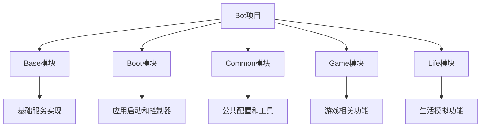
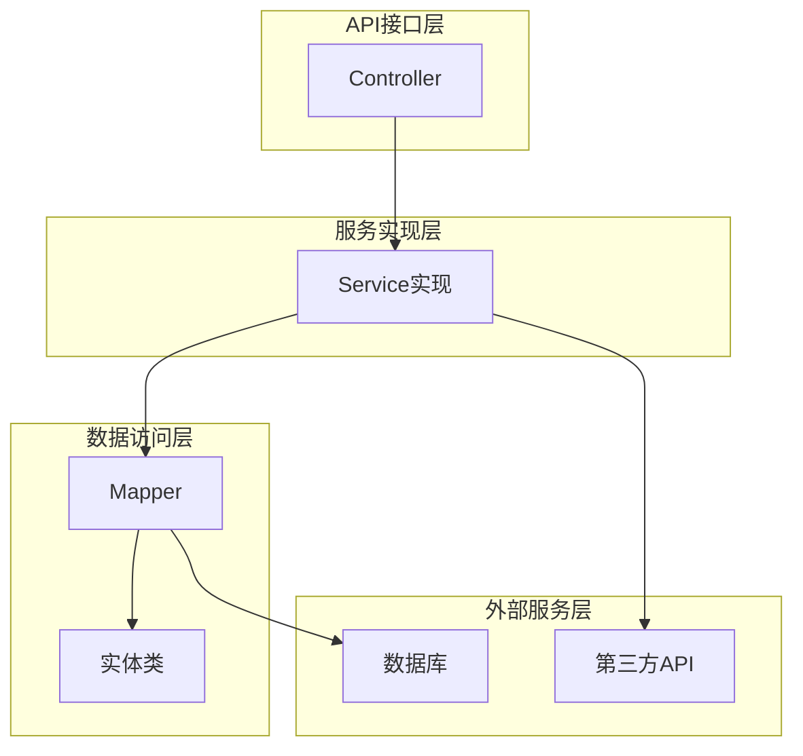
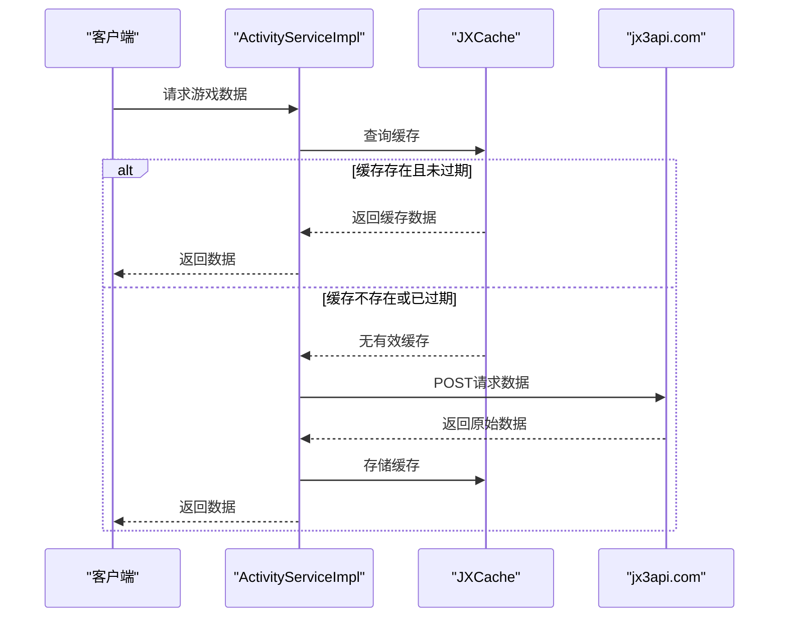
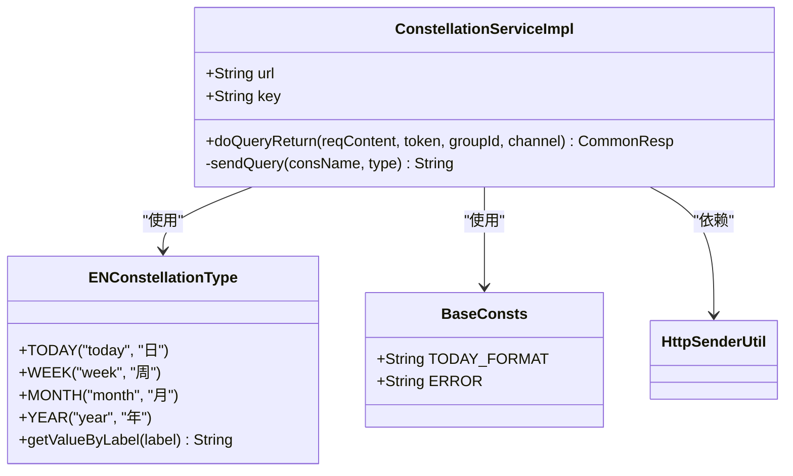
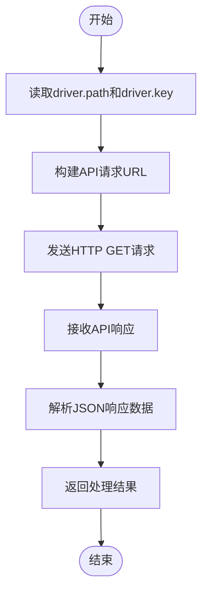
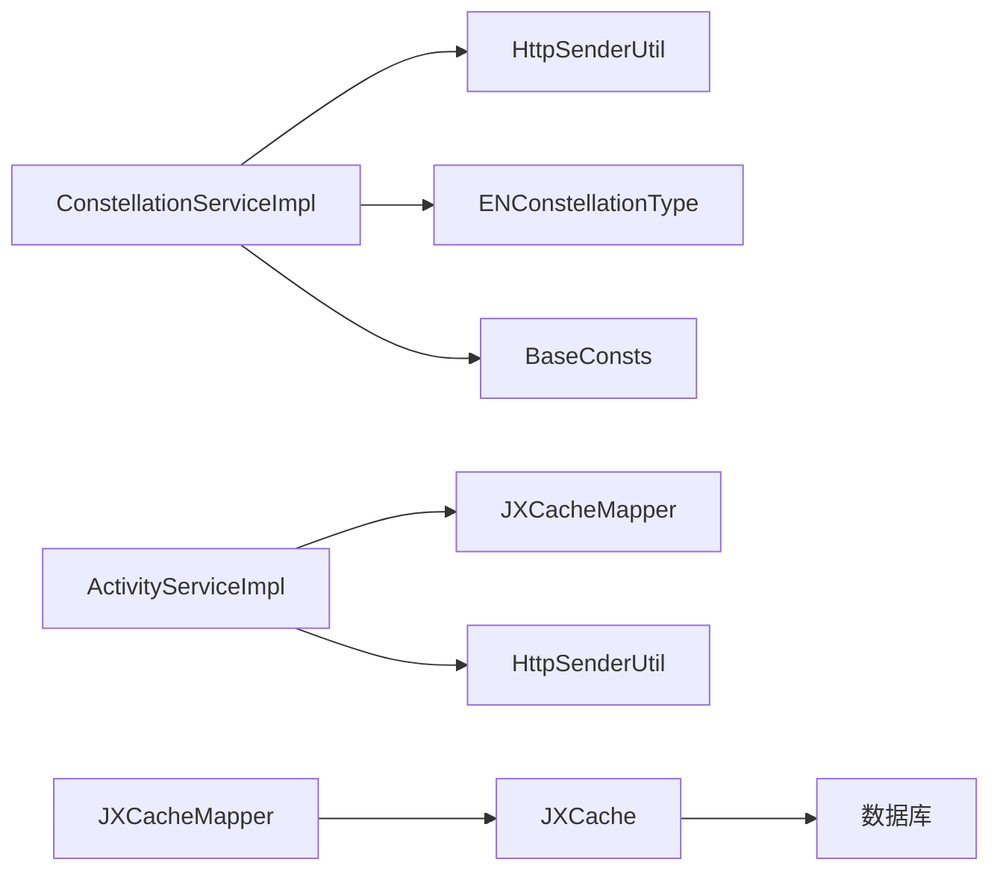

# 第三方服务API

<cite>
**本文档引用的文件**  
- [application.properties](file://Boot/src/main/resources/application.properties)
- [ConstellationServiceImpl.java](file://Base/src/main/java/com/bot/base/service/impl/ConstellationServiceImpl.java)
- [ActivityServiceImpl.java](file://Base/src/main/java/com/bot/base/service/impl/ActivityServiceImpl.java)
- [HttpSenderUtil.java](file://Common/src/main/java/com/bot/common/util/HttpSenderUtil.java)
- [JXCache.java](file://Game/src/main/java/com/bot/game/dao/entity/JXCache.java)
- [JXCacheMapper.java](file://Game/src/main/java/com/bot/game/dao/mapper/JXCacheMapper.java)
- [JXCacheMapper.xml](file://Game/src/main/resources/mapper/JXCacheMapper.xml)
- [BaseConsts.java](file://Common/src/main/java/com/bot/common/constant/BaseConsts.java)
- [ENConstellationType.java](file://Common/src/main/java/com/bot/common/enums/ENConstellationType.java)
</cite>

## 目录
1. [简介](#简介)
2. [项目结构](#项目结构)
3. [核心组件](#核心组件)
4. [架构概述](#架构概述)
5. [详细组件分析](#详细组件分析)
6. [依赖分析](#依赖分析)
7. [性能考虑](#性能考虑)
8. [故障排除指南](#故障排除指南)
9. [结论](#结论)

## 简介
本文档系统性地介绍了剑三数据API（jx3.url）、星座API（constellation.path）和驾考题库API（driver.path）等第三方服务API。详细说明了各API的配置、密钥管理、请求配额限制和数据缓存策略。重点描述了API密钥轮换的最佳实践和安全存储建议，为开发者提供全面的API使用指南。

## 项目结构
项目采用模块化设计，主要分为Base、Boot、Common、Game和Life五个模块。每个模块负责不同的功能领域，通过清晰的包结构和依赖管理实现功能解耦。

**图表来源**
- [application.properties](file://Boot/src/main/resources/application.properties)

**本节来源**
- [application.properties](file://Boot/src/main/resources/application.properties)

## 核心组件
核心组件包括第三方API服务实现、HTTP请求工具、缓存机制和配置管理。这些组件共同构成了系统与外部服务交互的基础架构。

**本节来源**
- [ConstellationServiceImpl.java](file://Base/src/main/java/com/bot/base/service/impl/ConstellationServiceImpl.java)
- [HttpSenderUtil.java](file://Common/src/main/java/com/bot/common/util/HttpSenderUtil.java)

## 架构概述
系统采用分层架构设计，从上到下分为API接口层、服务实现层、数据访问层和外部服务层。这种设计模式提高了代码的可维护性和可扩展性。

**图表来源**
- [ConstellationServiceImpl.java](file://Base/src/main/java/com/bot/base/service/impl/ConstellationServiceImpl.java)
- [JXCacheMapper.java](file://Game/src/main/java/com/bot/game/dao/mapper/JXCacheMapper.java)

## 详细组件分析

### 剑三数据API (jx3.url) 分析
剑三数据API用于查询游戏数据，包括日常任务、金价、资讯等信息。API通过POST请求与jx3api.com进行通信，使用token进行身份验证。

**图表来源**
- [ActivityServiceImpl.java](file://Base/src/main/java/com/bot/base/service/impl/ActivityServiceImpl.java)
- [JXCache.java](file://Game/src/main/java/com/bot/game/dao/entity/JXCache.java)

**本节来源**
- [ActivityServiceImpl.java](file://Base/src/main/java/com/bot/base/service/impl/ActivityServiceImpl.java)
- [JXCache.java](file://Game/src/main/java/com/bot/game/dao/entity/JXCache.java)

### 星座API (constellation.path) 分析
星座API用于获取星座运势信息，支持查询日、周、月、年四种类型的运势。API通过GET请求与聚合数据平台通信，使用API key进行身份验证。

**图表来源**
- [ConstellationServiceImpl.java](file://Base/src/main/java/com/bot/base/service/impl/ConstellationServiceImpl.java)
- [ENConstellationType.java](file://Common/src/main/java/com/bot/common/enums/ENConstellationType.java)
- [BaseConsts.java](file://Common/src/main/java/com/bot/common/constant/BaseConsts.java)

**本节来源**
- [ConstellationServiceImpl.java](file://Base/src/main/java/com/bot/base/service/impl/ConstellationServiceImpl.java)
- [ENConstellationType.java](file://Common/src/main/java/com/bot/common/enums/ENConstellationType.java)

### 驾考题库API (driver.path) 分析
驾考题库API用于提供驾考服务，通过京东云服务接口获取驾考题目和答案。API使用特定的key进行身份验证，确保请求的合法性。

**图表来源**
- [application.properties](file://Boot/src/main/resources/application.properties)
- [HttpSenderUtil.java](file://Common/src/main/java/com/bot/common/util/HttpSenderUtil.java)

**本节来源**
- [application.properties](file://Boot/src/main/resources/application.properties)

## 依赖分析
系统依赖关系清晰，各模块通过定义良好的接口进行通信。第三方API依赖通过配置文件管理，便于维护和更新。

**图表来源**
- [ConstellationServiceImpl.java](file://Base/src/main/java/com/bot/base/service/impl/ConstellationServiceImpl.java)
- [ActivityServiceImpl.java](file://Base/src/main/java/com/bot/base/service/impl/ActivityServiceImpl.java)
- [JXCacheMapper.java](file://Game/src/main/java/com/bot/game/dao/mapper/JXCacheMapper.java)

**本节来源**
- [ConstellationServiceImpl.java](file://Base/src/main/java/com/bot/base/service/impl/ConstellationServiceImpl.java)
- [ActivityServiceImpl.java](file://Base/src/main/java/com/bot/base/service/impl/ActivityServiceImpl.java)

## 性能考虑
系统通过多种机制优化性能，包括数据缓存、请求合并和超时设置。这些优化措施有效减少了对外部API的请求频率，提高了系统响应速度。

### 缓存策略
系统采用多级缓存策略，根据不同的数据类型设置不同的缓存有效期：

| 数据类型 | 缓存有效期 | 缓存键 | 缓存表 |
|---------|-----------|-------|-------|
| 资讯数据 | 2小时 | news | bot_jx_cache |
| 金价数据 | 12小时 | serverName | bot_jx_cache |
| 名片秀数据 | 10分钟 | serverName-name | bot_jx_cache |

**本节来源**
- [ActivityServiceImpl.java](file://Base/src/main/java/com/bot/base/service/impl/ActivityServiceImpl.java)
- [JXCache.java](file://Game/src/main/java/com/bot/game/dao/entity/JXCache.java)

## 故障排除指南
本节提供常见问题的解决方案和调试建议，帮助开发者快速定位和解决问题。

### API密钥管理最佳实践
1. **密钥轮换**：定期更换API密钥，建议每3个月轮换一次
2. **安全存储**：将密钥存储在配置文件中，避免硬编码在代码中
3. **访问控制**：限制密钥的访问权限，只允许必要的服务使用
4. **监控告警**：设置API调用监控，异常调用及时告警

### 常见问题
- **API调用失败**：检查网络连接和API地址是否正确
- **响应超时**：检查超时设置是否合理，当前设置为180秒
- **数据格式错误**：检查请求参数是否符合API文档要求
- **认证失败**：检查API密钥是否正确且未过期

**本节来源**
- [application.properties](file://Boot/src/main/resources/application.properties)
- [HttpSenderUtil.java](file://Common/src/main/java/com/bot/common/util/HttpSenderUtil.java)

## 结论
本文档详细介绍了第三方服务API的配置和使用方法。通过合理的架构设计和优化策略，系统能够高效、安全地与外部服务进行交互。建议开发者遵循文档中的最佳实践，确保系统的稳定性和安全性。