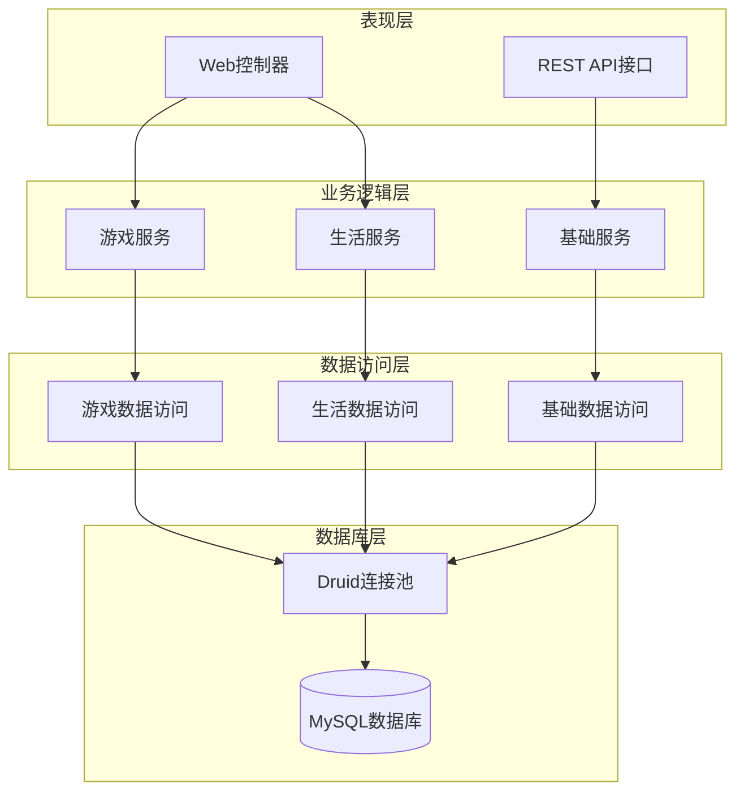
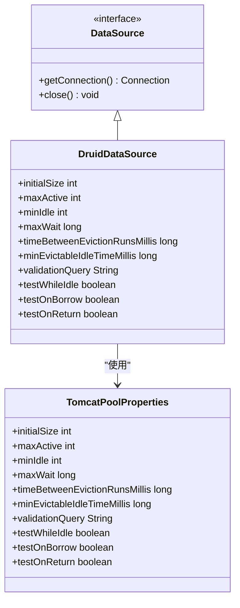
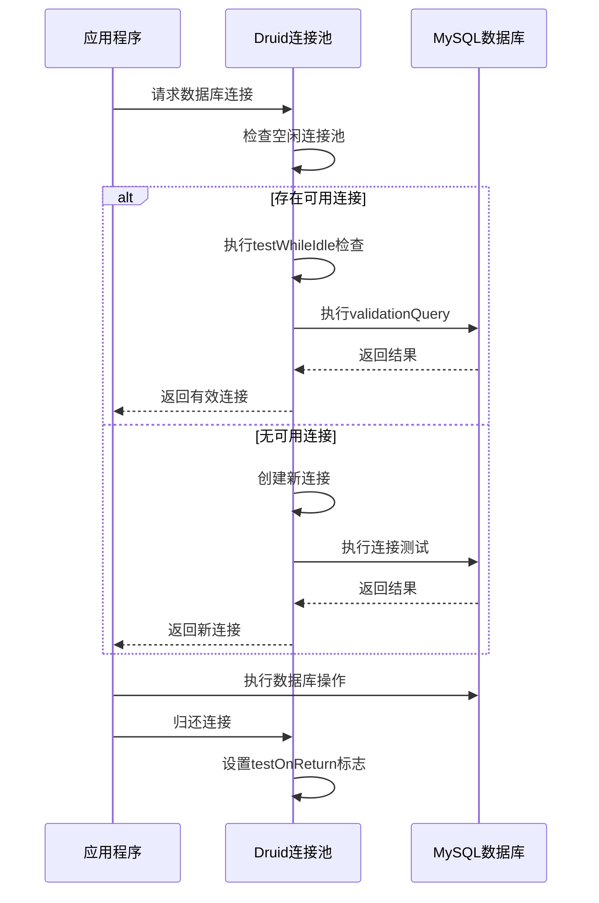
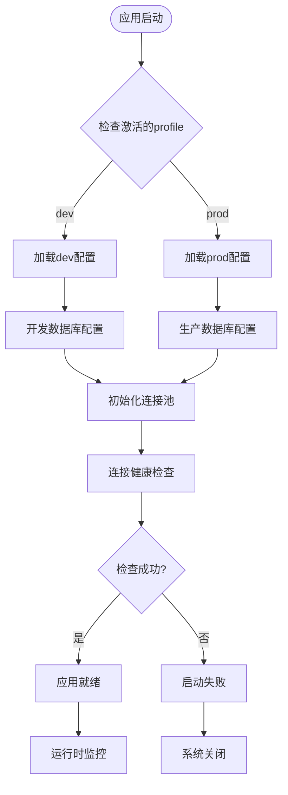
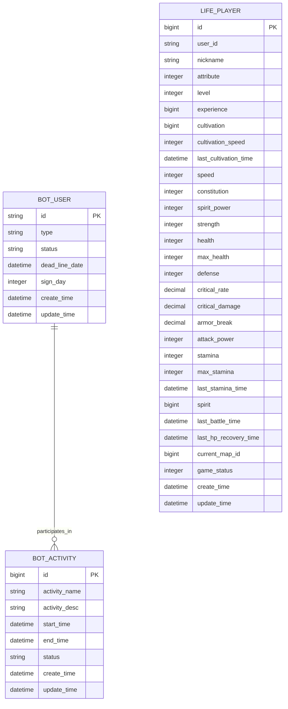
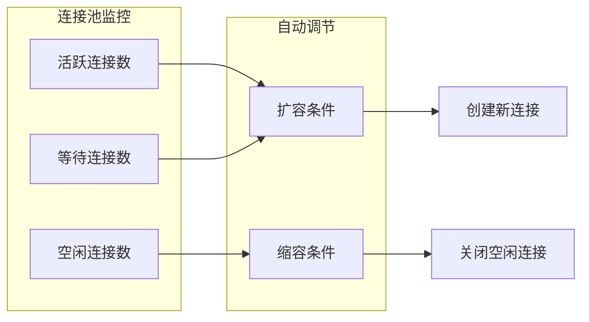
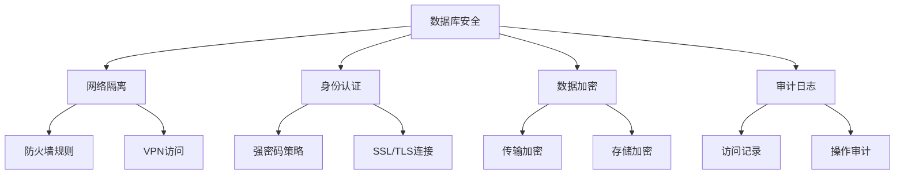
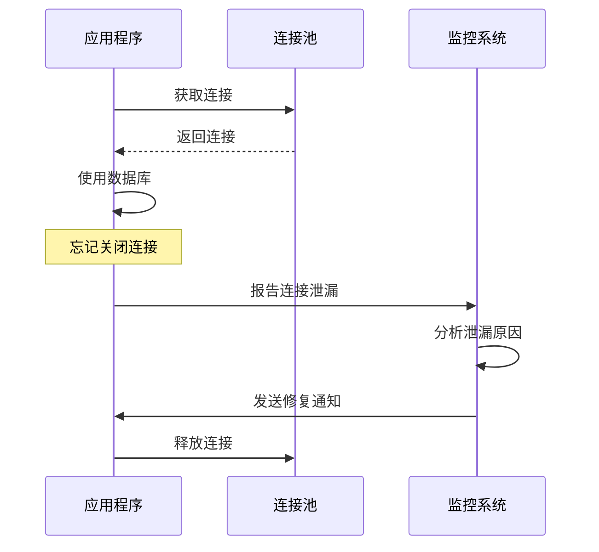
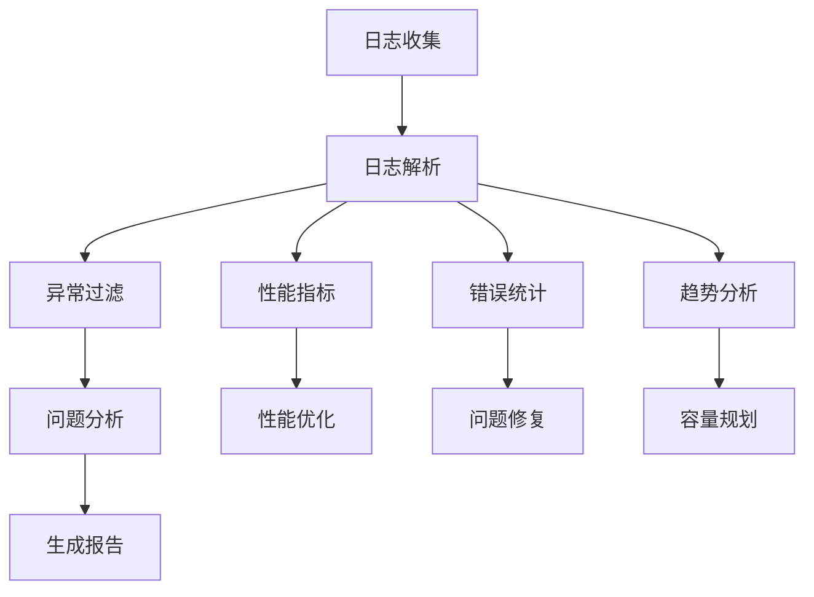

# 数据库配置

<cite>
**本文档引用的文件**
- [application.properties](file://Boot/src/main/resources/application.properties)
- [application-dev.properties](file://Boot/src/main/resources/application-dev.properties)
- [application-prod.properties](file://Boot/src/main/resources/application-prod.properties)
- [BotApplication.java](file://Boot/src/main/java/com/bot/boot/BotApplication.java)
- [generatorConfig.xml](file://Boot/src/main/resources/generatorConfig.xml)
- [pom.xml](file://pom.xml)
- [BotException.java](file://Common/src/main/java/com/bot/common/exception/BotException.java)
- [GlobalExceptionHandler.java](file://Boot/src/main/java/com/bot/boot/aspect/GlobalExceptionHandler.java)
- [BotUser.java](file://Game/src/main/java/com/bot/game/dao/entity/BotUser.java)
- [LifePlayer.java](file://Life/src/main/java/com/bot/life/dao/entity/LifePlayer.java)
</cite>

## 目录
1. [简介](#简介)
2. [项目架构概览](#项目架构概览)
3. [数据库配置基础](#数据库配置基础)
4. [Druid连接池配置详解](#druid连接池配置详解)
5. [开发环境与生产环境对比](#开发环境与生产环境对比)
6. [MyBatis配置说明](#mybatis配置说明)
7. [数据库连接最佳实践](#数据库连接最佳实践)
8. [故障排查指南](#故障排查指南)
9. [总结](#总结)

## 简介

Bot项目是一个基于Spring Boot框架构建的多功能聊天机器人系统，采用MySQL作为主要数据库存储。该项目通过Spring Data JPA和MyBatis两种ORM框架实现数据持久化，使用Druid连接池进行数据库连接管理，支持多模块架构的数据访问层设计。

本文档详细介绍了Bot项目中数据库连接的完整配置体系，包括基础连接参数、Druid连接池各项配置参数的含义及其对系统性能的影响，以及开发环境与生产环境配置的差异对比。

## 项目架构概览

Bot项目采用分层架构设计，数据库访问层位于应用架构的核心位置：

**图表来源**
- [BotApplication.java](file://Boot/src/main/java/com/bot/boot/BotApplication.java#L12-L21)

**章节来源**
- [BotApplication.java](file://Boot/src/main/java/com/bot/boot/BotApplication.java#L1-L22)

## 数据库配置基础

### Spring DataSource核心配置

Bot项目的基础数据库连接配置包含以下核心参数：

#### 基础连接参数

| 配置项 | 值 | 说明 |
|--------|-----|------|
| spring.datasource.url | jdbc:mysql://47.92.127.30:3306/bot?useUnicode=true&characterEncoding=utf8&useSSL=false&serverTimezone=UTC | 数据库连接URL，包含主机、端口、数据库名及连接参数 |
| spring.datasource.username | root | 数据库用户名 |
| spring.datasource.password | gouzaizi@123 | 数据库密码 |
| spring.datasource.driver-class-name | com.mysql.cj.jdbc.Driver | MySQL JDBC驱动类 |

#### 连接池类型配置

**图表来源**
- [application.properties](file://Boot/src/main/resources/application.properties#L48-L51)
- [application-dev.properties](file://Boot/src/main/resources/application-dev.properties#L34-L37)

**章节来源**
- [application.properties](file://Boot/src/main/resources/application.properties#L47-L51)
- [application-dev.properties](file://Boot/src/main/resources/application-dev.properties#L33-L37)

## Druid连接池配置详解

### 连接池参数详解

Druid连接池提供了丰富的配置选项，每个参数都直接影响系统的性能和稳定性：

#### 核心连接参数

| 参数名称 | 默认值 | 推荐值 | 说明 | 性能影响 |
|----------|--------|--------|------|----------|
| initial-size | 10 | 1 | 初始化时创建的连接数 | 影响应用启动时间 |
| max-active | 8 | 60000 | 最大活跃连接数 | 影响并发处理能力 |
| min-idle | 10 | 3 | 最小空闲连接数 | 影响连接获取效率 |
| max-wait | -1 | 20 | 获取连接的最大等待时间(ms) | 影响响应时间 |

#### 连接维护参数

| 参数名称 | 默认值 | 推荐值 | 说明 | 性能影响 |
|----------|--------|--------|------|----------|
| time-between-eviction-runs-millis | 60000 | 60000 | 连接池空闲检测间隔(ms) | 影响资源回收效率 |
| min-evictable-idle-time-millis | 600000 | 300000 | 连接最小空闲时间(ms) | 影响连接复用率 |
| validation-query | select 1 | select 'x' | 连接有效性检测SQL | 影响连接健康检查效率 |

#### 连接测试策略

**图表来源**
- [application.properties](file://Boot/src/main/resources/application.properties#L53-L62)
- [application-dev.properties](file://Boot/src/main/resources/application-dev.properties#L39-L48)

### 参数配置策略

#### 开发环境配置特点

开发环境采用保守的连接池配置：
- 初始连接数：1
- 最大活跃连接：10
- 最小空闲连接：3
- 连接超时：20ms

这种配置适合开发调试，避免过多的数据库连接占用。

#### 生产环境配置优化

生产环境采用高性能配置：
- 初始连接数：1
- 最大活跃连接：60000
- 最小空闲连接：3
- 连接超时：20ms

这种配置支持高并发访问，但需要确保数据库服务器有足够的资源。

**章节来源**
- [application.properties](file://Boot/src/main/resources/application.properties#L53-L62)
- [application-dev.properties](file://Boot/src/main/resources/application-dev.properties#L39-L48)
- [application-prod.properties](file://Boot/src/main/resources/application-prod.properties#L76-L85)

## 开发环境与生产环境对比

### 配置差异分析

| 配置项 | 开发环境 | 生产环境 | 差异说明 |
|--------|----------|----------|----------|
| 数据库URL | jdbc:mysql://47.92.127.30:3306/bot | jdbc:mysql://47.92.127.30:3306/bot | 完全相同 |
| 用户名 | root | root | 完全相同 |
| 密码 | gouzaizi@123 | gouzaizi@123 | 完全相同 |
| 驱动类 | com.mysql.cj.jdbc.Driver | com.mysql.cj.jdbc.Driver | 完全相同 |
| 连接池类型 | com.alibaba.druid.pool.DruidDataSource | com.alibaba.druid.pool.DruidDataSource | 完全相同 |
| 初始连接数 | 1 | 1 | 开发环境更保守 |
| 最大活跃连接 | 10 | 60000 | 生产环境支持高并发 |
| 最小空闲连接 | 3 | 3 | 数值相同，意义不同 |
| 连接超时 | 20ms | 20ms | 完全相同 |
| 日志路径 | D:\\home\\gardpay\\reconciliation\\logs\\ | /data/project/bot/logs | 文件系统路径差异 |
| 文本路径 | 空 | /data/project/bot/text/ | 文件系统路径差异 |

### 环境切换机制

**图表来源**
- [application.properties](file://Boot/src/main/resources/application.properties#L2)
- [pom.xml](file://pom.xml#L125-L146)

**章节来源**
- [application-dev.properties](file://Boot/src/main/resources/application-dev.properties#L1-L59)
- [application-prod.properties](file://Boot/src/main/resources/application-prod.properties#L1-L92)

## MyBatis配置说明

### ORM框架配置

Bot项目同时使用Spring Data JPA和MyBatis两种ORM框架，每种框架都有其特定的数据库配置：

#### MyBatis核心配置

| 配置项 | 值 | 说明 |
|--------|-----|------|
| mybatis.configuration.map-underscore-to-camel-case | true | 自动将下划线命名转换为驼峰命名 |
| mybatis.configuration.default-fetch-size | 100 | 默认游标大小 |
| mybatis.configuration.default-statement-timeout | 3000 | 默认语句超时时间(毫秒) |
| mybatis.type-aliases-package | com.bot.game.mapper,com.bot.life.mapper | 类型别名扫描包 |
| mybatis.mapper-locations | classpath*:mapper/*.xml | Mapper XML文件位置 |

#### 数据库表结构示例

**图表来源**
- [BotUser.java](file://Game/src/main/java/com/bot/game/dao/entity/BotUser.java#L6-L214)
- [LifePlayer.java](file://Life/src/main/java/com/bot/life/dao/entity/LifePlayer.java#L12-L130)

### 配置文件位置

MyBatis的Mapper XML文件分布在不同的模块中：
- 游戏模块：`Game/src/main/resources/mapper/*.xml`
- 生活模块：`Life/src/main/resources/mapper/*.xml`

**章节来源**
- [application.properties](file://Boot/src/main/resources/application.properties#L64-L69)
- [application-dev.properties](file://Boot/src/main/resources/application-dev.properties#L50-L55)

## 数据库连接最佳实践

### 连接池配置优化建议

#### 1. 合理设置初始连接数

- **开发环境**：1-3个连接，快速启动
- **测试环境**：5-10个连接，平衡性能和资源
- **生产环境**：根据并发需求设置，通常为CPU核心数×2

#### 2. 动态调整最大连接数

#### 3. 连接超时策略

| 超时类型 | 推荐值 | 说明 |
|----------|--------|------|
| 连接获取超时 | 20-50ms | 避免长时间等待 |
| 查询执行超时 | 3000ms | 平衡查询质量和响应时间 |
| 连接空闲超时 | 300000ms | 保持连接活跃但不过度占用 |

### 性能监控指标

#### 关键性能指标(KPI)

| 指标名称 | 正常范围 | 监控方法 |
|----------|----------|----------|
| 连接池利用率 | 60-80% | (活跃连接数/最大连接数)×100% |
| 连接获取平均时间 | <10ms | 监控连接池统计信息 |
| 连接泄漏率 | <1% | 定期检查连接使用情况 |
| 数据库响应时间 | <50ms | 监控慢查询日志 |

### 安全配置建议

#### 数据库安全配置

## 故障排查指南

### 常见数据库连接问题

#### 1. 连接超时问题

**症状**：应用程序抛出`ConnectionTimeoutException`或类似异常

**排查步骤**：
1. 检查数据库连接池配置
2. 监控数据库服务器负载
3. 检查网络连接稳定性
4. 分析慢查询日志

**解决方案**：
- 增加`max-wait`参数值
- 优化数据库查询性能
- 增加数据库服务器资源
- 调整连接池大小

#### 2. 认证失败问题

**症状**：出现`Access denied for user`错误

**排查步骤**：
1. 验证数据库用户名和密码
2. 检查用户权限设置
3. 确认数据库服务状态
4. 检查网络访问限制

**解决方案**：
- 更新正确的数据库凭据
- 授予必要的数据库权限
- 检查防火墙设置
- 验证数据库服务配置

#### 3. 连接泄漏问题

**症状**：连接池耗尽，无法获取新连接

**排查步骤**：
1. 启用Druid连接池监控
2. 检查未关闭的数据库连接
3. 分析连接使用模式
4. 监控连接池统计信息

**解决方案**：

#### 4. 数据库死锁问题

**症状**：查询长时间挂起，出现死锁异常

**排查步骤**：
1. 查看数据库死锁日志
2. 分析事务执行顺序
3. 检查索引使用情况
4. 优化事务边界

**解决方案**：
- 重新排序事务操作
- 添加适当的索引
- 缩短事务持续时间
- 使用乐观锁替代悲观锁

### 监控和诊断工具

#### Druid连接池监控

| 监控指标 | 说明 | 正常阈值 |
|----------|------|----------|
| ActiveCount | 活跃连接数 | < MaxActive × 0.8 |
| PoolingCount | 池中连接数 | > MinIdle |
| WaitThreadCount | 等待线程数 | = 0 |
| NotEmptyWaitCount | 非空等待次数 | 稳定增长 |
| ConnectErrorCount | 连接错误次数 | 稳定增长 |

#### 日志分析

### 故障恢复策略

#### 自动恢复机制

1. **连接重试**：自动重试失败的数据库连接
2. **降级策略**：在数据库不可用时提供缓存数据
3. **熔断保护**：暂时停止数据库访问，防止雪崩效应
4. **备用数据库**：主数据库故障时切换到备用节点

#### 手动恢复步骤

1. 检查数据库服务状态
2. 重启数据库连接池
3. 清理僵尸连接
4. 重新建立数据库连接
5. 验证数据一致性

**章节来源**
- [BotException.java](file://Common/src/main/java/com/bot/common/exception/BotException.java#L1-L20)
- [GlobalExceptionHandler.java](file://Boot/src/main/java/com/bot/boot/aspect/GlobalExceptionHandler.java#L1-L26)

## 总结

Bot项目的数据库配置体系体现了现代Java应用的最佳实践，通过Spring Boot的自动配置机制简化了数据库连接的设置。Druid连接池的强大功能为系统提供了稳定可靠的数据库访问能力。

### 关键配置要点

1. **基础连接参数**：正确配置数据库URL、用户名、密码和驱动类
2. **连接池优化**：根据应用场景合理设置连接池参数
3. **环境差异化**：开发和生产环境采用不同的配置策略
4. **性能监控**：建立完善的监控体系及时发现和解决问题

### 最佳实践总结

- **开发阶段**：采用保守配置，注重开发效率
- **测试阶段**：模拟生产环境，验证配置合理性
- **生产阶段**：优化配置参数，确保系统稳定性
- **运维阶段**：持续监控，及时调整配置

通过遵循本文档的指导原则和最佳实践，可以确保Bot项目数据库系统的稳定运行和优异性能。定期审查和优化数据库配置是保证系统长期稳定运行的重要措施。