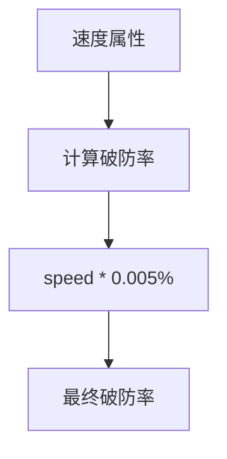
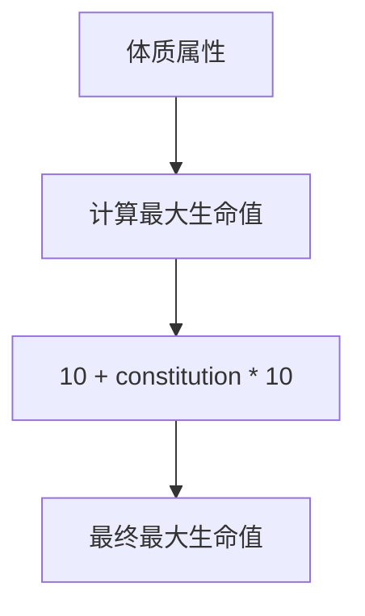
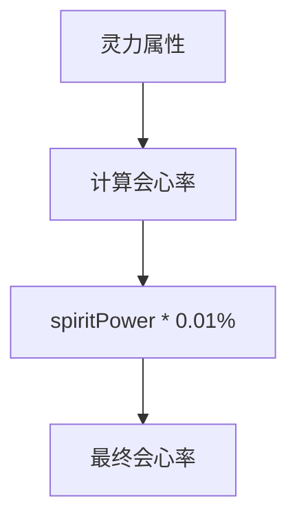
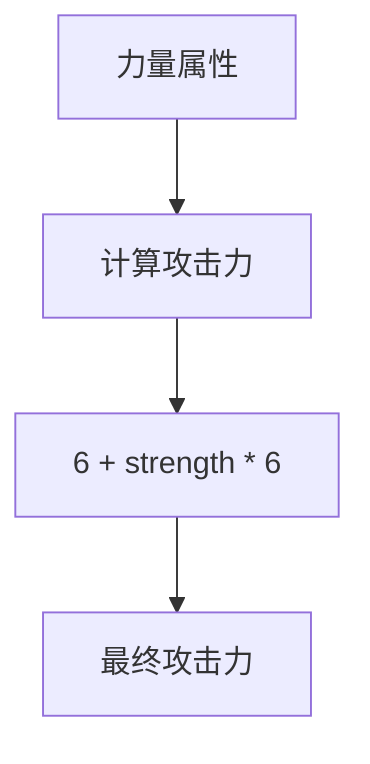
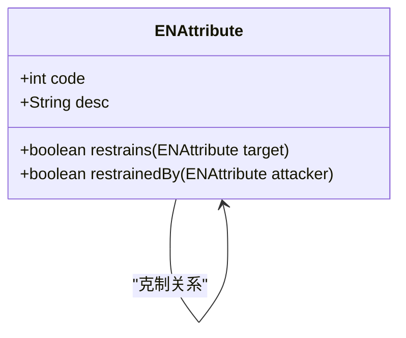
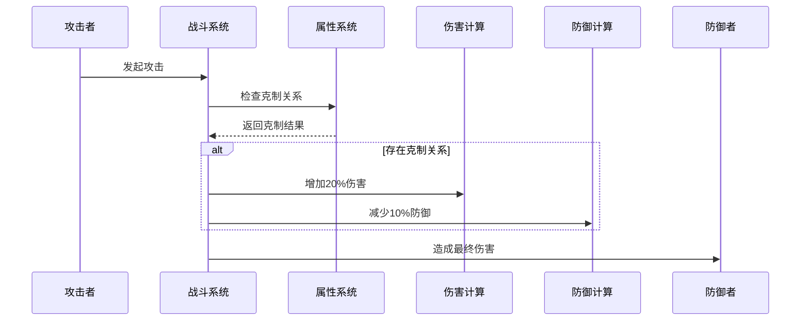
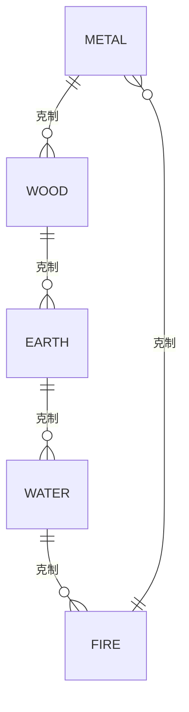

# 游戏配置

<cite>
**本文档引用文件**  
- [Life_Deployment_Guide.md](file://Life_Deployment_Guide.md)
- [LifePlayer.java](file://Life/src/main/java/com/bot/life/dao/entity/LifePlayer.java)
- [BattleServiceImpl.java](file://Life/src/main/java/com/bot/life/service/impl/BattleServiceImpl.java)
- [ENAttribute.java](file://Life/src/main/java/com/bot/life/enums/ENAttribute.java)
- [Life_Database_Init.sql](file://Life_Database_Init.sql)
</cite>

## 目录
1. [引言](#引言)
2. [游戏平衡性配置概述](#游戏平衡性配置概述)
3. [属性影响系数详解](#属性影响系数详解)
4. [战斗公式参数解析](#战斗公式参数解析)
5. [游戏机制中的配置作用](#游戏机制中的配置作用)
6. [游戏难度调整最佳实践](#游戏难度调整最佳实践)
7. [配置修改示例](#配置修改示例)
8. [结论](#结论)

## 引言
《浮生卷》是一款修仙题材的文字游戏，其核心玩法围绕角色成长、战斗系统和属性克制展开。本配置文档旨在详细解释Life模块中的游戏平衡性配置，帮助开发者和运营人员理解并调整游戏难度和玩法体验。通过深入分析`life_system_config`表中的各项配置，我们可以精确控制游戏的平衡性，确保玩家在不同阶段都能获得良好的游戏体验。

## 游戏平衡性配置概述
游戏平衡性配置主要存储在`life_system_config`表中，该表通过键值对的形式存储各种游戏参数。这些参数涵盖了从角色属性成长到战斗机制的各个方面，是调整游戏难度和玩法体验的核心。通过动态修改这些配置，可以在不重新编译代码的情况下，快速响应玩家反馈和市场变化。

**文档来源**
- [Life_Deployment_Guide.md](file://Life_Deployment_Guide.md#L97-L113)
- [Life_Database_Init.sql](file://Life_Database_Init.sql#L482-L498)

## 属性影响系数详解
属性影响系数决定了角色基础属性对拓展属性的转化率。这些系数直接影响角色的成长曲线和职业定位，是游戏平衡性的基石。

### 速度破防率 (speed_armor_break_rate)
每点速度增加0.005%的破防率。这意味着速度属性不仅影响行动顺序，还能间接提升输出能力。高速度角色在面对高防御敌人时更具优势。



**图表来源**
- [LifePlayer.java](file://Life/src/main/java/com/bot/life/dao/entity/LifePlayer.java#L58)
- [Life_Deployment_Guide.md](file://Life_Deployment_Guide.md#L103)

### 体质生命率 (constitution_health_rate)
每点体质增加10点最大生命值。体质是生存能力的核心属性，直接影响角色的耐久度。该系数决定了坦克型角色的基础生存能力。



**图表来源**
- [LifePlayer.java](file://Life/src/main/java/com/bot/life/dao/entity/LifePlayer.java#L61)
- [Life_Deployment_Guide.md](file://Life_Deployment_Guide.md#L104)

### 灵力会心率 (spirit_critical_rate)
每点灵力增加0.01%的会心率。会心攻击能造成更高伤害，是输出型角色的核心属性。该系数平衡了稳定输出和爆发输出的关系。



**图表来源**
- [LifePlayer.java](file://Life/src/main/java/com/bot/life/dao/entity/LifePlayer.java#L65)
- [Life_Deployment_Guide.md](file://Life_Deployment_Guide.md#L106)

### 力量攻击力 (strength_attack_rate)
每点力量增加6点攻击力。力量是物理输出的核心属性，直接决定基础伤害。该系数影响了力量型职业的伤害成长曲线。



**图表来源**
- [LifePlayer.java](file://Life/src/main/java/com/bot/life/dao/entity/LifePlayer.java#L69)
- [Life_Deployment_Guide.md](file://Life_Deployment_Guide.md#L108)

## 战斗公式参数解析
战斗公式参数定义了战斗中的各种机制，包括属性克制、防御计算和逃跑成功率等。这些参数共同构成了游戏的战斗系统。

### 属性克制伤害加成 (attribute_restraint_damage_bonus)
当攻击方属性克制防御方时，伤害增加20%。这是五行相克系统的核心参数，鼓励玩家根据敌人属性选择合适的战斗策略。



**图表来源**
- [ENAttribute.java](file://Life/src/main/java/com/bot/life/enums/ENAttribute.java#L45-L53)
- [Life_Deployment_Guide.md](file://Life_Deployment_Guide.md#L110)

### 被克制防御惩罚 (attribute_restrained_defense_penalty)
当防御方属性被攻击方克制时，防御减少10%。这个参数与属性克制伤害加成配合使用，双重强化了属性克制的效果。



**图表来源**
- [BattleServiceImpl.java](file://Life/src/main/java/com/bot/life/service/impl/BattleServiceImpl.java#L129-L130)
- [Life_Deployment_Guide.md](file://Life_Deployment_Guide.md#L111)

### 最大破防率 (max_armor_break_rate)
破防率上限为30%。这个参数防止了过度破防导致防御属性贬值，维护了防御属性的价值。

```mermaid
flowchart TD
A[计算破防率] --> B[armorBreakRate = Math.min(0.3, ...)]
B --> C{破防率≤30%?}
C --> |是| D[使用计算值]
C --> |否| E[使用30%上限]
```

**图表来源**
- [BattleServiceImpl.java](file://Life/src/main/java/com/bot/life/service/impl/BattleServiceImpl.java#L158)
- [Life_Deployment_Guide.md](file://Life_Deployment_Guide.md#L112)

## 游戏机制中的配置作用
这些配置项在游戏机制中扮演着关键角色，它们不仅影响单个角色的成长，还决定了整个游戏的平衡性和策略深度。

### 属性成长机制
属性成长机制通过基础属性影响拓展属性，形成了不同的职业定位。例如，高体质角色适合坦克定位，高灵力角色适合输出定位。这种设计鼓励玩家根据自己的游戏风格选择发展方向。

**文档来源**
- [LifePlayer.java](file://Life/src/main/java/com/bot/life/dao/entity/LifePlayer.java#L56-L75)

### 战斗平衡机制
战斗平衡机制通过属性克制、会心系统和防御计算，创造了丰富的战斗策略。玩家需要根据敌人的属性和配置，选择合适的战斗策略和技能组合。

**文档来源**
- [BattleServiceImpl.java](file://Life/src/main/java/com/bot/life/service/impl/BattleServiceImpl.java#L149-L162)

### 五行相克系统
五行相克系统（金克木、木克土、土克水、水克火、火克金）是游戏的核心策略元素。通过`attribute_restraint_damage_bonus`和`attribute_restrained_defense_penalty`两个参数，实现了完整的属性克制循环。



**图表来源**
- [ENAttribute.java](file://Life/src/main/java/com/bot/life/enums/ENAttribute.java#L49-L53)

## 游戏难度调整最佳实践
通过调整`life_system_config`表中的配置，可以有效控制游戏难度和玩法体验。以下是一些最佳实践建议。

### 新手期难度调整
对于新手玩家，可以适当提高属性成长系数，让角色成长更加明显，增强成就感。

```sql
-- 提高新手期属性成长
UPDATE life_system_config SET config_value = '15' WHERE config_key = 'constitution_health_rate';
UPDATE life_system_config SET config_value = '8' WHERE config_key = 'strength_attack_rate';
```

**文档来源**
- [Life_Deployment_Guide.md](file://Life_Deployment_Guide.md#L217)

### 中后期难度平衡
在游戏后期，应更加注重属性克制和战斗策略，适当降低基础属性成长，突出策略的重要性。

```sql
-- 降低后期属性成长，突出策略
UPDATE life_system_config SET config_value = '8' WHERE config_key = 'constitution_health_rate';
UPDATE life_system_config SET config_value = '5' WHERE config_key = 'strength_attack_rate';
-- 强化属性克制效果
UPDATE life_system_config SET config_value = '25' WHERE config_key = 'attribute_restraint_damage_bonus';
```

**文档来源**
- [Life_Deployment_Guide.md](file://Life_Deployment_Guide.md#L220)

### 特殊活动配置
在特殊活动期间，可以临时调整配置，创造独特的游戏体验。

```sql
-- 双倍掉落活动
UPDATE life_system_config SET config_value = '2.0' WHERE config_key = 'drop_rate_multiplier';
-- 节日特殊属性效果
UPDATE life_system_config SET config_value = '30' WHERE config_key = 'attribute_restraint_damage_bonus';
```

## 配置修改示例
以下是几个典型的配置修改示例，展示了如何通过调整配置来改变游戏体验。

### 增强坦克职业
通过提高体质相关系数，增强坦克职业的生存能力。

```sql
-- 增强坦克职业
UPDATE life_system_config SET config_value = '15' WHERE config_key = 'constitution_health_rate';
UPDATE life_system_config SET config_value = '1.5' WHERE config_key = 'constitution_defense_rate';
-- 降低速度对破防的影响，避免速度坦克
UPDATE life_system_config SET config_value = '0.003' WHERE config_key = 'speed_armor_break_rate';
```

### 强化输出职业
通过提高灵力和力量相关系数，增强输出职业的伤害能力。

```sql
-- 强化输出职业
UPDATE life_system_config SET config_value = '0.015' WHERE config_key = 'spirit_critical_rate';
UPDATE life_system_config SET config_value = '0.01' WHERE config_key = 'spirit_critical_damage_rate';
UPDATE life_system_config SET config_value = '7' WHERE config_key = 'strength_attack_rate';
```

### 调整战斗节奏
通过调整逃跑成功率相关参数，改变战斗的紧张程度。

```sql
-- 降低逃跑难度，增加游戏流畅性
UPDATE life_system_config SET config_value = '60' WHERE config_key = 'escape_base_success_rate';
UPDATE life_system_config SET config_value = '1' WHERE config_key = 'escape_speed_penalty_rate';
-- 提高战斗奖励，鼓励战斗
UPDATE life_system_config SET config_value = '1.5' WHERE config_key = 'battle_reward_multiplier';
```

## 结论
游戏平衡性配置是《浮生卷》游戏设计的核心。通过深入理解`life_system_config`表中的各项参数，我们可以精确控制游戏的难度和玩法体验。合理的配置调整不仅能改善玩家体验，还能有效应对游戏运营中的各种挑战。建议定期分析玩家数据和反馈，动态调整配置，保持游戏的长期活力。