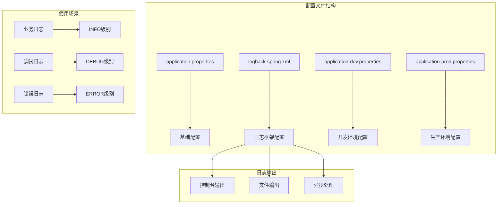
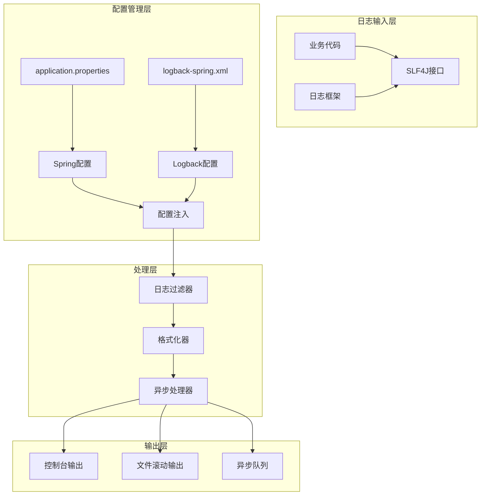
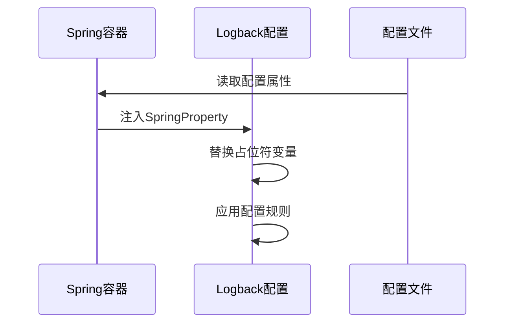

# 日志配置

<cite>
**本文档中引用的文件**
- [application.properties](file://Boot/src/main/resources/application.properties)
- [logback-spring.xml](file://Boot/src/main/resources/logback-spring.xml)
- [application-dev.properties](file://Boot/src/main/resources/application-dev.properties)
- [application-prod.properties](file://Boot/src/main/resources/application-prod.properties)
- [MessageSender.java](file://Base/src/main/java/com/bot/base/commom/MessageSender.java)
- [StatusMonitor.java](file://Base/src\main\java\com\bot\base\service\StatusMonitor.java)
- [HttpSenderUtil.java](file://Common\src\main\java\com\bot\common\util\HttpSenderUtil.java)
</cite>

## 目录
1. [简介](#简介)
2. [项目结构概览](#项目结构概览)
3. [核心日志配置项](#核心日志配置项)
4. [日志系统架构](#日志系统架构)
5. [详细配置分析](#详细配置分析)
6. [日志使用示例](#日志使用示例)
7. [环境配置对比](#环境配置对比)
8. [最佳实践与建议](#最佳实践与建议)
9. [故障排除指南](#故障排除指南)
10. [总结](#总结)

## 简介

本项目采用基于Logback的日志系统，通过Spring Boot的配置机制实现灵活的日志管理。日志配置主要分布在多个配置文件中，支持不同环境下的差异化配置需求。系统提供了完整的日志记录功能，包括控制台输出、文件滚动存储、异步处理等特性。

## 项目结构概览

项目采用模块化架构，日志配置相关文件主要位于以下位置：



**图表来源**
- [application.properties](file://Boot/src/main/resources/application.properties#L11-L17)
- [logback-spring.xml](file://Boot/src/main/resources/logback-spring.xml#L1-L58)

## 核心日志配置项

### logback.level - 日志级别配置

**配置值**: INFO  
**含义**: 设置全局日志输出级别为INFO级别

**日志级别优先级** (从高到低):
- ERROR: 仅记录错误信息
- WARN: 记录警告和错误信息
- INFO: 记录一般信息和重要事件
- DEBUG: 记录调试信息
- TRACE: 最详细的跟踪信息

**作用范围**: 控制所有日志输出的最低级别，低于此级别的日志将被忽略。

### logback.rootPath - 日志根目录配置

**配置值**: C:\\logs\\bot (开发环境) 或 /data/project/bot/logs (生产环境)

**特点**:
- 跨平台兼容性考虑
- 开发环境使用Windows路径格式
- 生产环境使用Linux路径格式
- 支持相对路径和绝对路径

### logback.charset - 字符编码配置

**配置值**: UTF-8  
**重要性**:
- 确保多语言字符正确显示
- 避免中文乱码问题
- 支持国际化应用场景
- 保证日志文件可读性

### logback.pattern - 日志格式模式

**配置值**: `%d{HH:mm:ss.SSS} [%thread] %-5level %logger-%line -- %msg --%n`

**各字段含义**:
- `%d{HH:mm:ss.SSS}`: 时间戳，精确到毫秒
- `[%thread]`: 线程名称
- `%-5level`: 日志级别，左对齐，宽度5字符
- `%logger`: 日志记录器名称
- `-%line`: 行号
- `-- %msg --`: 日志消息内容
- `%n`: 平台相关的换行符

**Section sources**
- [application.properties](file://Boot/src/main/resources/application.properties#L11-L17)
- [logback-spring.xml](file://Boot/src/main/resources/logback-spring.xml#L18-L20)

## 日志系统架构

### 整体架构设计



**图表来源**
- [logback-spring.xml](file://Boot/src/main/resources/logback-spring.xml#L14-L53)

### 关键组件说明

#### ConsoleAppender - 控制台输出
- **用途**: 开发调试阶段实时查看日志
- **阈值**: TRACE级别，捕获所有日志
- **编码**: 使用配置的UTF-8编码

#### RollingFileAppender - 文件滚动输出
- **滚动策略**: 基于时间和文件大小
- **文件命名**: `${logback.path}/%d{yyyy-MM-dd}/${project.name}.%d{yyyy-MM-dd}.%i.log`
- **大小限制**: 单个文件最大100MB
- **历史保留**: 最近30天的日志文件

#### AsyncAppender - 异步处理
- **队列大小**: 2048条日志
- **丢弃阈值**: 0（不丢弃任何日志）
- **性能优化**: 避免I/O操作阻塞主线程

**Section sources**
- [logback-spring.xml](file://Boot/src/main/resources/logback-spring.xml#L14-L53)

## 详细配置分析

### Spring配置集成

Logback通过Spring Property机制实现配置注入：



**图表来源**
- [logback-spring.xml](file://Boot/src/main/resources/logback-spring.xml#L4-L9)

### 文件路径配置

系统支持动态路径配置：
- `${logback.rootPath}`: 根日志目录
- `${logback.path}`: 控制器特定路径
- `${project.name}`: 项目名称标识

### 编码处理

字符编码在整个日志流程中保持一致：
1. 配置文件中指定UTF-8
2. Logback编码器使用相同编码
3. 文件系统自动处理编码转换

**Section sources**
- [logback-spring.xml](file://Boot/src/main/resources/logback-spring.xml#L1-L58)

## 日志使用示例

### 基础日志记录

系统广泛使用SLF4J进行日志记录：

#### 成功消息记录
```java
// 示例：消息发送成功
log.info("目标[{}],消息发送完毕，响应结果[{}]", token, result);
```

#### 错误异常记录
```java
// 示例：异常处理
log.error("目标[{}],请求异常", token);
log.error("管理模式状态监控出现异常", e);
```

#### 条件日志记录
```java
// 示例：条件性日志
if (CollectionUtil.isNotEmpty(userConfigList)) {
    userConfigList.forEach(x -> {
        // 日志记录逻辑
    });
}
```

### 日志级别使用原则

#### INFO级别 - 业务关键信息
- 用户操作记录
- 业务流程节点
- 系统状态变化

#### ERROR级别 - 异常处理
- 网络请求失败
- 数据库操作异常
- 核心功能失效

#### DEBUG级别 - 调试信息
- 方法参数值
- 中间计算结果
- 流程执行路径

**Section sources**
- [MessageSender.java](file://Base/src/main/java/com/bot/base/commom/MessageSender.java#L37-L41)
- [StatusMonitor.java](file://Base/src\main\java\com\bot\base\service\StatusMonitor.java#L88-L159)

## 环境配置对比

### 开发环境配置

| 配置项 | 开发环境值 | 说明 |
|--------|------------|------|
| logback.level | INFO | 通用信息级别 |
| logback.rootPath | D:\\home\\gardpay\\reconciliation\\logs\\ | Windows本地路径 |
| logback.charset | UTF-8 | 字符编码 |
| logback.pattern | 标准格式 | 标准日志格式 |
| logback.sql-level | DEBUG | SQL调试级别 |

### 生产环境配置

| 配置项 | 生产环境值 | 说明 |
|--------|------------|------|
| logback.level | INFO | 通用信息级别 |
| logback.rootPath | /data/project/bot/logs | Linux服务器路径 |
| logback.charset | UTF-8 | 字符编码 |
| logback.pattern | 标准格式 | 标准日志格式 |
| logback.sql-level | DEBUG | SQL调试级别 |

### 配置差异分析

1. **路径格式**: 开发环境使用Windows路径，生产环境使用Linux路径
2. **部署位置**: 开发环境通常在本地开发机，生产环境在服务器
3. **性能考虑**: 生产环境更注重性能和稳定性
4. **维护便利**: 生产环境配置更简洁，便于维护

**Section sources**
- [application-dev.properties](file://Boot/src/main/resources/application-dev.properties#L1-L6)
- [application-prod.properties](file://Boot/src/main/resources/application-prod.properties#L1-L6)

## 最佳实践与建议

### 日志配置最佳实践

#### 1. 合理设置日志级别
- **开发环境**: DEBUG或TRACE，便于调试
- **测试环境**: INFO，平衡信息量和性能
- **生产环境**: INFO，关注关键业务信息

#### 2. 优化文件存储策略
- **滚动策略**: 基于时间和大小双重保护
- **保留期限**: 30天合理，既保证历史查询又避免磁盘占用过多
- **压缩存储**: 可考虑启用压缩以节省空间

#### 3. 异步处理优化
- **队列大小**: 根据并发量调整，避免内存溢出
- **丢弃策略**: 生产环境建议设置合理的丢弃阈值
- **监控指标**: 监控队列使用率和处理延迟

#### 4. 日志格式设计
- **一致性**: 全局统一格式，便于解析
- **信息完整性**: 包含时间、线程、级别、位置等关键信息
- **可读性**: 适当的缩进和分隔符

### 性能优化建议

#### 1. 异步日志处理
```xml
<!-- 异步配置优化 -->
<appender name="ASYNC_ROLLING_FILE" class="ch.qos.logback.classic.AsyncAppender">
    <discardingThreshold>0</discardingThreshold>
    <queueSize>2048</queueSize>
    <includeCallerData>false</includeCallerData>
</appender>
```

#### 2. 文件系统优化
- **SSD存储**: 推荐使用SSD提高I/O性能
- **挂载选项**: Linux环境下使用noatime选项
- **权限设置**: 确保应用有写入权限

#### 3. 内存使用优化
- **缓冲区大小**: 合理设置编码器缓冲区
- **对象池**: 复用日志对象减少GC压力
- **字符串拼接**: 使用StringBuilder避免大量字符串创建

### 监控和维护

#### 1. 日志监控指标
- **日志生成速率**: 监控每秒日志条数
- **文件增长速度**: 监控磁盘使用情况
- **异步队列状态**: 监控队列长度和处理延迟

#### 2. 清理策略
- **定期清理**: 自动删除超过保留期的日志文件
- **空间检查**: 监控磁盘空间使用率
- **备份策略**: 关键日志定期备份

## 故障排除指南

### 常见问题及解决方案

#### 1. 日志文件无法创建
**症状**: 应用启动正常但无日志文件生成
**原因**: 
- 目录权限不足
- 路径不存在
- 磁盘空间不足

**解决方案**:
```bash
# 检查目录权限
ls -la /data/project/bot/logs

# 创建目录（如需要）
mkdir -p /data/project/bot/logs

# 检查磁盘空间
df -h /data/project/bot/logs
```

#### 2. 中文乱码问题
**症状**: 日志中出现乱码字符
**原因**: 字符编码不匹配

**解决方案**:
```xml
<!-- 确保编码配置一致 -->
<encoder charset="UTF-8">
    <pattern>%d{HH:mm:ss.SSS} [%thread] %-5level %logger-%line -- %msg --%n</pattern>
</encoder>
```

#### 3. 日志丢失问题
**症状**: 部分日志未记录
**原因**: 
- 异步队列满载
- 文件写入权限问题
- 磁盘空间不足

**解决方案**:
```xml
<!-- 优化异步配置 -->
<discardingThreshold>0</discardingThreshold>
<queueSize>4096</queueSize>
```

#### 4. 性能问题
**症状**: 应用响应变慢
**原因**: 同步日志写入阻塞主线程

**解决方案**:
- 启用异步日志处理
- 优化日志级别设置
- 减少不必要的日志记录

### 调试技巧

#### 1. 临时调整日志级别
```bash
# 开发环境临时启用DEBUG
-Dlogback.level=DEBUG
```

#### 2. 分析日志文件
```bash
# 查看最近日志
tail -f /data/project/bot/logs/bot-controller/bot.log

# 搜索特定关键词
grep "ERROR" /data/project/bot/logs/bot-controller/*.log

# 统计日志数量
wc -l /data/project/bot/logs/bot-controller/*.log
```

#### 3. 性能分析
```bash
# 监控日志写入性能
strace -e write -p $(pgrep java) 2>&1 | grep ".log" | wc -l
```

## 总结

本项目构建了一个完整、高效、可扩展的日志系统，具有以下特点：

### 核心优势

1. **配置灵活性**: 支持多环境差异化配置
2. **性能优化**: 异步处理确保应用性能
3. **可维护性**: 清晰的文件组织和命名规范
4. **国际化支持**: 完整的UTF-8编码支持
5. **监控友好**: 标准化的日志格式便于分析

### 技术亮点

- **Spring集成**: 无缝集成Spring Boot配置体系
- **Logback原生**: 利用Logback的强大功能
- **滚动策略**: 基于时间和大小的智能滚动
- **异步处理**: 避免I/O操作影响应用性能
- **多输出**: 支持控制台和文件双重输出

### 发展方向

1. **集中化管理**: 考虑引入ELK或EFK栈进行日志聚合
2. **智能分析**: 集成日志分析工具进行异常检测
3. **云原生**: 支持容器化部署和云存储
4. **安全增强**: 加入敏感信息脱敏和访问控制

通过合理配置和使用这些日志功能，可以有效提升系统的可观测性和运维效率，为系统的稳定运行提供有力保障。