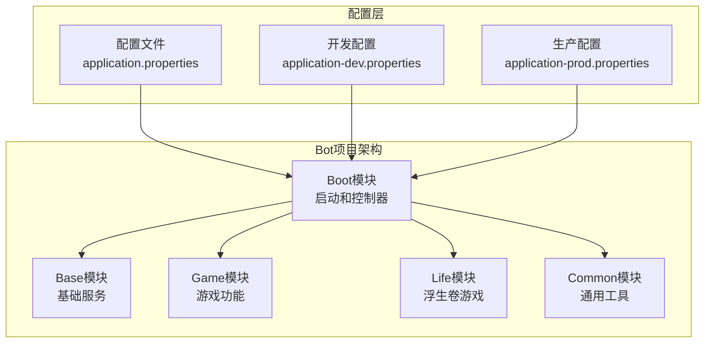
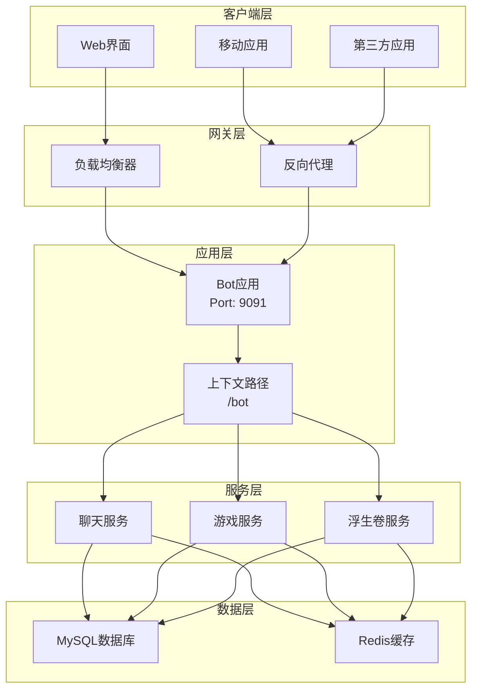
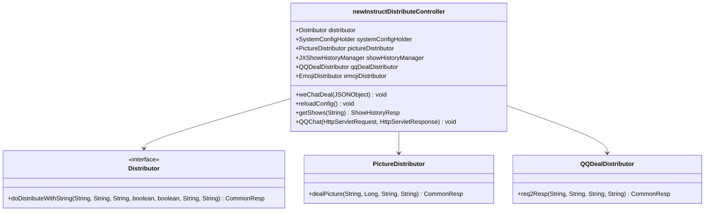
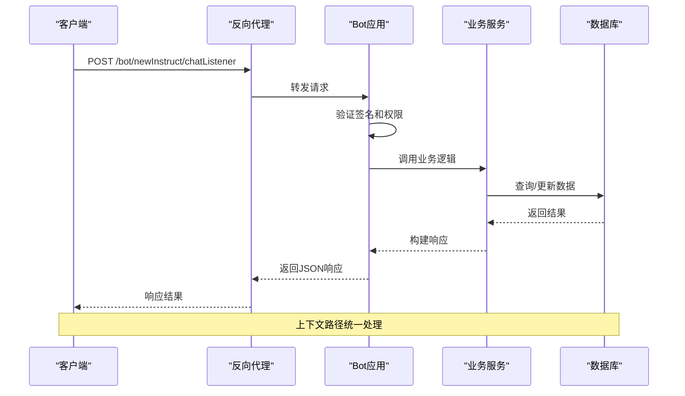
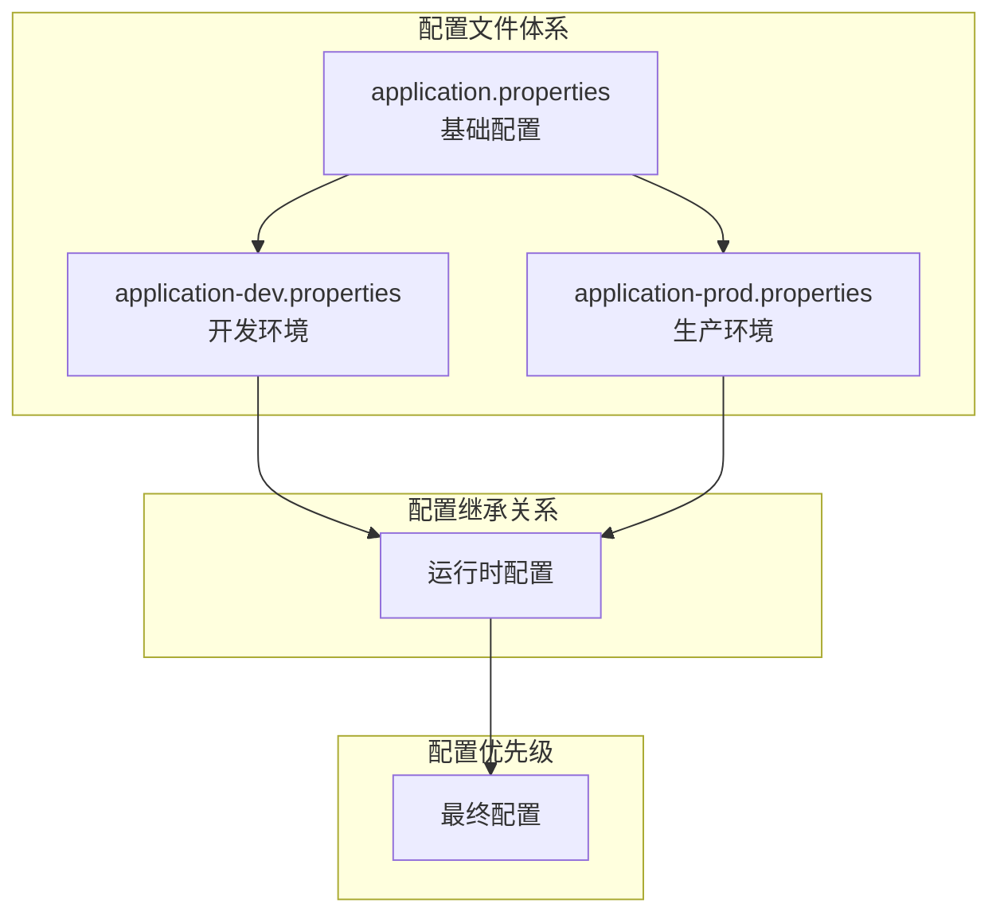

# 服务器配置

<cite>
**本文档引用的文件**
- [application.properties](file://Boot/src/main/resources/application.properties)
- [application-dev.properties](file://Boot/src/main/resources/application-dev.properties)
- [application-prod.properties](file://Boot/src/main/resources/application-prod.properties)
- [BotApplication.java](file://Boot/src/main/java/com/bot/boot/BotApplication.java)
- [newInstructDistributeController.java](file://Boot/src/main/java/com/bot/boot/controller/newInstructDistributeController.java)
- [Life_Deployment_Guide.md](file://Life_Deployment_Guide.md)
</cite>

## 目录
1. [简介](#简介)
2. [项目结构概览](#项目结构概览)
3. [核心配置项详解](#核心配置项详解)
4. [服务器架构分析](#服务器架构分析)
5. [详细组件分析](#详细组件分析)
6. [部署配置指南](#部署配置指南)
7. [故障排除](#故障排除)
8. [最佳实践](#最佳实践)
9. [总结](#总结)

## 简介

本文档详细介绍了Bot项目中服务器配置的核心要素，重点解析`application.properties`文件中的`server.port`和`server.servlet.context-path`配置项。这些配置直接影响应用程序的网络访问方式、部署拓扑和系统集成能力。

Bot项目是一个基于Spring Boot框架的多功能聊天机器人系统，支持QQ、微信等多种平台的消息交互。服务器配置是确保系统正常运行的基础，合理的配置能够提升系统的可维护性和扩展性。

## 项目结构概览

Bot项目采用模块化架构设计，主要包含以下核心模块：



**图表来源**
- [BotApplication.java](file://Boot/src/main/java/com/bot/boot/BotApplication.java#L12-L15)
- [application.properties](file://Boot/src/main/resources/application.properties#L1-L70)

**章节来源**
- [BotApplication.java](file://Boot/src/main/java/com/bot/boot/BotApplication.java#L1-L22)
- [application.properties](file://Boot/src/main/resources/application.properties#L1-L70)

## 核心配置项详解

### server.port配置

#### 基础配置
```properties
server.port=9091
```

#### 配置作用
- **端口监听**：指定Spring Boot应用监听的TCP端口
- **网络通信**：建立与客户端的网络连接通道
- **负载均衡**：支持多实例部署时的端口分配

#### 技术原理
Spring Boot默认使用嵌入式Tomcat服务器，`server.port`配置决定了HTTP服务器监听的端口号。当设置为9091时，应用将在该端口上提供所有REST API服务。

#### 配置示例
```properties
# 开发环境端口
server.port=9091

# 生产环境端口（可能不同）
server.port=8080
```

#### 注意事项
- **端口占用**：确保端口未被其他进程占用
- **防火墙配置**：开放相应端口的入站规则
- **容器化部署**：在Docker等容器环境中需要映射端口

### server.servlet.context-path配置

#### 基础配置
```properties
server.servlet.context-path=/bot
```

#### 配置作用
- **URL前缀**：为所有API路径添加统一的前缀
- **多应用隔离**：在同一主机上部署多个应用时避免冲突
- **安全考虑**：隐藏真实的服务路径，增加安全性

#### 技术实现
上下文路径作为所有API请求的根路径前缀，Spring MVC会自动将该路径添加到每个控制器的映射路径前。

#### 配置示例
```properties
# 基础路径配置
server.servlet.context-path=/bot

# 对应的API访问路径
# /newInstruct/chatListener -> /bot/newInstruct/chatListener
```

#### 影响范围
- **控制器映射**：所有`@RequestMapping`注解的路径都会加上前缀
- **静态资源**：静态资源路径也会受到影响
- **Swagger文档**：API文档路径需要相应调整

**章节来源**
- [application.properties](file://Boot/src/main/resources/application.properties#L2-L4)
- [newInstructDistributeController.java](file://Boot/src/main/java/com/bot/boot/controller/newInstructDistributeController.java#L43-L43)

## 服务器架构分析

### 整体架构图



**图表来源**
- [application.properties](file://Boot/src/main/resources/application.properties#L2-L4)
- [newInstructDistributeController.java](file://Boot/src/main/java/com/bot/boot/controller/newInstructDistributeController.java#L43-L43)

### 控制器架构



**图表来源**
- [newInstructDistributeController.java](file://Boot/src/main/java/com/bot/boot/controller/newInstructDistributeController.java#L43-L65)

**章节来源**
- [newInstructDistributeController.java](file://Boot/src/main/java/com/bot/boot/controller/newInstructDistributeController.java#L1-L255)

## 详细组件分析

### API端点分析

#### 核心API路径
基于上下文路径`/bot`，以下是主要API端点：

| API路径 | 方法 | 功能描述 | 访问示例 |
|---------|------|----------|----------|
| `/bot/newInstruct/chatListener` | POST | 聊天消息监听 | `/bot/newInstruct/chatListener` |
| `/bot/newInstruct/reloadConfig` | POST | 重新加载配置 | `/bot/newInstruct/reloadConfig` |
| `/bot/newInstruct/getShows` | GET | 获取展示历史 | `/bot/newInstruct/getShows?queryId=xxx` |
| `/bot/newInstruct/QQ/event` | POST | QQ事件处理 | `/bot/newInstruct/QQ/event` |

#### 请求流程图



**图表来源**
- [newInstructDistributeController.java](file://Boot/src/main/java/com/bot/boot/controller/newInstructDistributeController.java#L72-L148)

### 配置文件层次结构



**图表来源**
- [application.properties](file://Boot/src/main/resources/application.properties#L1-L70)
- [application-dev.properties](file://Boot/src/main/resources/application-dev.properties#L1-L59)
- [application-prod.properties](file://Boot/src/main/resources/application-prod.properties#L1-L92)

**章节来源**
- [application.properties](file://Boot/src/main/resources/application.properties#L1-L70)
- [application-dev.properties](file://Boot/src/main/resources/application-dev.properties#L1-L59)
- [application-prod.properties](file://Boot/src/main/resources/application-prod.properties#L1-L92)

## 部署配置指南

### 端口配置修改

#### 开发环境配置
```properties
# 修改端口为8080（避免冲突）
server.port=8080

# 保持上下文路径不变
server.servlet.context-path=/bot
```

#### 生产环境配置
```properties
# 使用标准HTTP端口
server.port=80

# 或使用HTTPS端口
server.port=443
```

### 上下文路径修改

#### 修改为子域名
```properties
# 将应用部署到子域名
server.servlet.context-path=/

# 配合反向代理配置
location / {
    proxy_pass http://localhost:9091/;
}
```

#### 多应用部署
```properties
# 应用A
server.servlet.context-path=/bot-a
server.port=9091

# 应用B  
server.servlet.context-path=/bot-b
server.port=9092
```

### 反向代理配置示例

#### Nginx配置
```nginx
server {
    listen 80;
    server_name bot.example.com;
    
    location /bot/ {
        proxy_pass http://localhost:9091/bot/;
        proxy_set_header Host $host;
        proxy_set_header X-Real-IP $remote_addr;
        proxy_set_header X-Forwarded-For $proxy_add_x_forwarded_for;
    }
}
```

#### Apache配置
```apache
<VirtualHost *:80>
    ServerName bot.example.com
    
    ProxyPreserveHost On
    ProxyPass /bot/ http://localhost:9091/bot/
    ProxyPassReverse /bot/ http://localhost:9091/bot/
</VirtualHost>
```

**章节来源**
- [Life_Deployment_Guide.md](file://Life_Deployment_Guide.md#L1-L234)

## 故障排除

### 常见端口冲突问题

#### 问题诊断
```bash
# 检查端口占用
netstat -anp | grep 9091

# Linux/macOS查看进程
lsof -i :9091

# Windows查看进程
netstat -ano | findstr :9091
```

#### 解决方案
```properties
# 方案1：更换端口
server.port=9092

# 方案2：终止占用进程
# Linux/macOS
kill -9 $(lsof -t -i:9091)

# Windows
taskkill /PID <进程ID> /F
```

### 上下文路径访问问题

#### API访问测试
```bash
# 正确访问方式
curl -X POST http://localhost:9091/bot/newInstruct/chatListener \
     -H "Content-Type: application/json" \
     -d '{"messageType":"60001","data":{"content":"帮助"}}'

# 错误访问方式（缺少上下文路径）
curl -X POST http://localhost:9091/newInstruct/chatListener
```

#### 代理配置错误
```properties
# 错误配置
server.servlet.context-path=/bot

# Nginx配置错误
location / {
    proxy_pass http://localhost:9091/;
}

# 正确配置
location /bot/ {
    proxy_pass http://localhost:9091/bot/;
}
```

### 性能优化配置

#### 连接池配置
```properties
# Tomcat连接池优化
server.tomcat.max-threads=200
server.tomcat.min-spare-threads=10
server.connection-timeout=5000ms

# 数据库连接池优化
spring.datasource.hikari.maximum-pool-size=20
spring.datasource.hikari.minimum-idle=5
spring.datasource.hikari.idle-timeout=30000
spring.datasource.hikari.max-lifetime=1200000
```

**章节来源**
- [application.properties](file://Boot/src/main/resources/application.properties#L52-L62)

## 最佳实践

### 配置管理策略

#### 环境分离
```properties
# application.properties（基础配置）
spring.profiles.active=@profileActive@
server.port=9091
server.servlet.context-path=/bot

# application-dev.properties（开发环境）
logback.level=DEBUG
system.message.send.url=http://localhost:21213/SendTempIM.do

# application-prod.properties（生产环境）
logback.level=INFO
system.message.send.url=http://prod-server:21213/SendTempIM.do
```

#### 安全配置
```properties
# HTTPS配置
server.ssl.enabled=true
server.ssl.key-store=classpath:keystore.p12
server.ssl.key-store-password=changeit
server.ssl.keyStoreType=PKCS12
server.ssl.keyAlias=tomcat

# 安全头配置
server.forward-headers-strategy=native
```

### 监控和日志配置

#### 日志级别配置
```properties
# 开发环境
logback.level=DEBUG
logback.sql-level=TRACE

# 生产环境
logback.level=INFO
logback.sql-level=WARN
```

#### 健康检查端点
```properties
# Actuator端点配置
management.endpoints.web.exposure.include=health,info,metrics
management.endpoint.health.show-details=when-authorized
```

### 高可用部署

#### 负载均衡配置
```yaml
# Kubernetes部署配置
apiVersion: apps/v1
kind: Deployment
metadata:
  name: bot-app
spec:
  replicas: 3
  selector:
    matchLabels:
      app: bot
  template:
    metadata:
      labels:
        app: bot
    spec:
      containers:
      - name: bot
        image: bot:latest
        ports:
        - containerPort: 9091
        env:
        - name: SERVER_PORT
          value: "9091"
        - name: SERVER_SERVLET_CONTEXT_PATH
          value: "/bot"
```

#### 服务发现配置
```properties
# Eureka注册配置
eureka.client.service-url.defaultZone=http://localhost:8761/eureka/
eureka.instance.prefer-ip-address=true
```

## 总结

Bot项目的服务器配置体现了现代微服务架构的最佳实践。通过合理配置`server.port`和`server.servlet.context-path`，我们实现了：

### 关键收益

1. **灵活部署**：支持多种部署场景，从单机开发到集群生产
2. **安全隔离**：通过上下文路径避免API暴露风险
3. **易于维护**：清晰的配置层次结构便于管理和调试
4. **性能优化**：合理的连接池和缓存配置提升系统性能

### 配置要点回顾

- **server.port=9091**：指定应用监听端口，需注意端口冲突
- **server.servlet.context-path=/bot**：添加统一路径前缀，支持多应用部署
- **环境分离**：通过profile实现开发、测试、生产环境的配置隔离
- **安全考虑**：结合HTTPS和适当的访问控制机制

### 未来发展方向

随着Bot项目的发展，建议持续关注以下方面：
- **容器化部署**：利用Docker和Kubernetes简化部署流程
- **云原生特性**：集成服务网格和可观测性工具
- **自动化运维**：实现CI/CD流水线和基础设施即代码
- **性能监控**：建立完善的APM监控体系

通过遵循本文档的指导原则和最佳实践，可以确保Bot项目在各种环境下稳定、高效地运行，为用户提供优质的聊天机器人服务体验。