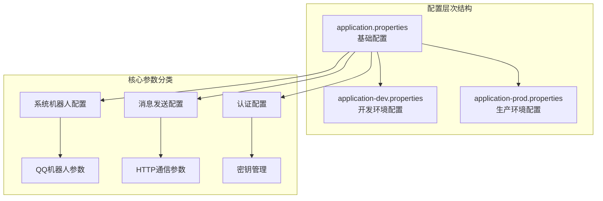
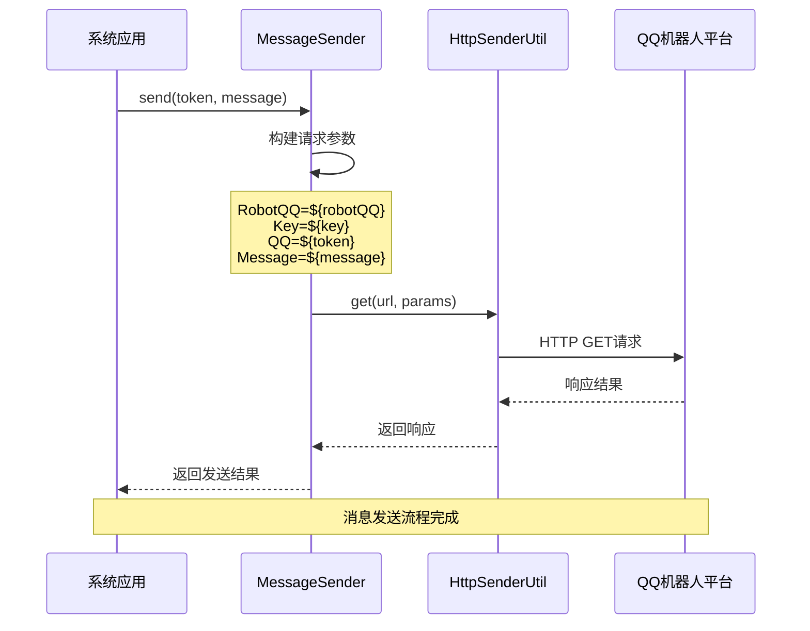
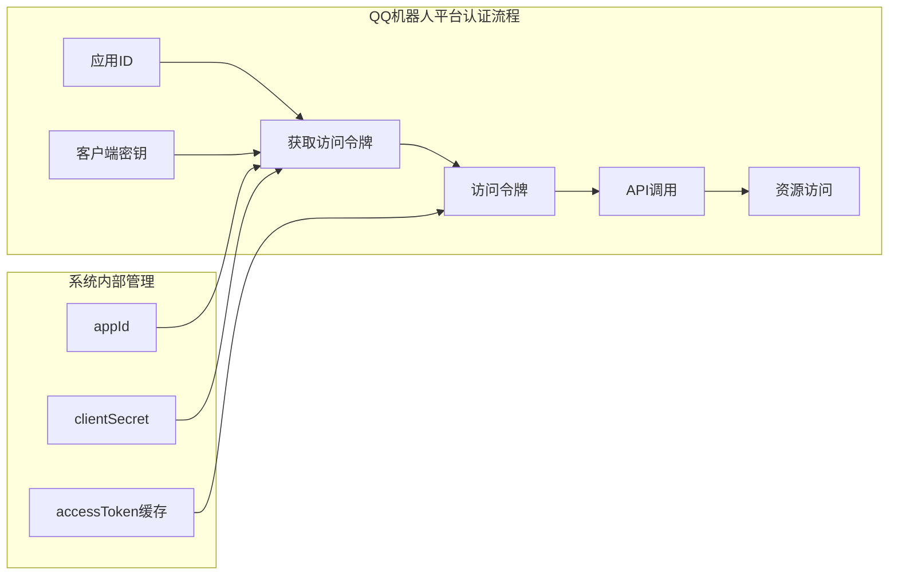
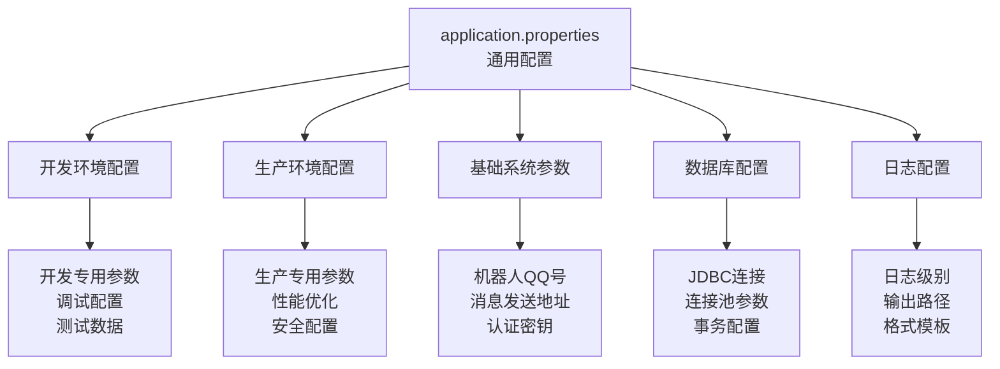

# 核心系统参数

<cite>
**本文档引用的文件**
- [application.properties](file://Boot/src/main/resources/application.properties)
- [application-dev.properties](file://Boot/src/main/resources/application-dev.properties)
- [application-prod.properties](file://Boot/src/main/resources/application-prod.properties)
- [Life_Deployment_Guide.md](file://Life_Deployment_Guide.md)
- [MessageSender.java](file://Base/src/main/java/com/bot/base/commom/MessageSender.java)
- [QQSender.java](file://Common/src/main/java/com/bot/common/util/QQSender.java)
- [HttpSenderUtil.java](file://Common/src/main/java/com/bot/common/util/HttpSenderUtil.java)
- [SystemConfigCache.java](file://Common/src/main/java/com/bot/common/config/SystemConfigCache.java)
- [SendMsgUtil.java](file://Common/src/main/java/com/bot/common/util/SendMsgUtil.java)
</cite>

## 目录
1. [简介](#简介)
2. [核心系统配置概述](#核心系统配置概述)
3. [关键系统参数详解](#关键系统参数详解)
4. [系统通信架构](#系统通信架构)
5. [QQ机器人平台集成](#qq机器人平台集成)
6. [配置文件层次结构](#配置文件层次结构)
7. [安全注意事项](#安全注意事项)
8. [最佳实践指南](#最佳实践指南)
9. [故障排除](#故障排除)
10. [总结](#总结)

## 简介

本文档详细介绍了浮生卷项目中的核心系统参数配置，重点解析application.properties文件中的关键配置项，特别是与QQ机器人平台集成相关的系统参数。这些参数构成了系统的通信基础，直接影响着机器人与用户交互的功能实现。

## 核心系统配置概述

浮生卷项目采用分层配置管理模式，通过Spring Boot的Profile机制实现不同环境下的差异化配置。系统配置主要包含以下几个方面：

- **基础通信配置**：机器人QQ号、消息发送地址、认证密钥等核心参数
- **服务端点配置**：各种API接口地址和认证信息
- **数据库配置**：连接信息和连接池参数
- **日志配置**：日志级别、输出路径和格式设置



**图表来源**
- [application.properties](file://Boot/src/main/resources/application.properties#L1-L70)
- [application-dev.properties](file://Boot/src/main/resources/application-dev.properties#L1-L59)
- [application-prod.properties](file://Boot/src/main/resources/application-prod.properties#L1-L92)

## 关键系统参数详解

### system.robot.qq - 机器人QQ号

**参数位置**：`application.properties` 第18行  
**默认值**：`2732151511`  
**作用**：指定系统使用的QQ机器人账号标识符

该参数是系统识别和区分不同机器人实例的核心标识。在QQ机器人平台中，每个机器人账号都有唯一的QQ号，系统通过此参数确定消息发送的目标接收方。

**技术实现**：
- 通过Spring的`@Value`注解注入到MessageSender组件
- 在消息发送过程中作为请求参数传递给QQ机器人平台
- 用于标识消息的发送源和接收目标

**配置示例**：
```properties
system.robot.qq=2732151511
```

### system.message.send.url - 消息发送地址

**参数位置**：`application.properties` 第20行  
**默认值**：`http://127.0.0.1:21213/SendTempIM.do`  
**作用**：指定QQ机器人消息发送的HTTP接口地址

该参数定义了系统与QQ机器人平台进行消息通信的网络端点。系统通过向此地址发送HTTP请求来触发消息发送操作。

**技术实现**：
- 使用Apache HttpClient库进行HTTP通信
- 支持GET请求方式发送消息
- 请求参数包括机器人QQ号、认证密钥、目标QQ号和消息内容

**配置示例**：
```properties
system.message.send.url=http://127.0.0.1:21213/SendTempIM.do
```

### system.message.send.key - 认证密钥

**参数位置**：`application.properties` 第19行  
**默认值**：`murongyehua123`  
**作用**：提供系统与QQ机器人平台之间的身份认证凭据

该密钥用于验证系统的合法性和确保消息发送的安全性。只有持有正确密钥的系统才能通过消息发送接口。

**技术实现**：
- 作为HTTP请求参数的一部分发送
- 与机器人QQ号配合完成双重认证
- 密钥验证失败会导致消息发送被拒绝

**配置示例**：
```properties
system.message.send.key=murongyehua123
```

**章节来源**
- [application.properties](file://Boot/src/main/resources/application.properties#L18-L20)
- [MessageSender.java](file://Base/src/main/java/com/bot/base/commom/MessageSender.java#L21-L28)

## 系统通信架构

系统采用基于HTTP的异步通信模式，通过专门的消息发送组件实现与QQ机器人平台的交互。



**图表来源**
- [MessageSender.java](file://Base/src/main/java/com/bot/base/commom/MessageSender.java#L30-L44)
- [HttpSenderUtil.java](file://Common/src/main/java/com/bot/common/util/HttpSenderUtil.java#L289-L326)

### 通信流程详解

1. **参数构建阶段**：MessageSender组件根据配置参数和目标信息构建HTTP请求参数
2. **HTTP传输阶段**：通过HttpSenderUtil的get方法发送HTTP请求
3. **平台处理阶段**：QQ机器人平台接收请求，验证参数并处理消息发送
4. **结果返回阶段**：平台返回处理结果，系统记录日志并返回给调用方

**章节来源**
- [MessageSender.java](file://Base/src/main/java/com/bot/base/commom/MessageSender.java#L30-L44)
- [HttpSenderUtil.java](file://Common/src/main/java/com/bot/common/util/HttpSenderUtil.java#L289-L326)

## QQ机器人平台集成

### 平台认证机制

系统集成了QQ官方机器人平台，采用OAuth2.0认证机制确保通信安全。



**图表来源**
- [QQSender.java](file://Common/src/main/java/com/bot/common/util/QQSender.java#L29-L31)
- [QQSender.java](file://Common/src/main/java/com/bot/common/util/QQSender.java#L33-L50)

### 访问令牌管理

系统实现了智能的访问令牌管理机制：

- **自动获取**：首次调用时自动从QQ平台获取访问令牌
- **过期检测**：实时检测令牌有效期，提前30秒刷新
- **缓存机制**：将有效令牌缓存在内存中，避免重复获取
- **错误处理**：令牌获取失败时提供降级处理方案

**章节来源**
- [QQSender.java](file://Common/src/main/java/com/bot/common/util/QQSender.java#L33-L66)

### 消息类型支持

系统支持多种消息类型的发送：

| 消息类型 | 描述 | 实现方法 |
|---------|------|----------|
| 文本消息 | 纯文本内容 | `sendGroupMessageTxt()` |
| 图片消息 | 包含图片附件 | `sendGroupMessageMedia()` |
| 语音消息 | 音频文件传输 | 通过媒体文件上传 |
| 视频消息 | 视频文件传输 | 通过媒体文件上传 |

**章节来源**
- [QQSender.java](file://Common/src/main/java/com/bot/common/util/QQSender.java#L69-L102)

## 配置文件层次结构

系统采用Spring Boot的Profile机制实现环境隔离和配置管理。



**图表来源**
- [application.properties](file://Boot/src/main/resources/application.properties#L1-L70)
- [application-dev.properties](file://Boot/src/main/resources/application-dev.properties#L1-L59)
- [application-prod.properties](file://Boot/src/main/resources/application-prod.properties#L1-L92)

### 环境差异对比

| 配置项 | 开发环境 | 生产环境 | 说明 |
|-------|----------|----------|------|
| system.robot.qq | 2732151511 | 2732151511 | 机器人QQ号保持一致 |
| system.message.send.url | http://10.60.45.114:21213/SendTempIM.do | http://127.0.0.1:21213/SendTempIM.do | 开发环境使用内网地址 |
| system.message.send.key | murongyehua123 | murongyehua123 | 密钥保持一致 |
| text.path | 空路径 | /data/project/bot/text/ | 文件路径环境差异 |

**章节来源**
- [application-dev.properties](file://Boot/src/main/resources/application-dev.properties#L8-L10)
- [application-prod.properties](file://Boot/src/main/resources/application-prod.properties#L8-L12)

## 安全注意事项

### 密钥安全管理

1. **密钥存储**：敏感信息不应直接硬编码在配置文件中
2. **环境隔离**：不同环境使用不同的密钥配置
3. **访问控制**：限制配置文件的访问权限
4. **定期轮换**：建立密钥定期更换机制

### 网络安全

1. **HTTPS使用**：建议在生产环境中使用HTTPS加密通信
2. **IP白名单**：限制机器人平台的访问IP范围
3. **请求验证**：在机器人平台端验证请求来源
4. **日志脱敏**：避免在日志中记录敏感信息

### 数据保护

1. **消息加密**：对于敏感消息考虑加密传输
2. **访问审计**：记录所有消息发送操作
3. **异常监控**：监控异常的消息发送行为
4. **备份恢复**：建立配置变更的备份机制

## 最佳实践指南

### 配置管理最佳实践

1. **环境分离**：严格分离开发、测试、生产环境配置
2. **参数化设计**：将所有可变参数集中管理
3. **版本控制**：配置文件纳入版本控制系统
4. **文档同步**：配置变更时及时更新相关文档

### 性能优化建议

1. **连接池配置**：合理设置HTTP连接池参数
2. **缓存策略**：对频繁使用的配置参数实施缓存
3. **异步处理**：采用异步方式处理消息发送
4. **批量操作**：对于大量消息考虑批量发送

### 监控和告警

1. **发送成功率**：监控消息发送的成功率
2. **响应时间**：跟踪消息发送的响应时间
3. **错误统计**：统计各类错误的发生频率
4. **容量规划**：根据消息发送量进行容量评估

## 故障排除

### 常见问题及解决方案

#### 消息发送失败

**问题现象**：系统无法发送消息到QQ机器人平台

**可能原因**：
1. 网络连接问题
2. 配置参数错误
3. 机器人平台服务异常
4. 认证信息过期

**排查步骤**：
1. 检查网络连通性：`ping 机器人平台地址`
2. 验证配置参数：确认QQ号、URL、密钥正确
3. 测试接口连通性：使用curl命令测试API
4. 检查机器人状态：确认机器人在线状态

#### 认证失败

**问题现象**：收到认证失败的错误响应

**解决方法**：
1. 验证密钥配置：确认system.message.send.key正确
2. 检查机器人权限：确认机器人具有消息发送权限
3. 重置认证信息：联系机器人平台管理员重置密钥
4. 查看平台日志：检查机器人平台的认证日志

#### 性能问题

**问题现象**：消息发送延迟较高

**优化措施**：
1. 调整连接池参数
2. 实施消息队列机制
3. 优化网络配置
4. 升级硬件资源

**章节来源**
- [MessageSender.java](file://Base/src/main/java/com/bot/base/commom/MessageSender.java#L36-L43)
- [QQSender.java](file://Common/src/main/java/com/bot/common/util/QQSender.java#L75-L78)

## 总结

浮生卷项目的核心系统参数配置体现了现代分布式系统的设计理念，通过合理的参数化管理和多层次的安全防护，确保了系统的稳定运行和安全可靠。关键参数system.robot.qq、system.message.send.url和system.message.send.key构成了系统与QQ机器人平台通信的基础，其配置的正确性和安全性直接影响着整个系统的功能实现。

在实际部署过程中，需要特别注意以下几点：

1. **环境隔离**：严格区分不同环境的配置参数
2. **安全防护**：妥善保管认证密钥，防止泄露
3. **监控告警**：建立完善的监控体系，及时发现和处理问题
4. **文档维护**：保持配置文档的及时更新和准确性

通过遵循本文档提供的最佳实践和安全指导，可以确保系统的稳定运行和持续发展。