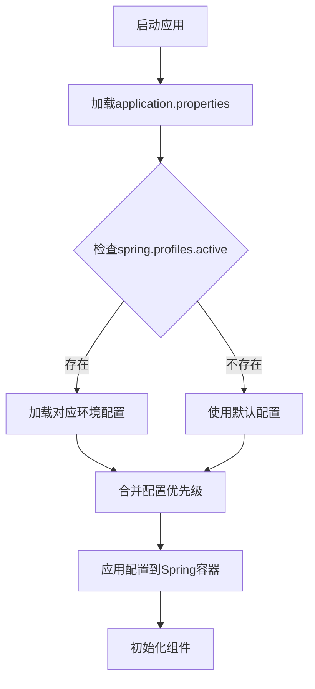
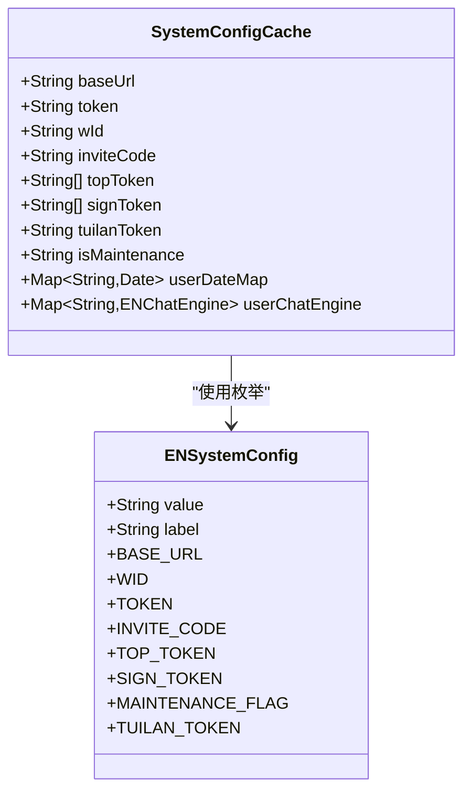

# 系统配置

<cite>
**本文档引用的文件**
- [application.properties](file://Boot/src/main/resources/application.properties)
- [application-dev.properties](file://Boot/src/main/resources/application-dev.properties)
- [application-prod.properties](file://Boot/src/main/resources/application-prod.properties)
- [logback-spring.xml](file://Boot/src/main/resources/logback-spring.xml)
- [SystemConfigCache.java](file://Common/src/main/java/com/bot/common/config/SystemConfigCache.java)
- [ENSystemConfig.java](file://Common/src/main/java/com/bot/common/enums/ENSystemConfig.java)
- [MessageSender.java](file://Base/src/main/java/com/bot/base/commom/MessageSender.java)
- [QQSender.java](file://Common/src/main/java/com/bot/common/util/QQSender.java)
</cite>

## 目录
1. [概述](#概述)
2. [服务器配置](#服务器配置)
3. [日志配置](#日志配置)
4. [系统核心参数](#系统核心参数)
5. [外部服务配置](#外部服务配置)
6. [数据库配置](#数据库配置)
7. [MyBatis配置](#mybatis配置)
8. [配置管理机制](#配置管理机制)
9. [配置修改指南](#配置修改指南)
10. [故障排除](#故障排除)

## 概述

Bot项目采用Spring Boot框架，支持多环境配置管理。系统配置主要分为以下几个方面：
- **服务器配置**：控制应用的网络服务参数
- **日志配置**：管理应用程序的日志记录行为
- **系统核心参数**：定义机器人运行的核心业务参数
- **外部服务配置**：集成第三方服务的接口地址和密钥
- **数据库配置**：设置数据存储相关参数

## 服务器配置

### server.port

**配置位置**：application.properties 第3行  
**默认值**：9091  
**作用范围**：全局  
**影响范围**：HTTP服务器监听端口


**配置说明**：
- 该端口用于接收来自QQ机器人平台的消息请求
- 修改此配置需要同步更新机器人平台的回调地址
- 生产环境建议使用非标准端口（如9091）以提高安全性

**修改注意事项**：
- 必须确保防火墙允许该端口的入站流量
- 如果在同一台服务器上运行多个实例，需要避免端口冲突
- 修改后需要重启应用使配置生效

### server.servlet.context-path

**配置位置**：application.properties 第4行  
**默认值**：/bot  
**作用范围**：全局  
**影响范围**：API路由前缀

**配置说明**：
- 为所有REST API添加统一的路径前缀
- 有助于实现多版本API管理和负载均衡
- 在生产环境中可设置为更短的路径以减少URL长度

**修改注意事项**：
- 影响所有API接口的访问路径
- 需要同步更新前端调用和第三方集成代码
- 建议保持相对稳定的配置，避免频繁变更

**节源**
- [application.properties](file://Boot/src/main/resources/application.properties#L3-L4)

## 日志配置

### logback.level

**配置位置**：application.properties 第12行  
**默认值**：INFO  
**作用范围**：全局  
**影响范围**：应用日志级别

**配置说明**：
- 控制应用程序主流程的日志输出级别
- 支持的级别包括：TRACE、DEBUG、INFO、WARN、ERROR
- INFO级别会记录业务关键信息但不包含详细的调试信息

**推荐配置**：
- 开发环境：DEBUG（获取详细调试信息）
- 测试环境：INFO（平衡信息量和性能）
- 生产环境：INFO（最小化日志开销）

### logback.rootPath

**配置位置**：application.properties 第13行  
**默认值**：C:\\logs\\bot  
**作用范围**：全局  
**影响范围**：日志文件存储路径

**配置说明**：
- 指定日志文件的根目录
- Windows环境使用绝对路径格式
- Linux环境应使用适合的路径格式

**修改注意事项**：
- 确保应用进程对该目录具有写权限
- 路径不存在时会自动创建
- 生产环境建议使用独立的磁盘分区存储日志

### logback.charset

**配置位置**：application.properties 第14行  
**默认值**：UTF-8  
**作用范围**：全局  
**影响范围**：日志编码格式

**配置说明**：
- 确保日志文件正确保存中文字符
- UTF-8编码兼容性最佳，支持全球字符集
- 与系统默认编码保持一致

### logback.pattern

**配置位置**：application.properties 第15行  
**默认值**：`%d{HH:mm:ss.SSS} [%thread] %-5level %logger-%line -- %msg --%n`  
**作用范围**：全局  
**影响范围**：日志格式模板

**配置说明**：
- 定义日志输出的标准格式
- 包含时间戳、线程名、日志级别、类名、行号、消息内容等信息
- `%n`表示换行符，确保每条日志独占一行

**日志格式解析**：
- `%d{HH:mm:ss.SSS}`：精确到毫秒的时间戳
- `[%thread]`：产生日志的线程名称
- `%-5level`：左对齐的日志级别
- `%logger-%line`：类名和代码行号
- `%msg`：实际的日志消息
- `--%n`：分隔符和换行符

### logback.sql-level

**配置位置**：application.properties 第16行  
**默认值**：DEBUG  
**作用范围**：全局  
**影响范围**：SQL语句日志级别

**配置说明**：
- 控制数据库操作的SQL语句输出级别
- DEBUG级别会记录所有执行的SQL语句
- 生产环境中建议设置为OFF或ERROR以减少性能开销

**节源**
- [application.properties](file://Boot/src/main/resources/application.properties#L11-L17)
- [logback-spring.xml](file://Boot/src/main/resources/logback-spring.xml#L1-L59)

## 系统核心参数

### system.robot.qq

**配置位置**：application.properties 第18行  
**默认值**：2732151511  
**作用范围**：全局  
**影响范围**：机器人QQ号码

**配置说明**：
- 指定机器人的QQ账号
- 用于消息发送和识别
- 必须与机器人平台绑定的QQ号一致

**修改注意事项**：
- 必须确保该QQ号已正确配置机器人平台
- 修改后需要重新验证机器人身份
- 不同环境可以使用不同的QQ号进行隔离测试

### system.message.send.key

**配置位置**：application.properties 第19行  
**默认值**：murongyehua123  
**作用范围**：全局  
**影响范围**：消息发送安全密钥

**配置说明**：
- 用于验证消息发送请求的合法性
- 防止未经授权的消息发送
- 密钥应定期更换以提高安全性

**安全建议**：
- 使用复杂且随机的密钥字符串
- 不要在代码库中硬编码敏感信息
- 建议使用环境变量或配置中心管理

### system.message.send.url

**配置位置**：application.properties 第20行  
**默认值**：http://127.0.0.1:21213/SendTempIM.do  
**作用范围**：全局  
**影响范围**：消息发送服务地址

**配置说明**：
- 指定消息发送服务的API地址
- 默认指向本地消息代理服务
- 生产环境应配置为可靠的远程服务

**部署建议**：
- 使用负载均衡器分散请求压力
- 配置健康检查确保服务可用性
- 实施限流策略防止服务过载

**节源**
- [application.properties](file://Boot/src/main/resources/application.properties#L18-L20)
- [MessageSender.java](file://Base/src/main/java/com/bot/base/commom/MessageSender.java#L21-L28)

## 外部服务配置

### 天气查询服务

**配置项**：
- `weather.url`：天气查询API地址
- `jd.key`：京东智能云API密钥

**作用范围**：天气功能模块  
**影响范围**：天气预报服务可用性

### 文本路径配置

**配置项**：
- `text.path`：文本资源文件存储路径

**作用范围**：文本资源管理  
**影响范围**：自定义文本内容加载

### 聊天服务配置

**配置项**：
- `chat.url`：聊天服务API地址
- `chat.key`：聊天服务API密钥
- `base.chat.key`：基础聊天引擎密钥
- `audio.chat.key`：音频聊天引擎密钥
- `drink.chat.key`：饮酒聊天引擎密钥
- `group.chat.key`：群组聊天引擎密钥
- `review.chat.key`：评论聊天引擎密钥

**作用范围**：AI对话功能  
**影响范围**：智能聊天服务可用性

### 图片生成服务

**配置项**：
- `pic.create.url`：图片生成API地址

**作用范围**：AI图片生成功能  
**影响范围**：图片生成服务可用性

### 游戏相关配置

**配置项**：
- `game.file.path`：游戏文件存储路径
- `help.img.path`：帮助图片路径

**作用范围**：游戏功能模块  
**影响范围**：游戏资源加载

**节源**
- [application.properties](file://Boot/src/main/resources/application.properties#L25-L46)
- [application-prod.properties](file://Boot/src/main/resources/application-prod.properties#L15-L30)

## 数据库配置

### 数据库连接池配置

#### spring.datasource.url

**配置位置**：application.properties 第48行  
**默认值**：`jdbc:mysql://47.92.127.30:3306/bot?useUnicode=true&characterEncoding=utf8&useSSL=false&serverTimezone=UTC`  
**作用范围**：全局  
**影响范围**：数据库连接地址

**配置说明**：
- 指定MySQL数据库的连接字符串
- 包含主机地址、端口、数据库名等信息
- 参数配置确保字符集和时区正确

#### spring.datasource.username

**配置位置**：application.properties 第49行  
**默认值**：root  
**作用范围**：全局  
**影响范围**：数据库访问凭据

#### spring.datasource.password

**配置位置**：application.properties 第50行  
**默认值**：gouzaizi@123  
**作用范围**：全局  
**影响范围**：数据库访问凭据

**安全建议**：
- 生产环境必须更改默认密码
- 使用强密码策略
- 考虑使用加密存储或外部认证

### Druid连接池配置

#### spring.datasource.type

**配置位置**：application.properties 第52行  
**默认值**：com.alibaba.druid.pool.DruidDataSource  
**作用范围**：全局  
**影响范围**：连接池实现

**配置说明**：
- 使用阿里巴巴Druid作为连接池实现
- 提供监控、统计、防SQL注入等功能

#### 连接池参数

| 参数 | 默认值 | 作用 | 影响 |
|------|--------|------|------|
| initial-size | 1 | 初始连接数 | 启动时建立的连接数量 |
| max-wait | 20 | 最大等待时间(ms) | 获取连接的最大等待时间 |
| min-idle | 3 | 最小空闲连接数 | 保持的最小连接数量 |
| max-active | 60000 | 最大活跃连接数 | 允许的最大并发连接 |

**优化建议**：
- 根据实际并发需求调整连接池大小
- 监控连接池使用率，避免资源浪费
- 设置合理的超时时间防止长时间阻塞

#### 连接验证配置

| 参数 | 默认值 | 作用 | 影响 |
|------|--------|------|------|
| test-while-idle | true | 空闲时测试连接 | 保持连接有效性 |
| test-on-borrow | false | 获取时测试连接 | 减少获取连接时间 |
| test-on-return | false | 归还时测试连接 | 预防连接损坏 |

**节源**
- [application.properties](file://Boot/src/main/resources/application.properties#L47-L62)

## MyBatis配置

### 基础配置

#### mybatis.configuration.map-underscore-to-camel-case

**配置位置**：application.properties 第64行  
**默认值**：true  
**作用范围**：全局  
**影响范围**：字段映射规则

**配置说明**：
- 自动将数据库下划线命名转换为Java驼峰命名
- 减少手动映射的工作量
- 提高开发效率

#### mybatis.configuration.default-fetch-size

**配置位置**：application.properties 第65行  
**默认值**：100  
**作用范围**：全局  
**影响范围**：查询结果集缓存大小

**配置说明**：
- 设置游标的默认批量读取大小
- 影响内存使用和查询性能
- 对于大数据量查询建议适当增大

#### mybatis.configuration.default-statement-timeout

**配置位置**：application.properties 第66行  
**默认值**：3000  
**作用范围**：全局  
**影响范围**：SQL语句执行超时时间

**配置说明**：
- 设置SQL语句的默认超时时间为3秒
- 防止长时间运行的查询影响系统性能
- 可根据具体查询复杂度调整

### Mapper配置

#### mybatis.type-aliases-package

**配置位置**：application.properties 第67行  
**默认值**：com.bot.game.mapper,com.bot.life.mapper  
**作用范围**：全局  
**影响范围**：实体类包扫描范围

**配置说明**：
- 指定MyBatis实体类所在的包
- 自动注册类型别名
- 支持多个包的逗号分隔

#### mybatis.mapper-locations

**配置位置**：application.properties 第68行  
**默认值**：classpath*:mapper/*.xml  
**作用范围**：全局  
**影响范围**：Mapper XML文件位置

**配置说明**：
- 支持classpath和classpath*两种前缀
- classpath仅扫描当前类路径
- classpath*扫描所有jar包中的资源
- 通配符支持灵活的文件组织方式

**节源**
- [application.properties](file://Boot/src/main/resources/application.properties#L64-L68)

## 配置管理机制

### 配置加载顺序



**配置优先级**（从高到低）：
1. 命令行参数
2. 环境变量
3. 应用程序特定配置文件
4. 应用程序通用配置文件
5. 默认配置

### 动态配置支持

系统通过`SystemConfigCache`类实现动态配置管理：



**配置类型说明**：

| 配置类型 | 用途 | 更新方式 |
|----------|------|----------|
| BASE_URL | 基础服务地址 | 数据库动态更新 |
| WID | 工作标识 | 数据库动态更新 |
| TOKEN | 访问令牌 | 数据库动态更新 |
| INVITE_CODE | 邀请码 | 数据库动态更新 |
| TOP_TOKEN | 顶级用户令牌 | 数据库动态更新 |
| SIGN_TOKEN | 签到令牌 | 数据库动态更新 |
| MAINTENANCE_FLAG | 维护标志 | 数据库动态更新 |
| TUILAN_TOKEN | 推广令牌 | 数据库动态更新 |

**节源**
- [SystemConfigCache.java](file://Common/src/main/java/com/bot/common/config/SystemConfigCache.java#L1-L116)
- [ENSystemConfig.java](file://Common/src/main/java/com/bot/common/enums/ENSystemConfig.java#L1-L24)

## 配置修改指南

### 修改步骤

1. **备份现有配置**
   ```bash
   cp application.properties application.properties.backup
   ```

2. **修改配置文件**
   - 根据环境选择合适的配置文件
   - 修改相应的参数值
   - 确保配置格式正确

3. **验证配置语法**
   ```bash
   # 检查配置文件语法
   java -jar spring-boot-application.jar --spring.config.location=application.properties
   ```

4. **重启应用**
   ```bash
   # Linux环境
   systemctl restart bot-service
   
   # Windows环境
   net stop BotService && net start BotService
   ```

### 配置验证清单

- [ ] **服务器配置验证**
  - [ ] 端口是否被占用
  - [ ] 防火墙规则是否正确
  - [ ] 上下文路径是否正确

- [ ] **日志配置验证**
  - [ ] 日志目录是否存在
  - [ ] 写入权限是否正常
  - [ ] 日志级别是否符合预期

- [ ] **数据库配置验证**
  - [ ] 数据库连接是否成功
  - [ ] 权限是否足够
  - [ ] 连接池配置是否合理

- [ ] **外部服务验证**
  - [ ] API地址是否可达
  - [ ] 认证密钥是否正确
  - [ ] 服务响应是否正常

### 配置模板

#### 开发环境配置
```properties
# 服务器配置
server.port=9091
server.servlet.context-path=/bot

# 日志配置
logback.level=DEBUG
logback.rootPath=D:\\home\\gardpay\\reconciliation\\logs\\
logback.charset=UTF-8
logback.pattern=%d{HH:mm:ss.SSS} [%thread] %-5level %logger-%line -- %msg --%n

# 系统配置
system.robot.qq=2732151511
system.message.send.key=dev_key_123
system.message.send.url=http://localhost:21213/SendTempIM.do

# 数据库配置
spring.datasource.url=jdbc:mysql://localhost:3306/bot_dev?useUnicode=true&characterEncoding=utf8&useSSL=false&serverTimezone=UTC
spring.datasource.username=dev_user
spring.datasource.password=dev_password
```

#### 生产环境配置
```properties
# 服务器配置
server.port=9091
server.servlet.context-path=/bot

# 日志配置
logback.level=INFO
logback.rootPath=/data/project/bot/logs
logback.charset=UTF-8
logback.pattern=%d{HH:mm:ss.SSS} [%thread] %-5level %logger-%line -- %msg --%n

# 系统配置
system.robot.qq=2732151511
system.message.send.key=prod_key_123
system.message.send.url=http://production-server:21213/SendTempIM.do

# 数据库配置
spring.datasource.url=jdbc:mysql://production-db:3306/bot_prod?useUnicode=true&characterEncoding=utf8&useSSL=false&serverTimezone=UTC
spring.datasource.username=prod_user
spring.datasource.password=prod_password
```

## 故障排除

### 常见问题及解决方案

#### 1. 服务器启动失败

**症状**：应用无法启动，提示端口占用错误

**原因分析**：
- 端口已被其他进程占用
- 防火墙阻止端口访问
- 配置文件语法错误

**解决方案**：
```bash
# 检查端口占用
netstat -ano | findstr :9091

# 查看占用进程
tasklist | findstr PID_NUMBER

# 修改端口号或停止占用进程
```

#### 2. 日志文件无法写入

**症状**：应用启动正常但无日志输出

**原因分析**：
- 日志目录不存在
- 权限不足
- 磁盘空间不足

**解决方案**：
```bash
# 创建日志目录
mkdir -p /data/project/bot/logs

# 设置权限
chmod -R 755 /data/project/bot/logs
chown -R app_user:app_group /data/project/bot/logs

# 检查磁盘空间
df -h
```

#### 3. 数据库连接失败

**症状**：应用启动时报数据库连接错误

**原因分析**：
- 数据库服务未启动
- 连接参数错误
- 网络连接问题

**解决方案**：
```bash
# 检查数据库服务状态
systemctl status mysql

# 测试数据库连接
mysql -h localhost -u root -p

# 检查网络连通性
telnet database_host 3306
```

#### 4. 外部服务调用失败

**症状**：某些功能无法正常使用

**原因分析**：
- API地址错误
- 认证信息过期
- 服务不可用

**解决方案**：
```bash
# 测试API连通性
curl -X GET "https://api.example.com/test" \
     -H "Authorization: Bearer YOUR_TOKEN"

# 检查认证信息
echo "Current token: $TOKEN"
```

### 性能优化建议

#### 1. 数据库连接池优化

```properties
# 根据并发量调整连接池大小
spring.datasource.tomcat.initial-size=5
spring.datasource.tomcat.max-active=100
spring.datasource.tomcat.min-idle=10

# 启用连接泄漏检测
spring.datasource.tomcat.remove-abandoned=true
spring.datasource.tomcat.remove-abandoned-timeout=60
```

#### 2. JVM内存优化

```bash
# 建议的JVM参数
-Xms2g -Xmx4g
-XX:+UseG1GC
-XX:MaxGCPauseMillis=200
-XX:+HeapDumpOnOutOfMemoryError
```

#### 3. 日志性能优化

```properties
# 生产环境关闭DEBUG日志
logback.level=INFO

# 使用异步日志提升性能
logback.async.enabled=true
logback.async.queue-size=2048
```

### 监控指标

#### 关键性能指标(KPI)

| 指标类型 | 监控项目 | 正常范围 | 告警阈值 |
|----------|----------|----------|----------|
| 响应时间 | API平均响应时间 | < 500ms | > 1000ms |
| 错误率 | 请求失败比例 | < 1% | > 5% |
| 资源使用 | CPU使用率 | < 70% | > 85% |
| 资源使用 | 内存使用率 | < 80% | > 90% |
| 数据库 | 连接池使用率 | < 80% | > 90% |

#### 监控工具配置

```yaml
# Prometheus监控配置
management:
  endpoints:
    web:
      exposure:
        include: health,metrics,prometheus
  metrics:
    export:
      prometheus:
        enabled: true
```

通过以上系统化的配置管理，可以确保Bot项目在不同环境下稳定运行，并为后续的功能扩展和性能优化奠定良好的基础。