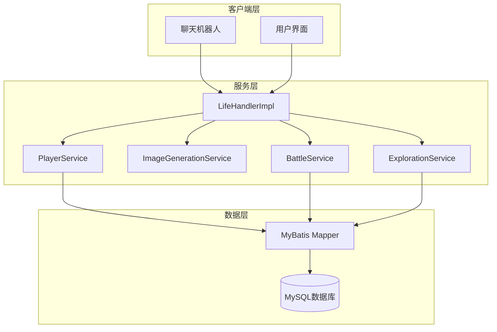
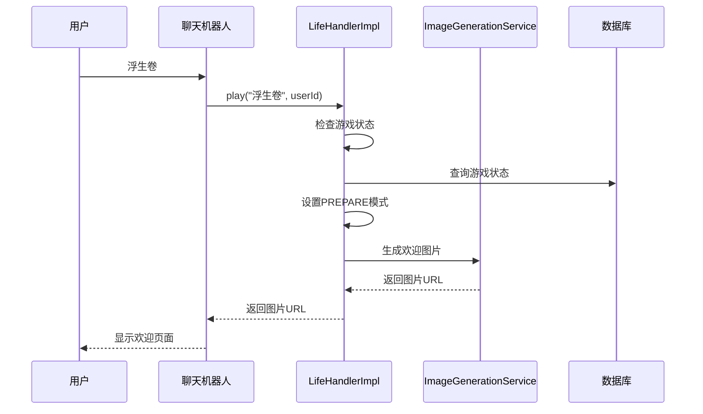
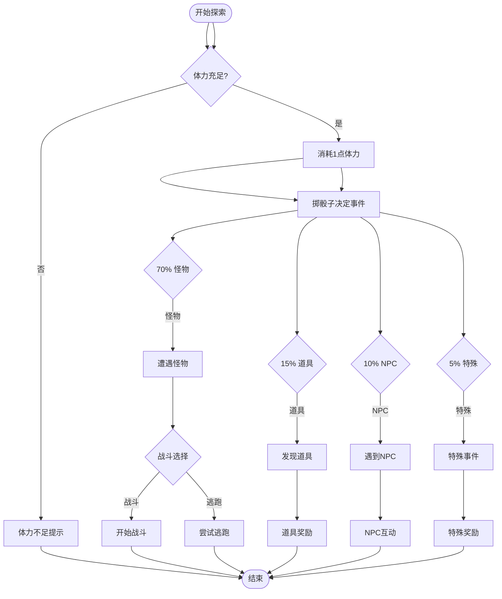
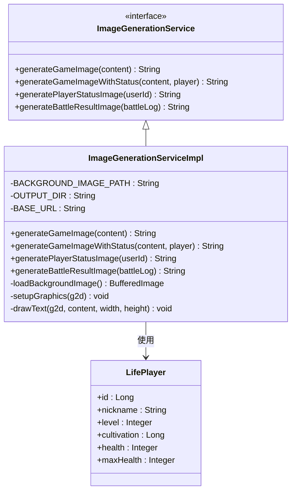
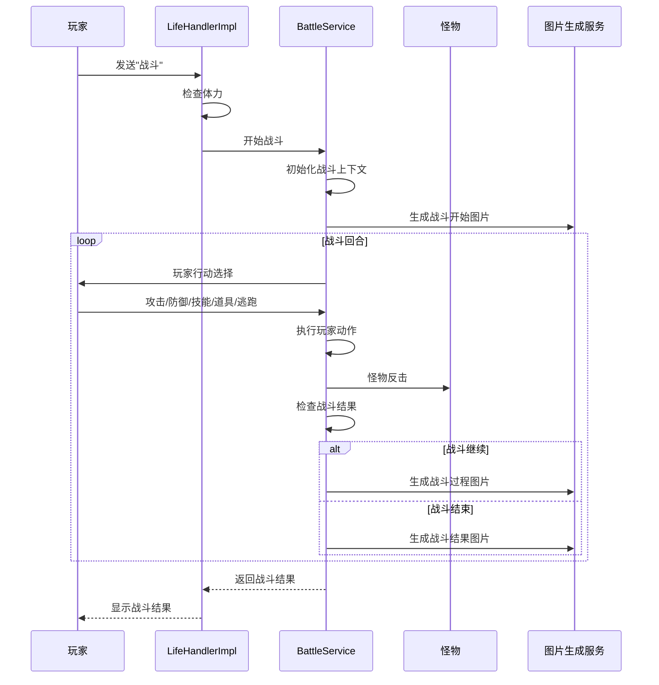

# 功能验证

<cite>
**本文档引用的文件**
- [LifeHandlerImpl.java](file://Life/src/main/java/com/bot/life/service/impl/LifeHandlerImpl.java)
- [Life_Deployment_Guide.md](file://Life_Deployment_Guide.md)
- [ImageGenerationServiceImpl.java](file://Life/src/main/java/com/bot/life/service/impl/ImageGenerationServiceImpl.java)
- [ImageGenerationService.java](file://Life/src/main/java/com/bot/life/service/ImageGenerationService.java)
- [ENGameMode.java](file://Life/src/main/java/com/bot/life/enums/ENGameMode.java)
- [LifeGameStatus.java](file://Life/src/main/java/com/bot/life/dao/entity/LifeGameStatus.java)
- [PlayerService.java](file://Life/src/main/java/com/bot/life/service/PlayerService.java)
- [ExplorationServiceImpl.java](file://Life/src/main/java/com\bot\life\service\impl\ExplorationServiceImpl.java)
- [BattleServiceImpl.java](file://Life/src/main/java\com\bot\life\service\impl\BattleServiceImpl.java)
- [application.properties](file://Boot\src\main\resources\application.properties)
</cite>

## 目录
1. [简介](#简介)
2. [系统架构概览](#系统架构概览)
3. [游戏入口功能验证](#游戏入口功能验证)
4. [角色创建与管理](#角色创建与管理)
5. [核心游戏功能测试](#核心游戏功能测试)
6. [图片生成功能验证](#图片生成功能验证)
7. [战斗系统测试](#战斗系统测试)
8. [社交互动功能](#社交互动功能)
9. [故障排除指南](#故障排除指南)
10. [性能监控建议](#性能监控建议)

## 简介

本文档提供了浮生卷游戏系统的完整功能验证指南。该系统是一个基于Java Spring Boot框架的修仙文字游戏，通过聊天机器人提供沉浸式的修仙体验。验证过程涵盖了从游戏入口到核心功能的全方位测试，确保系统各组件正常工作。

## 系统架构概览

浮生卷游戏系统采用模块化架构设计，主要包含以下核心组件：



**图表来源**
- [LifeHandlerImpl.java](file://Life/src/main/java/com/bot/life/service/impl/LifeHandlerImpl.java#L1-L50)
- [ImageGenerationService.java](file://Life/src/main/java/com/bot/life/service/ImageGenerationService.java#L1-L40)

**章节来源**
- [LifeHandlerImpl.java](file://Life/src/main/java/com/bot/life/service/impl/LifeHandlerImpl.java#L1-L100)
- [ImageGenerationServiceImpl.java](file://Life/src/main/java/com/bot/life/service/impl/ImageGenerationServiceImpl.java#L1-L50)

## 游戏入口功能验证

### 测试目标
验证用户通过聊天机器人发送'浮生卷'指令时，系统能否正确识别并引导进入游戏流程。

### 测试步骤

1. **发送游戏入口指令**
   - 发送消息：`浮生卷`
   - 预期响应：系统返回欢迎页面图片，包含以下内容：
     ```
     『欢迎来到浮生卷』
     
     这是一个修仙文字游戏
     在这里你将踏上修仙之路
     体验不同的修仙人生
     
     发送『1』正式进入游戏
     发送其他内容返回
     游戏中可随时发送『退出』返回正常模式
     ```

2. **验证图片生成**
   - 检查返回的图片URL是否有效
   - 确认图片包含正确的游戏介绍内容
   - 验证图片格式为PNG且分辨率适当

3. **预备状态验证**
   - 发送数字`1`确认进入游戏
   - 验证系统状态从`NOT_ENTERED`(0)变为`PREPARE`(1)
   - 检查数据库中`life_game_status`表的更新

### 预期响应示例



**图表来源**
- [LifeHandlerImpl.java](file://Life/src/main/java/com/bot/life/service/impl/LifeHandlerImpl.java#L174-L192)

**章节来源**
- [LifeHandlerImpl.java](file://Life/src/main/java/com/bot/life/service/impl/LifeHandlerImpl.java#L174-L192)
- [ENGameMode.java](file://Life/src/main/java/com/bot/life/enums/ENGameMode.java#L8-L12)

## 角色创建与管理

### 角色创建测试

1. **发送角色创建指令**
   - 输入格式：`昵称-派系`
   - 示例：`张三-金`
   - 支持的派系：金、木、水、火、土

2. **验证角色创建流程**
   - 检查昵称长度限制（≤7个字符）
   - 验证昵称只能包含中文字符
   - 确认派系参数有效性
   - 验证昵称唯一性检查

3. **角色状态验证**
   - 检查`life_player`表中新增记录
   - 验证初始属性分配
   - 确认境界和修为初始化

### 角色管理功能

| 功能 | 指令 | 验证要点 |
|------|------|----------|
| 角色信息查询 | `1` | 显示完整角色状态，包括属性、修为、血量等 |
| 签到系统 | `签到`或`0` | 验证每日签到奖励和连续签到机制 |
| 境界突破 | `境界`或`突破` | 检查修为消耗和属性提升 |

**章节来源**
- [LifeHandlerImpl.java](file://Life/src/main/java/com/bot/life/service/impl/LifeHandlerImpl.java#L317-L382)
- [PlayerService.java](file://Life/src/main/java/com/bot/life/service/PlayerService.java#L11-L77)

## 核心游戏功能测试

### 游历探索功能

#### 测试场景
1. **体力检查**
   - 发送`2`（游历探索）
   - 验证体力消耗机制
   - 检查体力恢复逻辑

2. **随机事件测试**
   - 怪物遭遇概率：70%
   - 道具发现概率：15%
   - NPC互动概率：10%
   - 特殊事件概率：5%

3. **探索结果验证**
   - 怪物战斗触发
   - 道具获得反馈
   - NPC对话和奖励
   - 特殊事件效果



**图表来源**
- [ExplorationServiceImpl.java](file://Life/src/main/java/com\bot\life\service\impl\ExplorationServiceImpl.java#L34-L60)

### 地图传送功能

#### 测试要点
1. **可用地图检查**
   - 验证`life_map`表中的地图数据
   - 检查地图等级要求
   - 确认传送条件

2. **传送流程验证**
   - 发送`3`（地图传送）
   - 选择目标地图
   - 验证等级限制
   - 检查传送成功后的状态更新

### 鬼市交易功能

#### 测试场景
1. **进入鬼市**
   - 发送`5`（鬼市交易）
   - 验证游戏模式切换到GHOST_MARKET(3)
   - 检查玩家位置更新到地图ID 5

2. **交易功能测试**
   - 道具购买
   - 道具出售
   - 玩家摊位系统
   - 灵粹交易

**章节来源**
- [LifeHandlerImpl.java](file://Life/src/main/java/com/bot/life/service/impl/LifeHandlerImpl.java#L441-L470)
- [ExplorationServiceImpl.java](file://Life/src/main/java/com\bot\life\service\impl\ExplorationServiceImpl.java#L1-L100)

## 图片生成功能验证

### 图片生成服务架构



**图表来源**
- [ImageGenerationService.java](file://Life/src/main/java/com/bot/life/service/ImageGenerationService.java#L1-L40)
- [ImageGenerationServiceImpl.java](file://Life/src/main/java/com/bot/life/service/impl/ImageGenerationServiceImpl.java#L1-L50)

### 图片生成测试

#### 基础功能验证

1. **文本图片生成**
   - 输入纯文本内容
   - 验证背景图片加载
   - 检查字体渲染效果
   - 确认图片保存路径和URL生成

2. **带状态图片生成**
   - 包含玩家基本信息
   - 显示当前修为、血量等状态
   - 验证状态数据准确性

3. **角色状态图片**
   - 完整的角色属性展示
   - 基础属性和战斗属性
   - 境界和经验信息

#### 图片质量验证

| 验证项目 | 检查要点 | 预期结果 |
|----------|----------|----------|
| 背景图片 | 是否正确加载life_back.png | 成功加载或使用默认背景 |
| 字体渲染 | 字体清晰度和中文支持 | 字体正常显示，中文无乱码 |
| 文本排版 | 对齐方式和行间距 | 文本整齐排列 |
| 文件大小 | 图片压缩和存储效率 | 文件大小合理 |
| URL访问 | 公网URL可访问性 | 图片可通过浏览器打开 |

#### 错误处理测试

1. **背景图片缺失**
   - 移除life_back.png文件
   - 验证系统是否生成默认背景
   - 检查错误日志记录

2. **输出目录权限**
   - 设置输出目录只读
   - 验证错误处理机制
   - 检查异常捕获和日志记录

**章节来源**
- [ImageGenerationServiceImpl.java](file://Life/src/main/java/com/bot/life/service/impl/ImageGenerationServiceImpl.java#L1-L305)
- [Life_Image_Service_Update.md](file://Life_Image_Service_Update.md#L1-L59)

## 战斗系统测试

### 战斗流程验证



**图表来源**
- [LifeHandlerImpl.java](file://Life/src/main/java/com/bot/life/service/impl/LifeHandlerImpl.java#L1076-L1175)
- [BattleServiceImpl.java](file://Life/src/main/java/com\bot\life\service\impl\BattleServiceImpl.java#L1-L100)

### 战斗功能测试

#### 基础战斗测试

1. **战斗准备**
   - 检查玩家体力是否充足
   - 验证战斗模式切换
   - 确认战斗状态初始化

2. **战斗动作测试**
   - 攻击动作：验证伤害计算
   - 防御动作：验证伤害减免
   - 逃跑机制：验证成功率计算
   - 技能系统：验证技能冷却和效果

3. **战斗结果验证**
   - 胜利条件判断
   - 失败条件处理
   - 经验值和修为奖励
   - 战斗日志记录

#### 战斗属性计算

| 属性类型 | 计算公式 | 验证要点 |
|----------|----------|----------|
| 伤害计算 | 攻击力 - 防御力 × (1 - 破防率) | 属性克制效果 |
| 会心率 | 基础会心率 + 灵力×0.01 | 灵力影响会心 |
| 破防率 | 基础破防率 + 力量×0.01 | 力量影响破防 |
| 逃跑成功率 | (玩家速度 - 怪物速度)/10 × 2% | 速度差影响成功率 |

**章节来源**
- [BattleServiceImpl.java](file://Life/src/main/java/com\bot\life\service\impl\BattleServiceImpl.java#L1-L200)
- [LifeHandlerImpl.java](file://Life/src/main/java/com/bot/life/service/impl/LifeHandlerImpl.java#L1076-L1175)

## 社交互动功能

### 好友系统测试

#### 好友添加流程

1. **发送好友请求**
   - 格式：`添加好友+昵称`
   - 示例：`添加好友李四`
   - 验证昵称存在性检查

2. **好友请求处理**
   - 接收方同意：`同意好友+好友ID`
   - 接收方拒绝：`拒绝好友+好友ID`
   - 检查好友关系建立

3. **好友功能验证**
   - 好友列表查看
   - 好友间邮件系统
   - 好友状态显示

### 邮件系统测试

#### 邮件功能验证

| 功能 | 指令格式 | 验证要点 |
|------|----------|----------|
| 发送邮件 | `发送邮件+昵称+标题+内容` | 邮件成功发送 |
| 读取邮件 | `读取邮件+邮件ID` | 邮件内容正确显示 |
| 领取附件 | `领取附件+邮件ID` | 附件奖励正确发放 |
| 删除邮件 | `删除邮件+邮件ID` | 邮件删除成功 |

### 组队系统测试

#### 组队功能验证

1. **队伍创建**
   - 格式：`创建队伍+队伍名称`
   - 验证队长权限
   - 检查队伍状态初始化

2. **队伍加入**
   - 格式：`加入队伍+队伍ID`
   - 验证邀请机制
   - 检查成员资格

3. **队伍管理**
   - 同意队员：`同意队员+玩家ID`
   - 拒绝队员：`拒绝队员+玩家ID`
   - 离开队伍：`离开队伍`
   - 解散队伍：`解散队伍`

**章节来源**
- [LifeHandlerImpl.java](file://Life/src/main/java/com/bot/life/service/impl/LifeHandlerImpl.java#L573-L620)
- [LifeHandlerImpl.java](file://Life/src/main/java/com/bot/life/service/impl/LifeHandlerImpl.java#L663-L720)

## 故障排除指南

### 常见问题及解决方案

#### 图片生成问题

1. **背景图片加载失败**
   - 检查`life_back.png`文件是否存在
   - 验证文件权限设置
   - 确认输出目录可写

2. **图片URL无法访问**
   - 检查BASE_URL配置
   - 验证Web服务器配置
   - 确认防火墙设置

#### 数据库连接问题

1. **连接超时**
   - 检查数据库服务状态
   - 验证网络连接
   - 调整连接池配置

2. **SQL执行错误**
   - 检查数据库表结构
   - 验证字段类型匹配
   - 确认索引设置

#### 游戏功能异常

1. **游戏状态异常**
   - 检查`life_game_status`表数据
   - 验证状态转换逻辑
   - 确认事务处理

2. **角色数据不一致**
   - 检查玩家数据完整性
   - 验证属性计算逻辑
   - 确认经验值增长

### 监控和日志

#### 关键指标监控

| 监控项目 | 检查频率 | 告警阈值 |
|----------|----------|----------|
| 数据库连接数 | 实时 | >80%最大连接数 |
| 图片生成响应时间 | 实时 | >5秒 |
| 游戏活跃用户数 | 每小时 | 异常波动 |
| 错误率 | 实时 | >5% |

#### 日志分析

1. **错误日志**
   - 分析异常堆栈信息
   - 识别重复错误模式
   - 跟踪问题修复效果

2. **性能日志**
   - 监控慢查询
   - 分析资源使用情况
   - 识别性能瓶颈

**章节来源**
- [Life_Deployment_Guide.md](file://Life_Deployment_Guide.md#L125-L150)

## 性能监控建议

### 系统性能指标

#### 响应时间监控

1. **游戏入口响应**
   - 目标：<2秒
   - 监控：从接收到图片URL
   - 告警：>5秒

2. **战斗系统响应**
   - 目标：<1秒
   - 监控：从选择动作到结果返回
   - 告警：>3秒

3. **图片生成响应**
   - 目标：<3秒
   - 监控：从请求到图片URL
   - 告警：>10秒

#### 资源使用监控

1. **CPU使用率**
   - 目标：<70%
   - 监控：游戏逻辑处理
   - 告警：>90%

2. **内存使用**
   - 目标：<80%
   - 监控：玩家状态缓存
   - 告警：>95%

3. **磁盘空间**
   - 目标：>20%可用空间
   - 监控：图片文件存储
   - 告警：>90%使用率

### 扩展性考虑

#### 水平扩展

1. **负载均衡**
   - 多实例部署
   - 数据库读写分离
   - 缓存集群

2. **异步处理**
   - 图片生成异步化
   - 复杂计算任务
   - 邮件发送队列

#### 容量规划

1. **用户容量**
   - 单实例支持：1000+活跃用户
   - 数据库容量：10万+玩家数据
   - 存储容量：1TB+图片文件

2. **峰值处理**
   - 并发用户：100+同时在线
   - 短时高负载：节日活动期间
   - 数据备份：每日增量备份

**章节来源**
- [Life_Deployment_Guide.md](file://Life_Deployment_Guide.md#L152-L180)