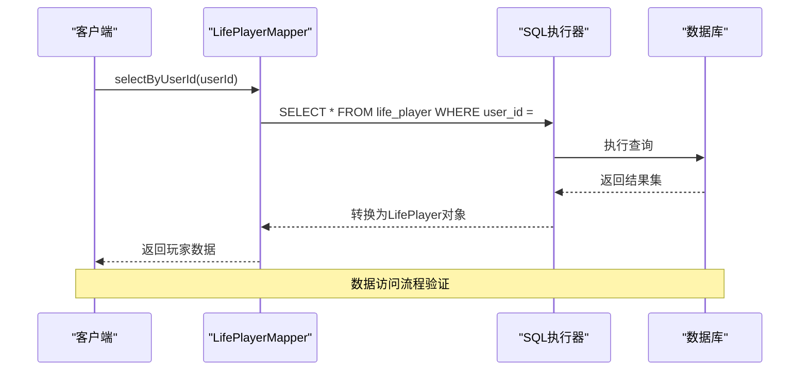

# 数据库验证

<cite>
**本文档引用的文件**
- [Life_Deployment_Guide.md](file://Life_Deployment_Guide.md)
- [Life_Database_Init.sql](file://Life_Database_Init.sql)
- [Life_Database_Tables_Check.md](file://Life_Database_Tables_Check.md)
- [Life_PlayerMapper.xml](file://Life\src\main\resources\mapper\LifePlayerMapper.xml)
- [LifeMapMapper.xml](file://Life\src\main\resources\mapper\LifeMapMapper.xml)
- [LifeMonsterMapper.xml](file://Life\src\main\resources\mapper\LifeMonsterMapper.xml)
- [LifeItemMapper.xml](file://Life\src\main\resources\mapper\LifeItemMapper.xml)
- [application.properties](file://Boot\src\main\resources\application.properties)
</cite>

## 目录
1. [简介](#简介)
2. [数据库初始化验证](#数据库初始化验证)
3. [表结构验证](#表结构验证)
4. [初始数据完整性验证](#初始数据完整性验证)
5. [数据访问功能验证](#数据访问功能验证)
6. [数据库连接池状态检查](#数据库连接池状态检查)
7. [性能指标监控](#性能指标监控)
8. [故障排除指南](#故障排除指南)
9. [总结](#总结)

## 简介

本文档提供了全面的数据库验证指南，帮助用户确认Life模块的数据库正确初始化和数据访问功能正常。基于Life模块的部署指南和数据库初始化脚本，详细说明了如何验证数据库的各项功能。

## 数据库初始化验证

### 执行初始化脚本

按照部署指南执行数据库初始化脚本：

```sql
-- 连接到MySQL数据库
mysql -u root -p

-- 创建数据库（如果不存在）
CREATE DATABASE IF NOT EXISTS bot DEFAULT CHARSET utf8mb4;
USE bot;

-- 执行初始化脚本
source Life_Database_Init.sql;
```

### 验证表创建

使用以下SQL命令验证Life模块相关表的创建情况：

```sql
-- 查看所有Life模块相关表
SHOW TABLES LIKE 'life_%';

-- 验证表数量
SELECT COUNT(*) FROM information_schema.tables 
WHERE table_schema = 'bot' AND table_name LIKE 'life_%';
```

**预期结果：**
- 应该返回22张核心表
- 包括玩家相关表、游戏内容表、社交系统表、活动挑战表等

**节源**
- [Life_Deployment_Guide.md](file://Life_Deployment_Guide.md#L85-L93)
- [Life_Database_Tables_Check.md](file://Life_Database_Tables_Check.md#L128-L133)

## 表结构验证

### 核心表结构检查

基于数据库初始化脚本，验证关键表的结构：

```mermaid
erDiagram
LIFE_PLAYER {
bigint id PK
varchar user_id UK
varchar nickname UK
tinyint attribute
int level
bigint experience
bigint cultivation
int cultivation_speed
datetime last_cultivation_time
int speed
int constitution
int spirit_power
int strength
int health
int max_health
int defense
decimal critical_rate
decimal critical_damage
decimal armor_break
int attack_power
int stamina
int max_stamina
datetime last_stamina_time
bigint spirit
datetime last_battle_time
datetime last_hp_recovery_time
bigint current_map_id
tinyint game_status
datetime create_time
datetime update_time
}
LIFE_MAP {
bigint id PK
varchar name
tinyint type
int min_level
text description
datetime create_time
}
LIFE_MONSTER {
bigint id PK
varchar name
bigint map_id FK
tinyint monster_type
tinyint attribute
int level
int health
int attack_power
int defense
int speed
decimal critical_rate
decimal critical_damage
decimal armor_break
datetime create_time
}
LIFE_ITEM {
bigint id PK
varchar name
tinyint type
int effect_value
varchar effect_attribute
bigint skill_id FK
int max_use_count
tinyint can_use_in_battle
text description
datetime create_time
}
LIFE_SYSTEM_CONFIG {
bigint id PK
varchar config_key UK
text config_value
text description
datetime create_time
datetime update_time
}
LIFE_PLAYER -> LIFE_MAP : current_map_id
LIFE_MONSTER -> LIFE_MAP : map_id
LIFE_ITEM -> LIFE_SKILL : skill_id
```

**图表源**
- [Life_Database_Init.sql](file://Life_Database_Init.sql#L6-L48)
- [Life_Database_Init.sql](file://Life_Database_Init.sql#L118-L126)
- [Life_Database_Init.sql](file://Life_Database_Init.sql#L141-L159)
- [Life_Database_Init.sql](file://Life_Database_Init.sql#L188-L201)
- [Life_Database_Init.sql](file://Life_Database_Init.sql#L367-L376)

### 关键约束验证

验证数据库约束和索引：

```sql
-- 检查主键和唯一约束
SELECT CONSTRAINT_NAME, CONSTRAINT_TYPE 
FROM INFORMATION_SCHEMA.TABLE_CONSTRAINTS 
WHERE TABLE_SCHEMA = 'bot' AND TABLE_NAME LIKE 'life_%';

-- 检查外键约束
SELECT CONSTRAINT_NAME, TABLE_NAME, REFERENCED_TABLE_NAME
FROM INFORMATION_SCHEMA.KEY_COLUMN_USAGE 
WHERE TABLE_SCHEMA = 'bot' AND REFERENCED_TABLE_NAME IS NOT NULL;
```

**节源**
- [Life_Database_Tables_Check.md](file://Life_Database_Tables_Check.md#L30-L53)

## 初始数据完整性验证

### 基础地图数据验证

```sql
-- 检查地图数据
SELECT id, name, type, min_level, description 
FROM life_map 
ORDER BY id;

-- 预期结果：
-- 1. 新手村 - 可传送地图，最低等级1
-- 2. 青云山 - 可传送地图，最低等级10  
-- 3. 幽冥谷 - 可传送地图，最低等级20
-- 4. 天机阁 - 内置地图
-- 5. 鬼市 - 可传送地图，最低等级1
```

### 怪物数据验证

```sql
-- 检查怪物数据
SELECT id, name, map_id, monster_type, attribute, level, health, attack_power, defense, speed 
FROM life_monster 
ORDER BY map_id, level;

-- 预期结果：包含基础怪物如野狼、山贼、青风狼、石甲熊、幽冥鬼
```

### 道具数据验证

```sql
-- 检查道具数据
SELECT id, name, type, effect_value, effect_attribute, max_use_count, can_use_in_battle, description 
FROM life_item 
ORDER BY type, id;

-- 预期结果：包含修为丹、属性药剂、恢复类道具、技能书等
```

### 系统配置验证

```sql
-- 检查系统配置
SELECT config_key, config_value, description 
FROM life_system_config 
ORDER BY config_key;

-- 关键配置项：
-- speed_armor_break_rate: 0.005
-- constitution_health_rate: 10
-- spirit_critical_rate: 0.01
-- attribute_restraint_damage_bonus: 20
-- max_armor_break_rate: 30
```

**节源**
- [Life_Database_Init.sql](file://Life_Database_Init.sql#L393-L498)

## 数据访问功能验证

### MyBatis映射文件验证

基于LifePlayerMapper.xml验证数据访问功能：



**图表源**
- [LifePlayerMapper.xml](file://Life\src\main\resources\mapper\LifePlayerMapper.xml#L52-L57)

### 核心查询验证

验证关键查询语句的功能：

#### 玩家数据访问

```sql
-- 通过ID查询玩家
SELECT * FROM life_player WHERE id = 1;

-- 通过用户ID查询玩家  
SELECT * FROM life_player WHERE user_id = 'test_user_001';

-- 查询所有玩家
SELECT COUNT(*) FROM life_player;
```

#### 地图数据访问

```sql
-- 查询可传送地图
SELECT * FROM life_map WHERE type = 1 ORDER BY min_level;

-- 查询指定地图的可用地图
SELECT * FROM life_map WHERE type = 1 AND min_level <= 10 ORDER BY min_level;
```

#### 怪物数据访问

```sql
-- 查询指定地图的所有怪物
SELECT * FROM life_monster WHERE map_id = 1 ORDER BY level;

-- 查询普通怪物
SELECT * FROM life_monster WHERE map_id = 1 AND monster_type = 1 ORDER BY level;
```

#### 道具数据访问

```sql
-- 查询所有道具
SELECT * FROM life_item ORDER BY type, id;

-- 查询特定类型的道具
SELECT * FROM life_item WHERE type = 1 ORDER BY id;
```

**节源**
- [LifePlayerMapper.xml](file://Life\src\main\resources\mapper\LifePlayerMapper.xml#L45-L67)
- [LifeMapMapper.xml](file://Life\src\main\resources\mapper\LifeMapMapper.xml#L25-L39)
- [LifeMonsterMapper.xml](file://Life\src\main\resources\mapper\LifeMonsterMapper.xml#L34-L48)
- [LifeItemMapper.xml](file://Life\src\main\resources\mapper\LifeItemMapper.xml#L29-L42)

## 数据库连接池状态检查

### 连接池配置验证

基于application.properties配置验证连接池状态：

```properties
# Druid连接池配置
spring.datasource.type=com.alibaba.druid.pool.DruidDataSource
spring.datasource.tomcat.initial-size=1
spring.datasource.tomcat.max-wait=20
spring.datasource.tomcat.min-idle=3
spring.datasource.tomcat.max-active=60000
spring.datasource.tomcat.time-between-eviction-runs-millis=60000
spring.datasource.tomcat.min-evictable-idle-time-millis=300000
```

### 连接池状态监控

```sql
-- 检查当前连接池状态
SHOW STATUS LIKE 'Threads_connected';
SHOW STATUS LIKE 'Threads_running';
SHOW STATUS LIKE 'Aborted_connects';

-- 检查连接池统计信息
SELECT 
    pool_name,
    active_connections,
    max_connections,
    wait_count,
    total_wait_time
FROM druid_connection_pool_status;
```

### 性能指标检查

```sql
-- 检查慢查询
SHOW VARIABLES LIKE '%slow_query_log%';
SHOW VARIABLES LIKE '%long_query_time%';

-- 检查查询统计
SHOW GLOBAL STATUS LIKE 'Queries';
SHOW GLOBAL STATUS LIKE 'Slow_queries';
```

**节源**
- [application.properties](file://Boot\src\main\resources\application.properties#L47-L62)

## 性能指标监控

### 查询性能监控

```sql
-- 监控慢查询
SET GLOBAL slow_query_log = 'ON';
SET GLOBAL long_query_time = 1;

-- 检查查询执行计划
EXPLAIN SELECT * FROM life_player WHERE user_id = 'test_user';

-- 监控表扫描
SELECT 
    table_schema,
    table_name,
    rows_read,
    rows_sent,
    rows_examined
FROM information_schema.processlist 
WHERE db = 'bot';
```

### 数据库健康检查

```sql
-- 检查表碎片
SELECT 
    table_schema,
    table_name,
    engine,
    data_free,
    ROUND((data_free/(data_length+index_length))*100,2) AS fragmentation_pct
FROM information_schema.tables 
WHERE table_schema = 'bot' 
AND engine = 'InnoDB';

-- 检查索引使用情况
SELECT 
    table_name,
    index_name,
    last_updated,
    rows_selected,
    rows_inserted,
    rows_updated,
    rows_deleted
FROM mysql.innodb_index_stats 
WHERE database_name = 'bot';
```

### 缓存性能监控

```sql
-- 检查InnoDB缓冲池
SHOW ENGINE INNODB STATUS;

-- 检查查询缓存
SHOW VARIABLES LIKE 'query_cache%';
```

## 故障排除指南

### 常见问题及解决方案

#### 1. 数据库连接失败

**症状：**
- 应用启动时报Connection refused错误
- 数据库连接超时

**解决方案：**
```sql
-- 检查MySQL服务状态
SHOW PROCESSLIST;

-- 检查用户权限
SELECT host, user FROM mysql.user;

-- 检查防火墙设置
-- 确保3306端口开放
```

#### 2. 表不存在错误

**症状：**
- 执行查询时报Table 'bot.life_xxx' doesn't exist

**解决方案：**
```sql
-- 重新执行初始化脚本
source Life_Database_Init.sql;

-- 检查表是否存在
SHOW TABLES LIKE 'life_%';

-- 手动创建缺失表
CREATE TABLE IF NOT EXISTS `life_player_skill` (...);
```

#### 3. 数据访问异常

**症状：**
- MyBatis映射错误
- SQL语法错误

**解决方案：**
```sql
-- 检查表结构
DESCRIBE life_player;

-- 验证SQL语法
SELECT * FROM life_player LIMIT 1;

-- 检查索引
SHOW INDEX FROM life_player;
```

#### 4. 性能问题

**症状：**
- 查询响应缓慢
- 连接池耗尽

**解决方案：**
```sql
-- 优化查询
EXPLAIN SELECT * FROM life_player WHERE user_id = 'xxx';

-- 添加索引
CREATE INDEX idx_user_id ON life_player(user_id);

-- 调整连接池参数
ALTER SYSTEM CONFIG SET max_connections = 100;
```

### 监控和日志

启用数据库监控和日志记录：

```sql
-- 启用通用查询日志
SET GLOBAL general_log = 'ON';
SET GLOBAL log_output = 'TABLE';

-- 启用慢查询日志
SET GLOBAL slow_query_log = 'ON';
SET GLOBAL long_query_time = 1;
```

**节源**
- [Life_Deployment_Guide.md](file://Life_Deployment_Guide.md#L129-L142)

## 总结

通过本文档提供的验证步骤，您可以全面确认Life模块数据库的正确初始化和数据访问功能：

1. **数据库初始化验证**：确保所有必要的表和初始数据正确创建
2. **表结构验证**：确认数据库架构符合设计要求
3. **初始数据完整性验证**：检查关键配置和基础数据的正确性
4. **数据访问功能验证**：测试MyBatis映射和SQL查询功能
5. **数据库连接池状态检查**：监控连接池健康状况
6. **性能指标监控**：跟踪数据库性能表现

定期执行这些验证步骤可以帮助您及时发现和解决数据库相关问题，确保Life模块的稳定运行。如果在验证过程中遇到任何问题，请参考故障排除指南或联系技术支持团队。