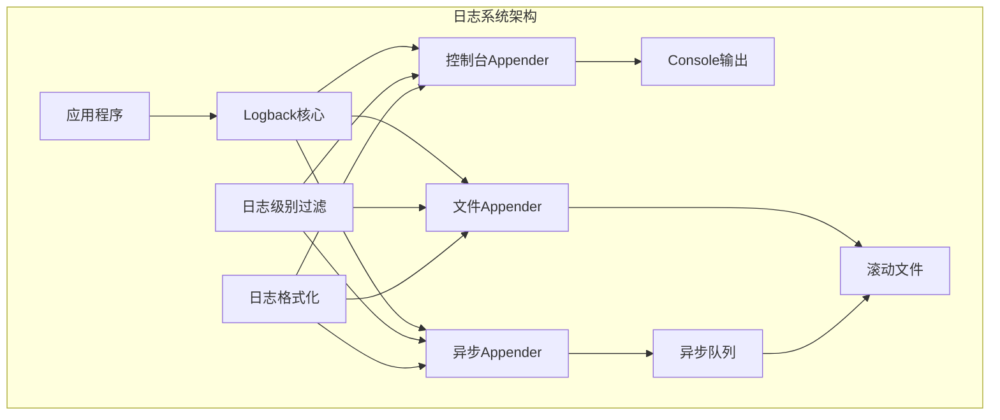
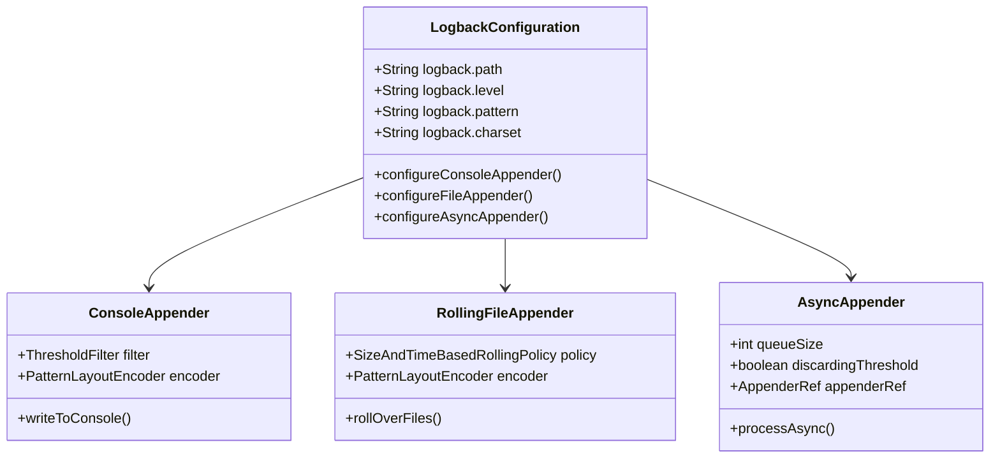
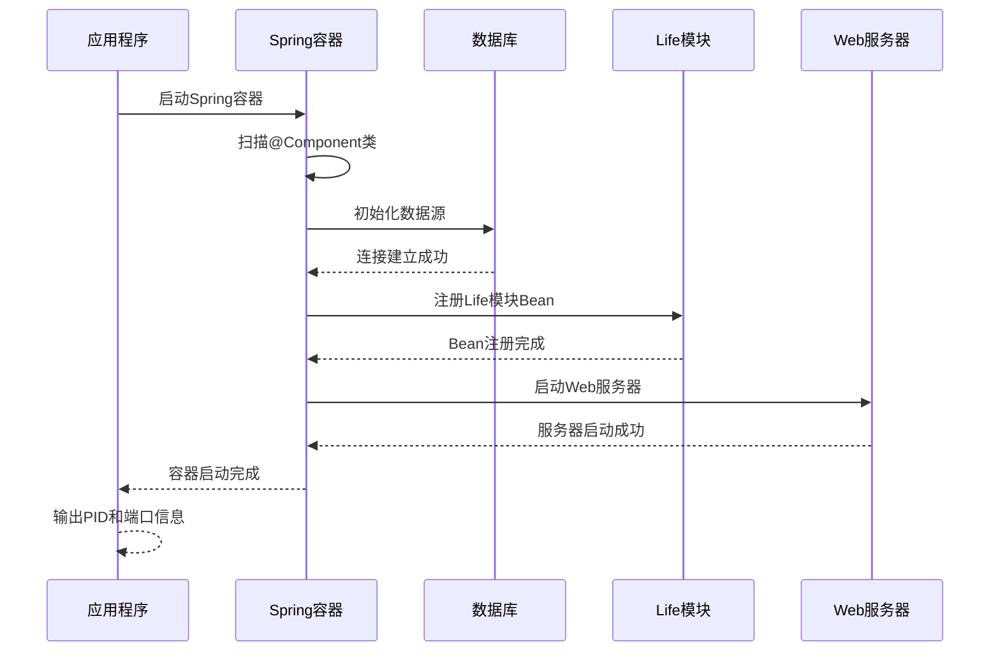
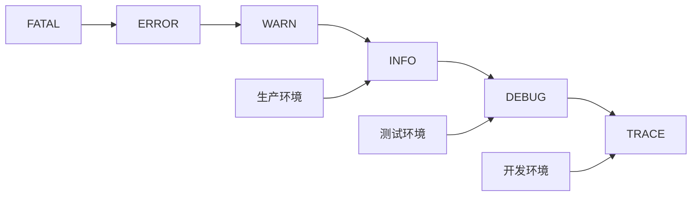
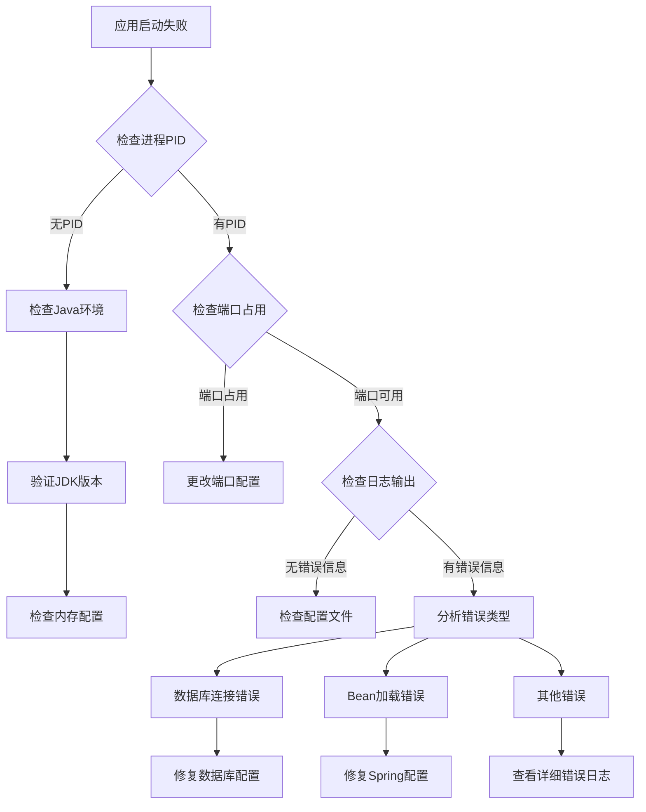

# 日志验证

<cite>
**本文档中引用的文件**
- [logback-spring.xml](file://Boot/src/main/resources/logback-spring.xml)
- [application.properties](file://Boot/src/main/resources/application.properties)
- [BotApplication.java](file://Boot/src/main/java/com/bot/boot/BotApplication.java)
- [Life_Deployment_Guide.md](file://Life_Deployment_Guide.md)
- [Life_Spring_Integration_Fix.md](file://Life_Spring_Integration_Fix.md)
- [Life_MyBatis_Configuration_Fix.md](file://Life_MyBatis_Configuration_Fix.md)
- [Life_Database_Init.sql](file://Life_Database_Init.sql)
</cite>

## 目录
1. [简介](#简介)
2. [日志系统架构](#日志系统架构)
3. [关键日志标识符](#关键日志标识符)
4. [日志配置详解](#日志配置详解)
5. [启动过程日志分析](#启动过程日志分析)
6. [常见启动错误及解决方案](#常见启动错误及解决方案)
7. [调试配置指南](#调试配置指南)
8. [日志监控最佳实践](#日志监控最佳实践)
9. [故障排除流程](#故障排除流程)

## 简介

本文档提供了Bot项目中日志验证的完整指南，帮助用户通过系统日志确认部署成功并快速定位问题。Bot项目采用Spring Boot框架，集成了Logback作为日志框架，提供了强大的日志记录和调试功能。

## 日志系统架构

Bot项目采用分层日志架构，包含控制台输出、文件记录和异步处理三个层次：



**图表来源**
- [logback-spring.xml](file://Boot/src/main/resources/logback-spring.xml#L1-L59)

**章节来源**
- [logback-spring.xml](file://Boot/src/main/resources/logback-spring.xml#L1-L59)

## 关键日志标识符

### Spring容器启动成功标志

启动过程中，以下日志信息表明Spring容器已成功启动：

| 日志模式 | 含义 | 重要性 |
|---------|------|--------|
| `Running as PID` | 应用程序进程ID标识 | 必需成功 |
| `Tomcat started on port` | Web服务器启动成功 | 必需成功 |
| `Started Application in` | 应用启动完成时间 | 可选 |
| `Spring Application Context refreshed` | Spring上下文刷新完成 | 可选 |

### 数据库连接成功标志

数据库连接成功的典型日志模式：

| 日志模式 | 含义 | 重要性 |
|---------|------|--------|
| `HikariPool - Start completed` | 数据库连接池启动成功 | 必需成功 |
| `Successfully registered ShardingSphere proxy` | 数据源注册成功 | 可选 |
| `DruidDataSource initialized` | Druid数据源初始化完成 | 可选 |

### Life模块Bean加载标志

Life模块组件加载的关键日志：

| 日志模式 | 含义 | 重要性 |
|---------|------|--------|
| `Bean 'LifeHandlerImpl' of type` | LifeHandler Bean注册成功 | 必需成功 |
| `Bean 'PlayerServiceImpl' of type` | 玩家服务Bean注册成功 | 必需成功 |
| `Bean 'BattleServiceImpl' of type` | 战斗服务Bean注册成功 | 必需成功 |
| `MyBatis mapper scanning completed` | MyBatis Mapper扫描完成 | 必需成功 |

**章节来源**
- [Life_Spring_Integration_Fix.md](file://Life_Spring_Integration_Fix.md#L40-L88)
- [Life_MyBatis_Configuration_Fix.md](file://Life_MyBatis_Configuration_Fix.md#L25-L29)

## 日志配置详解

### Logback核心配置

Bot项目使用logback-spring.xml进行日志配置，支持多种输出方式和级别控制：



**图表来源**
- [logback-spring.xml](file://Boot/src/main/resources/logback-spring.xml#L14-L52)

### 日志级别配置

| 配置项 | 默认值 | 说明 | 调试时建议值 |
|-------|--------|------|-------------|
| `logback.level` | INFO | 全局日志级别 | DEBUG |
| `logback.sql-level` | DEBUG | SQL语句日志级别 | TRACE |
| `com.bot.life` | INFO | Life模块日志级别 | DEBUG |

### 文件滚动策略

日志文件采用大小和时间双重滚动策略：

| 参数 | 默认值 | 说明 |
|------|--------|------|
| `maxFileSize` | 100MB | 单个文件最大大小 |
| `maxHistory` | 30天 | 保留历史文件天数 |
| `fileNamePattern` | `%d{yyyy-MM-dd}/${project.name}.%d{yyyy-MM-dd}.%i.log` | 文件命名模式 |

**章节来源**
- [logback-spring.xml](file://Boot/src/main/resources/logback-spring.xml#L23-L36)
- [application.properties](file://Boot/src/main/resources/application.properties#L11-L17)

## 启动过程日志分析

### 正常启动序列

Bot应用的标准启动日志序列如下：



**图表来源**
- [BotApplication.java](file://Boot/src/main/java/com/bot/boot/BotApplication.java#L12-L14)
- [application.properties](file://Boot/src/main/resources/application.properties#L47-L51)

### 关键启动阶段

1. **Spring容器初始化阶段**
   - 包扫描和组件发现
   - Bean定义注册
   - 依赖注入准备

2. **数据库连接阶段**
   - 数据源配置验证
   - 连接池初始化
   - MyBatis配置加载

3. **模块初始化阶段**
   - Life模块Bean注册
   - Mapper接口代理创建
   - 服务组件初始化

4. **Web服务器启动阶段**
   - Tomcat容器启动
   - 端口监听配置
   - 应用上下文绑定

**章节来源**
- [BotApplication.java](file://Boot/src/main/java/com/bot/boot/BotApplication.java#L12-L14)
- [Life_Spring_Integration_Fix.md](file://Life_Spring_Integration_Fix.md#L26-L30)

## 常见启动错误及解决方案

### 数据库连接异常

#### 错误模式
```
ERROR - Failed to configure a DataSource
ERROR - Could not create connection to database server
ERROR - Access denied for user 'root'@'localhost'
```

#### 解决方案
1. 检查数据库服务状态
2. 验证连接参数配置
3. 确认用户权限设置

### Life模块Bean加载失败

#### 错误模式
```
Field lifeHandler in com.bot.base.service.impl.DistributorServiceImpl required a bean of type 'com.bot.life.service.LifeHandler' that could not be found
```

#### 解决方案
根据[Lifecycle Spring集成修复指南](file://Life_Spring_Integration_Fix.md#L11-L15)，确保：
- 启动类包扫描包含`com.bot.life`
- MyBatis Mapper扫描包含`com.bot.life.dao.mapper`

### MyBatis配置问题

#### 错误模式
```
Invalid bound statement (not found): com.bot.life.dao.mapper.LifeGameStatusMapper.selectByUserId
```

#### 解决方案
根据[MyBatis配置修复指南](file://Life_MyBatis_Configuration_Fix.md#L11-L14)，修正：
- `mybatis.type-aliases-package`添加`com.bot.life.mapper`
- `mybatis.mapper-locations`使用`classpath*:mapper/*.xml`

**章节来源**
- [Life_Spring_Integration_Fix.md](file://Life_Spring_Integration_Fix.md#L11-L15)
- [Life_MyBatis_Configuration_Fix.md](file://Life_MyBatis_Configuration_Fix.md#L11-L14)

## 调试配置指南

### 启用Life模块详细日志

在`logback-spring.xml`中添加以下配置：

```xml
<logger name="com.bot.life" level="DEBUG"/>
```

这将启用Life模块的所有DEBUG级别日志，包括：
- 服务调用详情
- 数据库操作记录
- 业务逻辑执行过程

### 启用异步日志记录

系统默认配置了异步日志记录，具有以下特性：

| 特性 | 配置值 | 说明 |
|------|--------|------|
| 队列大小 | 2048 | 日志缓冲队列容量 |
| 丢弃阈值 | 0 | 不丢弃任何日志 |
| 调用者数据 | false | 不记录调用者信息以提高性能 |

### SQL语句调试配置

启用SQL语句详细记录：

```xml
<logger name="com.bot.life.dao.mapper" level="TRACE"/>
```

这将记录：
- 执行的SQL语句
- 参数绑定信息
- 结果集处理过程

**章节来源**
- [logback-spring.xml](file://Boot/src/main/resources/logback-spring.xml#L40-L48)
- [application.properties](file://Boot/src/main/resources/application.properties#L16)

## 日志监控最佳实践

### 日志级别监控

建议采用分层日志级别策略：



### 关键指标监控

| 监控指标 | 建议阈值 | 监控方法 |
|---------|----------|----------|
| 启动时间 | < 30秒 | 应用启动日志分析 |
| 错误率 | < 1% | ERROR级别日志统计 |
| 数据库连接数 | < 80% | 连接池监控 |
| 磁盘空间 | > 20% | 日志文件监控 |

### 日志轮转策略

实施有效的日志轮转策略：
- 按大小轮转（100MB）
- 按时间轮转（每日）
- 保留期限（30天）
- 压缩存储

## 故障排除流程

### 启动失败诊断流程



### 日志分析工具推荐

1. **命令行工具**
   ```bash
   # 查看实时日志
   tail -f logs/bot-controller/current.log
   
   # 搜索特定关键字
   grep "ERROR" logs/bot-controller/current.log
   
   # 统计错误频率
   grep "ERROR" logs/bot-controller/current.log | wc -l
   ```

2. **日志分析脚本**
   ```bash
   # 启动时间分析
   grep "Started Application" logs/bot-controller/current.log
   
   # 数据库连接分析
   grep "HikariPool" logs/bot-controller/current.log
   ```

### 性能优化建议

1. **日志级别优化**
   - 生产环境使用INFO级别
   - 开发环境使用DEBUG级别
   - 避免使用TRACE级别

2. **异步日志配置**
   - 启用异步日志以提高性能
   - 合理配置队列大小
   - 监控日志延迟

3. **文件系统优化**
   - 使用SSD存储日志文件
   - 定期清理过期日志
   - 监控磁盘空间使用

**章节来源**
- [Life_Deployment_Guide.md](file://Life_Deployment_Guide.md#L125-L151)

## 结论

通过本文档提供的日志验证指南，用户可以：
- 准确识别应用启动成功的关键标志
- 快速定位和解决启动过程中的常见问题
- 配置适当的日志级别进行调试
- 建立有效的日志监控和维护流程

正确的日志配置和监控是确保Bot项目稳定运行的重要保障。建议在生产环境中始终启用适当的日志记录，并建立定期的日志审查和维护流程。