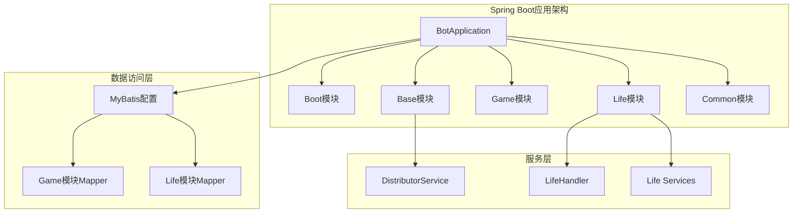
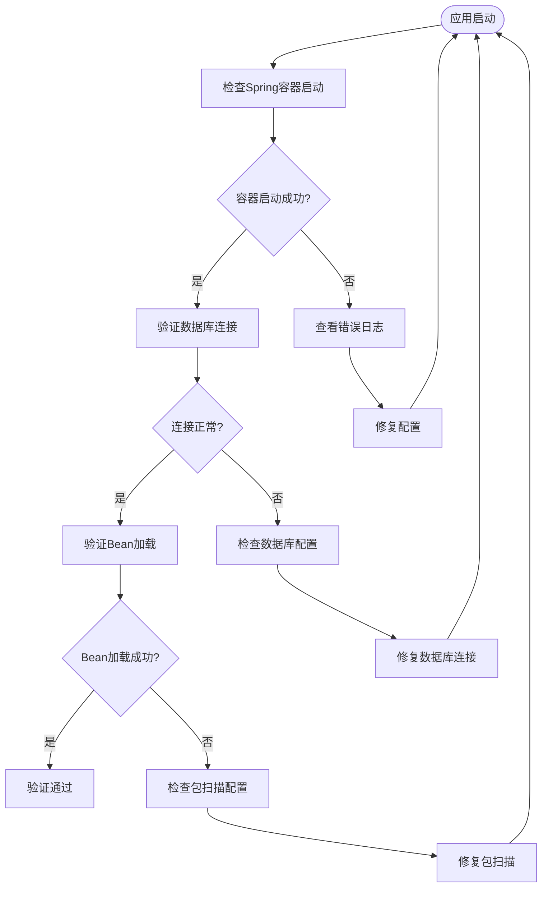
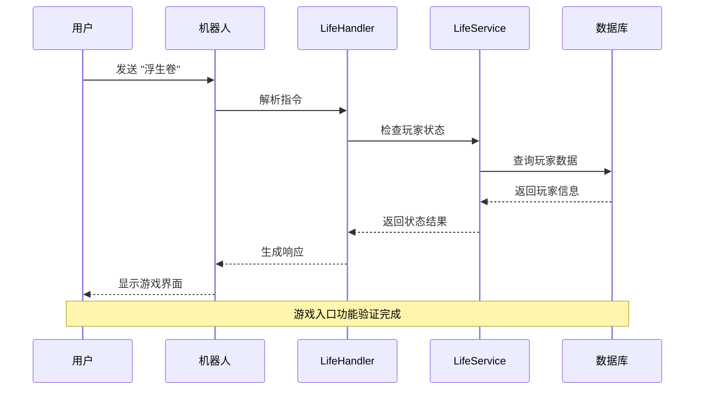
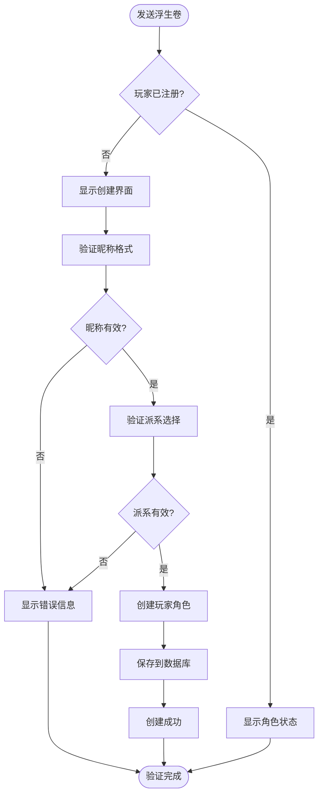
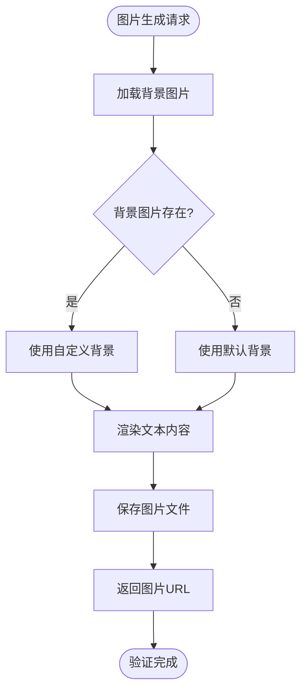
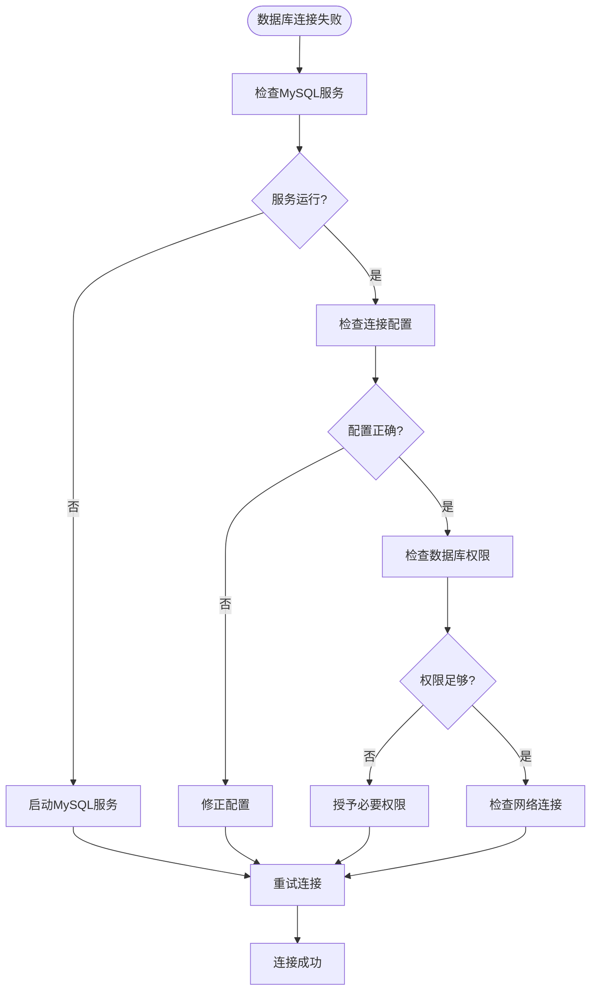

# 验证测试

<cite>
**本文档引用的文件**
- [Life_Deployment_Guide.md](file://Life_Deployment_Guide.md)
- [logback-spring.xml](file://Boot/src/main/resources/logback-spring.xml)
- [BotApplication.java](file://Boot/src/main/java/com/bot/boot/BotApplication.java)
- [Life_Database_Tables_Check.md](file://Life_Database_Tables_Check.md)
- [Life_Database_Init.sql](file://Life_Database_Init.sql)
- [HealthRecoveryTask.java](file://Life\src\main\java\com\bot\life\task\HealthRecoveryTask.java)
- [StatusMonitor.java](file://Base\src\main\java\com\bot\base\service\StatusMonitor.java)
- [ENSystemConfig.java](file://Common\src\main\java\com\bot\common\enums\ENSystemConfig.java)
- [CommonTextLoader.java](file://Common\src\main\java\com\bot\common\loader\CommonTextLoader.java)
- [ImageGenerationServiceImpl.java](file://Life\src\main\java\com\bot\life\service\impl\ImageGenerationServiceImpl.java)
</cite>

## 目录
1. [概述](#概述)
2. [系统架构验证](#系统架构验证)
3. [日志检查验证](#日志检查验证)
4. [数据库验证](#数据库验证)
5. [功能测试验证](#功能测试验证)
6. [性能监控验证](#性能监控验证)
7. [故障排除指南](#故障排除指南)
8. [最佳实践建议](#最佳实践建议)

## 概述

本文档提供了浮生卷模块部署完成后的完整验证测试方案，涵盖系统健康检查、功能验证和性能监控等关键方面。通过系统化的验证流程，确保部署的系统能够稳定运行并提供预期的功能。

验证测试分为以下几个核心维度：
- **启动验证**：确认Spring容器正常启动和Bean加载
- **连接验证**：验证数据库连接和MyBatis配置
- **功能验证**：测试游戏入口和核心功能
- **监控验证**：检查系统监控和性能指标
- **日志验证**：分析控制台和应用日志

## 系统架构验证

### 多模块Spring Boot架构



**图表来源**
- [BotApplication.java](file://Boot/src/main/java/com/bot/boot/BotApplication.java#L12-L14)
- [Life_Spring_Integration_Fix.md](file://Life_Spring_Integration_Fix.md#L26-L29)

### 包扫描配置验证

系统采用多模块包扫描配置，确保所有组件正确加载：

| 模块 | 扫描包路径 | 验证要点 |
|------|------------|----------|
| Boot | `com.bot.boot` | 启动类和控制器 |
| Base | `com.bot.base` | 基础服务和工具 |
| Game | `com.bot.game` | 游戏核心逻辑 |
| Life | `com.bot.life` | 浮生卷游戏模块 |
| Common | `com.bot.common` | 通用组件和常量 |

**章节来源**
- [BotApplication.java](file://Boot/src/main/java/com/bot/boot/BotApplication.java#L12-L14)

## 日志检查验证

### 控制台日志验证

#### Spring容器启动验证

启动后检查控制台日志，确认以下关键信息：



**图表来源**
- [BotApplication.java](file://Boot/src/main/java/com/bot/boot/BotApplication.java#L17-L19)

#### 关键日志关键字

验证Spring容器启动成功的日志关键字：

| 关键字 | 说明 | 正常值 |
|--------|------|--------|
| `Started BotApplication` | 应用启动成功 | 包含此关键字 |
| `Tomcat started on port(s)` | Web服务器启动 | 端口信息 |
| `Bean 'xxx' of type` | Bean注册成功 | Bean类型信息 |
| `MyBatis mapper` | Mapper扫描成功 | Mapper接口信息 |

#### 数据库连接验证

检查数据库连接成功的日志模式：

```
Connection established to database: bot
MyBatis SqlSessionFactoryBean created
Mapped "{LifePlayerMapper, LifeGameStatusMapper}" onto namespace
```

#### Life模块Bean加载验证

验证Life模块组件正确加载的日志：

```
Bean 'lifeHandlerImpl' of type [com.bot.life.service.impl.LifeHandlerImpl]
Bean 'playerServiceImpl' of type [com.bot.life.service.impl.PlayerServiceImpl]
Bean 'battleServiceImpl' of type [com.bot.life.service.impl.BattleServiceImpl]
```

**章节来源**
- [logback-spring.xml](file://Boot/src/main/resources/logback-spring.xml#L1-L59)

### 日志级别配置

#### DEBUG级别配置

基于`logback-spring.xml`文件，配置`com.bot.life`包的日志级别为DEBUG：

```xml
<logger name="com.bot.life" level="DEBUG"/>
```

#### 日志配置参数

| 参数 | 默认值 | 说明 |
|------|--------|------|
| `logback.level` | INFO | 根日志级别 |
| `logback.path` | ${logback.rootPath}/bot-controller | 日志文件路径 |
| `logback.pattern` | %d{HH:mm:ss.SSS} [%thread] %-5level %logger-%line -- %msg --%n | 日志格式 |
| `sql.level` | OFF | SQL语句日志级别 |

**章节来源**
- [logback-spring.xml](file://Boot/src/main/resources/logback-spring.xml#L1-L59)

## 数据库验证

### 数据库表结构验证

#### 表创建验证

使用SQL命令验证数据库表创建情况：

```sql
-- 验证Life模块相关表
SHOW TABLES LIKE 'life_%';

-- 验证特定表结构
DESCRIBE life_player;
DESCRIBE life_game_status;
DESCRIBE life_map;
DESCRIBE life_monster;
DESCRIBE life_item;
```

#### 核心表验证清单

| 表名 | 验证要点 | 预期结果 |
|------|----------|----------|
| `life_player` | 玩家角色表 | 包含基本属性字段 |
| `life_game_status` | 游戏状态表 | 包含状态和配置 |
| `life_map` | 地图表 | 包含地图信息 |
| `life_monster` | 怪物表 | 包含战斗属性 |
| `life_item` | 道具表 | 包含道具配置 |
| `life_player_skill` | 玩家技能表 | 新增表已修复 |

**章节来源**
- [Life_Database_Tables_Check.md](file://Life_Database_Tables_Check.md#L1-L147)
- [Life_Database_Init.sql](file://Life_Database_Init.sql#L1-L200)

### 数据完整性验证

#### 初始化数据验证

```sql
-- 验证地图数据
SELECT COUNT(*) FROM life_map;

-- 验证怪物数据
SELECT COUNT(*) FROM life_monster;

-- 验证道具数据
SELECT COUNT(*) FROM life_item;

-- 验证玩家数据
SELECT COUNT(*) FROM life_player;
```

#### 索引和约束验证

检查关键表的索引和约束：

```sql
-- 检查主键和唯一约束
SHOW INDEX FROM life_player;

-- 检查外键约束
SELECT CONSTRAINT_NAME, TABLE_NAME, COLUMN_NAME 
FROM INFORMATION_SCHEMA.KEY_COLUMN_USAGE 
WHERE TABLE_SCHEMA = 'bot' AND TABLE_NAME LIKE 'life_%';
```

**章节来源**
- [Life_Database_Init.sql](file://Life_Database_Init.sql#L366-L372)

## 功能测试验证

### 游戏入口功能测试

#### 基础指令验证

通过聊天机器人发送'浮生卷'指令测试游戏入口功能：



**图表来源**
- [浮生卷开发说明.md](file://浮生卷开发说明.md#L151-L169)

#### 游戏状态验证

验证游戏状态管理功能：

| 测试场景 | 预期行为 | 验证方法 |
|----------|----------|----------|
| 未注册玩家 | 显示创建角色引导 | 检查欢迎界面 |
| 已注册玩家 | 显示角色状态 | 检查状态信息 |
| 游戏中状态 | 显示游戏界面 | 检查图片生成 |
| 战斗状态 | 显示战斗界面 | 检查战斗数据 |

#### 角色创建验证

验证角色创建流程：



**图表来源**
- [Life_User_Manual.md](file://Life_User_Manual.md#L21-L41)

**章节来源**
- [Life_User_Manual.md](file://Life_User_Manual.md#L1-L58)

### 图片生成功能验证

#### 背景图片验证

验证图片生成服务的背景图片配置：

| 配置项 | 默认值 | 验证方法 |
|--------|--------|----------|
| `BACKGROUND_IMAGE_PATH` | `life_back.png` | 检查文件存在 |
| `OUTPUT_DIR` | `temp/life_images/` | 检查目录权限 |
| 图片格式 | PNG/JPEG | 检查生成图片 |

#### 图片生成流程验证



**图表来源**
- [ImageGenerationServiceImpl.java](file://Life\src\main\java\com\bot\life\service\impl\ImageGenerationServiceImpl.java#L145-L180)

**章节来源**
- [ImageGenerationServiceImpl.java](file://Life\src\main\java\com\bot\life\service\impl\ImageGenerationServiceImpl.java#L145-L180)

## 性能监控验证

### 系统监控指标

#### 关键性能指标

| 指标类别 | 指标名称 | 正常范围 | 监控方法 |
|----------|----------|----------|----------|
| 响应时间 | 游戏指令响应 | < 2秒 | 日志分析 |
| 内存使用 | JVM堆内存 | < 80% | JMX监控 |
| 数据库连接 | 连接池状态 | < 80%活跃 | 连接池监控 |
| CPU使用率 | 系统CPU | < 70% | 系统监控 |

#### 定时任务监控

验证健康恢复定时任务：

```mermaid
gantt
title 健康恢复定时任务监控
dateFormat X
axisFormat %s
section 任务执行
健康恢复检查 :done, healthCheck, 0, 60
数据库查询 :active, dbQuery, 5, 15
状态更新 :dbUpdate, 15, 25
日志记录 :logRecord, 25, 30
```



**图表来源**
- [HealthRecoveryTask.java](file://Life\src\main\java\com\bot\life\task\HealthRecoveryTask.java#L19-L30)

### 状态监控验证

#### 系统状态监控

验证系统状态监控功能：

| 监控项 | 检查方法 | 正常状态 |
|--------|----------|----------|
| 在线玩家数 | 查询数据库 | 实时统计 |
| 服务可用性 | 健康检查端点 | HTTP 200 |
| 数据库连接 | 连接测试 | 连接正常 |
| 文件系统 | 磁盘空间检查 | > 20%可用 |

**章节来源**
- [StatusMonitor.java](file://Base\src\main\java\com\bot\base\service\StatusMonitor.java#L31-L76)

## 故障排除指南

### 常见问题诊断

#### Spring容器启动问题

| 问题症状 | 可能原因 | 解决方案 |
|----------|----------|----------|
| Bean注入失败 | 包扫描配置错误 | 检查`scanBasePackages`配置 |
| 数据库连接超时 | 数据库配置错误 | 验证连接字符串和凭据 |
| MyBatis映射失败 | Mapper扫描失败 | 检查`@MapperScan`配置 |

#### 数据库连接问题



#### 图片生成问题

| 问题类型 | 症状 | 解决步骤 |
|----------|------|----------|
| 背景图片缺失 | 使用默认背景 | 检查图片文件路径 |
| 输出目录无权限 | 生成失败 | 设置写入权限 |
| 字体文件缺失 | 文字显示异常 | 安装系统字体 |

### 日志分析指南

#### 错误日志分类

```mermaid
mindmap
root((错误日志))
Spring启动错误
Bean注入失败
包扫描问题
配置加载失败
数据库错误
连接超时
SQL语法错误
权限不足
功能错误
图片生成失败
指令解析错误
业务逻辑异常
性能问题
响应超时
内存溢出
连接池耗尽
```

**章节来源**
- [Life_Deployment_Guide.md](file://Life_Deployment_Guide.md#L125-L142)

## 最佳实践建议

### 部署后验证清单

#### 启动阶段验证

- [ ] ✅ Spring容器成功启动
- [ ] ✅ 数据库连接建立
- [ ] ✅ Life模块Bean正确加载
- [ ] ✅ MyBatis配置生效

#### 功能阶段验证

- [ ] ✅ 游戏入口功能正常
- [ ] ✅ 角色创建流程完整
- [ ] ✅ 图片生成服务可用
- [ ] ✅ 数据持久化正常

#### 监控阶段验证

- [ ] ✅ 系统监控指标正常
- [ ] ✅ 定时任务执行正常
- [ ] ✅ 日志记录完整
- [ ] ✅ 性能指标在范围内

### 维护建议

#### 定期检查项目

1. **数据库维护**
   - 定期清理临时文件记录
   - 检查玩家数据完整性
   - 分析热门功能使用情况

2. **系统监控**
   - 监控在线玩家数量
   - 跟踪图片生成响应时间
   - 检查数据库连接池状态

3. **性能优化**
   - 实现图片缓存机制
   - 优化内存使用
   - 定期清理过期数据

#### 配置管理

建议通过`life_system_config`表动态调整系统配置，避免频繁重启应用。关键配置包括：

| 配置键 | 默认值 | 调整建议 |
|--------|--------|----------|
| `speed_armor_break_rate` | 0.005 | 根据平衡性调整 |
| `constitution_health_rate` | 10 | 影响角色成长 |
| `spirit_critical_rate` | 0.01 | 影响战斗策略 |

**章节来源**
- [Life_Deployment_Guide.md](file://Life_Deployment_Guide.md#L168-L221)

通过以上全面的验证测试方案，可以确保浮生卷模块部署后的系统稳定性和功能完整性，为用户提供优质的修仙RPG游戏体验。