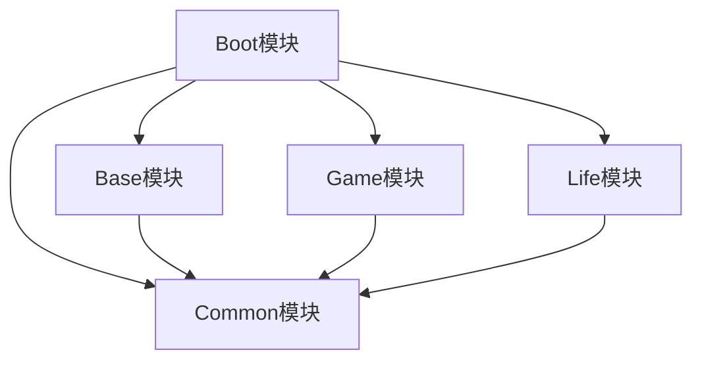
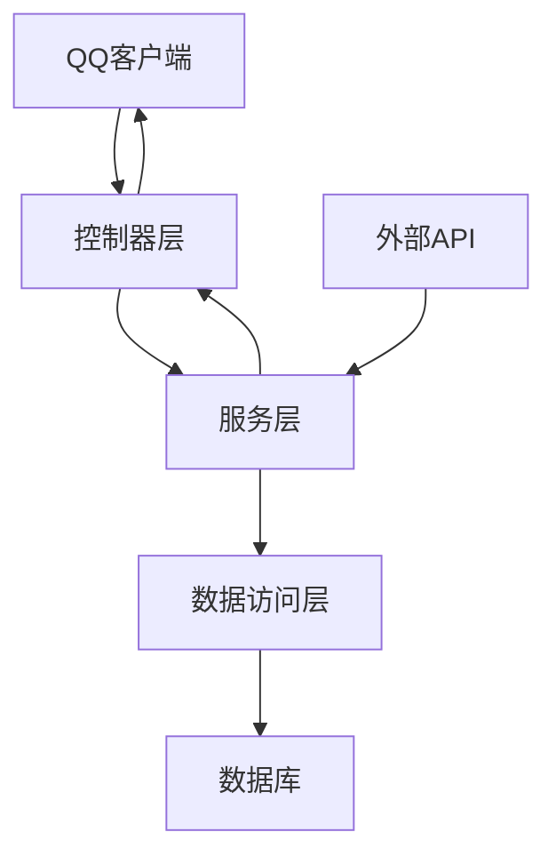
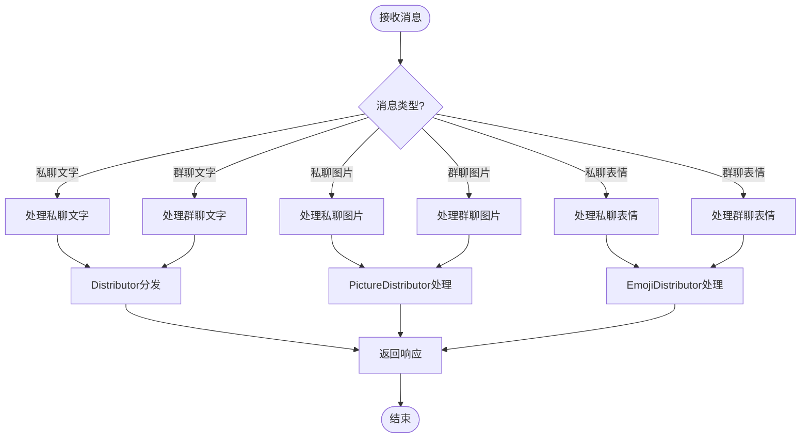
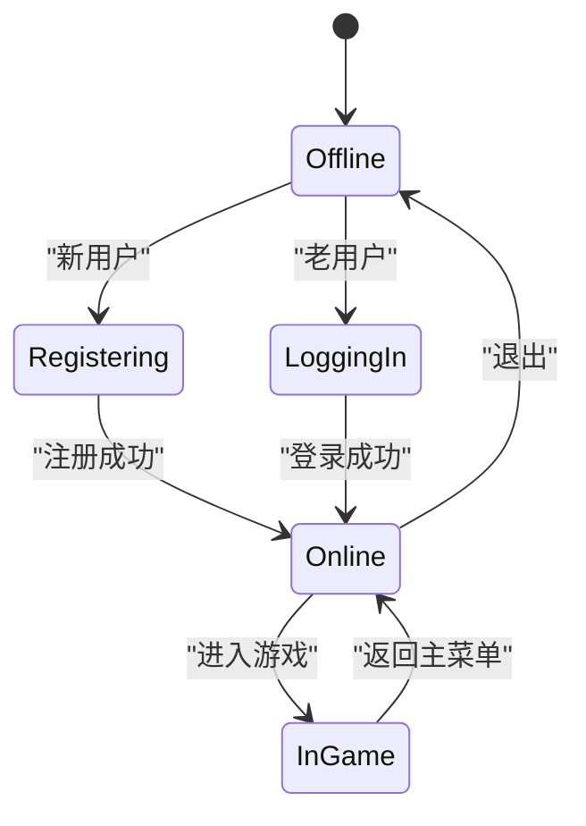
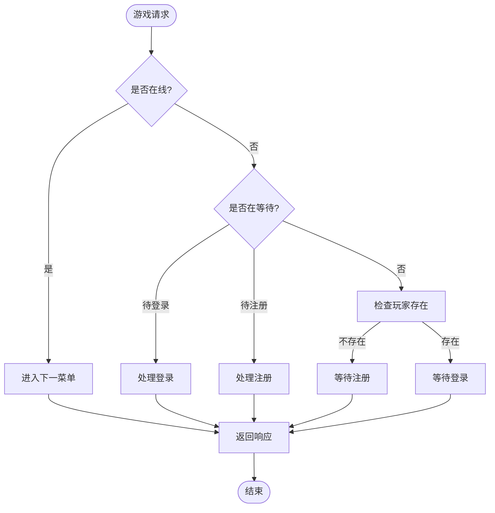
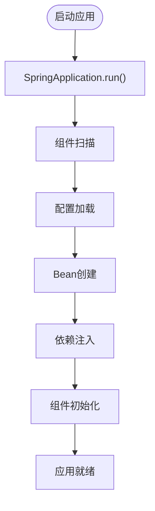
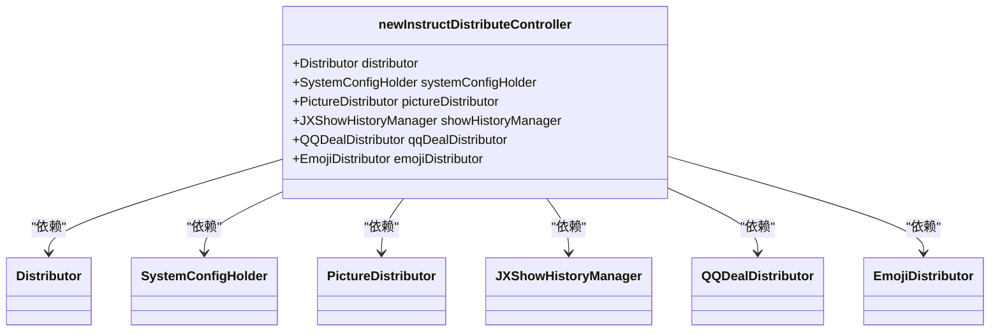

# 项目概述

<cite>
**本文档中引用的文件**   
- [pom.xml](file://pom.xml)
- [BotApplication.java](file://Boot/src/main/java/com/bot/boot/BotApplication.java)
- [newInstructDistributeController.java](file://Boot/src/main/java/com/bot/boot/controller/newInstructDistributeController.java)
- [ChainCollector.java](file://Base/src/main/java/com/bot/base/chain/ChainCollector.java)
- [MainMenuPrinter.java](file://Base/src/main/java/com/bot/base/chain/menu/MainMenuPrinter.java)
- [application.properties](file://Boot/src/main/resources/application.properties)
- [application-dev.properties](file://Boot/src/main/resources/application-dev.properties)
- [application-prod.properties](file://Boot/src/main/resources/application-prod.properties)
- [GameHandler.java](file://Game/src/main/java/com/bot/game/service/GameHandler.java)
- [GameHandlerServiceImpl.java](file://Game/src/main/java/com/bot/game/service/impl/GameHandlerServiceImpl.java)
- [JXAttributeInitUtil.java](file://Base/src/main/java/com/bot/base/util/JXAttributeInitUtil.java)
</cite>

## 目录
1. [项目简介](#项目简介)
2. [项目结构](#项目结构)
3. [核心功能与架构](#核心功能与架构)
4. [模块化设计](#模块化设计)
5. [消息处理链机制](#消息处理链机制)
6. [修仙文字游戏'浮生卷'实现机制](#修仙文字游戏浮生卷实现机制)
7. [技术基础概念](#技术基础概念)
8. [项目启动与核心组件初始化](#项目启动与核心组件初始化)

## 项目简介

本项目是一个基于Spring Boot框架开发的QQ机器人后端服务，旨在为QQ群提供丰富的互动功能。系统采用多模块架构设计，通过消息处理链实现对用户指令的智能响应，特别实现了名为"浮生卷"的修仙文字游戏。项目整合了多种外部API服务，包括音乐、星座、聊天、图片生成等功能，为用户提供多样化的娱乐体验。系统支持微信和QQ双平台接入，具备良好的扩展性和可维护性。

**Section sources**
- [pom.xml](file://pom.xml#L1-L148)
- [BotApplication.java](file://Boot/src/main/java/com/bot/boot/BotApplication.java#L1-L22)

## 项目结构

项目采用Spring Boot多模块架构，包含五个主要模块：Base、Boot、Common、Game和Life。这种模块化设计有助于代码的组织和维护，每个模块都有明确的职责分工。

**Diagram sources**
- [pom.xml](file://pom.xml#L6-L11)
- [Base/pom.xml](file://Base/pom.xml#L22-L34)
- [Game/pom.xml](file://Game/pom.xml#L16-L19)
- [Life/pom.xml](file://Life/pom.xml#L16-L19)

**Section sources**
- [pom.xml](file://pom.xml#L1-L148)
- [Base/pom.xml](file://Base/pom.xml#L1-L46)
- [Common/pom.xml](file://Common/pom.xml#L1-L29)
- [Game/pom.xml](file://Game/pom.xml#L1-L22)
- [Life/pom.xml](file://Life/pom.xml#L1-L23)

## 核心功能与架构

项目核心功能是作为QQ机器人的后端服务，处理来自QQ群和私聊的消息，并根据用户指令提供相应的响应。系统架构基于Spring Boot框架，采用分层设计模式，包括控制器层、服务层、数据访问层等。

**Diagram sources**
- [newInstructDistributeController.java](file://Boot/src/main/java/com/bot/boot/controller/newInstructDistributeController.java#L43-L255)
- [BotApplication.java](file://Boot/src/main/java/com/bot/boot/BotApplication.java#L12-L14)

**Section sources**
- [newInstructDistributeController.java](file://Boot/src/main/java/com/bot/boot/controller/newInstructDistributeController.java#L1-L255)
- [BotApplication.java](file://Boot/src/main/java/com/bot/boot/BotApplication.java#L1-L22)

## 模块化设计

项目采用Spring Boot多模块架构，各模块之间有明确的依赖关系和职责划分。这种设计模式提高了代码的可维护性和可扩展性，使得不同功能模块可以独立开发和测试。

### 模块关系

### 模块职责

**Base模块**：提供基础功能实现，包括消息处理链、菜单系统、通用服务等。该模块依赖于Common模块，为其他业务模块提供基础支持。

**Boot模块**：项目启动模块，包含Spring Boot应用的主类和控制器。负责接收外部请求并分发到相应的处理模块。

**Common模块**：提供通用工具类、常量定义、枚举类型和基础配置。作为其他模块的公共依赖，确保代码的一致性和复用性。

**Game模块**：实现"浮生卷"修仙文字游戏的核心逻辑，包括角色管理、战斗系统、物品系统等。

**Life模块**：实现更复杂的生命周期管理系统，包括成就系统、战斗状态、装备系统等。

**Section sources**
- [pom.xml](file://pom.xml#L6-L11)
- [Base/pom.xml](file://Base/pom.xml#L22-L34)
- [Common/pom.xml](file://Common/pom.xml#L1-L29)
- [Game/pom.xml](file://Game/pom.xml#L16-L19)
- [Life/pom.xml](file://Life/pom.xml#L16-L19)

## 消息处理链机制

项目通过消息处理链实现QQ群互动功能，这是一种责任链设计模式的应用。当用户发送消息时，系统会根据消息类型和内容，通过一系列处理器进行处理，最终返回相应的响应。

### 消息处理流程

**Diagram sources**
- [newInstructDistributeController.java](file://Boot/src/main/java/com/bot/boot/controller/newInstructDistributeController.java#L73-L255)
- [ChainCollector.java](file://Base/src/main/java/com/bot/base/chain/ChainCollector.java#L1-L58)

**Section sources**
- [newInstructDistributeController.java](file://Boot/src/main/java/com/bot/boot/controller/newInstructDistributeController.java#L73-L255)
- [ChainCollector.java](file://Base/src/main/java/com/bot/base/chain/ChainCollector.java#L1-L58)

## 修仙文字游戏'浮生卷'实现机制

"浮生卷"是项目中的核心游戏功能，实现了一个完整的修仙文字游戏系统。游戏采用菜单驱动的方式，用户通过数字选择不同的操作，系统根据用户的选择返回相应的游戏内容。

### 游戏状态管理

### 游戏处理流程

**Diagram sources**
- [GameHandler.java](file://Game/src/main/java/com/bot/game/service/GameHandler.java#L1-L30)
- [GameHandlerServiceImpl.java](file://Game/src/main/java/com/bot/game/service/impl/GameHandlerServiceImpl.java#L1-L191)

**Section sources**
- [GameHandler.java](file://Game/src/main/java/com/bot/game/service/GameHandler.java#L1-L30)
- [GameHandlerServiceImpl.java](file://Game/src/main/java/com/bot/game/service/impl/GameHandlerServiceImpl.java#L1-L191)

## 技术基础概念

为了帮助不同层次的开发者理解项目，这里介绍一些关键的技术基础概念。

### Java基础

Java是一种面向对象的编程语言，具有跨平台、安全性高、性能优良等特点。项目中使用了Java 8版本，利用了Lambda表达式、Stream API等现代Java特性。

### Spring Boot

Spring Boot是Spring框架的扩展，旨在简化Spring应用的初始搭建和开发过程。它提供了自动配置、起步依赖等特性，使得开发者可以快速构建独立的、生产级别的Spring应用。

### MyBatis

MyBatis是一个优秀的持久层框架，它支持定制化SQL、存储过程以及高级映射。项目中使用MyBatis作为ORM框架，通过XML或注解的方式配置SQL语句，实现了数据库操作的简化。

**Section sources**
- [pom.xml](file://pom.xml#L13-L17)
- [BotApplication.java](file://Boot/src/main/java/com/bot/boot/BotApplication.java#L12-L14)
- [pom.xml](file://pom.xml#L119-L122)

## 项目启动与核心组件初始化

项目启动过程由Spring Boot框架管理，通过`BotApplication`类的`main`方法启动。系统会自动扫描并初始化所有配置的组件，包括控制器、服务、数据访问对象等。

### 启动流程

### 核心组件初始化

系统在启动时会初始化多个核心组件，包括消息分发器、图片处理器、表情处理器等。这些组件通过Spring的依赖注入机制自动装配，确保系统能够正确处理各种类型的消息。

**Diagram sources**
- [BotApplication.java](file://Boot/src/main/java/com/bot/boot/BotApplication.java#L17-L19)
- [newInstructDistributeController.java](file://Boot/src/main/java/com/bot/boot/controller/newInstructDistributeController.java#L48-L65)

**Section sources**
- [BotApplication.java](file://Boot/src/main/java/com/bot/boot/BotApplication.java#L1-L22)
- [newInstructDistributeController.java](file://Boot/src/main/java/com/bot/boot/controller/newInstructDistributeController.java#L1-L255)